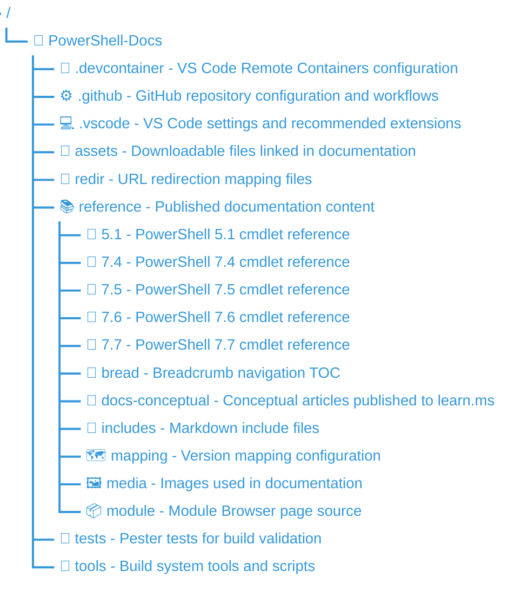

# PowerShell Documentation

Welcome to the PowerShell-Docs repository, the home of the official PowerShell documentation.

## Microsoft Open Source Code of Conduct

This project has adopted the [Microsoft Open Source Code of Conduct][04].

## PowerShell Updatable Help (CabGen) CI Build Status

[![Build Status][cabgen-status]][cabgen-log]

[cabgen-status]: https://apidrop.visualstudio.com/Content%20CI/_apis/build/status/PROD/CabGen(PowerShell_Updatable_Help)/GitHub_MicrosoftDocs_PowerShell-Docs/6ff7e8c3-dfc6-3ebd-da5a-d5e2ff43de8f_cabgen_Publish-Updatable-Help?repoName=MicrosoftDocs%2FPowerShell-Docs&branchName=live
[cabgen-log]: https://apidrop.visualstudio.com/Content%20CI/_build/latest?definitionId=5076&repoName=MicrosoftDocs%2FPowerShell-Docs&branchName=live

## Repository Structure

The following list describes the main folders in this repository.

> [!NOTE]
> The reference content (in the numbered folders) is used to create the webpages on the Docs site as
> well as the updateable help used by PowerShell. The articles in the `docs-conceptual` folder are
> only published to the Docs website.

## Contributing

We welcome public contributions into this repository via pull requests into the _main_ branch.
Please note that before we can accept your pull request you must sign our
[Contribution License Agreement][03]. This is a one-time requirement.

For more information on contributing, read our [contributor's guide][02]. The contributor's guide
contains detailed information about how to contribute documentation, suggested tools, and style and
formatting requirements. Please use the Issue and Pull Request templates to help keep documentation
consistent across versions.

## Licenses

There are two license files for this project. The [MIT License][05] applies to the code contained in
this repo. The [Creative Commons license][06] applies to the documentation.

<!-- link references -->
[02]: https://aka.ms/PSDocsContributor
[03]: https://cla.microsoft.com/
[04]: CODE_OF_CONDUCT.md
[05]: LICENSE-CODE.md
[06]: LICENSE.md
