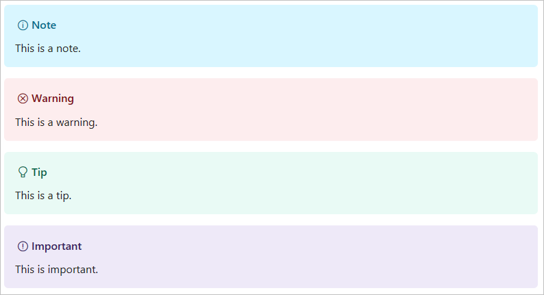

# Markdown Specifics

The Microsoft Open Publishing System (OPS) that builds our documentation uses [markdig][] to process
the Markdown documents. Markdig parses the documents based on the rules of the latest [CommonMark][]
specification.

The new CommonMark spec is much stricter about the construction of some Markdown elements. Pay close
attention to the details provided in this document.

## Blank lines, spaces, and tabs

Remove duplicate blank lines. Multiple blank lines render as a single blank line in HTML. Blank
lines can also signal the end of a block in Markdown. There should be a single blank between
Markdown blocks of different types (for example, between a paragraph and a list).

> [!NOTE]
> Spacing is significant in Markdown. Always uses spaces instead of hard tabs. Remove
> extra spaces at the end of lines.

## Titles and headings

Only use [ATX headings][atx] (# style, as opposed to = or \- style headers).

- There must be a single space between the # and the first letter of the heading
- Titles/headings should be surrounded by blank lines
- Only the first letter of a title and any proper nouns in that title should be capitalized
- Only one H1 per document
- Header levels should increment by one. Do not skip levels.
- Do not use bold or code markup in header text

When editing reference content, the H2s are prescribed by [platyPS][platyPS]. Adding or removing H2
causes a build break.

## Lists

If your list contains multiple sentences or paragraphs,
consider using a sub-level header rather than a list.

### Unordered lists

Do not end list items with a period (unless they contain multiple sentences). Use the hyphen
character [-] as for list item bullets. This avoids confusion with bold or italic markup that uses
the asterisk [*]. To include a paragraph or other elements under a bullet item, insert a line break
and align indentation with the first character after the bullet.

For example:

```markdown
This is a list that contain sub-elements under a bullet item.

- First bullet item

  Sentence explaining the first bullet.

  - Sub-bullet item

    Sentence explaining the sub-bullet.

- Second bullet item
- Third bullet item
```

This is a list that contains sub-elements under a bullet item.

- First bullet item

  Sentence explaining the first bullet.

  - Sub-bullet item

    Sentence explaining the sub-bullet.

- Second bullet item
- Third bullet item

### Ordered lists

If you want multiple lines within a single list element, format your list as follows:

```markdown
1. For the first element, insert a single space after the 1.

   To include a second element (like this one), insert a line break after the first and align
   indentations. The indentation of the second element must line up with the first character after
   the numbered list marker. For single digit items, like this one, you indent to column 4. For
   double digits items, for example item number 10, you indent to column 5.

2. The next numbered item starts here.
```

to get this output:

1. For the first element (like this one), insert a space after the 1.

   To include a second element (like this one), insert a line break after the first and align
   indentations. The indentation of the second element must line up with the first character after
   the numbered list marker. For single digit items, like this one, you indent to column 4. For
   double digits items, for example item number 10, you indent to column 5.

2. The next numbered item starts here.

## Images

The syntax to include an image is:

```markdown
![[alt text]](<folderPath>)

Example:

```

Where `alt text` is a brief description of the image and `<folder path>` is a relative path to the
image. Alternate text is required for screen readers for the visually impaired. It is also useful if
there is a site bug where the image cannot render.

Images should be stored in a `images/<article-name>` folder within the folder containing your
article. Images should not be shared between articles. Create a folder that matches the filename of
your article under the `images` folder. Copy the images for that article to that new folder. If an
image is used by multiple articles, each image folder must have a copy of that image file. This
practice prevents a change to an image in one article affecting another article.

In some cases, you want to share images, like logos and icons, across multiple articles. These
images are stored in a the `/images/shared` folder at the root of the repository.

The following file types are supported by default for images:

- .jpg
- .png

You can add support for other image types by adding them as resources to the docfx.json file for
your doc set. For example, add .gif to enable animated .gif files.

## Markdown extensions supported by Open Publishing

The following sections describe supported extensions in Open Publishing.

### Note, warning, tip, important

Use specific syntax inside a block quote to indicate that the content is a type of note.

```Markdown
> [!NOTE]
> This is a note.

> [!WARNING]
> This is a warning.

> [!TIP]
> This is a tip.

> [!IMPORTANT]
> This is important.
```

And it will be rendered like this:



## Next steps

See [Formatting code blocks](5-FORMATTING-CODE.md).

<!-- External URLs -->
[platyPS]: https://github.com/PowerShell/platyPS
[markdig]: https://github.com/lunet-io/markdig
[CommonMark]: https://spec.commonmark.org/
[atx]: https://github.github.com/gfm/#atx-headings