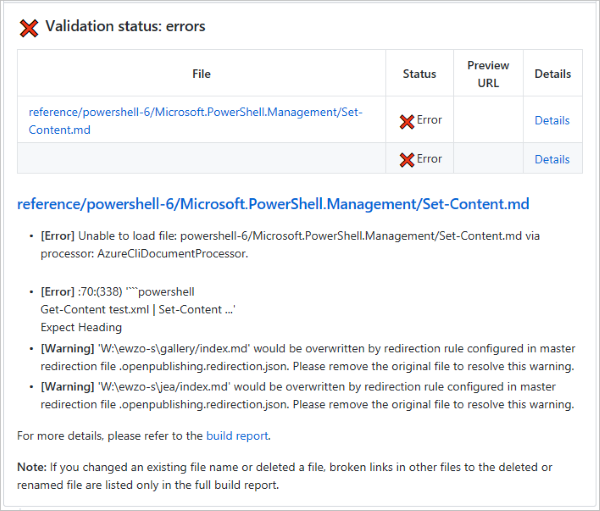
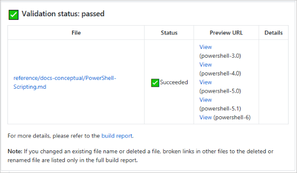

# Best Practices for Pull requests

To publish changes to content, you submit a pull request from your fork. Every pull request has to
be reviewed prior to being merged.

## Make the pull request queue work better for everyone

There are two basic realities in the PR queue:

- Pull requests that are small in scope and that contain very similar changes take less time to
  review.
- Pull requests that are large in scope or that contain mixed kinds of changes take more time to
  review.

### Avoid branches that update large numbers of files

Separate minor updates to existing articles from new articles or major rewrites. Work on these
changes in separate working branches.

Bulk changes drive PRs with large numbers of changed files. Limit your PRs to a maximum of 50
changed files. Large PRs are difficult to review and are more prone to contain errors.

### Renaming or deleting files

When you rename or delete files, avoid mixing these changes with content additions or updates.
Handle these changes in a separate PR that gets merged after the PR for related updates. For
example, update the redirects file and verify the redirect is working before deleting an article.

You must update all files that link to the renamed file. This includes any TOC files. You must also
add redirection entries in the master redirection file (`.openpublishing.redirection.json`) in the
root of the repository.

## Docs PR validation service

The Docs PR validation service is a GitHub app that runs validation rules on the files in a PR.

You'll see the following behavior:

1. You submit a PR.
1. In the GitHub comment that indicates the status of your PR, you'll see the status of "checks"
   enabled on the repo. Note that in this example, there are two checks enabled, "Commit Validation"
   and "OpenPublishing.Build":

   

   Build can pass even if commit validation fails.

1. Click **Details** for more information.
1. On the Details page, you'll see all the validation checks that failed, with information about how
   to fix the issues.
1. When validation succeeds, you will see a comment similar to the following:

   

If you are an external (non-Microsoft) contributor you do not have access to the detailed build
reports or preview links.
