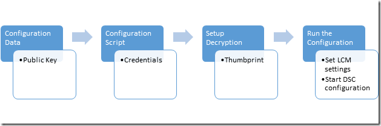

# DSC Credential Encryption

> Applies To: Windows PowerShell 4.0, Windows PowerShell 5.0

Using Windows PowerShell Desired State Configuration (DSC), it is common to need to specify credentials for resources.
To ensure that any credentials remain secure the DSC configuration file must be encrypted.

## Prerequisites
The requirements for encrypting a DSC configuration file: 

* An Encryption capable certificate on the target node in the Local Machine's Personnal Certificate Store (in PowerShell the path to the store is `Cert:\LocalMachine\My`, we used the workstation authentication template, see all templates here.)
* If the configuration is being run from a machine other than the target node, the public key of the certificate must be exported and then imported on the target node that the configuration will be applied to.
    * **It is important that the private key is kept secure.  Since the public key is all that is needed to encrypt, it is recommended that you only export the public key to the machine that is being used to create the configurations on in order to keep the private key more secure.** 

## Assumptions
This guide makes the following assumptions:

* A Public Key Infrastructure (PKI) Certificate Issuing authority such as Active Directory Certificate Services is available to issue and distribute required encryption certificates.
* Administrator access to the target node is properly secured.
    * **Anyone with administrator access to the target node should be trusted with the credentials as the local administrators can decrypt the credentials with enough effort.**

# Overview
In order to encrypt credentials in a DSC configuration, a specific process should be followed:
 1. The _target node_ should be provided with a certificate which supports encryption.
 2. The public key and thumbprint of the certificate should be made available on the machine that the DSC configuration is authored on.
 3. The public key and thumbprint should be provided to the configuration in the _configuration data_.
 4. Run the DSC configuration for the _target node_ on the authoring computer and apply it to the _target node_.
 5. Create a Local Configuration Manager (LCM) configuration script to configure the _target node_ LCM to use the encryption certificate (as identified by its thumbprint) to decrypt DSC configuration credentials, then apply the LCM configuration to the _target node_ and start DSC configuration.
 


## Certificate Requirements
To enact credential encryption, a public key certificate is required to be available on the _Target Node_ that is **trusted** by the computer being used to author the DSC configuration.
This public key certificate has specific requirements that must be satisfied to allow it to be used for DSC Credential Encryption:
 1. **Key Usage**: must contain 'DigitalSignature', 'KeyEncipherment' and 'DataEncipherment'.
 2. **Enhanced Key Usage**: must contain 'Document Encryption'.
 3. The Private Key for the certificate is available on the _Target Node_.

## Configuration Data
When dealing with encryption of DSC configuration, it is important to understand the DSC **configuration data** structure.
This structure is used to separate configuration data from the logic of a configuration file.
It allows node specific configuration data to be passed to a DSC configuration when it is run.
See [Separating Configuration and Environment Data](configData.md) for more information on the **configuration data** structure. 

The elements that can be configured for each node that are related to credential encryption are:
* **NodeName** - the name of the target node that the credential encryption is being configured for.
* **PsDscAllowPlainTextPassword** - whether unencrypted credentials will be allowed to be passed to this node. This is **not recommended**.
* **Thumbprint** - the thumbprint of the certificate that will be used to decrypt the credentials in the DSC Configuration on the _Target Node_. **This certificate must exist in the Local Machine certificate store on the Target Node.**
* **CertificateFile** - the certificate file (containing the public key only) that should be used to encrypt the credentials for the _Target Node_.

The following is an example of **configuration data** for a single node named `targetNode` which should be encrypted using a public key certificate that has been exported to `C:\publicKeys\targetNode.cer`:

```PowerShell
$ConfigData = @{ 
        AllNodes = @(     
                        @{  
                            # The name of the node we are describing 
                            NodeName        = “targetNode”

                            # The path to the .cer file containing the 
                            # public key of the Encryption Certificate 
                            # used to encrypt credentials for this node 
                            CertificateFile = “C:\publicKeys\targetNode.cer”


                            # The thumbprint of the Encryption Certificate 
                            # used to decrypt the credentials on target node 
                            Thumbprint      = “AC23EA3A9E291A75757A556D0B71CBBF8C4F6FD8″ 
                        }; 
                    );    
                } 
```
 

## Configuration Script
After the configuration data has been assembled the DSC configuration can be built.
Since credentials are important to keep secure, care should always be taken that any credentials that the DSC configuration script requires are passed as parameters to it.
This ensures the credentials are stored for the shortest possible time.
The following is an example of copying a file from a share that can only be accessed by a specific user account: 

```PowerShell
configuration CredentialEncryptionExample 
{ 
    param( 
        [Parameter(Mandatory=$true)]
        [ValidateNotNullorEmpty()] 
        [PsCredential] $credential 
    ) 
   

    Node $AllNodes.NodeName 
    { 
        File exampleFile 
        { 
            SourcePath      = “\\Server\share\path\file.ext” 
            DestinationPath = “C:\destinationPath” 
            Credential      = $credential 
        } 
    } 
}
```

When ```CredentialEncryptionExample``` is run, DSC will prompt for the credential (if it wasn't passed to the configuration) and encrypt the MOF using the **CertificateFile** associated with the node in the configuration data.
 
## Setting up Decryption
There is still one final step required to enable DSC credential encryption.
When [`Start-DscConfiguration`](http://technet.microsoft.com/en-us/library/dn521623.aspx), the Local Configuration Manager (LCM) of target node will not know which certificate to use to decrypt the credentials.
Therefore a configuration containing the LocalConfigurationManager resource needs to be created to configure the LCM on the _Target Node_.
The CertificateId property of the LCM must be set to the thumbprint of the decryption certificate that is in the Local Machine certificate store on the _Target Node_.

Below is an example of how to find a local machine certificate that would work for credential encryption.
This may need to customized to find the exact certificate you want to use.

```PowerShell
# Get the certificate that works for encryption 
function Get-LocalEncryptionCertificateThumbprint 
{ 
    (Get-ChildItem Cert:\LocalMachine\my) | % { 
        # Verify the certificate is for Encryption and valid 
        if ($_.PrivateKey.KeyExchangeAlgorithm `
            -and ($_.Verify()) `
            -and ($_.EnhancedKeyUsageList.FriendlyName -contains 'Document Encryption')) 
        { 
            return $_.Thumbprint 
        } 
    } 
}
```

If PowerShell 5.0 is available then this code can be used instead to get the list of compatible certificates:
```PowerShell
# Get the certificate that works for encryption (PowerShell 5.0 and above only) 
function Get-LocalEncryptionCertificateThumbprint 
{ 
    (Get-ChildItem Cert:\LocalMachine\my -DocumentEncryptionCert) | % { 
        # Verify the certificate is for Encryption and valid 
        if ($_.PrivateKey.KeyExchangeAlgorithm `
            -and ($_.Verify()))
        { 
            return $_.Thumbprint 
        } 
    } 
}
```

After the thumbprint is obtained it can be used to build the configuration data (given in the above configuration data example).

The following is an example of the updated configuration with the LocalConfigurationManager resource, getting the value from the node in the configuration data:

```PowerShell 
configuration CredentialEncryptionExample 
{ 
    param( 
        [Parameter(Mandatory=$true)] 
        [ValidateNotNullorEmpty()] 
        [PsCredential] $credential 
    ) 
   
    Node $AllNodes.NodeName 
    { 
        File exampleFile 
        { 
            SourcePath      = “\\Server\share\path\file.ext” 
            DestinationPath = “C:\destinationPath” 
            Credential      = $credential 
        } 
        
        LocalConfigurationManager 
        { 
             CertificateId  = $node.Thumbprint 
        } 
    } 
}
```

See [this page](metaConfig.md) for more information on configuring the Local Configuration Manager (LCM).

## Running the Configuration
At this point the configuration can now be run.
It will output:
 * A `*.meta.mof` to configure LCM to decrypt the credentials using the certificate available in the local machine certificate store on the _Target Ndoe_ identified by the thumbprint.
 * A `*.mof` to apply the DSC configuration to the node.
 
To apply the configuration, use [`Set-DscLocalConfigurationManager`](http://technet.microsoft.com/en-us/library/dn521621.aspx) to apply the `*.meta.mof` and then, `Start-DscConfiguration` to apply the DSC node configuration.
The following is an example of applying the LCM and DSC configuration to a node:

```PowerShell
Write-Host “Generate DSC Configuration…”
CredentialEncryptionExample -ConfigurationData $ConfigData -OutputPath .\CredentialEncryptionExample

Write-Host “Setting up LCM to decrypt credentials…”
Set-DscLocalConfigurationManager .\CredentialEncryptionExample -Verbose
 
Write-Host “Starting Configuration…”
Start-DscConfiguration .\CredentialEncryptionExample -wait -Verbose
```

This example would push the DSC configuration to the target node.
The DSC configuration can also be applied using a DSC Pull Server if one is available.

See [this page](PullClient.md) for more information on applying DSC configurations using a DSC Pull Server.

## Credential Encryption Module Example
The following example is the contents of a **PowerShell Module** that could be used to implement credential encryption:
```PowerShell
# A simple example of using credentials
configuration CredentialEncryptionExample
{
    param(
        [Parameter(Mandatory=$true)]
        [ValidateNotNullorEmpty()]
        [PsCredential] $credential
    )
    

    Node $AllNodes.NodeName
    {
        File exampleFile
        {
            SourcePath      = "\\server\share\file.txt"
            DestinationPath = "C:\Users\user"
            Credential      = $credential
        }
        
        LocalConfigurationManager
        {
            CertificateId = $node.Thumbprint
        }
    }
}

# A Helper to invoke the configuration, with the correct public key 
# To encrypt the configuration credentials
function Start-CredentialEncryptionExample
{
    [CmdletBinding()]
    param ($computerName)


    [string] $thumbprint = Get-EncryptionCertificate -computerName $computerName -Verbose
    Write-Verbose "using cert: $thumbprint"

    $certificatePath = join-path -Path "$env:SystemDrive\$script:publicKeyFolder" -childPath "$computername.EncryptionCertificate.cer"         

    $ConfigData = @{
        AllNodes =   @(     
                        @{  
                            # The name of the node we are describing
                            NodeName = "$computerName"

                            # The path to the .cer file containing the
                            # public key of the Encryption Certificate
                            CertificateFile = "$certificatePath"

                            # The thumbprint of the Encryption Certificate
                            # used to decrypt the credentials
                            Thumbprint = $thumbprint
                        };
                    );    
                }

    Write-Verbose "Generate DSC Configuration..."
    CredentialEncryptionExample -ConfigurationData $ConfigData -OutputPath .\CredentialEncryptionExample `
        -credential (Get-Credential -UserName "$env:USERDOMAIN\$env:USERNAME" -Message "Enter credentials for configuration") 

    Write-Verbose "Setting up LCM to decrypt credentials..."
    Set-DscLocalConfigurationManager .\CredentialEncryptionExample -Verbose 

    Write-Verbose "Starting Configuration..."
    Start-DscConfiguration .\CredentialEncryptionExample -wait -Verbose
}


#region HelperFunctions

# The folder name for the exported public keys
$script:publicKeyFolder = "publicKeys"

# Get the certificate that works for encryptions
function Get-EncryptionCertificate
{
    [CmdletBinding()]
    param ($computerName)
    $returnValue= Invoke-Command -ComputerName $computerName -ScriptBlock {
            $certificates = dir Cert:\LocalMachine\my

            $certificates | %{
                    # Verify the certificate is for Encryption and valid
                    if ($_.PrivateKey.KeyExchangeAlgorithm -and $_.Verify())
                    {
                        # Create the folder to hold the exported public key
                        $folder= Join-Path -Path $env:SystemDrive\ -ChildPath $using:publicKeyFolder
                        if (! (Test-Path $folder))
                        {
                            md $folder | Out-Null
                        }

                        # Export the public key to a well known location
                        $certPath = Export-Certificate -Cert $_ -FilePath (Join-Path -path $folder -childPath "EncryptionCertificate.cer") 

                        # Return the thumbprint, and exported certificate path
                        return @($_.Thumbprint,$certPath);
                    }
                  }
        }
    Write-Verbose "Identified and exported cert..."
    # Copy the exported certificate locally
    $destinationPath = join-path -Path "$env:SystemDrive\$script:publicKeyFolder" -childPath "$computername.EncryptionCertificate.cer"
    Copy-Item -Path (join-path -path \\$computername -childPath $returnValue[1].FullName.Replace(":","$"))  $destinationPath | Out-Null

    # Return the thumbprint
    return $returnValue[0]
}

#endregion HelperFunctions
```

