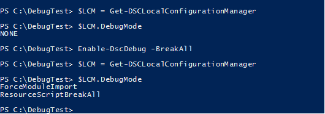

# Debugging DSC resources

> Applies To: Windows PowerShell 5.0

In PowerShell 5.0, a new feature was introduced in Desired State Configuraiton (DSC) that allows you to debug a DSC resource as a configuration is being applied.

## Enabling DSC debugging
Before you can debug a resource, you have to enable debugging by calling the [Enable-DscDebug](https://technet.microsoft.com/en-us/library/mt517870.aspx) cmdlet. This cmdlet takes a mandatory parameter, **BreakAll**. You can verify that debugging has been enabled by looking at the result of a call to [Get-DscLocalConfigurationManager](https://technet.microsoft.com/en-us/library/dn407378.aspx). The following PowerShell output shows the result of enabling debugging:

