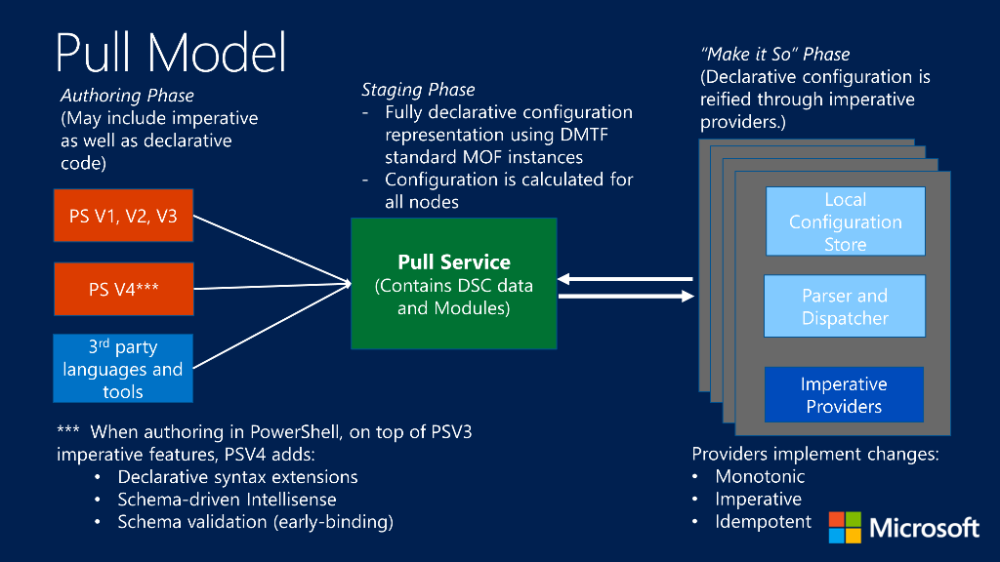

# Enacting configurations

>Applies To: Windows PowerShell 4.0, Windows PowerShell 5.0

There are two ways to enact PowerShell Desired State Configuration (DSC) configurations:
push mode and pull mode.

## Push mode

Push mode refers to a user actively applying a configuration to a target node
by calling the [Start-DscConfiguration](https://technet.microsoft.com/en-us/library/dn521623.aspx) cmdlet.

After creating and compiling a configuration, you can enact it in push mode
by calling the [Start-DscConfiguration](https://technet.microsoft.com/en-us/library/dn521623.aspx) cmdlet,
setting the -Path parameter of the cmdlet to the path where the configuration MOF is located.
For example, if the configuration MOF is located at `C:\DSC\Configurations\localhost.mof`,
you would apply it to the local machine with the following command:
`Start-DscConfiguration -Path 'C:\DSC\Configurations'`

> __Note__: By default, DSC runs a configuration as a background job. To run the configuration interactively, call the 
>[Start-DscConfiguration](https://technet.microsoft.com/library/dn521623.aspx) with the __-Wait__ parameter.

## Pull mode

In pull mode, pull clients are configured to get their desired state configurations
from a remote pull service.
Likewise, the pull service has been set up to host the DSC service,
and has been provisioned with the configurations and resources that are required by the pull clients.
Each of the pull clients has a scheduled event that performs a periodic compliance
check on the configuration of the node.
When the event is triggered the first time,
the Local Configuration Manager (LCM) on the pull client makes a request to the pull service to get the
configuration specified in the LCM.
If that configuration exists on the pull service, and it passes initial validation checks,
the configuration is downloaded to the pull client, where it is then executed by the LCM.

The LCM checks that the client is in compliance with the configuration at regular intervals
specified by the **ConfigurationModeFrequencyMins** property of the LCM.
The LCM checks for updated configurations on the pull service at regular intervals
specified by the **RefreshModeFrequency** property of the LCM.
For information about configuring the LCM, see
[Configuring the Local Configuration Manager](metaConfig.md).

The recommended solution for hosting a Pull Service, is the DSC cloud service,
[Azure Automation](https://azure.microsoft.com/en-us/services/automation/).
This is hosted solution provides graphical management, reporting,
and centralized administration.

For more information on setting up a Pull Service on Windows Server,
see [Setting up a DSC web pull server](pullServer.md).
Understand however, that this implementation has limited features
and does require some "do it yourself" integration.

The following topics explain pull service and clients:

- [Azure Automation DSC Overview](https://docs.microsoft.com/en-us/azure/automation/automation-dsc-overview)
- [Setting up an SMB pull server](pullServerSMB.md)
- [Configuring a pull client](pullClientConfigID.md)
