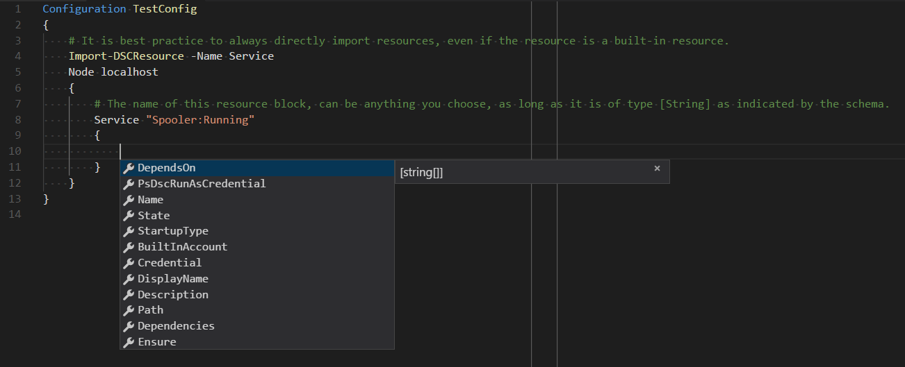

# DSC Resources

>Applies To: Windows PowerShell 4.0, Windows PowerShell 5.0

Desired State Configuration (DSC) Resources provide the building blocks for a DSC configuration. A resource exposes properties that can be configured (schema) and contains the PowerShell script functions that the Local Configuration Manager (LCM) calls to "make it so".

A resource can model something as generic as a file or as specific as an IIS server setting.  Groups of like resources are combined in to a DSC Module, which organizes all the required files in to a structure that is portable and includes metadata to identify how the resources are intended to be used.

Each resource has a *schema that determines the syntax needed to use the resource in a [Configuration](configurations.md). A resource's schema can be defined in the following ways:

- **'Schema.Mof'** file: Most resources define their *schema* in a 'schema.mof' file, using [Managed Object Format](/windows/desktop/wmisdk/managed-object-format--mof-).
- **'\<Resource Name\>.schema.psm1'** file: [Composite Resources](compositeconfigs.md) define their *schema* in a '<ResourceName>.schema.psm1' file using a [Parameter Block](/powershell/module/microsoft.powershell.core/about/about_functions?view=powershell-6#functions-with-parameters).
- **'\<Resource Name\>.psm1'** file: Class based DSC resources define their *schema* in the class definition. Syntax items are denoted as Class properties. For more information, see [about_Classes](/powershell/module/psdesiredstateconfiguration/about/about_classes_and_dsc).

To retrieve the syntax for a DSC resource, use the [Get-DSCResource](/powershell/module/psdesiredstateconfiguration/get-dscresource) cmdlet with the `-Syntax` parameter. This usage is similar to using [Get-Command](/powershell/module/microsoft.powershell.core/get-command) with the `-Syntax` parameter to get cmdlet syntax. The output you see will show the template used for a resource block for the resource you specify.

```powershell
Get-DscResource -Syntax Service
```

The output you see should be similar to the output below, though this resource's syntax could change in the future. Like cmdlet syntax, the *keys* seen in square brackets, are optional. The types specify the type of data each key expects.

> [!NOTE]
> The **Ensure** key is optional because it defaults to "Present".

```output
Service [String] #ResourceName
{
    Name = [string]
    [BuiltInAccount = [string]{ LocalService | LocalSystem | NetworkService }]
    [Credential = [PSCredential]]
    [Dependencies = [string[]]]
    [DependsOn = [string[]]]
    [Description = [string]]
    [DisplayName = [string]]
    [Ensure = [string]{ Absent | Present }]
    [Path = [string]]
    [PsDscRunAsCredential = [PSCredential]]
    [StartupType = [string]{ Automatic | Disabled | Manual }]
    [State = [string]{ Running | Stopped }]
}
```

Inside a Configuration, a **Service** might look like this to **Ensure** that the Spooler service is running.

> [!NOTE]
> Before using a resource in a Configuration, you must import it using [Import-DSCResource](./cmdlets/Import-DSCResource.md).

```powershell
Configuration TestConfig
{
    # It is best practice to always directly import resources, even if the resource is a built-in resource.
    Import-DSCResource -Name Service
    Node localhost
    {
        # The name of this resource block, can be anything you choose, as long as it is of type [String] as indicated by the schema.
        Service "Spooler:Running"
        {
            Name = "Spooler"
            State = "Running"
        }
    }
}
```

Beginning in PowerShell 5.0, intellisense was added for DSC. This new feature allows you to use \<TAB\> and \<Ctrl+Space\> to auto-complete key names.


