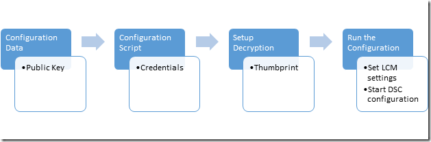

# Securing the MOF File

>Applies To: Windows PowerShell 4.0, Windows PowerShell 5.0

DSC tells the target nodes what configuration they should have by sending a MOF file with that information to each node, where the Local Configuration Manager (LCM) implements the desired 
configuration. Because this file contains the details of the configuration, it’s important to keep it secure. To do this, you can set the LCM to check the credentials of 
a user. This topic describes how to transmit those credentials securely to the target node by encrypting them with certificates.

>**Note:** This topic discusses certificates used for encryption. For encryption, a self-signed certificate is sufficient, because the private key is always kept secret and encryption does not imply trust of the document. Self-signed certificates
>should *not* be used for authentication purposes. You should use a certificate from a trusted Certification Authority (CA) for any authentication purposes.

## Prerequisites

To successfully encrypt the credentials used to secure a DSC configuration, make sure you have the following:

* **Some means of issuing and distributing certificates**. This topic and its examples assume you are using Active Directory Certification Authority. For more background information on 
Active Directory Certificate Services, see [Active Directory Certificate Services Overview](https://technet.microsoft.com/library/hh831740.aspx) and 
[Active Directory Certificate Services in Windows Server 2008](https://technet.microsoft.com/windowsserver/dd448615.aspx).
* **Administrative access to the target node or nodes**.
* **Each target node has an encryption-capable certificate saved its Personal Store**. In Windows PowerShell, the path to the store is Cert:\LocalMachine\My. The examples in this topic use the 
“workstation authentication” template, which you can find (along with other certificate templates) at [Default Certificate Templates](https://technet.microsoft.com/library/cc740061(v=WS.10).aspx).
* If you will be running this configuration on a computer other than the target node, **export the public key of the certificate**, and then import it to the computer you will run the 
configuration from. Make sure that you export only the **public** key; keep the private key secure.

## Overall process

 1. Set up the certificates, keys, and thumbprints, making sure that each target node has copies of the certificate and the configuration computer has the public key and thumbprint.
 2. Create a configuration data block that contains the path and thumbprint of the public key.
 3. Create a configuration script that defines your desired configuration for the target node and sets up decryption on the target nodes by commanding the Local Configuration manager to decrypt the configuration data using the certificate and its thumbprint.
 4. Run the configuration, which will set the Local Configuration Manager settings and start the DSC configuration.



## Certificate Requirements

To enact credential encryption, a public key certificate must be available on the _Target Node_ that is **trusted** by the computer being used to author the DSC configuration.
This public key certificate has specific requirements for it to be used for DSC credential encryption:
 1. **Key Usage**:
   - Must contain: 'KeyEncipherment' and 'DataEncipherment'.
   - Should _not_ contain: 'Digital Signature'.
 2. **Enhanced Key Usage**:
   - Must contain: Document Encryption (1.3.6.1.4.1.311.80.1).
   - Should _not_ contain: Client Authentication (1.3.6.1.5.5.7.3.2) and Server Authentication (1.3.6.1.5.5.7.3.1).
 3. The Private Key for the certificate is available on the *Target Node_.
 4. The **Provider** for the certificate must be "Microsoft RSA SChannel Cryptographic Provider".
 
>**Recommended Best Practice:** Although you can use a certificate with containing a Key Usage of 'Digital Signature' or one of the Authentication EKU's, this will enable the encryption key 
>to be more easily misused and vulnerable to attack. So it is best practice to use a certificate created specifically for the purpose of securing DSC credentials that omits these Key Usage and 
>EKUs.
  
Any existing certificate on the _Target Node_ that meets these criteria can be used to secure DSC credentials.

## Certificate creation

There are two approaches you can take to create and use the required Encryption Certificate (public-private key pair).

1. Create it on the **Target Node** and export just the public key to the **Authoring Node**
2. Create it on the **Authoring Node** and export the entire key pair to the **Target Node**

Method 1 is recommended because the private key used to decrypt credentials in the MOF stays on the Target Node at all times.


### Creating the Certificate on the Target Node

The private key must be kept secret, because is used to decrypt the MOF on the **Target Node**
The easiest way to do that is to create the private key certificate on the **Target Node**, and copy the **public key certificate** to the computer being used to author the DSC configuration into a MOF file.
The following example:
 1. creates a certificate on the **Target node**
 2. exports the public key certificate on the **Target node**.
 3. imports the public key certificate into the **my** certificate store on the **Authoring node**.

#### On the Target Node: create and export the certificate
>Authoring Node: Windows Server 2016 and Windows 10

```powershell
# note: These steps need to be performed in an Administrator PowerShell session
$cert = New-SelfSignedCertificate -Type DocumentEncryptionCertLegacyCsp -DnsName 'DscEncryptionCert' -HashAlgorithm SHA256
# export the public key certificate
$cert | Export-Certificate -FilePath "$env:temp\DscPublicKey.cer" -Force
```
Once exported, the ```DscPublicKey.cer``` would need to be copied to the **Authoring Node**.

>Authoring Node: Windows Server 2012 R2/Windows 8.1 and earlier

Because the New-SelfSignedCertificate cmdlet on Windows Operating Systems prior to Windows 10 and Windows Server 2016 do not support the **Type** parameter, an alternate method of creating this certificate is required on these operating systems.
In this case you can use ```makecert.exe``` or ```certutil.exe``` to create the certificate.

An alternate method is to [download the New-SelfSignedCertificateEx.ps1 script from Microsoft Script Center](https://gallery.technet.microsoft.com/scriptcenter/Self-signed-certificate-5920a7c6) and use it to create the certificate instead:
```powershell
# note: These steps need to be performed in an Administrator PowerShell session
# and in the folder that contains New-SelfSignedCertificateEx.ps1
. .\New-SelfSignedCertificateEx.ps1
New-SelfsignedCertificateEx `
    -Subject "CN=${ENV:ComputerName}" `
    -EKU 'Document Encryption' `
    -KeyUsage 'KeyEncipherment, DataEncipherment' `
    -SAN ${ENV:ComputerName} `
    -FriendlyName 'DSC Credential Encryption certificate' `
    -Exportable `
    -StoreLocation 'LocalMachine' `
    -StoreName 'My' `
    -KeyLength 2048 `
    -ProviderName 'Microsoft Enhanced Cryptographic Provider v1.0' `
    -AlgorithmName 'RSA' `
    -SignatureAlgorithm 'SHA256'
# Locate the newly created certificate
$Cert = Get-ChildItem -Path cert:\LocalMachine\My `
    | Where-Object {
        ($_.FriendlyName -eq 'DSC Credential Encryption certificate') `
        -and ($_.Subject -eq "CN=${ENV:ComputerName}")
    } | Select-Object -First 1
# export the public key certificate
$cert | Export-Certificate -FilePath "$env:temp\DscPublicKey.cer" -Force
```
Once exported, the ```DscPublicKey.cer``` would need to be copied to the **Authoring Node**.

#### On the Authoring Node: import the cert’s public key
```powershell
# Import to the my store
Import-Certificate -FilePath "$env:temp\DscPublicKey.cer" -CertStoreLocation Cert:\LocalMachine\My
```

### Creating the Certificate on the Authoring Node
Alternately, the encryption certificate can be created on the **Authoring Node**, exported with the **private key** as a PFX file and then imported on the **Target Node**.
This is the current method for implementing DSC credential encryption on _Nano Server_.
Although the PFX is secured with a password it should be kept secure during transit.
The following example:
 1. creates a certificate on the **Authoring node**.
 2. exports the certificate including the private key on the **Authoring node**.
 3. removes the private key from the **Authoring node**, but keeps the public key certificate in the **my** store.
 4. imports the private key certificate into the root certificate store on the **Target node**.
   - it must be added to the root store so that it will be trusted by the **Target node**.

#### On the Authoring Node: create and export the certificate
>Target Node: Windows Server 2016 and Windows 10

```powershell
# note: These steps need to be performed in an Administrator PowerShell session
$cert = New-SelfSignedCertificate -Type DocumentEncryptionCertLegacyCsp -DnsName 'DscEncryptionCert' -HashAlgorithm SHA256
# export the private key certificate
$mypwd = ConvertTo-SecureString -String "YOUR_PFX_PASSWD" -Force -AsPlainText
$cert | Export-PfxCertificate -FilePath "$env:temp\DscPrivateKey.pfx" -Password $mypwd -Force
# remove the private key certificate from the node but keep the public key certificate
$cert | Export-Certificate -FilePath "$env:temp\DscPublicKey.cer" -Force
$cert | Remove-Item -Force
Import-Certificate -FilePath "$env:temp\DscPublicKey.cer" -CertStoreLocation Cert:\LocalMachine\My
```
Once exported, the ```DscPrivateKey.pfx``` would need to be copied to the **Target Node**.

>Target Node: Windows Server 2012 R2/Windows 8.1 and earlier

Because the New-SelfSignedCertificate cmdlet on Windows Operating Systems prior to Windows 10 and Windows Server 2016 do not support the **Type** parameter, an alternate method of creating this certificate is required on these operating systems.
In this case you can use ```makecert.exe``` or ```certutil.exe``` to create the certificate.

An alternate method is to [download the New-SelfSignedCertificateEx.ps1 script from Microsoft Script Center](https://gallery.technet.microsoft.com/scriptcenter/Self-signed-certificate-5920a7c6) and use it to create the certificate instead:
```powershell
# note: These steps need to be performed in an Administrator PowerShell session
# and in the folder that contains New-SelfSignedCertificateEx.ps1
. .\New-SelfSignedCertificateEx.ps1
New-SelfsignedCertificateEx `
    -Subject "CN=${ENV:ComputerName}" `
    -EKU 'Document Encryption' `
    -KeyUsage 'KeyEncipherment, DataEncipherment' `
    -SAN ${ENV:ComputerName} `
    -FriendlyName 'DSC Credential Encryption certificate' `
    -Exportable `
    -StoreLocation 'LocalMachine' `
    -KeyLength 2048 `
    -ProviderName 'Microsoft Enhanced Cryptographic Provider v1.0' `
    -AlgorithmName 'RSA' `
    -SignatureAlgorithm 'SHA256'
# Locate the newly created certificate
$Cert = Get-ChildItem -Path cert:\LocalMachine\My `
    | Where-Object {
        ($_.FriendlyName -eq 'DSC Credential Encryption certificate') `
        -and ($_.Subject -eq "CN=${ENV:ComputerName}")
    } | Select-Object -First 1
# export the public key certificate
$mypwd = ConvertTo-SecureString -String "YOUR_PFX_PASSWD" -Force -AsPlainText
$cert | Export-PfxCertificate -FilePath "$env:temp\DscPrivateKey.pfx" -Password $mypwd -Force
# remove the private key certificate from the node but keep the public key certificate
$cert | Export-Certificate -FilePath "$env:temp\DscPublicKey.cer" -Force
$cert | Remove-Item -Force
Import-Certificate -FilePath "$env:temp\DscPublicKey.cer" -CertStoreLocation Cert:\LocalMachine\My
```

#### On the Target Node: import the cert’s private key as a trusted root
```powershell
# Import to the root store so that it is trusted
$mypwd = ConvertTo-SecureString -String "YOUR_PFX_PASSWD" -Force -AsPlainText
Import-PfxCertificate -FilePath "$env:temp\DscPrivateKey.pfx" -CertStoreLocation Cert:\LocalMachine\Root -Password $mypwd > $null
```

## Configuration data

The configuration data block defines which target nodes to operate on, whether or not to encrypt the credentials, the means of encryption, and other information. For more information on the configuration data block, see [Separating Configuration and Environment Data](configData.md).

The elements that can be configured for each node that are related to credential encryption are:
* **NodeName** - the name of the target node that the credential encryption is being configured for.
* **PsDscAllowPlainTextPassword** - whether unencrypted credentials will be allowed to be passed to this node. This is **not recommended**.
* **Thumbprint** - the thumbprint of the certificate that will be used to decrypt the credentials in the DSC Configuration on the _Target Node_. **This certificate must exist in the Local Machine certificate store on the Target Node.**
* **CertificateFile** - the certificate file (containing the public key only) that should be used to encrypt the credentials for the _Target Node_. This must be either a DER encoded binary X.509 or Base-64 encoded X.509 format certificate file.

This example shows a configuration data block that specifies a target node to act on named targetNode, the path to the public key certificate file (named targetNode.cer), and the thumbprint for the public key.

```powershell
$ConfigData= @{ 
    AllNodes = @(     
            @{  
                # The name of the node we are describing 
                NodeName = "targetNode" 

                # The path to the .cer file containing the 
                # public key of the Encryption Certificate 
                # used to encrypt credentials for this node 
                CertificateFile = "C:\publicKeys\targetNode.cer" 

         
                # The thumbprint of the Encryption Certificate 
                # used to decrypt the credentials on target node 
                Thumbprint = "AC23EA3A9E291A75757A556D0B71CBBF8C4F6FD8" 
            }; 
        );    
    }
```


## Configuration script

In the configuration script itself, use the `PsCredential` parameter to ensure that credentials are stored for the shortest possible time. When you run the supplied example, DSC will prompt you for credentials and then encrypt the MOF file using the CertificateFile that is associated with the target node in the configuration data block. This code example copies a file from a share that is secured to a user.

```
configuration CredentialEncryptionExample 
{ 
    param( 
        [Parameter(Mandatory=$true)] 
        [ValidateNotNullorEmpty()] 
        [PsCredential] $credential 
        ) 
    

    Node $AllNodes.NodeName 
    { 
        File exampleFile 
        { 
            SourcePath = "\\Server\share\path\file.ext" 
            DestinationPath = "C:\destinationPath" 
            Credential = $credential 
        } 
    } 
}
```

## Setting up decryption

Before [`Start-DscConfiguration`](https://technet.microsoft.com/en-us/library/dn521623.aspx) can work, you have to tell the Local Configuration Manager on each target node which certificate to use to decrypt the credentials, using the CertificateID resource to verify the certificate’s thumbprint. This example function will find the appropriate local certificate (you might have to customize it so it will find the exact certificate you want to use):

```powershell
# Get the certificate that works for encryption 
function Get-LocalEncryptionCertificateThumbprint 
{ 
    (dir Cert:\LocalMachine\my) | %{
        # Verify the certificate is for Encryption and valid 
        if ($_.PrivateKey.KeyExchangeAlgorithm -and $_.Verify()) 
        { 
            return $_.Thumbprint 
        } 
    } 
}
```

With the certificate identified by its thumbprint, the configuration script can be updated to use the value:

```powershell
configuration CredentialEncryptionExample 
{ 
    param( 
        [Parameter(Mandatory=$true)] 
        [ValidateNotNullorEmpty()] 
        [PsCredential] $credential 
        ) 
    

    Node $AllNodes.NodeName 
    { 
        File exampleFile 
        { 
            SourcePath = "\\Server\share\path\file.ext" 
            DestinationPath = "C:\destinationPath" 
            Credential = $credential 
        } 
        
        LocalConfigurationManager 
        { 
             CertificateId = $node.Thumbprint 
        } 
    } 
}
```

## Running the configuration

At this point, you can run the configuration, which will output two files:

 * A *.meta.mof file that configures the Local Configuration Manager to decrypt the credentials using the certificate that is stored on the local machine store and identified by its thumbprint. [`Set-DscLocalConfigurationManager`](https://technet.microsoft.com/en-us/library/dn521621.aspx) applies the *.meta.mof file.
 * A MOF file that actually applies the configuration. Start-DscConfiguration applies the configuration.

These commands will accomplish those steps:

```powershell
Write-Host "Generate DSC Configuration..."
CredentialEncryptionExample -ConfigurationData $ConfigData -OutputPath .\CredentialEncryptionExample

Write-Host "Setting up LCM to decrypt credentials..."
Set-DscLocalConfigurationManager .\CredentialEncryptionExample -Verbose 
 
Write-Host "Starting Configuration..."
Start-DscConfiguration .\CredentialEncryptionExample -wait -Verbose
```

This example would push the DSC configuration to the target node.
The DSC configuration can also be applied using a DSC Pull Server if one is available.

See [Setting up a DSC pull client](pullClient.md) for more information on applying DSC configurations using a DSC Pull Server.

## Credential Encryption Module Example

Here is a full example that incorporates all of these steps, plus a helper cmdlet that exports and copies the public keys:

```powershell
# A simple example of using credentials
configuration CredentialEncryptionExample
{
    param(
        [Parameter(Mandatory=$true)]
        [ValidateNotNullorEmpty()]
        [PsCredential] $credential
        )
    

    Node $AllNodes.NodeName
    {
        File exampleFile
        {
            SourcePath = "\\server\share\file.txt"
            DestinationPath = "C:\Users\user"
            Credential = $credential
        }
        
        LocalConfigurationManager
        {
            CertificateId = $node.Thumbprint
        }
    }
}

# A Helper to invoke the configuration, with the correct public key 
# To encrypt the configuration credentials
function Start-CredentialEncryptionExample
{
    [CmdletBinding()]
    param ($computerName)


    [string] $thumbprint = Get-EncryptionCertificate -computerName $computerName -Verbose
    Write-Verbose "using cert: $thumbprint"

    $certificatePath = join-path -Path "$env:SystemDrive\$script:publicKeyFolder" -childPath "$computername.EncryptionCertificate.cer"         

    $ConfigData=    @{
        AllNodes = @(     
                        @{  
                            # The name of the node we are describing
                            NodeName = "$computerName"

                            # The path to the .cer file containing the
                            # public key of the Encryption Certificate
                            CertificateFile = "$certificatePath"

                            # The thumbprint of the Encryption Certificate
                            # used to decrypt the credentials
                            Thumbprint = $thumbprint
                        };
                    );    
    }

    Write-Verbose "Generate DSC Configuration..."
    CredentialEncryptionExample -ConfigurationData $ConfigData -OutputPath .\CredentialEncryptionExample `
        -credential (Get-Credential -UserName "$env:USERDOMAIN\$env:USERNAME" -Message "Enter credentials for configuration") 

    Write-Verbose "Setting up LCM to decrypt credentials..."
    Set-DscLocalConfigurationManager .\CredentialEncryptionExample -Verbose 

    Write-Verbose "Starting Configuration..."
    Start-DscConfiguration .\CredentialEncryptionExample -wait -Verbose

}


#region HelperFunctions

# The folder name for the exported public keys
$script:publicKeyFolder = "publicKeys"

# Get the certificate that works for encryptions
function Get-EncryptionCertificate
{
    [CmdletBinding()]
    param ($computerName)
    $returnValue= Invoke-Command -ComputerName $computerName -ScriptBlock {
            $certificates = dir Cert:\LocalMachine\my

            $certificates | %{
                    # Verify the certificate is for Encryption and valid
                    if ($_.PrivateKey.KeyExchangeAlgorithm -and $_.Verify())
                    {
                        # Create the folder to hold the exported public key
                        $folder= Join-Path -Path $env:SystemDrive\ -ChildPath $using:publicKeyFolder
                        if (! (Test-Path $folder))
                        {
                            md $folder | Out-Null
                        }

                        # Export the public key to a well known location
                        $certPath = Export-Certificate -Cert $_ -FilePath (Join-Path -path $folder -childPath "EncryptionCertificate.cer") 

                        # Return the thumbprint, and exported certificate path
                        return @($_.Thumbprint,$certPath);
                    }
                  }
        }
    Write-Verbose "Identified and exported cert..."
    # Copy the exported certificate locally
    $destinationPath = join-path -Path "$env:SystemDrive\$script:publicKeyFolder" -childPath "$computername.EncryptionCertificate.cer"
    Copy-Item -Path (join-path -path \\$computername -childPath $returnValue[1].FullName.Replace(":","$"))  $destinationPath | Out-Null

    # Return the thumbprint
    return $returnValue[0]
}

Start-CredentialEncryptionExample
```

