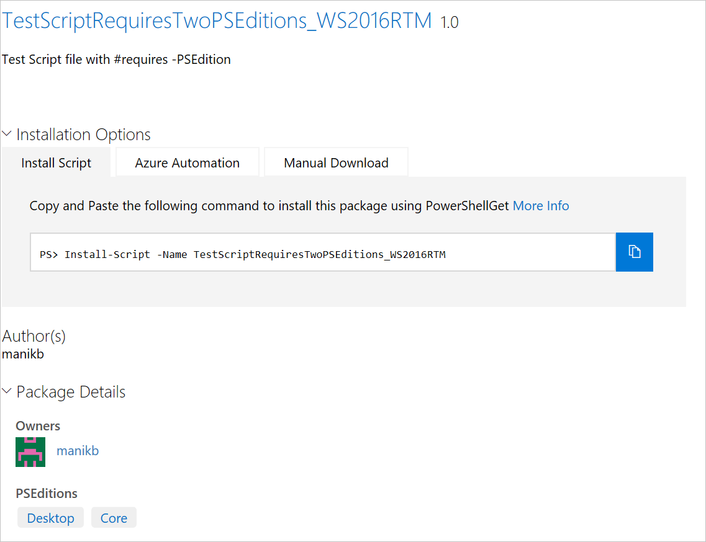

# Packages with compatible PowerShell Editions or Operating Systems

Starting with version 5.1, PowerShell is available in different editions which denote varying
feature sets and platform compatibilities.

## Searching by PowerShell Edition 

- **Desktop Edition:** Built on .NET Framework and provides compatibility with scripts and modules
  targeting versions of PowerShell running on full footprint editions of Windows such as Server Core
  and Windows Desktop.
- **Core Edition:** Built on .NET Core and provides compatibility with scripts and modules
  targeting versions of PowerShell running on reduced footprint editions of Windows such as Nano
  Server and Windows IoT.

### PowerShell Gallery extracts supported PSEditions metadata and allows you to filters the packages compatible for specific PowerShell Editions

If a package has compatible PSEditions specified, they will be listed as part of 'PowerShell
Editions' in the package display page and also in packages results.

### Search for packages in the gallery UI which works on PowerShellCore

Use Tags:"PSEdition_Desktop" and Tags:"PSEdition_Core" to filters the packages on PowerShell Gallery.

#### Use Tags:"PSEdition_Core" to search items compatible with PowerShell Core Edition.

#### Use Tags:"PSEdition_Desktop" to search items compatible with PowerShell Desktop Edition.

## Searching by Operating System 

Since PowerShell Core is available for Windows, Linux, and MacOS, packages in the Gallery may be designed for any combination of these operating systems. In the GalleryUI use the following searchs tags to find packages tagged by operating system:

- Tags: "Windows"
- Tags: "Linux"
- Tags: "MacOS" 

## Searching for Multiple Compatibilities

If I am looking for a package that is complatible with multiple compatibilities I would use the syntax: 

Tags: "Compatibility1" "Compatibility2" 

For example, if I am looking for a package with PowerShell Core Compatibility that runs on both Windows and Linux I would search:

Tags: "PSEdition_Core" "Windows" "Linux" 

## More details on authoring and finding the packages with compatible PowerShell Editions

- [Modules with PSEditions](../../concepts/module-psedition-support.md)
- [Scripts with PSEditions](../../concepts/script-psedition-support.md)
