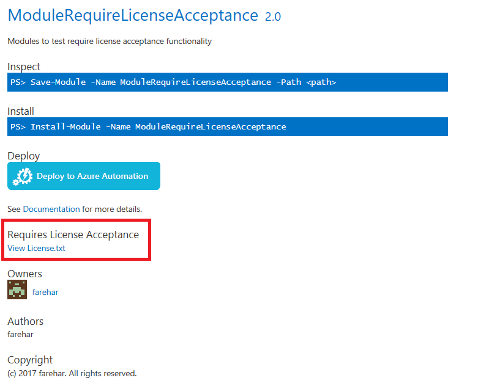

---
ms.date:  06/12/2017
contributor:  Farehar
ms.topic:  conceptual
keywords:  gallery,powershell,psgallery
title:  psgallery_require_license_acceptance
---
# Require License Acceptance

Require License Acceptance text shows up on item details page for modules that require license acceptance. License for module can be viewed by clicking on 'View License.txt' link.

Users will be prompted to accept the license when installing, saving or updating the module through PowerShellGet or when deploying to Azure Automation.

## Require License Acceptance on Deploy to Azure Automation

If the module being deployed to Azure Automation requires license acceptance, portal UI will show a disclaimer saying 'This module requires license acceptance. By clicking OK, you are accepting license terms.'

## More details

[Require License Acceptance in PowerShellGet](module-requirelicenseacceptance.md)
[Require License Acceptance in PowerShell Gallery](items-that-requirelicenseacceptance.md)
[Azure Automation website](http://azure.microsoft.com/services/automation/)
