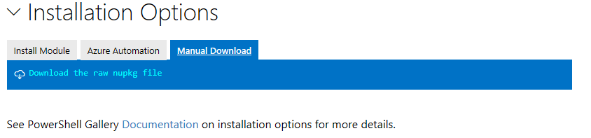

---
ms.date:  06/26/18
contributor:  JKeithB
keywords:  gallery,powershell,psgallery
title:  Manual Package download 
---
# Manual download and installation

The Powershell Gallery supports downloading a package from the website directly, without using the PowerShellGet cmdlets. 
The package will be downloaded as a NuGet package (.nupkg) file, which can then be easily copied to an internal repository. 

> [!NOTE]
> Manual package download is **not** intended as a replacement for the Install-Module cmdlet. 
> Downloading the package not install the module/script, and dependencies will not be downloaded. 
> The instructions below provide the information needed to expand and deploy a PowerShell module as a reference, only. 

## Using manual download to acquire a package

Each page has a link for Manual Download, as shown here:

To download manually, click on the text titled: "Download the raw nupkg file". 
Depending on the browser you are using, you may be able to choose the target folder where the nupkg file is placed. 
A copy of the package will be placed in the download folder for your browser, with the name [name].[version].nupkg. 

A NuGet package is in a zip format with extra content added to store data about the contents of the package (for example the author, version, type, licenseURI, projectURI, etc.). 
Some browsers, notably Internet Explorer, will automatically rename the nupkg file to .zip during the download, as this is a supported part of the NuGet specification. 

Users who wish to expand the package can rename the .nupkg file to .zip (if needed), then extract the contents to a local folder. 

A NuGet zip includes the following NuGet-specific elements that are not part of the original package:

* A folder named "_rels". This contains a .rels file, which lists the dependencies. 
* A folder named "package". This folder contains the NuGet-specific data.
* A file named "[content_types].xml". This describes how extensions such as PowerShellGet work with NuGet.
* A file named "[name].nuspec". This contains the bulk of the metadata.

## Installing PowerShell Modules from a NuGet package

> [!NOTE]
> These instructions **will not** give the same result as running Install-Module, as some steps for Install-Module will be skipped. 
> The instructions provide basic and minimum requirements. This is not intended to be a replacement for Install-Module. 

The easiest approach is to remove the elements that are part of the NuGet package structure, leaving a folder that contains the PowerShell code from the package author. 
The steps are:

* Extract the contents of the NuGet package.  
* Rename the extracted folder. The default folder name for the will generally be [name].[version], and the version section will include "-prerelease" if the module is tagged as a prerelease. Rename the folder to be just the module name. For example, "azurerm.storage.5.0.4-preview" should become "azurerm.storage". 
* Copy the folder to your PSModulePath. 

Unlike using the PowerShellGet cmdlets, manual download will not include any dependencies required for the module to work. 
If there are other packages that this package depends on, they must be installed on the system for this module to be used.
The PowerShell Gallery will show all dependencies required by the downloaded package.

## Installing PowerShell Scripts from a NuGet package

> [!NOTE]
> These instructions **will not** give the same result as running Install-Script. 
> The instructions provide basic and minimum requirements. This is not intended to be a replacement for Install-Script. 

The easiest approach is to extract the NuGet package, then use the script directly. 
The steps are:

* Extract the contents of the NuGet package.  
* The .PS1 file will be in the folder, and may be used directly. 
* You may delete the other elements of the folder, including the folders named .rel and .package, and files named [content_types].xml and [scriptname].nuspec. 

Unlike using the PowerShellGet cmdlets, manual download will not include any dependencies required for the script to work. 
If there are other packages that this script depends on, they must be installed on the system for this script to be used.
The PowerShell Gallery will show all dependencies required by the downloaded package.

