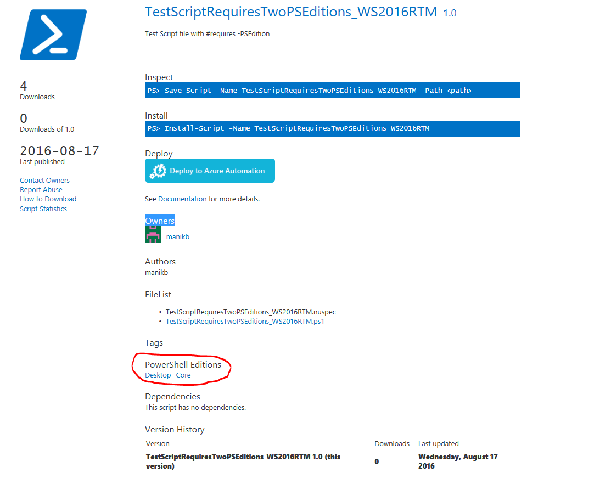

# Manual Package Download

The PowerShell Gallery supports downloading a package from the website directly, without using the
PowerShellGet cmdlets. You can download any package as a NuGet package (.nupkg) file, which you can
then copy to an internal repository.

> [!NOTE]
> Manual package download is **not** intended as a replacement for the Install-Module cmdlet.
> Downloading the package does not install the module or script. Dependencies are not included in
> the NuGet package downloaded. The following instructions are provided for reference purposes
> only.

## Using manual download to acquire a package

Each page has a link for Manual Download, as shown here:

To download manually, click on **Download the raw nupkg file**. A copy of the package copied to the
download folder for your browser with the name `<name>.<version>.nupkg`.

A NuGet package is a ZIP archive with extra files containing information about the contents of the
package. Some browsers, like Internet Explorer, automatically replace the `.nupkg` file extension
with `.zip`. To expand the package, rename the `.nupkg` file to `.zip`, if needed, then extract the
contents to a local folder.

A NuGet package file includes the following NuGet-specific elements that aren't part of the
original packaged code:

- A folder named `_rels` - contains a `.rels` file that lists the dependencies
- A folder named `package` - contains the NuGet-specific data
- A file named `[Content_Types].xml` - describes how extensions like PowerShellGet work with NuGet
- A file named `<name>.nuspec` - contains the bulk of the metadata

## Installing PowerShell Modules from a NuGet package

> [!NOTE]
> These instructions **DO NOT** give the same result as running `Install-Module`. These
> instructions fulfill the minimum requirements. They are not intended to be a replacement for
> `Install-Module`. Some steps performed by `Install-Module` are not included.

The easiest approach is to remove the NuGet-specific elements from the folder. This leaves the
PowerShell code created by the package author. The steps are:

1. Extract the contents of the NuGet package to a local folder.
2. Delete the NuGet-specific elements from the folder.
3. Rename the folder. The default folder name is usually `<name>.<version>`. The version can
   include "-prerelease" if the module is tagged as a prerelease version. Rename the folder to just
   the module name. For example, "azurerm.storage.5.0.4-preview" becomes "azurerm.storage".
4. Copy the folder to one of the folders in the `$env:PSModulePath value`. `$env:PSModulePath` is a semicolon delimited set of paths in which PowerShell should look for modules.

> [!IMPORTANT]
> The manual download does not include any dependencies required by the module. If the package has
> dependencies, they must be installed on the system for this module to work correctly. The
> PowerShell Gallery shows all dependencies required by the package.

## Installing PowerShell Scripts from a NuGet package

> [!NOTE]
> These instructions **DO NOT** give the same result as running `Install-Script`. These
> instructions fulfill the minimum requirements. They are not intended to be a replacement for
> `Install-Script`.

The easiest approach is to extract the NuGet package, then use the script directly. The steps are:

1. Extract the contents of the NuGet package.
2. The `.PS1` file in the folder can be used directly from this location.
3. You may delete the NuGet-specific elements in the folder.

> [!IMPORTANT]
> The manual download does not include any dependencies required by the module. If the package has
> dependencies, they must be installed on the system for this module to work correctly. The
> PowerShell Gallery shows all dependencies required by the package.
