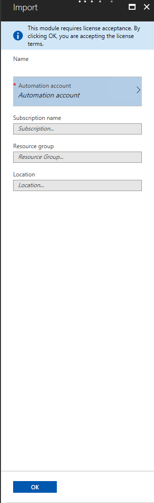

Require License Acceptance on Deploy to Azure Automation
===========================

If the module being deployed to Azure Automation requires license acceptance, portal UI will show a disclaimer saying 'This module requires license acceptance. By clicking OK, you are accepting license terms.'

## More details
### [Require License Acceptance in PowerShellGet](../psget/module/RequireLicenseAcceptance.md)
### [Require License Acceptance in PowerShell Gallery](psgallery_requires_license_acceptance.md)
### [Azure Automation website](http://azure.microsoft.com/en-us/services/automation/)

