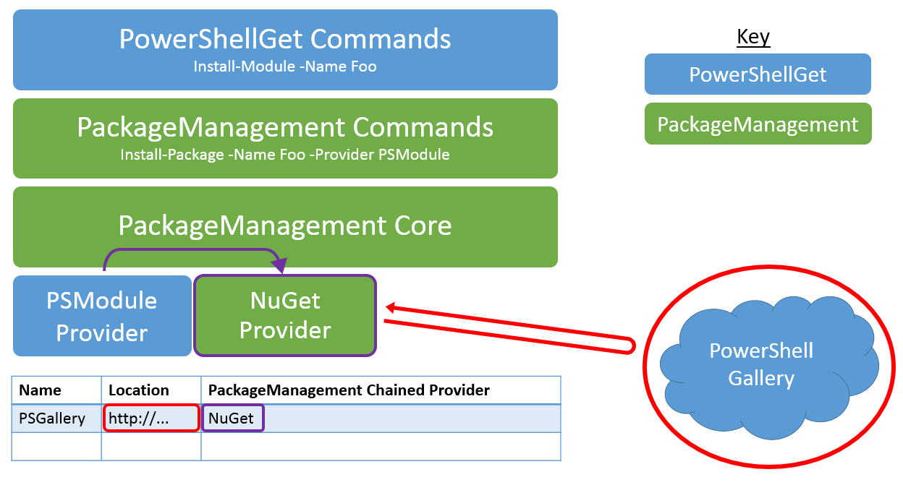

# Frequently Asked Questions

## What is a PowerShell module?

A PowerShell module is a reusable package containing some PowerShell functionality. Everything in PowerShell (functions, variables, DSC resources, etc.) can be packaged in modules. Typically, modules are folders containing specific types of files stored on a specific path. There are a few different types of PowerShell modules out there.

## What is a PowerShell script?

A PowerShell script is a series of commands that are stored in a .ps1 file to enable reuse and sharing. PowerShell workflows are also PowerShell scripts, which outline a set of tasks and provide sequencing for those tasks. For more information, please visit [Getting Started with PowerShell Workflow](https://technet.microsoft.com/library/jj134242.aspx).

## How are PowerShell Scripts different from PowerShell Modules?

Modules are generally better for sharing, but we are enabling script sharing to make it easier for you to contribute workflows and scripts to the community. For more information, see the following blogs:

- [Don't Write Scripts, Write PowerShell Modules](https://blogs.technet.microsoft.com/heyscriptingguy/2011/06/27/dont-write-scripts-write-powershell-modules/)
- [Understanding PowerShell Modules](https://blogs.technet.microsoft.com/heyscriptingguy/2015/07/10/understanding-powershell-modules/)

## How can I publish to the PowerShell Gallery?

You must register an account in the PowerShell Gallery before you can publish items to the Gallery. This is because publishing items requires a NuGetApiKey, which is provided upon registration. To register, use your personal, work, or school account to sign in to the PowerShell Gallery. A one-time registration process is required when you sign in for the first time. Afterwards, your NuGetApiKey is available on your profile page.

Once you have registered in the Gallery, use the [Publish-Module](https://go.microsoft.com/fwlink/?LinkID=760387&clcid=0x409) or [Publish-Script](https://go.microsoft.com/fwlink/?LinkID=760387&clcid=0x409) cmdlets to publish your item to the Gallery. For more details on how to run these cmdlets, visit the Publish tab, or read the [Publish-Module](https://go.microsoft.com/fwlink/?LinkID=760387&clcid=0x409) and [Publish-Script](https://go.microsoft.com/fwlink/?LinkID=760387&clcid=0x409) documentation.

**You do not need to register or sign in to the Gallery to install or save items.**

## I received "Failed to process request. 'The specified API key is invalid or does not have permission to access the specified package.'. The remote server returned an error: (403) Forbidden." error when I tried to publish an item to the PowerShell Gallery. What does that mean?

This error can occur for the following reasons:

- **The specified API key is invalid.**
     Ensure that you have specified the valid API key from your account. To get your API key, view your profile page.
- **The specified item name is not owned by you.**
     If you have confirmed that your API key is correct, then there may already exist an item with the same name as the one you are trying to use. The item may have been unlisted by the owner, in which case it will not appear in any search results. To determine if an item with the same name already exists, open a browser and navigate to the item's details page: `https://www.powershellgallery.com/packages/<itemName>`. For example, navigating directly to `https://www.powershellgallery.com/packages/pester` will take you to the Pester module's details page, whether it is unlisted or not. If an item with a conflicting name already exists and is unlisted, you can:
    - Select another name for your item.
    - Contact the owners of the existing item.

## Why can't I sign in with my personal account, but I could sign in yesterday?

Please be aware that your gallery account does not accommodate changes to your primary email alias. For more information, see [Microsoft Email Aliases](https://windows.microsoft.com/windows/outlook/add-alias-account).

## Why don't I see all the gallery items when I select all the Category checkboxes on the Items tab?

By selecting a Category checkbox, you are stating "I would like to see all items in this category." Only the items in the selected categories will be displayed. So similarly, by selecting all the Category checkboxes, you are stating "I would like to see all items in any category." But some items in the gallery do not belong to any of the categories listed, so they will not appear in the results. To see all items in the gallery, uncheck all the Categories, or select the Items tab again.

## What are the requirements to publish a module to the PowerShell Gallery?

Any kind of PowerShell module (script modules, binary modules, or manifest modules) can be published to the gallery. To publish a module, PowerShellGet needs to know a few things about it - the version, description, author, and how it is licensed. This information is read as part of the publishing process from the *module manifest* (.psd1) file, or from the value of the [**Publish-Module**](https://go.microsoft.com/fwlink/?LinkID=760387&clcid=0x409) cmdlet's **LicenseUri** parameter. All modules published to the Gallery must have module manifests. Any module that includes the following information in its manifest can be published to the Gallery:

- Version
- Description
- Author
- A URI to the license terms of the module, either as part of the **PrivateData** section of the manifest, or in the **LicenseUri** parameter of the [**Publish-Module**](https://go.microsoft.com/fwlink/?LinkID=760387&clcid=0x409) cmdlet.

## How do I create a correctly-formatted module manifest?

The easiest way to create a module manifest is to run the [**New-ModuleManifest**](https://go.microsoft.com/fwlink/?LinkID=760387&clcid=0x409) cmdlet. In PowerShell 5.0 or newer, New-ModuleManifest generates a correctly-formatted module manifest with blank fields for useful metadata like **ProjectUri**, **LicenseUri**, and **Tags**. Simply fill in the blanks, or use the generated manifest as an example of correct formatting.

To verify that all required metadata fields have been properly filled, use the [**Test-ModuleManifest**](https://go.microsoft.com/fwlink/?LinkID=760387&clcid=0x409) cmdlet.

To update the module manifest file fields, use the [**Update-ModuleManifest**](https://go.microsoft.com/fwlink/?LinkID=760387&clcid=0x409) cmdlet.

## What are the requirements to publish a script to the Gallery?

Any kind of PowerShell script (scripts or workflows) can be published to the gallery. To publish a script, PowerShellGet needs to know a few things about it - the version, description, author, and how it is licensed. This information is read as part of the publishing process from the script file's *PSScriptInfo* section, or from the value of the [**Publish-Script**](https://go.microsoft.com/fwlink/?LinkID=760387&clcid=0x409) cmdlet's **LicenseUri** parameter. All scripts published to the Gallery must have metadata information. Any script that includes the following information in its PSScriptInfo section can be published to the Gallery:

- Version
- Description
- Author
- A URI to the license terms of the script, either as part of the **PSScriptInfo** section of the script, or in the **LicenseUri** parameter of the [**Publish-Script**](https://go.microsoft.com/fwlink/?LinkID=760387&clcid=0x409) cmdlet.

## How do I search?

Type what you are looking for in the text box. For example, if you want to find modules that are related to Azure SQL, just type "azure sql". Our search engine will look for those keywords in all published items, including titles, descriptions and across metadata. Then, based on a weighted quality score, it will display the closest matches. You can also search by specific field using field:"value" syntax in the search query for the following fields:

- Tags
- Functions
- Cmdlets
- DscResources
- PowerShellVersion

So, for example, when you search for PowerShellVersion:"2.0" only results that are compatible with PowerShellVersion 2.0 (based on their module/script manifest) will be displayed.

## How do I create a correctly-formatted script file?

The easiest way to create a properly-formatted script file is to run the [**New-ScriptFileInfo**](https://go.microsoft.com/fwlink/?LinkID=760387&clcid=0x409) cmdlet. In PowerShell 5.0, New-ScriptFileInfo generates a correctly-formatted script file with blank fields for useful metadata like **ProjectUri**, **LicenseUri**, and **Tags**. Simply fill in the blanks, or use the generated script file as an example of correct formatting.

To verify that all required metadata fields have been properly filled, use the [**Test-ScriptFileInfo**](http://go.microsoft.com/fwlink/?LinkID=760387&clcid=0x409) cmdlet.

To update the script metadata fields, use the [**Update-ScriptFileInfo**](https://go.microsoft.com/fwlink/?LinkID=760387&clcid=0x409) cmdlet.

## What other types of PowerShell Modules exist?

The term PowerShell module also refers to the files that implement actual functionality. Script module files (.psm1) contain PowerShell code. Binary module files (.dll) contain compiled code.

Here is one way to think about it: the folder that encapsulates the module is the module folder. The module folder can contain a module manifest (.psd1) that describes the contents of the folder. The files that actually do the work are the script module files (.psm1) and the binary module files (.dll). DSC resources are located in a specific sub-folder, and are implemented as script module files or binary module files.

All of the modules in the Gallery contain module manifests, and most of these modules contain script module files or binary module files. The term module can be confusing because of these different meanings. Unless explicitly stated otherwise, all uses of the word module on this page refer to the module folder containing these files.

## How does PackageManagement relate to PowerShellGet? (High Level Answer)

PackageManagement is a common interface for working with any package manager. Eventually, whether you're dealing with PowerShell modules, MSIs, Ruby gems, NuGet packages, or Perl modules, you should be able to use PackageManagement's commands (Find-Package and Install-Package) to find and install them. PackageManagement does this by having a package provider for each package manager that plugs into PackageManagement. Providers do all of the actual work; they fetch content from repositories, and install the content locally. Often, package providers simply wrap around the existing package manager tools for a given package type.

PowerShellGet is the package manager for PowerShell items. There is a PSModule package provider that exposes PowerShellGet functionality through PackageManagement. Because of this, you can either run [Install-Module](https://go.microsoft.com/fwlink/?LinkID=760387&clcid=0x409) or Install-Package -Provider PSModule to install a module from the PowerShell Gallery. Certain PowerShellGet functionality, including [Update-Module](https://go.microsoft.com/fwlink/?LinkID=760387&clcid=0x409) and [Publish-Module](https://go.microsoft.com/fwlink/?LinkID=760387&clcid=0x409), cannot be accessed through PackageManagement commands.

In summary, PowerShellGet is solely focused on having a premium package management experience for PowerShell content. PackageManagement is focused on exposing all package management experiences through one general set of tools. If you find this answer unsatisfying, there is a long answer at the bottom of this document, in the **How does PackageManagement actually relate to PowerShellGet?** section.

For more information, please visit the [PackageManagement project page](https://oneget.org/).

## How does NuGet relate to PowerShellGet?

The PowerShell Gallery is a modified version of the [NuGet Gallery](https://www.nuget.org/). PowerShellGet uses NuGet provider to work with NuGet based repositories like the PowerShell Gallery.

You can use PowerShellGet against any valid NuGet repository or file share. You simply need to add the repository by running the [**Register-PSRepository**](https://go.microsoft.com/fwlink/?LinkID=760387&clcid=0x409) cmdlet.

## Does that mean I can use NuGet.exe to work with the Gallery?

Yes.

## How does PackageManagement actually relate to PowerShellGet? (Technical Details)

Under the hood, PowerShellGet heavily leverages PackageManagement infrastructure.

At the PowerShell cmdlet layer, [Install-Module](https://go.microsoft.com/fwlink/?LinkID=760387&clcid=0x409) is actually a thin wrapper around Install-Package -Provider PSModule.

At the PackageManagement package provider layer, the PSModule package provider actually calls into other PackageManagement package providers. For example, when you are working with NuGet-based galleries (such as the PowerShell Gallery), the PSModule package provider uses the NuGet Package Provider to work with the repository.

Figure 1: PowerShellGet Architecture

## What is required to run PowerShellGet?

In general we recommend picking the latest version of PowerShellGet module (note that it requires .NET 4.5).

The **PowerShellGet** module requires **PowerShell 3.0 or newer**.

Therefore, **PowerShellGet** requires one of the following operating systems:

- Windows 10
- Windows 8.1 Pro
- Windows 8.1 Enterprise
- Windows 7 SP1
- Windows Server 2016
- Windows Server 2012 R2
- Windows Server 2008 R2 SP1

**PowerShellGet** also  requires .NET Framework 4.5 or above. You can install .NET Framework 4.5 or above from [here](https://msdn.microsoft.com/library/5a4x27ek.aspx).

## Is it possible to reserve names for items that will be published in future?

It is not possible to squat item names. If you feel that an existing item has taken the name which suits your item more, try [contacting the owner of the item](psgallery_contacting_item_owners.md). If you didnt get response within a couple of weeks, you can contact support and the PowerShell Gallery team will look in to it.

## How do I claim ownership for items ?

Check out [Managing Item Owners on PowerShellGallery.com](Managing-Item-Owners.md) for details.

## How do I deal with an item owner who is violating my item license?

We encourage the PowerShell community to work together to resolve any disputes that may arise between item owners and the owners of other items.  We have crafted a [dispute resolution process](psgallery_dispute_resolution.md) that we ask you to follow before PowerShellGallery.com administrators intercede.

