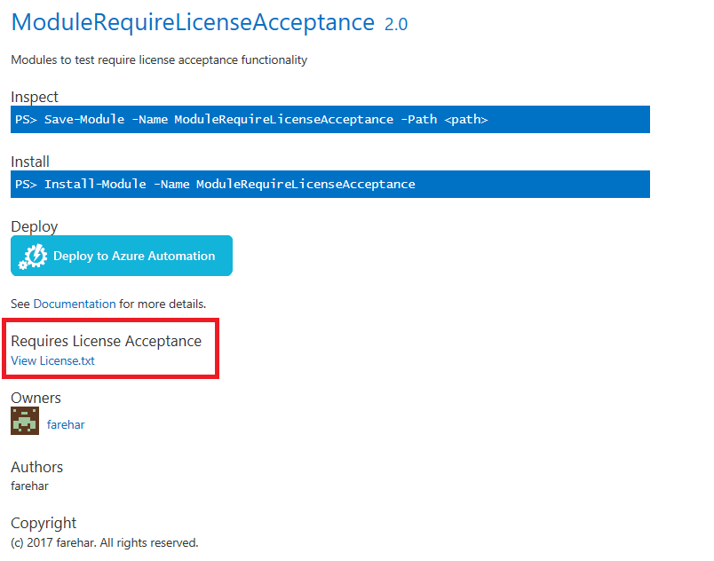

Requires License Acceptance
===========================

Requires License Acceptance text shows up on item details page for modules that require license acceptance. License for module can be viewed by clicking on 'View License.txt' link.

Users will be prompted to accept the license when installing, saving or updating the module through PowerShellGet or when deploying to azure automation. To learn more, see [PowerShellGet Documentation](../psget/module/RequireLicenseAcceptance.md)