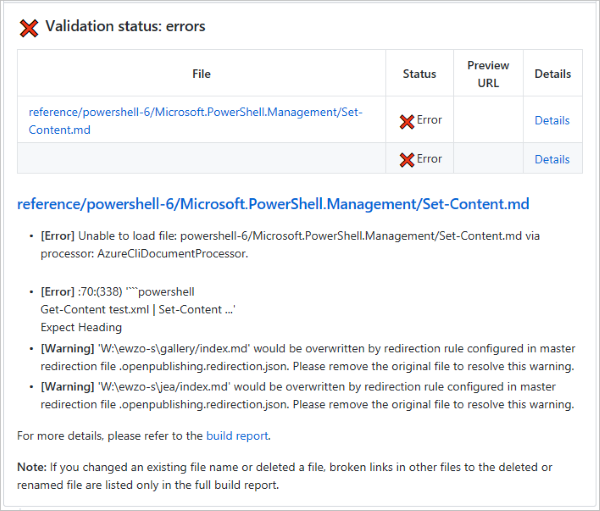
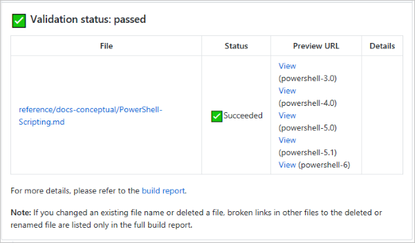

# How to submit pull requests

To make changes to content, submit a pull request (PR) from your fork. A pull request must be
reviewed before it can be merged. For best results, review the
[editorial checklist](editorial-checklist.md) before submitting your pull request.

## Using git branches

The default branch for PowerShell-Docs is the `staging` branch. Changes made in working branches are
merged into the `staging` branch before then being published. The `staging` branch is merged into
the `live` branch every weekday at 3:00 PM (Pacific Time). The `live` branch contains the content
that is published to docs.microsoft.com.

Before starting any changes, create a working branch in your local copy of the PowerShell-Docs
repository. When working locally, be sure to synchronize your local repository before creating your
working branch. The working branch should be created from an update-to-date copy of the `staging`
branch.

All pull requests should target the `staging` branch. Don't submit change to the `live` branch.
Changes made in the `staging` branch get merged into `live`, overwriting any changes made to `live`.

## Make the pull request process work better for everyone

The simpler and more focused you can make your PR, the faster it can be reviewed and merged.

### Avoid pull requests that update large numbers of files or contain unrelated changes

Avoid creating PRs that contain unrelated changes. Separate minor updates to existing articles from
new articles or major rewrites. Work on these changes in separate working branches.

Bulk changes create PRs with large numbers of changed files. Limit your PRs to a maximum of 50
changed files. Large PRs are difficult to review and are more prone to contain errors.

### Renaming or deleting files

When renaming or deleting files, there must be an issue associated with the PR. That issue must
discuss the need to rename or delete the files.

Avoid mixing content additions or change with file renames and deletes. Any file that is renamed or
deleted must be added to the global redirection file. When possible, update any files that link to
the renamed or deleted content, including any TOC files.

## Docs PR validation service

The Docs PR validation service is a GitHub app that runs validation rules on your changes. You must
fix any errors or warnings reported by the validation service.

You'll see the following behavior:

1. You submit a PR.
1. In the GitHub comment that indicates the status of your PR, you'll see the status of "checks"
   enabled on the repository. In this example, there are two checks enabled, "Commit Validation" and
   "OpenPublishing.Build":

   

   The build can pass even if commit validation fails.

1. Click **Details** for more information.
1. On the Details page, you'll see all the validation checks that failed, with information about how
   to fix the issues.
1. When validation succeeds, the following comment is added to the PR:

   

> [!NOTE]
> If you are an external (not a Microsoft employee) contributor you do not have access to the
> detailed build reports or preview links.

When the PR is reviewed, you may be asked to make changes or fix validation warning messages. The
PowerShell-Docs team can help you understand validation errors and editorial requirements.

## Next steps

[PowerShell-Docs style guide](powershell-style-guide.md)

## Additional resources

[How we manage pull requests](managing-pull-requests.md)

<!--link refs-->
[fork]: /contribute/get-started-setup-local#fork-the-repository
