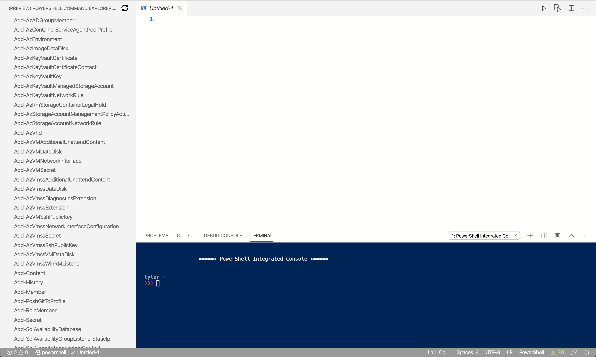
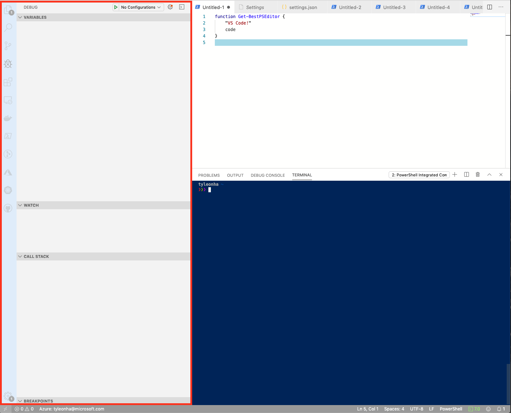
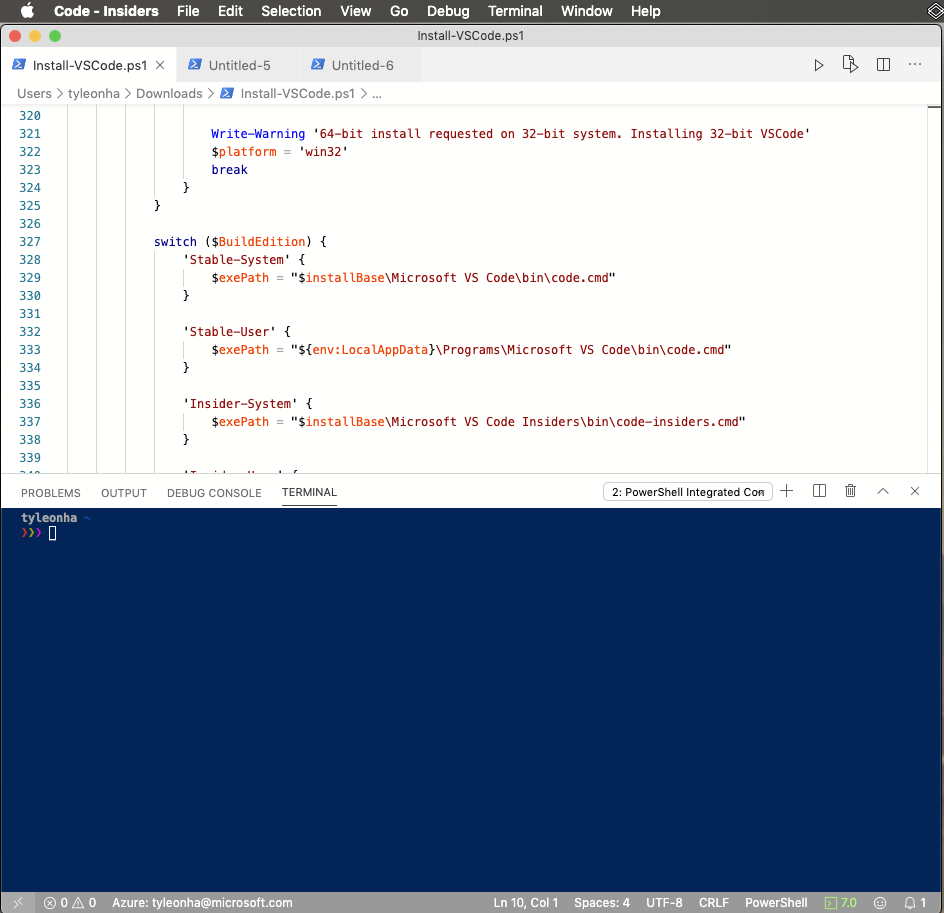

# How to replicate the ISE experience in Visual Studio Code

While the PowerShell extension for VSCode doesn't seek
complete feature parity with the PowerShell ISE,
there are features in place to make the VSCode experience more natural
for users of the ISE.

This document tries to list settings you can configure in VSCode
to make the user experience a bit more familiar compared to the ISE.

## ISE Mode

> [!NOTE]
> This feature is available in the PowerShell Preview extension since version 2019.12.0
> and in the PowerShell extension since version 2020.3.0.

The easiest way to replicate the ISE experience in Visual Studio Code is by turning on "ISE Mode".
To do this, open the command pallet (<kbd>F1</kbd> OR <kbd>Ctrl</kbd>+<kbd>Shift</kbd>+<kbd>P</kbd> OR
<kbd>Cmd</kbd>+<kbd>Shift</kbd>+<kbd>P</kbd> on macOS) and type in "ISE Mode".
Select "PowerShell: Enable ISE Mode" from the list.

This command will apply a lot of the settings found in this document automatically.
The result looks like this:



The rest of this article includes more detailed information on settings in ISE Mode and
some additional settings.

## Key bindings

| Function                              | ISE Binding                  | VSCode Binding                              |
| ----------------                      | -----------                  | --------------                              |
| Interrupt and break debugger          | <kbd>Ctrl</kbd>+<kbd>B</kbd> | <kbd>F6</kbd>                               |
| Execute current line/highlighted text | <kbd>F8</kbd>                | <kbd>F8</kbd>                               |
| List available snippets               | <kbd>Ctrl</kbd>+<kbd>J</kbd> | <kbd>Ctrl</kbd>+<kbd>Alt</kbd>+<kbd>J</kbd> |

### Custom Key bindings

You can [configure your own key bindings](https://code.visualstudio.com/docs/getstarted/keybindings#_custom-keybindings-for-refactorings)
in VSCode as well.

## Simplified ISE-like UI

If you're looking to simplify the Visual Studio Code UI to look more closely to the UI of the ISE, apply these two settings:

```json
"workbench.activityBar.visible": false,
"debug.openDebug": "neverOpen",
```

> [!NOTE]
> These settings are included in ["ISE Mode"](#ise-mode).

This will hide the "Activity Bar" and the "Debug Side Bar" sections below inside of the red box:



The end result looks like this:



## Tab completion

To enable more ISE-like tab completion, add this setting:

```json
"editor.tabCompletion": "on",
```

> [!NOTE]
> This setting was added directly to VSCode (rather than in the extension). Its behavior is determined by VSCode directly and cannot be changed by the extension.

> [!NOTE]
> This setting is included in ["ISE Mode"](#ise-mode).

## No focus on console when executing

To keep the focus in the editor when you execute with <kbd>F8</kbd>:

```json
"powershell.integratedConsole.focusConsoleOnExecute": false
```

> [!NOTE]
> This setting is included in ["ISE Mode"](#ise-mode).

The default is `true` for accessibility purposes.

## Don't start integrated console on startup

To stop the integrated console on startup, set:

```json
"powershell.integratedConsole.showOnStartup": false
```

> [!NOTE]
> The background PowerShell process will still start since that provides IntelliSense, script analysis, symbol navigation, etc.
But the console won't be shown.

## Assume files are PowerShell by default

To make new/untitled files, register as PowerShell by default:

```json
"files.defaultLanguage": "powershell",
```

> [!NOTE]
> This setting is included in ["ISE Mode"](#ise-mode).

## Color scheme

There are a number of ISE themes available for VSCode
to make the editor look much more like the ISE.

In the [Command Palette]
type `theme` to get `Preferences: Color Theme` and press <kbd>Enter</kbd>.
In the drop-down list, select `PowerShell ISE`.

You can set this theme in the settings with:

```json
"workbench.colorTheme": "PowerShell ISE",
```

> [!NOTE]
> This setting is included in ["ISE Mode"](#ise-mode).

## PowerShell Command Explorer

Thanks to the work of [@corbob](https://github.com/corbob),
the PowerShell extension has the beginnings of its own command explorer.

In the [Command Palette],
enter `PowerShell Command Explorer` and press <kbd>Enter</kbd>.

> [!NOTE]
> This is shown automatically in ["ISE Mode"](#ise-mode).

## Open in the ISE

If you end up wanting to open a file in the ISE anyway,
you can use <kbd>Shift</kbd>+<kbd>Alt</kbd>+<kbd>P</kbd>.

## Other resources

- 4sysops has [a great article](https://4sysops.com/archives/make-visual-studio-code-look-and-behave-like-powershell-ise/)
  on configuring VSCode to be more like the ISE.
- Mike F Robbins has [a great post](https://mikefrobbins.com/2017/08/24/how-to-install-visual-studio-code-and-configure-it-as-a-replacement-for-the-powershell-ise/) on setting up VSCode.
- Learn PowerShell has [an excellent write up](https://www.learnpwsh.com/setup-vs-code-for-powershell/)
  on getting VSCode setup for PowerShell.

## More settings

If you know of more ways to make VSCode feel more familiar
for ISE users, contribute to this doc.
If there's a compatibility configuration you're looking for,
but you can't find any way to enable it, [open an issue](https://github.com/PowerShell/vscode-powershell/issues/new/choose)
and ask away!

We're always happy to accept PRs and contributions as well!

## VSCode Tips

### Command Palette

<kbd>F1</kbd> OR <kbd>Ctrl</kbd>+<kbd>Shift</kbd>+<kbd>P</kbd>
(<kbd>Cmd</kbd>+<kbd>Shift</kbd>+<kbd>P</kbd> on macOS)

A handy way of executing commands in VSCode.
For more information, see [the VSCode docs](https://code.visualstudio.com/docs/getstarted/userinterface#_command-palette).

[Command Palette]: #command-palette
