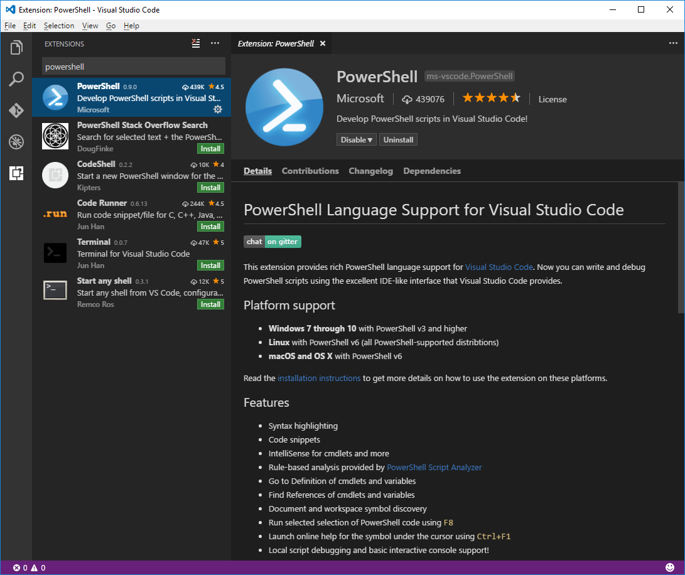

# Using Visual Studio Code for PowerShell Development

[Visual Studio Code](https://code.visualstudio.com/) is a cross-platform (Windows, macOS, and Linux)
script editor by Microsoft. Together with the
[the PowerShell extension](https://marketplace.visualstudio.com/items?itemName=ms-vscode.PowerShell),
it provides a rich and interactive script editing experience,
making it easier to write reliable PowerShell scripts.

Visual Studio Code with the PowerShell extension is the recommended editor for writing PowerShell scripts.
It supports the following PowerShell versions:

- PowerShell 7 and up
- PowerShell Core 6
- Windows PowerShell 5.1

Before you begin, make sure PowerShell exists on your system. For modern workloads on Windows,
macOS, and Linux, see the following links:

- [Installing PowerShell on Linux][install-pscore-linux]
- [Installing PowerShell on macOS][install-pscore-macos]
- [Installing PowerShell on Windows][install-pscore-windows]

For traditional Windows PowerShell workloads, see [Installing Windows PowerShell][install-winps].

> [!NOTE]
> Visual Studio Code is not the same as [Visual Studio](https://visualstudio.microsoft.com/).

> [!IMPORTANT]
> The [Windows PowerShell ISE][ise] is also still available for Windows, however, it is no longer in
> active feature development and does not work with PowerShell 7 and up or PowerShell Core 6.
> As a shipping component of Windows, it continues to be officially supported for security and
> high-priority servicing fixes. We currently have no plans to remove the ISE from Windows.

## Editing with Visual Studio Code

1. Install Visual Studio Code. For more information, see the overview
    [Setting up Visual Studio Code](https://code.visualstudio.com/Docs/setup/setup-overview).

    There are installation instructions for each platform:

    - **Windows**: follow the installation instructions on the
     [Running Visual Studio Code on Windows](https://code.visualstudio.com/docs/setup/windows) page.
    - **macOS**: follow the installation instructions on the
     [Running Visual Studio Code on macOS](https://code.visualstudio.com/docs/setup/mac) page.
    - **Linux**: follow the installation instructions on the
     [Running Visual Studio Code on Linux](https://code.visualstudio.com/docs/setup/linux) page.

1. Install the PowerShell Extension.

   1. Launch the Visual Studio Code app by typing `code` in a console or `code-insiders`
      if you installed Visual Studio Code Insiders.
   1. Launch **Quick Open** on Windows or Linux by pressing <kbd>Ctrl</kbd>+<kbd>P</kbd>. On macOS,
      press <kbd>Cmd</kbd>+<kbd>P</kbd>.
   1. In Quick Open, type `ext install powershell` and press **Enter**.
   1. The **Extensions** view opens on the Side Bar. Select the PowerShell extension from Microsoft.
      You should see a Visual Studio Code screen similar to the following image:

      

   1. Click the **Install** button on the PowerShell extension from Microsoft.
   1. After the install, if you see the **Install** button turn into **Reload**, Click on **Reload**.
   1. After Visual Studio Code has reloaded, you're ready for editing.

For example, to create a new file, click **File > New**. To save it, click **File > Save** and then
provide a file name, such as `HelloWorld.ps1`. To close the file, click the `X` next to the file
name. To exit Visual Studio Code, **File > Exit**.

### Installing the PowerShell Extension on Restricted Systems

Some systems are set up in a way that requires all code signatures to be checked and requires
PowerShell Editor Services to be manually approved to run on the system. A Group Policy update that
changes execution policy is a likely cause if you've installed the PowerShell extension but are
receiving an error such as:

```
Language server startup failed.
```

To manually approve PowerShell Editor Services and the PowerShell extension for Visual Studio Code,
open a PowerShell prompt and run the following command:

```powershell
Import-Module $HOME\.vscode\extensions\ms-vscode.powershell*\modules\PowerShellEditorServices\PowerShellEditorServices.psd1
```

You're prompted with **Do you want to run software from this untrusted publisher?**
Type `A` to run the file. Then, open Visual Studio Code and check that the PowerShell extension is
functioning properly. If you still have issues getting started, let us know on
[GitHub](https://github.com/PowerShell/vscode-powershell/issues).

> [!NOTE]
> The PowerShell extension for Visual Studio Code does not support running in
> constrained language mode. Please see the [GitHub issue tracking that support](https://github.com/PowerShell/vscode-powershell/issues/606)
> for more information.

### Using an older version of the PowerShell Extension for Windows PowerShell v3 and v4

Although the current PowerShell extension [stopped supporting v3 and v4](https://github.com/PowerShell/vscode-powershell/issues/1310),
you can still use the last version of the extension that did.

> [!NOTE]
> There will be no additional fixes to this older version of the extension. It's provided "AS IS" but
> is available for you if you are still using Windows PowerShell v3 and Windows PowerShell v4.

First, open the Extension pane and search for `PowerShell`. Then click the gear and select
**Install another version...**.


Then select the **`2020.1.0`** version. This version of the extension was the last version to support
v3 and v4.

Also, add the following setting so that your extension version doesn't update automatically:

```json
{
    "extensions.autoUpdate": false
}
```

Although this will work in the forseeable future,
Visual Studio Code could implement a change that breaks this version of the extension.
Because of this, and lack of support, we highly recommend either:

- Downloading PowerShell 7 - which is a side-by-side install to Windows PowerShell and works
the best with the PowerShell extension
- Upgrading to Windows PowerShell 5.1

The [Editing with Visual Studio Code](#editing-with-visual-studio-code) section in this article
links to where to install these.

### Choosing a version of PowerShell to use with the extension

With PowerShell Core installing side-by-side with Windows PowerShell, it's now possible to use a
particular version of PowerShell with the PowerShell extension. Use the following steps to choose
the version:

1. Open the **Command Palette** on Windows or Linux with
   <kbd>Ctrl</kbd>+<kbd>Shift</kbd>+<kbd>P</kbd>. On macOS, use
   <kbd>Cmd</kbd>+<kbd>Shift</kbd>+<kbd>P</kbd>.
1. Search for **Session**.
1. Click on **PowerShell: Show Session Menu**.
1. Choose the version of PowerShell you want to use from the list, for example: **PowerShell Core**.

> [!IMPORTANT]
> This feature looks at a few well-known paths on different operating systems to discover install
> locations of PowerShell. If you installed PowerShell to a non-typical location, it might not show
> up initially in the Session Menu. You can extend the session menu by
> [adding your own custom paths](#adding-your-own-powershell-paths-to-the-session-menu) as described
> below.

>[!NOTE]
> There's another way to get to the session menu. When a PowerShell file is open in your editor, you
> see a green version number in the bottom right. Clicking this version number will bring you to the
> session menu.

### Adding your own PowerShell paths to the session menu

You can add other PowerShell executable paths to the session menu through the
[Visual Studio Code setting](https://code.visualstudio.com/docs/getstarted/settings):
`powershell.powerShellAdditionalExePaths`.

Add an item to the list `powershell.powerShellAdditionalExePaths` or create the list if it doesn't
exist in your `settings.json`:

```json
{
    // other settings...

    "powershell.powerShellAdditionalExePaths": [
        {
            "exePath": "C:\\Users\\tyler\\Downloads\\PowerShell\\pwsh.exe",
            "versionName": "Downloaded PowerShell"
        }
    ],

    // other settings...
}
```

Each item must have:

- `exePath`: The path to the `pwsh` or `powershell` executable.
- `versionName`: The text that will show up in the session menu.

You can set the default PowerShell version to use the `powershell.powerShellDefaultVersion` setting
by setting this to the text displayed in the session menu (also known as the `versionName` in the
last setting):

```json
{
    // other settings...

    "powershell.powerShellAdditionalExePaths": [
        {
            "exePath": "C:\\Users\\tyler\\Downloads\\PowerShell\\pwsh.exe",
            "versionName": "Downloaded PowerShell"
        }
    ],

    "powershell.powerShellDefaultVersion": "Downloaded PowerShell",

    // other settings...
}
```

After you've configured this setting, restart Visual Studio Code or to reload the current
Visual Studio Code window from the **Command Palette**, type **Developer: Reload Window**.

If you open the session menu, you now see your additional PowerShell versions!

> [!NOTE]
> If you build PowerShell from source, this is a great way to test out your local build of
> PowerShell.

### Configuration settings for Visual Studio Code

First, if you're not familiar with how to change settings in Visual Studio Code,
we recommend looking at [Visual Studio Code's settings documentation](https://code.visualstudio.com/docs/getstarted/settings).

By using the steps in the previous paragraph, you can add configuration settings in `settings.json`.

```json
{
    "editor.renderWhitespace": "all",
    "editor.renderControlCharacters": true,
    "files.trimTrailingWhitespace": true,
    "files.encoding": "utf8bom",
    "files.autoGuessEncoding": true
}
```

If you don't want these settings to affect all files types, Visual Studio Code also allows per-language
configurations. Create a language-specific setting by putting settings in a `[<language-name>]`
field. For example:

```json
{
    "[powershell]": {
        "files.encoding": "utf8bom",
        "files.autoGuessEncoding": true
    }
}
```

> [!TIP]
> For more information about file encoding in Visual Studio Code, see [Understanding file encoding](understanding-file-encoding.md).
>
> Also check out the [How to replicate the ISE experience in Visual Studio Code](How-To-Replicate-the-ISE-Experience-In-VSCode.md)
for other tips on how to configure Visual Studio Code for PowerShell editing.

## Debugging with Visual Studio Code

### No-workspace debugging

As of Visual Studio Code version 1.9 you can debug PowerShell scripts without opening the folder
that contains the PowerShell script. Open the PowerShell script file with **File > Open File...**,
set a breakpoint on a line, press <kbd>F9</kbd>, and then press <kbd>F5</kbd> to start debugging. You
should see the Debug actions pane appear which allows you to break into the debugger, step, resume,
and stop debugging.

### Workspace debugging

Workspace debugging refers to debugging in the context of a folder that you've opened in Visual
Studio Code from the **File** menu using **Open Folder...**. The folder you open is typically your
PowerShell project folder and/or the root of your Git repository.

Even in this mode, you can start debugging the currently selected PowerShell script by pressing
<kbd>F5</kbd>. However, workspace debugging allows you to define multiple debug configurations other
than just debugging the currently open file. We'll get to those in a moment.

Follow these steps to create your debug configuration file:

  1. Open the **Debug** view on Windows or Linux by pressing
     <kbd>Ctrl</kbd>+<kbd>Shift</kbd>+<kbd>D</kbd>. On macOS, press
     <kbd>Cmd</kbd>+<kbd>Shift</kbd>+<kbd>D</kbd>.
  1. Click the "create a launch.json file" link.
  1. Visual Studio Code prompts you to **Select Environment**. Choose **PowerShell**.
  1. Lastly, choose the type of debugging you'd like to use:

- **Launch Current File** - Launch and debug the file in the currently active editor window
- **Launch Script** - Launch and debug the specified file or command
- **Interactive Session** - Debug commands executed from the Integrated Console
- **Attach** - Attach the debugger to a running PowerShell Host Process

The result is that Visual Studio Code creates a directory and a file `.vscode\launch.json` in the root of your
workspace folder. This location is where your debug configuration is stored. If your files are in a
Git repository, you typically want to commit the `launch.json` file. The contents of the
`launch.json` file are:

```json
{
  "version": "0.2.0",
  "configurations": [
      {
          "type": "PowerShell",
          "request": "launch",
          "name": "PowerShell Launch (current file)",
          "script": "${file}",
          "args": [],
          "cwd": "${file}"
      },
      {
          "type": "PowerShell",
          "request": "attach",
          "name": "PowerShell Attach to Host Process",
          "processId": "${command.PickPSHostProcess}",
          "runspaceId": 1
      },
      {
          "type": "PowerShell",
          "request": "launch",
          "name": "PowerShell Interactive Session",
          "cwd": "${workspaceRoot}"
      }
  ]
}
```

This file represents the common debug scenarios. When you open this file in the editor, you see an
**Add Configuration...** button. You can click this button to add more PowerShell debug
configurations. One useful configuration to add is **PowerShell: Launch Script**. With this
configuration, you can specify a file with optional arguments that should be launched whenever you
press <kbd>F5</kbd> no matter which file is currently active in the editor.

After the debug configuration is established, you can select which configuration you want to use
during a debug session. Select a configuration from the debug configuration drop-down in the
**Debug** view's toolbar.

There are a few blogs that may be helpful to get you started using PowerShell extension for Visual
Studio Code:

- [PowerShell Extension][ps-extension]
- [Write and debug PowerShell scripts in Visual Studio Code][debug]
- [Debugging Visual Studio Code Guidance][vscode-guide]
- [Debugging PowerShell in Visual Studio Code][ps-vscode]
- [Get started with PowerShell development in Visual Studio Code][getting-started]
- [Visual Studio Code editing features for PowerShell development – Part 1][editing-part1]
- [Visual Studio Code editing features for PowerShell development – Part 2][editing-part2]
- [Debugging PowerShell script in Visual Studio Code – Part 1][debugging-part1]
- [Debugging PowerShell script in Visual Studio Code – Part 2][debugging-part2]

[ise]: ../ise/Introducing-the-Windows-PowerShell-ISE.md
[install-pscore-linux]:  ../../install/Installing-PowerShell-Core-on-Linux.md
[install-pscore-macos]:  ../../install/Installing-PowerShell-Core-on-macOS.md
[install-pscore-windows]: ../../install/Installing-PowerShell-Core-on-Windows.md
[install-winps]: ../../install/Installing-Windows-PowerShell.md
[ps-extension]: https://blogs.msdn.microsoft.com/cdndevs/2015/12/11/visual-studio-code-powershell-extension/
[debug]: https://devblogs.microsoft.com/powershell/announcing-powershell-language-support-for-visual-studio-code-and-more/
[vscode-guide]: https://johnpapa.net/debugging-with-visual-studio-code/
[ps-vscode]: https://github.com/PowerShell/vscode-powershell/tree/master/examples
[getting-started]: https://devblogs.microsoft.com/scripting/get-started-with-powershell-development-in-visual-studio-code/
[editing-part1]: https://devblogs.microsoft.com/scripting/visual-studio-code-editing-features-for-powershell-development-part-1/
[editing-part2]: https://devblogs.microsoft.com/scripting/visual-studio-code-editing-features-for-powershell-development-part-2/
[debugging-part1]: https://devblogs.microsoft.com/scripting/debugging-powershell-script-in-visual-studio-code-part-1/
[debugging-part2]: https://devblogs.microsoft.com/scripting/debugging-powershell-script-in-visual-studio-code-part-2/

## PowerShell extension for Visual Studio Code

The PowerShell extension's source code can be found on [GitHub](https://github.com/PowerShell/vscode-powershell).

If you're interested in contributing, Pull Request are greatly appreciated. Follow along with the
[developer documentation on GitHub](https://github.com/PowerShell/vscode-powershell/blob/master/docs/development.md)
to get started.

## Troubleshooting the PowerShell extension for Visual Studio Code

If you experience any issues using Visual Studio Code for PowerShell script development,
please take a look at the
[troubleshooting guide on GitHub](https://github.com/PowerShell/vscode-powershell/blob/master/docs/troubleshooting.md)
