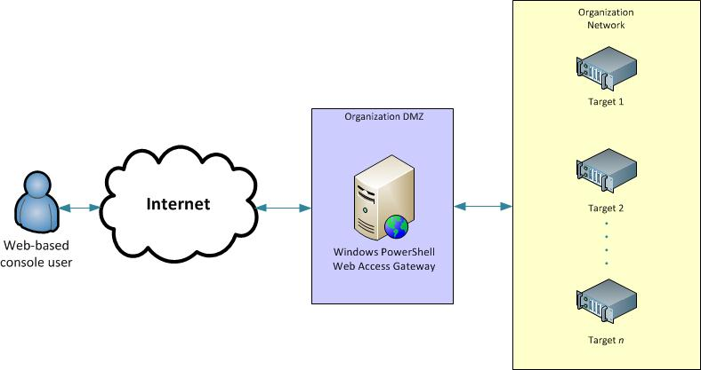

# Install and Use Windows PowerShell Web Access

Updated: November 5, 2013 (Edited: August 23, 2017)

Applies To: Windows Server 2012 R2, Windows Server 2012

## Introduction

Windows PowerShell Web Access, first introduced in Windows Server 2012,
acts as a Windows PowerShell gateway, providing a web-based Windows
PowerShell console that is targeted at a remote computer. It enables IT
Pros to run Windows PowerShell commands and scripts from a Windows
PowerShell console in a web browser, with no Windows PowerShell, remote
management software, or browser plug-in installation necessary on the
client device. All that is required to run the web-based Windows PowerShell
console is a properly-configured Windows PowerShell Web Access gateway, and
a client device browser that supports JavaScript and accepts cookies.

Examples of client devices include laptops, non-work personal computers,
borrowed computers, tablet computers, web kiosks, computers that are not
running a Windows-based operating system, and cell phone browsers. IT Pros
can perform critical management tasks on remote Windows-based servers from
devices that have access to an Internet connection and a web browser.

After successful gateway setup and configuration, users can access a
Windows PowerShell console by using a web browser. When users open the
secured Windows PowerShell Web Access website, they can run a web-based
Windows PowerShell console after successful authentication.

Windows PowerShell Web Access setup and configuration is a three-step 
process:

1. [Install Windows PowerShell Web Access](#install-windows-powershell-web-access)
1. [Configure the Gateway](#configure-the-gateway)
1. [Configure a restrictive authorization rule](#configure-a-restrictive-authorization-rule)

Before you install and configure Windows PowerShell Web Access, we
recommend that you read this entire guide, which includes instructions
about how to install, secure, and uninstall Windows PowerShell Web Access.
The [Use the Web-based Windows PowerShell Console](https://technet.microsoft.com/en-us/library/hh831417(v=ws.11).aspx)
topic describes how users sign in to the web-based console, and covers
limitations and differences between the web-based Windows PowerShell
console and the **powershell.exe** console. End users of the web-based
console should read [Use the Web based Windows PowerShell Console](use-the-web-based-windows-powershell-console.md),
but do not need to read the rest of this guide.

This topic does not provide in-depth IIS Web Server operations guidance;
only those steps required to configure the Windows PowerShell Web Access
gateway are described in this topic. For more information about configuring
and securing websites in IIS, see the IIS documentation resources in the
See Also section.

The following diagram shows how Windows PowerShell Web Access works.

## Requirements for running Windows PowerShell Web Access

Windows PowerShell Web Access requires Web Server (IIS), .NET Framework
4.5, and Windows PowerShell 3.0 or Windows PowerShell 4.0 to be running on
the server on which you want to run the gateway. You can install Windows
PowerShell Web Access on a server that is running Windows Server 2012 R2 or
Windows Server 2012 by using either the Add Roles and Features Wizard in
Server Manager, or Windows PowerShell deployment cmdlets for Server
Manager. When you install Windows PowerShell Web Access by using Server
Manager or its deployment cmdlets, required roles and features are
automatically added as part of the installation process.

Windows PowerShell Web Access allows remote users to access computers in
your organization by using Windows PowerShell in a web browser. Although
Windows PowerShell Web Access is a convenient and powerful management tool,
the web-based access poses security risks, and should be configured as
securely as possible. We recommend that administrators who configure the
Windows PowerShell Web Access gateway use available security layers, both
the cmdlet-based authorization rules included with Windows PowerShell Web
Access, and security layers that are available in Web Server (IIS) and
third-party applications. This documentation includes both unsecure
examples that are only recommended for test environments, as well as
examples that are recommended for secure deployments.

## Browser and client device support

Windows PowerShell Web Access supports the following Internet browsers.
Although mobile browsers are not officially supported, many may be able to
run the web-based Windows PowerShell console. Other browsers that accept
cookies, run JavaScript, and run HTTPS websites are expected to work, but
are not officially tested.

### Supported desktop computer browsers

- Windows Internet Explorer for Microsoft Windows 8.0, 9.0, 10.0, and 11.0
- Mozilla Firefox 10.0.2
- Google Chrome 17.0.963.56m for Windows
- Apple Safari 5.1.2 for Windows
- Apple Safari 5.1.2 for Mac OS

### Minimally-tested mobile devices or browsers

- Windows Phone 7 and 7.5
- Google Android WebKit 3.1 Browser Android 2.2.1 (Kernel 2.6)
- Apple Safari for iPhone operating system 5.0.1
- Apple Safari for iPad 2 operating system 5.0.1

### Browser requirements

To use the Windows PowerShell Web Access web-based console, 
browsers must do the following.

- Allow cookies from the Windows PowerShell Web Access gateway website.
- Be able to open and read HTTPS pages.
- Open and run websites that use JavaScript.

## Recommended quick deployment

You can install the Windows PowerShell Web Access gateway on a server that
is running Windows Server 2012 R2 or Windows Server 2012 by using either
Windows PowerShell cmdlets, or by using the Add Roles and Features Wizard
that is opened from within Server Manager. For quick installation and
configuration, use Windows PowerShell cmdlets, as described in this
section.

1. [Install Windows PowerShell Web Access](#install-Windows-powershell-web-access)
1. [Configure the Gateway](#configure-the-gateway)
1. [Configure a restrictive authorization rule](#configure-a-restrictive-authorization-rule)

### Install Windows PowerShell Web Access

#### To install Windows PowerShell Web Access by using Windows PowerShell cmdlets

1. Do one of the following to open a Windows PowerShell session with
elevated user rights.
    - On the Windows desktop, right-click **Windows PowerShell** on the taskbar, and then click **Run as Administrator**.
    - On the Windows **Start** screen, right-click **Windows PowerShell**, and then click **Run as Administrator**.

    >** Note**
    >In Windows PowerShell 3.0 and 4.0, there is no need to import the Server Manager cmdlet module into the Windows PowerShell session before running cmdlets that are part of the module. A module is automatically imported the first time you run a cmdlet that is part of the module. Also, Windows PowerShell cmdlets are not case-sensitive.

1. Type the following, and then press **Enter**, where *computer_name* represents a remote computer on which you want to install Windows PowerShell Web Access, if applicable. The `-Restart` parameter automatically restarts destination servers if required.

   `Install-WindowsFeature -Name WindowsPowerShellWebAccess -ComputerName <computer_name> -IncludeManagementTools -Restart`

   >** Note**
   >
   >Installing Windows PowerShell Web Access by using Windows PowerShell cmdlets does not add Web Server (IIS) management tools by default. If you want to install the management tools on the same server as the Windows PowerShell Web Access gateway, add the `-IncludeManagementTools` parameter to the installation command (as provided in this step). If you are managing the Windows PowerShell Web Access website from a remote computer, install the IIS Manager snap-in by installing [Remote Server Administration Toolsfor Windows 8.1](http://go.microsoft.com/fwlink/?LinkID=304145) or [Remote Server Administration Tools for Windows 8](http://go.microsoft.com/fwlink/p/?LinkID=238560) on the computer from which you want to manage the gateway.
   
   To install roles and features on an offline VHD, you must add both the `-ComputerName` parameter and the `-VHD` parameter. The `-ComputerName` parameter contains the name of the server on which to mount the VHD, and the `-VHD` parameter contains the path to the VHD file on the specified server.

   `Install-WindowsFeature -Name WindowsPowerShellWebAccess -VHD <path> -ComputerName <computer_name> -IncludeManagementTools -Restart`

1. When installation is complete, verify that Windows PowerShell Web Access
was installed on destination servers by running the **Get-WindowsFeature**
cmdlet on a destination server, in a Windows PowerShell console that has
been opened with elevated user rights. You can also verify that Windows
PowerShell Web Access was installed in the Server Manager console, by
selecting a destination server on the **All Servers** page, and then
viewing the **Roles and Features** tile for the selected server. You can
also view the readme file for Windows PowerShell Web Access.

1. After Windows PowerShell Web Access is installed, you are prompted to
review the readme file, which contains basic, required setup instructions
for the gateway. These setup instructions are also in the following
section, [Configure the Gateway](#configure-the-gateway). The path
to the readme file is
**C:\\Windows\\Web\\PowerShellWebAccess\\wwwroot\\README.txt**.

### Configure the Gateway

The **Install-PswaWebApplication** cmdlet is a quick way to get Windows
PowerShell Web Access configured. Although you can add the
`UseTestCertificate` parameter to the `Install-PswaWebApplication` cmdlet
to install a self-signed SSL certificate for test purposes, this is not
secure; for a secure production environment, always use a valid SSL
certificate that has been signed by a certification authority (CA).
Administrators can replace the test certificate with a signed certificate
of their choice by using the IIS Manager console.

You can complete Windows PowerShell Web Access web application
configuration either by running the `Install-PswaWebApplication` cmdlet or
by performing GUI-based configuration steps in IIS Manager. By default, the
cmdlet installs the web application, **pswa** (and an application pool for
it, **pswa_pool**), in the **Default Web Site** container, as shown in IIS
Manager; if desired, you can instruct the cmdlet to change the default site
container of the web application. IIS Manager offers configuration options
that are available for web applications, such as changing the port number
or the Secure Sockets Layer (SSL) certificate.

>** Security Note**
> 
>We strongly recommend that administrators configure
the gateway to use a valid certificate that has been signed by a CA. 

#### To configure the Windows PowerShell Web Access gateway with a test certificate by using Install-PswaWebApplication

1. Do one of the following to open a Windows PowerShell session.

    - On the Windows desktop, right-click **Windows PowerShell** on the taskbar.

    - On the Windows **Start** screen, click **Windows PowerShell**.

2. Type the following, and then press **Enter**.

    **Install-PswaWebApplication -UseTestCertificate**

  >** Security Note**
  >
  >The `UseTestCertificate` parameter should only be
  used in a private test environment. For a secure production environment,
  we recommend using a valid certificate that has been signed by a CA.

Running the cmdlet installs the Windows PowerShell Web Access web
application within the IIS Default Web Site container. The cmdlet creates
the infrastructure required to run Windows PowerShell Web Access on the
default website, `https://<server_name>/pswa`. To install the web
application in a different website, provide the website name by adding the
`WebSiteName` parameter. To change the name of the
web application (the default is `pswa`), add the
`WebApplicationName` parameter.

The following settings are configured by running the cmdlet. You can change
these manually in the IIS Manager console, if desired.

- Path: /pswa
- ApplicationPool: pswa_pool
- EnabledProtocols: http
- PhysicalPath: %*windir*%/Web/PowerShellWebAccess/wwwroot

**Example**: `Install-PswaWebApplication -webApplicationName myWebApp -useTestCertificate`

In this example, the resulting website for Windows PowerShell Web Access is
https://\<*server_name*\>/myWebApp.

>** Note** 
> 
>You cannot sign in until users have
been granted access to the website by adding authorization rules. For more
information, see 
[configure a restrictive authorization rule](#configure-a-restrictive-authorization-rule) 
and [Authorization Rules and Security Features of Windows PowerShell Web Access](authorization-rules-and-security-features-of-windows-powershell-web-access.md).

#### To configure the Windows PowerShell Web Access gateway with a genuine certificate by using Install-PswaWebApplication and IIS Manager

1. Do one of the following to open a Windows PowerShell session.

    - On the Windows desktop, right-click **Windows PowerShell** on the taskbar.

    - On the Windows **Start** screen, click **Windows PowerShell**.

2. Type the following, and then press **Enter**.

    **Install-PswaWebApplication**

    The following gateway settings are configured by running the cmdlet.
    You can change these manually in the IIS Manager console, if desired.
    You can also specify values for the `WebsiteName` and
    `WebApplicationName` parameters of the `Install-PswaWebApplication`
    cmdlet.

    - Path: /pswa

    - ApplicationPool: pswa_pool

    - EnabledProtocols: http

    - PhysicalPath: %*windir*%/Web/PowerShellWebAccess/wwwroot

3. Open the IIS Manager console by doing one of the following.

    - On the Windows desktop, start Server Manager by clicking **Server
    Manager** in the Windows taskbar. On the **Tools** menu in Server
    Manager, click **Internet Information Services (IIS) Manager**.

    - On the Windows **Start** screen, click **Server Manager**.

4. In the IIS Manager tree pane, expand the node for the server on which
Windows PowerShell Web Access is installed until the **Sites** folder is
visible. Expand the **Sites** folder.

5. Select the website in which you have installed the Windows PowerShell
Web Access web application. In the **Actions** pane, click **Bindings**.

6. In the **Site Binding** dialog box, click **Add**.

7. In the **Add Site Binding** dialog box, in the **Type** field, select **https**.

8. In the **SSL certificate** field, select your signed certificate from
the drop-down menu. Click **OK**. See 
[To configure an SSL certificate in IIS Manager](#to-configure-an-ssl-certificate-in-iis-Manager)
in this topic for more information about how to
obtain a certificate.

    The Windows PowerShell Web Access web application is now configured to 
    use your signed SSL certificate.

    You can access Windows PowerShell Web Access by opening 
    **https://\<server_name\>/pswa** in a browser window.

>** Note** 
> 
>You cannot sign in until users have been granted access to the website 
>by adding authorization rules. 
>For more information, see [Configure a restrictive authorization rule](#configure-a-restrictive-authorization-rule), in this topic, and [Authorization Rules and Security Features of Windows PowerShell Web Access](authorization-rules-and-security-features-of-windows-powershell-web-access.md).

### Configure a restrictive authorization rule

After Windows PowerShell Web Access is installed and the gateway is
configured, users can open the sign-in page in a browser, but they cannot
sign in until the Windows PowerShell Web Access administrator grants users
access explicitly. Windows PowerShell Web Access access control is managed
by using the set of Windows PowerShell cmdlets described in the following
table. There is no comparable GUI for adding or managing authorization
rules. For more detailed information about Windows PowerShell Web Access
cmdlets, see the cmdlet reference topics, 
[Windows PowerShell Web Access Cmdlets](cmdlets/web-access-cmdlets.md).

For more detail about Windows PowerShell Web Access authorization rules and 
security, see 
[Authorization Rules and Security Features of Windows PowerShell Web Access](authorization-rules-and-security-features-of-windows-powershell-web-access.md).

#### To add a restrictive authorization rule

1. Do one of the following to open a Windows PowerShell session with elevated user rights.

    - On the Windows desktop, right-click **Windows PowerShell** on the taskbar, and then click **Run as Administrator**.

    - On the Windows **Start** screen, right-click **Windows PowerShell**, and then click **Run as Administrator**.

2. Optional step for restricting user access by using session
configurations: Verify that session configurations that you want to use in
your rules already exist. If they have not yet been created, use
instructions for creating session configurations in
[about_Session_Configuration_Files](https://docs.microsoft.com/en-us/powershell/module/microsoft.powershell.core/about/about_session_configurations).

3. Type the following, and then press **Enter**.

   `Add-PswaAuthorizationRule -UserName <domain\user | computer\user> -ComputerName <computer_name> -ConfigurationName <session_configuration_name>`

   This authorization rule allows a specific user access to one computer on
   the network to which they typically have access, with access to a specific
   session configuration that is scoped to the user's typical scripting and
   cmdlet needs.
   
   In the following example, a user named `JSmith` in the
   `Contoso` domain is granted access to manage the computer `Contoso_214`,
   and use a session configuration named `NewAdminsOnly`.

   `Add-PswaAuthorizationRule -UserName Contoso\JSmith -ComputerName Contoso_214 -ConfigurationName NewAdminsOnly`

4. Verify that the rule has been created by running either the `Get-PswaAuthorizationRule` cmdlet, or `Test-PswaAuthorizationRule -UserName <domain\user> -ComputerName <computer-name>`

5. For example, `Test-PswaAuthorizationRule -UserName 'Contoso\JSmith' -ComputerName Contoso_214`.

After you have configured an authorization rule, you are ready for authorized users to sign in to the web-based console and begin using Windows PowerShell Web Access.

## Custom deployment

You can install the Windows PowerShell Web Access gateway on a server that
is running Windows Server 2012 R2 or Windows Server 2012 by using the Add
Roles and Features Wizard in Server Manager. After Windows PowerShell Web
Access is installed, you can customize the configuration of the gateway in
IIS Manager.

### Install Windows PowerShell Web Access

#### To install Windows PowerShell Web Access by using the Add Roles and Features Wizard

1. If Server Manager is already open, go on to the next step. If Server Manager is not already open, open it by doing one of the following.

    - On the Windows desktop, start Server Manager by clicking **Server Manager** in the Windows taskbar.

    - On the Windows **Start** screen, click **Server Manager**.

2. On the **Manage** menu, click **Add Roles and Features**.

3. On the **Select installation type** page, select **Role-based or feature-based installation**. Click **Next**.

4. On the **Select destination server** page, select a server from the server pool, or select an offline VHD. To select an offline VHD as your destination server, first select the server on which to mount the VHD, and then select the VHD file. For information about how to add servers to your server pool, see the Server Manager Help. After you have selected the destination server, click **Next**.

5. On the **Select features** page of the wizard, expand **Windows PowerShell**, and then select **Windows PowerShell Web Access**.

6. Note that you are prompted to add required features, such as .NET Framework 4.5, and role services of Web Server (IIS). Add required features and continue.

    >** Note** 
    >
    >Installing Windows PowerShell Web Access by using the Add Roles and Features Wizard also installs Web Server (IIS), including the IIS Manager snap-in. The snap-in and other IIS management tools are installed by default if you use Add Roles and Features Wizard. If you install Windows PowerShell Web Access by using Windows PowerShell cmdlets as described in the following procedure, management tools are not added by default.

7. On the **Confirm installation selections** page, if the feature files for Windows PowerShell Web Access are not stored on the destination server that you selected in step 4, click **Specify an alternate source path**, and provide the path to the feature files. Otherwise, click **Install**.

8. After you click **Install**, the **Installation progress** page displays installation progress, results, and messages such as warnings, failures, or post-installation configuration steps that are required for Windows PowerShell Web Access. After Windows PowerShell Web Access is installed, you are prompted to review the readme file, which contains basic, required setup instructions for the gateway. These instructions are also included in this topic. The path to the readme file is `C:\Windows\Web\PowerShellWebAccess\wwwroot\README.txt`.

### Configure the gateway

Instructions in this section are for installing the Windows PowerShell Web Access web application in a subdirectory and not in the root directory of your website. This procedure is the GUI-based equivalent of the actions performed by the `Install-PswaWebApplication` cmdlet. This section also includes instructions for how to use IIS Manager to configure the Windows PowerShell Web Access gateway as a root website.

#### To use IIS Manager to configure the gateway in an existing website

1. Open the IIS Manager console by doing one of the following.

    - On the Windows desktop, start Server Manager by clicking **Server Manager** in the Windows taskbar. On the **Tools** menu in Server Manager, click **Internet Information Services (IIS) Manager**.

    - On the Windows **Start** screen, type any part of the name **Internet Information Services (IIS) Manager**. Click the shortcut when it is displayed in the **Apps** results.

2. Create a new application pool for Windows PowerShell Web Access. Expand the node of the gateway server in the IIS Manager tree pane, select **Application Pools**, and click **Add Application Pool** in the **Actions** pane.

3. Add a new application pool with the name **pswa_pool**, or provide another name. Click **OK**.

4. In the IIS Manager tree pane, expand the node for the server on which Windows PowerShell Web Access is installed until the **Sites** folder is visible. Select the **Sites** folder.

5. Right-click the website (for example, **Default Web Site**) to which you would like to add the Windows PowerShell Web Access website, and then click **Add Application**.

6. In the **Alias** field, type pswa, or provide another alias. The alias becomes the virtual directory name. For example, **pswa** in the following URL represents the alias specified in this step: **https://\<server-name\>/pswa**.

7. In the **Application pool** field, select the application pool that you created in step 3.

8. In the **Physical path** field, browse for the location of the application. You can use the default location, %windir%/Web/PowerShellWebAccess/wwwroot. Click **OK**.

9. Follow the steps in the procedure 
To configure an SSL certificate in IIS manager](#to-configure-an-ssl-certificate-in-iis-Manager)
in this topic.

10.  Optional security step:

    With the website selected in the tree pane, double-click **SSL Settings** in the content pane. 
Select **Require SSL**, and then in the **Actions** pane, click **Apply**. 
Optionally, in the **SSL Settings** pane, you can require that users 
connecting to the Windows PowerShell Web Access website have client 
certificates. Client certificates help to verify the identity of a client 
device user. 
For more information about how requiring client certificates can increase the 
security of Windows PowerShell Web Access, see 
[Authorization Rules and Security Features of Windows PowerShell Web Access](authorization-rules-and-security-features-of-windows-powershell-web-access.md) 
in this guide.

11. Open a browser session on a client device. For more information about supported browsers and devices, see [Browser and client device support](#browser-and-client-device-support) in this topic.

12. Open the new Windows PowerShell Web Access website, **https://\<*gateway-server-name*\>/pswa**.

    The browser should display the Windows PowerShell Web Access console sign-in page.

    >** Note** 
    > 
    >You cannot sign in until users have been granted access to the website 
    >by adding authorization rules. 
    >For more information, see [Configure a restrictive authorization rule](#configure-a-restrictive-authorization-rule), in this topic, and [Authorization Rules and Security Features of Windows PowerShell Web Access](authorization-rules-and-security-features-of-windows-powershell-web-access.md).

13. In a Windows PowerShell session that has been opened with elevated user rights (Run as Administrator), run the following script, in which *application_pool_name* represents the name of the application pool that you created in step 3, to give the application pool access rights to the authorization file.

        $applicationPoolName = "<application_pool_name>"
        $authorizationFile = "C:\windows\web\powershellwebaccess\data\AuthorizationRules.xml"
        c:\windows\system32\icacls.exe $authorizationFile /grant ('"' + "IIS AppPool\$applicationPoolName" + '":R') > $null

    To view existing access rights on the authorization file, run the following command:

        c:\windows\system32\icacls.exe $authorizationFile

#### To use IIS Manager to configure the gateway as a root website with a test certificate

1. Open the IIS Manager console by doing one of the following.

    - On the Windows desktop, start Server Manager by clicking **Server Manager** in the Windows taskbar. On the **Tools** menu in Server Manager, click **Internet Information Services (IIS) Manager**.

    - On the Windows **Start** screen, type any part of the name **Internet Information Services (IIS) Manager**. Click the shortcut when it is displayed in the **Apps** results.

2. In the IIS Manager tree pane, expand the node for the server on which Windows PowerShell Web Access is installed until the **Sites** folder is visible. Select the **Sites** folder.

3. In the **Actions** pane, click **Add Website**.

4. Type a name for the website, such as **Windows PowerShell Web Access**.

5. An application pool is automatically created for the new website. To use a different application pool, click **Select** to select an application pool to associate with the new website. Select the alternate application pool in the **Select Application Pool** dialog box, and then click **OK**.

6. In the **Physical path** text box, navigate to %*windir*%/Web/PowerShellWebAccess/wwwroot.

7. In the **Type** field of the **Binding** area, select **https**.

8. Assign a port number to the website that is not already in use by another site or application. To locate open ports, you can run the **netstat** command in a Command Prompt window. The default port number is 443.

    Change the default port if another website is already using 443, or if you have other security reasons for changing the port number. If another website that is running on your gateway server is using your selected port, a warning is displayed when you click **OK** in the **Add Website** dialog box. You must use an unused port to run Windows PowerShell Web Access.

9. Optionally, if needed for your organization, specify a host name that makes sense to your organization and users, such as **www.contoso.com**. Click **OK**.

10. For a more secure production environment, we strongly recommend providing a valid certificate that has been signed by a CA. You must provide an SSL certificate, because users can only connect to Windows PowerShell Web Access through an HTTPS website. See [To configure an SSL certificate in IIS manager](#to-configure-an-ssl-certificate-in-iis-Manager) in this topic for more information about how to obtain a certificate.

11. Click **OK** to close the **Add Website** dialog box.

12. In a Windows PowerShell session that has been opened with elevated user rights (Run as Administrator), run the following script, in which *application_pool_name* represents the name of the application pool that you created in step 4, to give the application pool access rights to the authorization file.

        $applicationPoolName = "<application_pool_name>"
        $authorizationFile = "C:\windows\web\powershellwebaccess\data\AuthorizationRules.xml"
        c:\windows\system32\icacls.exe $authorizationFile /grant ('"' + "IIS AppPool\$applicationPoolName" + '":R') > $null

    To view existing access rights on the authorization file, run the following command:

        c:\windows\system32\icacls.exe $authorizationFile

13. With the new website selected in the IIS Manager tree pane, click **Start** in the **Actions** pane to start the website.

14. Open a browser session on a client device. For more information about supported browsers and devices, see [Browser and client device support](#browser-and-client-device-support) in this document.

15. Open the new Windows PowerShell Web Access website.

    Because the root website points to the Windows PowerShell Web Access folder, the browser should display the Windows PowerShell Web Access sign-in page when you open **https://\<*gateway_server_name*\>**. You should not need to add **/pswa** to the URL.

    >** Note** 
    > 
    >You cannot sign in until users have been granted access to the website 
    >by adding authorization rules. 
    >For more information, see [Configure a restrictive authorization rule](#configure-a-restrictive-authorization-rule), in this topic, and [Authorization Rules and Security Features of Windows PowerShell Web Access](authorization-rules-and-security-features-of-windows-powershell-web-access.md).

### Configure a restrictive authorization rule

After Windows PowerShell Web Access is installed and the gateway is configured, users can open the sign-in page in a browser, but they cannot sign in until the Windows PowerShell Web Access administrator grants users access explicitly. Windows PowerShell Web Access access control is managed by using the set of Windows PowerShell cmdlets described in the following table. There is no comparable GUI for adding or managing authorization rules. For more detailed information about Windows PowerShell Web Access cmdlets, see the cmdlet reference topics, [Windows PowerShell Web Access Cmdlets](cmdlets/web-access-cmdlets.md).

For more detail about Windows PowerShell Web Access authorization rules and security, see [Authorization Rules and Security Features of Windows PowerShell Web Access](authorization-rules-and-security-features-of-windows-powershell-web-access.md).

#### To add a restrictive authorization rule

1. Do one of the following to open a Windows PowerShell session with elevated user rights.

    - On the Windows desktop, right-click **Windows PowerShell** on the taskbar, and then click **Run as Administrator**.

    - On the Windows **Start** screen, right-click **Windows PowerShell**, and then click **Run as Administrator**.

2.  Optional step for restricting user access by using session configurations:

    Verify that session configurations that you want to use in your rules already exist. If they have not yet been created, use instructions for creating session configurations in [about_Session_Configuration_Files](https://docs.microsoft.com/en-us/powershell/module/microsoft.powershell.core/about/about_session_configurations).

3. Type the following, and then press **Enter**.

        Add-PswaAuthorizationRule -UserName <domain\user | computer\user> -ComputerName <computer_name> -ConfigurationName <session_configuration_name>

    This authorization rule allows a specific user access to one computer on the network to which they typically have access, with access to a specific session configuration that is scoped to the user'™s typical scripting and cmdlet needs. 
    
    In the following example, a user named `JSmith` in the `Contoso` domain is granted access to manage the computer `Contoso_214`, and use a session configuration named `NewAdminsOnly`.

        Add-PswaAuthorizationRule -UserName 'Contoso\JSmith' -ComputerName Contoso_214 -ConfigurationName NewAdminsOnly

4. Verify that the rule has been created by running either the `Get-PswaAuthorizationRule` cmdlet, or `Test-PswaAuthorizationRule -UserName '<domain\user>' -ComputerName <computer-name>`. 

    For example, `Test-PswaAuthorizationRule -UserName 'Contoso\JSmith' -ComputerName Contoso_214`.

After you have configured an authorization rule, you are ready for authorized users to sign in to the web-based console and begin using Windows PowerShell Web Access.

## Configure a genuine certificate

For a secure production environment, always use a valid SSL certificate that has been signed by a certification authority (CA). The procedure in this section describes how to obtain and apply a valid SSL certificate from a CA.

### To configure an SSL certificate in IIS Manager

1. In the IIS Manager tree pane, select the server on which Windows PowerShell Web Access is installed.

2. In the content pane, double click **Server Certificates**.

3. In the **Actions** pane, do one of the following. For more information about configuring server certificates in IIS, see [Configuring Server Certificates in IIS 7](https://technet.microsoft.com/library/cc732230.aspx).

    - Click **Import** to import an existing, valid certificate from a location on your network.

    - Click **Create Certificate Request** to request a certificate from a CA such as [VeriSign](http://www.verisign.com/), [Thawte](https://www.thawte.com/), or [GeoTrust](https://www.geotrust.com/). The certificate's common name must match the host header in the request.

      For example, if the client browser requests http://www.contoso.com/, then the common name must also be http://www.contoso.com/. This is the most secure and recommended option for providing the Windows PowerShell Web Access gateway with a certificate.

    - Click **Create a Self-Signed Certificate** to create a certificate that you can use immediately, and have signed later by a CA if desired. Specify a friendly name for the self-signed certificate, such as **Windows PowerShell Web Access**. This option is not considered secure, and is recommended only for a private test environment.

4. After creating or obtaining a certificate, select the website to which the certificate is applied (for example, **Default Web Site**) in the IIS Manager tree pane, and then click **Bindings** in the **Actions** pane.

5. In the **Add Site Binding** dialog box, add an **https** binding for the site, if one is not already displayed. If you are not using a self-signed certificate, specify the host name from step 3 of this procedure. If you are using a self-signed certificate, this step is not required.

6. Select the certificate that you obtained or created in step 3 of this procedure, and then click **OK**.

## Using the web-based Windows PowerShell console

After Windows PowerShell Web Access is installed and the gateway configuration is finished as described in this topic, the Windows PowerShell web-based console is ready to use. For more information about getting started in the web-based console, see [Use the Web-based Windows PowerShell Console](use-the-web-based-windows-powershell-console.md).

## See Also

- [Internet Information Services (IIS) 7.0 Documentation](https://technet.microsoft.com/library/cc753433.aspx)
- [IIS Manager 7.0 Help](https://technet.microsoft.com/library/cc732664.aspx)
- [Configure Web Server Security (IIS 7)](https://technet.microsoft.com/library/cc731278.aspx)
- [IPsec Deployment Resources](https://technet.microsoft.com/network/bb531150)
