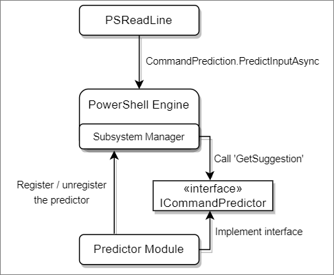

# How to create a command-line predictor

PSReadLine 2.1.0 introduced the concept of a smart command-line predictor by implementing the
Predictive IntelliSense feature. PSReadLine 2.2.2 expanded on that feature by adding a plugin model
that allows you create your own command-line predictors.

Predictive IntelliSense enhances tab completion by providing suggestions, on the command line, as
you type. The prediction suggestion appears as colored text following your cursor. This enables you
to discover, edit, and execute full commands based on matching predictions from your command
history or additional domain-specific plugins.

## System requirements

To create and use a plugin predictor, you must be using the following versions of software:

- PowerShell 7.2 (or higher) - provides the APIs necessary for creating a command predictor
- PSReadLine 2.2.2 (or higher) - allows you to configure PSReadLine to use the plugin

## Overview of a predictor

A predictor is a PowerShell binary module. The module must implement the
`System.Management.Automation.Subsystem.Prediction.ICommandPredictor` interface. This interface
declares the methods used to query for prediction results and provide feedback.

A predictor module must register a `CommandPredictor` subsystem with PowerShell's `SubsystemManager`
when loaded and unregister itself when unloaded.

The following diagram shows the architecture of a predictor in PowerShell.



## Creating the code

To create a predictor, you must have the .NET 6 SDK installed for your platform. For more
information on the SDK, see [Download .NET 6.0](https://dotnet.microsoft.com/download/dotnet/6.0).

Create a new PowerShell module project by following these steps:

1. Use the `dotnet` command-line tool to create a starter classlib project.

   ```powershell
   dotnet new classlib --name SamplePredictor
   ```

1. Edit the `SamplePredictor.csproj` to contain the following information:

   ```xml
   <Project Sdk="Microsoft.NET.Sdk">

     <PropertyGroup>
       <TargetFramework>net6.0</TargetFramework>
     </PropertyGroup>

     <ItemGroup>
       <PackageReference Include="Microsoft.PowerShell.SDK" Version="7.2.0" />
     </ItemGroup>

   </Project>
   ```

1. Delete the default `Class1.cs` file created by `dotnet` and copy the following code to a
   `SamplePredictorClass.cs` file in your project folder.

   ```csharp
   using System;
   using System.Collections.Generic;
   using System.Threading;
   using System.Management.Automation;
   using System.Management.Automation.Subsystem;
   using System.Management.Automation.Subsystem.Prediction;

   namespace PowerShell.Sample
   {
       public class SamplePredictor : ICommandPredictor
       {
           private readonly Guid _guid;

           internal SamplePredictor(string guid)
           {
               _guid = new Guid(guid);
           }

           /// <summary>
           /// Gets the unique identifier for a subsystem implementation.
           /// </summary>
           public Guid Id => _guid;

           /// <summary>
           /// Gets the name of a subsystem implementation.
           /// </summary>
           public string Name => "SamplePredictor";

           /// <summary>
           /// Gets the description of a subsystem implementation.
           /// </summary>
           public string Description => "A sample predictor";

           /// <summary>
           /// Get the predictive suggestions. It indicates the start of a suggestion rendering session.
           /// </summary>
           /// <param name="client">Represents the client that initiates the call.</param>
           /// <param name="context">The <see cref="PredictionContext"/> object to be used for prediction.</param>
           /// <param name="cancellationToken">The cancellation token to cancel the prediction.</param>
           /// <returns>An instance of <see cref="SuggestionPackage"/>.</returns>
           public SuggestionPackage GetSuggestion(PredictionClient client, PredictionContext context, CancellationToken cancellationToken)
           {
               string input = context.InputAst.Extent.Text;
               if (string.IsNullOrWhiteSpace(input))
               {
                   return default;
               }

               return new SuggestionPackage(new List<PredictiveSuggestion>{
                   new PredictiveSuggestion(string.Concat(input, " HELLO WORLD"))
               });
           }

           #region "interface methods for processing feedback"

           /// <summary>
           /// Gets a value indicating whether the predictor accepts a specific kind of feedback.
           /// </summary>
           /// <param name="client">Represents the client that initiates the call.</param>
           /// <param name="feedback">A specific type of feedback.</param>
           /// <returns>True or false, to indicate whether the specific feedback is accepted.</returns>
           public bool CanAcceptFeedback(PredictionClient client, PredictorFeedbackKind feedback) => false;

           /// <summary>
           /// One or more suggestions provided by the predictor were displayed to the user.
           /// </summary>
           /// <param name="client">Represents the client that initiates the call.</param>
           /// <param name="session">The mini-session where the displayed suggestions came from.</param>
           /// <param name="countOrIndex">
           /// When the value is greater than 0, it's the number of displayed suggestions from the list
           /// returned in <paramref name="session"/>, starting from the index 0. When the value is
           /// less than or equal to 0, it means a single suggestion from the list got displayed, and
           /// the index is the absolute value.
           /// </param>
           public void OnSuggestionDisplayed(PredictionClient client, uint session, int countOrIndex) { }

           /// <summary>
           /// The suggestion provided by the predictor was accepted.
           /// </summary>
           /// <param name="client">Represents the client that initiates the call.</param>
           /// <param name="session">Represents the mini-session where the accepted suggestion came from.</param>
           /// <param name="acceptedSuggestion">The accepted suggestion text.</param>
           public void OnSuggestionAccepted(PredictionClient client, uint session, string acceptedSuggestion) { }

           /// <summary>
           /// A command line was accepted to execute.
           /// The predictor can start processing early as needed with the latest history.
           /// </summary>
           /// <param name="client">Represents the client that initiates the call.</param>
           /// <param name="history">History command lines provided as references for prediction.</param>
           public void OnCommandLineAccepted(PredictionClient client, IReadOnlyList<string> history) { }

           /// <summary>
           /// A command line was done execution.
           /// </summary>
           /// <param name="client">Represents the client that initiates the call.</param>
           /// <param name="commandLine">The last accepted command line.</param>
           /// <param name="success">Shows whether the execution was successful.</param>
           public void OnCommandLineExecuted(PredictionClient client, string commandLine, bool success) { }

           #endregion;
       }

       /// <summary>
       /// Register the predictor on module loading and unregister it on module un-loading.
       /// </summary>
       public class Init : IModuleAssemblyInitializer, IModuleAssemblyCleanup
       {
           private const string Identifier = "843b51d0-55c8-4c1a-8116-f0728d419306";

           /// <summary>
           /// Gets called when assembly is loaded.
           /// </summary>
           public void OnImport()
           {
               var predictor = new SamplePredictor(Identifier);
               SubsystemManager.RegisterSubsystem(SubsystemKind.CommandPredictor, predictor);
           }

           /// <summary>
           /// Gets called when the binary module is unloaded.
           /// </summary>
           public void OnRemove(PSModuleInfo psModuleInfo)
           {
               SubsystemManager.UnregisterSubsystem(SubsystemKind.CommandPredictor, new Guid(Identifier));
           }
       }
   }
   ```

   The following example code returns the string "HELLO WORLD" for the prediction result for all
   user input. Since the sample predictor doesn't process any feedback, the code doesn't implement
   the feedback methods from the interface. Change the prediction and feedback code to meet the
   needs of your predictor.

   > [!NOTE]
   > The list view of **PSReadLine** doesn't support multiline suggestions. Each suggestion
   > should be a single line. If your code has a multiline suggestion, you should split the lines
   > into separate suggestions or join the lines with a semicolon (`;`).

1. Run `dotnet build` to produce the assembly. You can find the compiled assembly in the
   `bin/Debug/net6.0` location of your project folder.

   > [!NOTE]
   > To ensure a responsive user experience, the ICommandPredictor interface has a 20ms time out
   > for responses from the Predictors. Your predictor code must return results in less than 20ms
   > to be displayed.

## Using your predictor plugin

To try out your new predictor, open a new PowerShell 7.2 session and run the following commands:

```powershell
Set-PSReadLineOption -PredictionSource HistoryAndPlugin
Import-Module .\bin\Debug\net6.0\SamplePredictor.dll
```

With the assembly is loaded in the session, you see the text "HELLO WORLD" appear as you type in the
terminal. You can press <kbd>F2</kbd> to switch between the `Inline` view and the `List` view.

For more information about PSReadLine options, see
[Set-PSReadLineOption](/powershell/module/psreadline/set-psreadlineoption).

You can get a list of installed predictors, using the following command:

```powershell
Get-PSSubsystem -Kind CommandPredictor
```

```Output
Kind              SubsystemType      IsRegistered Implementations
----              -------------      ------------ ---------------
CommandPredictor  ICommandPredictor          True {SamplePredictor}
```

> [!NOTE]
> `Get-PSSubsystem` is an experimental cmdlet that was introduced in PowerShell 7.1 You must enable
> the `PSSubsystemPluginModel` experimental feature to use this cmdlet. For more information, see
> [Using Experimental Features](../learn/experimental-features.md#pssubsystempluginmodel).
