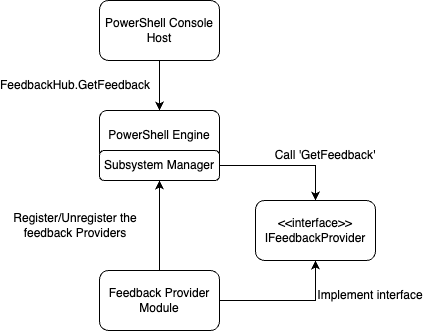
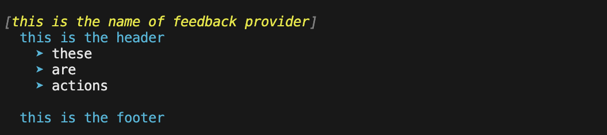

# How to create a feedback provider

PowerShell 7.4-preview.3 introduces the concept of feedback providers. A feedback provider is a
PowerShell module that utilizes the `IFeedbackProvider` interface that will trigger on a user action
and give feedback to the user.

Feedback providers are PowerShell modules that can give suggestions to the user based on what they
are trying to execute in the shell. They currently trigger when there is a success or failure of
execution. Feedback providers can take the specific information from successes and failures and
based on that information, trigger and provide feedback to the user.

## System requirements

To create and use a feedback provider, you must be using the following software versions:

- PowerShell 7.4-preview.3 or higher - includes the feedback provider interface
- .NET 8 SDK TODO CHECK VERSION

## Overview of a feedback provider

A feedback provider is a PowerShell binary module. The module must implement the
`using System.Management.Automation.Subsystem.Feedback` interface. This interface declares the
methods used to get feedback based on the command line input. Currently it can trigger on success
and errors of execution and provide the necessary information for assisting the user. Feedback can
be anything the module owner decides, it can be suggestions on better practices or remediation
commands to fix the error. We have created a good blog post you can read [here][TODO] that highlights some
of the built in feedback providers and capabilities of them. The architecture of a feedback provider
is shown below:



## Creating the code

You must have .NET 8 SDK installed to create a feedback provider. For more information on the SDK
see [Download .NET 8.0](https://dotnet.microsoft.com/en-us/download/dotnet/8.0). In this example we
will be creating a simple feedback provider and will also register with the command predictor
interface to give the feedback to the predictive experience. You can read more about predictors in
[Using predictors in PSReadLine](https://learn.microsoft.com/powershell/scripting/learn/shell/using-predictors),
and [How to create a command line predictor](./create-command-line-predictor.md).

First, you will need to create a new .NET class library project. You can do this by running the
following in the project directory:

```powershell

dotnet new classlib --name MyFeedbackProvider
```

You will need to add an `ItemGroup` to include the `System.Management.Automation` package to your
.csproj file. Your .csproj file should look like the following:

```xml
<Project Sdk="Microsoft.NET.Sdk">

  <PropertyGroup>
    <TargetFramework>net8.0</TargetFramework>
    <ImplicitUsings>enable</ImplicitUsings>
    <Nullable>enable</Nullable>
  </PropertyGroup>

  <ItemGroup>
    <PackageReference Include="System.Management.Automation" Version="7.4.0-preview.3">
        <ExcludeAssets>contentFiles</ExcludeAssets>
        <PrivateAssets>All</PrivateAssets>
    </PackageReference>
  </ItemGroup>
</Project>
```

> [!NOTE] 
> Since we are still in preview you may need to change the version of the
> System.Management.Automation to a greater package version. The minimum version is 7.4.0-preview.3.


### Building the feedback provider

You can change the name of your `Class1.cs` file to `myFeedbackProvider.cs`, this file will contain
two main classes that will be used to create your feedback provider. Add the two following classes
and namespaces to to your file.

```csharp
using System.Management.Automation;
using System.Management.Automation.Subsystem;
using System.Management.Automation.Subsystem.Feedback;
using System.Management.Automation.Subsystem.Prediction;
using System.Management.Automation.Language;

namespace myFeedbackProvider;

public sealed class myFeedbackProvider : IFeedbackProvider, ICommandPredictor
{

}


public class Init : IModuleAssemblyInitializer, IModuleAssemblyCleanup
{

}
```

First we are going to work on the `Init` class. This class will be used to register and unregister
your feedback provider with the subsystem manager. `OnImport` runs when the binary module is
registered with the subsystem and `OnRemove` runs when the binary module is unregistered from the
subsystem.

```csharp
public class Init : IModuleAssemblyInitializer, IModuleAssemblyCleanup
{
    private const string Id = "<ADD YOUR GUID HERE>";

    public void OnImport()
    {
        var feedback = new myFeedbackProvider(Id);
        SubsystemManager.RegisterSubsystem(SubsystemKind.FeedbackProvider, feedback);
        SubsystemManager.RegisterSubsystem(SubsystemKind.CommandPredictor, feedback);
    }

    public void OnRemove(PSModuleInfo psModuleInfo)
    {
        SubsystemManager.UnregisterSubsystem<ICommandPredictor>(new Guid(Id));
        SubsystemManager.UnregisterSubsystem<IFeedbackProvider>(new Guid(Id));
    }
}
```

You will need to replace `<ADD YOUR GUID HERE>` with a unique GUID. You can generate a GUID by
running the following command in PowerShell:

```powershell
New-Guid
```

This is required to maintain a unique identifier for your feedback provider. It is passed to the
constructor of the `myFeedbackProvider` class which we will make next. Above the init code, add your
main feedback provider class. This inherits from the `IFeedbackProvider` and `ICommandPredictor`
interface.

Next we are going to add some necessary variables to describe the feedback provider and get some
variables ready.

```csharp 
    // Gets the trigger that causes the feedback provider to be invoked. In this case, it gets All triggers.
    // See FeedbackTrigger enum for more details
    public FeedbackTrigger Trigger => FeedbackTrigger.All;

    // Gets a dictionary that contains the functions to be defined at the global scope of a PowerShell session.
    Dictionary<string, string>? ISubsystem.FunctionsToDefine => null;

    // Gets the name of a subsystem implementation, this will be the name displayed when triggered
    public string Name => "myFeedbackProvider";

    // Gets the description of a subsystem implementation.
    public string Description => "This is very simple feedback provider";

    // Gets the global unique identifier for the subsystem implementation.
    private readonly Guid _guid;
    public Guid Id => _guid;

    // List of candidates from the feedback provider to be passed as predictor results (will be used later)
    private List<string>? _candidates;

    // PowerShell session to get run PowerShell commands to help populate our feedback provider.
    private PowerShell _powershell;

    // Constructor
    internal myFeedbackProvider(string guid)
    {
        _guid = new Guid(guid); // Save guid
        _powershell = PowerShell.Create(); // Create PowerShell instance
    }
```

You will need to implement a number of required methods and variables in your feedback provider
class. <TODO EXPLANATIONS?>

Now lets start building out the feedback provider, we will do so by creating a `GetFeedback` method.
This has two parameters, `context` which is where we will get most of the information we need for
the feedback provider to trigger and then `token` which is tokens for cancellation. <TODO GET BETTER
EXPLANATIONs>. This function returns a `FeedbackItem` that takes passed in content and will be
displayed to the user. <TODO check>

```csharp
public FeedbackItem? GetFeedback(FeedbackContext context, CancellationToken token)
{
    
}
```

We then will add some variables that we will use to populate the feedback.

```csharp
public FeedbackItem? GetFeedback(FeedbackContext context, CancellationToken token)
{
    // Target describes the different kinds of triggers to activate on,
    var target = context.Trigger;
    var commandLine = context.CommandLine;
    var ast = context.CommandLineAst;

    // defining the header and footer variables
    string header; 
    string footer;

    // List of the actions 
    List<string>? actions = new List<string>();

    // Trigger on success code goes here
    
    // Trigger on error code goes here
    
    return null;
}
```

Visually this is what each of these fields look like:



For triggering on success, we are going to expand any aliased command used in the last execution. We
are going to navigate through the `CommandLineAst` and identify any commands, and check if those
commands are aliases and give feedback that the user is using an alias and with the fully qualified
name.

```csharp
if (target == FeedbackTrigger.Success){
    // Getting the commands from the AST and only finding those that are Commands
    var astCmds = ast.FindAll((cAst) => cAst is CommandAst, true);

    // Check to see if there are any command returned
    if(astCmds is null || astCmds.Count() == 0){
        return null;
    }

    // Navigate through each of the commands
    foreach(var command in astCmds){
        
        // Get the command name
        var aliasedCmd = ((CommandAst) command).GetCommandName();

        // Check if its an alias or not, if so then add it to the list of actions
        if(TryGetAlias(aliasedCmd, out string commandString)){
            actions.Add(aliasedCmd + " --> " + commandString);
            
        }
        
    }

    // If no aliases were found return null
    if(actions.Count == 0){
        return null;
    }

    // If some aliases were found then set the header to a description and return a new FeedbackItem.
    header = "You have used an aliased command:";
    
    return new FeedbackItem(header, actions);         
}
```

To check whether a command is an aliased command or not, we will be using the PowerShell instance we
created in the constructor to get the command to create a runspace and invoke the command GetCommand
and check if its an `Alias` type. If so then we will get an `AliasInfo` object that will be used to
get the full name of the command. The parameters this function takes are `command` which is the
command to be checked for it alias and then `targetCommand` which is the variable we will be saving
the full name of the aliased command to.


```csharp
private bool TryGetAlias(string command, out string targetCommand){
    // Create PowerShell runspace, session state proxy to run Get Command and check if its an alias
    AliasInfo? pwshAliasInfo = _powershell.Runspace.SessionStateProxy.InvokeCommand.GetCommand(command, CommandTypes.Alias) as AliasInfo;
    
    // if its null then it is not an aliased command so just return false
    if(pwshAliasInfo is null){
        targetCommand = String.Empty;
        return false;
    }

    // Set targetCommand to referenced command name
    targetCommand = pwshAliasInfo.ReferencedCommand.Name;
    return true;
}
```


That is all that is needed to trigger on success! Now lets add some code to trigger on error. In
this case, when a command fails, we will give feedback that the user can run
`Get-Help <Cmd that errored>` to get more insight into how to use the command.

```csharp
if (target == FeedbackTrigger.Error){
    // Gets the command that caused the error.
    var erroredCommand = context.LastError?.InvocationInfo.MyCommand;  
    if (erroredCommand is null){
        return null;
    }
    
    header = "You have triggered an error with the command " + erroredCommand + ". Try using the following command to get help:";
    actions.Add("Get-Help " + erroredCommand);
    footer = "You can also check online docs at learn.microsoft.com";

    return new FeedbackItem(header, actions, footer, FeedbackDisplayLayout.Portrait);
}  
```

## Using a feedback provider

Feedback providers will trigger after the defined action has taken place. So if you have designed
your feedback provider to trigger on a success and after a certain command, you will have to have
the module imported and then run the command to verify it is working.

We suggest importing feedback providers in your `$PROFILE` so that they are always available. You
can edit your `$PROFILE` by opening it in any text editor or if you have Visual Studio Code
installed you can run the following command:

```powershell
code $PROFILE
```

You can get a list of installed feedback providers, using the following command:

```powershell
Get-PSSubsystem -Kind FeedbackProvider
```

```Output
Kind              SubsystemType      IsRegistered Implementations
----              -------------      ------------ ---------------
FeedbackProvider  IFeedbackProvider          True {general}
```

> [!NOTE]
> `Get-PSSubsystem` is an experimental cmdlet that was introduced in PowerShell 7.1 You must enable
> the `PSSubsystemPluginModel` experimental feature to use this cmdlet. For more information, see
> [Using Experimental Features](../learn/experimental-features.md#pssubsystempluginmodel).

## Enhancing feedback provider experience

Another way to enhance users experience with your feedback provider is to make it utilize the
ICommandPredictor interface so the feedback can be given to the users predictor experience. You can
read more about creating a command line predictor in the
[How to create a command line predictor](./create-command-line-predictor.md) article. 

You can add this functionality to your feedback provider by adding the following code to your
feedback provider class to get predictor behavior for your feedback provider.

```csharp
#region ICommandPredictor

// Gets a value indicating whether the predictor accepts a specific kind of feedback.
// client - Represents the client that initiates the call.
// feedback - the specific kind of feedback 
public bool CanAcceptFeedback(PredictionClient client, PredictorFeedbackKind feedback)
{
    return feedback switch
    {
        PredictorFeedbackKind.CommandLineAccepted => true,
        _ => false,
    };
}

// Get the predictive suggestions. It indicates the start of a suggestion rendering session.
// client - Represents the client that initiates the call. 
// context - The PredictionContext object to be used for prediction.
// cancellationToken - The cancellation token to cancel the prediction.
public SuggestionPackage GetSuggestion(PredictionClient client, PredictionContext context, CancellationToken cancellationToken)
{
    if (_candidates is not null)
    {
        string input = context.InputAst.Extent.Text;
        List<PredictiveSuggestion>? result = null;

        foreach (string c in _candidates)
        {
            if (c.StartsWith(input, StringComparison.OrdinalIgnoreCase))
            {
                result ??= new List<PredictiveSuggestion>(_candidates.Count);
                result.Add(new PredictiveSuggestion(c));
            }
        }

        if (result is not null)
        {
            return new SuggestionPackage(result);
        }
    }

    return default;
}

// A command line was accepted to execute. The predictor can start processing early as needed with the latest history.
public void OnCommandLineAccepted(PredictionClient client, IReadOnlyList<string> history)
{
    // Reset the candidate state once the command is accepted.
    _candidates = null;
}

public void OnSuggestionDisplayed(PredictionClient client, uint session, int countOrIndex) { }

public void OnSuggestionAccepted(PredictionClient client, uint session, string acceptedSuggestion) { }

public void OnCommandLineExecuted(PredictionClient client, string commandLine, bool success) { }

#endregion;
```

In order to pass the `actions` we have definted to the predictor code, we will need to populate
`_candidates` with `actions`. So before we return any new `FeedbackItem`s, we need to
`_candidates = actions`.

Congratulations you have now created your first feedback provider! We hope this article was helpful
to build out your own feedback provider and are excited to see what other things you can build with
this! You can find the fully completed code file for this project below:

```csharp
using System.Management.Automation;
using System.Management.Automation.Subsystem;
using System.Management.Automation.Subsystem.Feedback;
using System.Management.Automation.Subsystem.Prediction;
using System.Management.Automation.Language;

namespace myFeedbackProvider;

public sealed class myFeedbackProvider : IFeedbackProvider, ICommandPredictor
{

    // Gets the trigger that causes the feedback provider to be invoked. In this case, it gets All triggers.
    // See FeedbackTrigger enum for more details
    public FeedbackTrigger Trigger => FeedbackTrigger.All;

    // Gets a dictionary that contains the functions to be defined at the global scope of a PowerShell session.
    Dictionary<string, string>? ISubsystem.FunctionsToDefine => null;

    // Gets the name of a subsystem implementation, this will be the name displayed when triggered
    public string Name => "myFeedbackProvider";

    // Gets the description of a subsystem implementation.
    public string Description => "This is very simple feedback provider";

    // Gets the global unique identifier for the subsystem implementation.
    private readonly Guid _guid;
    public Guid Id => _guid;

    // List of candidates from the feedback provider to be passed as predictor results (will be used later)
    private List<string>? _candidates;

    // PowerShell session to get run PowerShell commands to help populate our feedback provider.
    private PowerShell _powershell;

    // Constructor
    internal myFeedbackProvider(string guid)
    {
        _guid = new Guid(guid); // Save guid
        _powershell = PowerShell.Create(); // Create PowerShell instance
    }

    #region IFeedbackProvider

    // Gets feedback based on the given commandline and error record.
    // context - The context for the feedback call.
    // token - The cancellation token to cancel the operation.
    public FeedbackItem? GetFeedback(FeedbackContext context, CancellationToken token)
    {

        var target = context.Trigger;
        var commandLine = context.CommandLine;
        var ast = context.CommandLineAst;

        // defining the header and footer variables
        string header; 
        string footer;

        List<string>? actions = new List<string>();

        // Trigger on success
       if (target == FeedbackTrigger.Success){
            // Getting the commands from the AST and only finding those that are Commands
            var astCmds = ast.FindAll((cAst) => cAst is CommandAst, true);

            // Check to see if there are any command returned
            if(astCmds is null || astCmds.Count() == 0){
                return null;
            }

            // Navigate through each of the commands
            foreach(var command in astCmds){
                
                // Get the command name
                var aliasedCmd = ((CommandAst) command).GetCommandName();

                // Check if its an alias or not, if so then add it to the list of actions
                if(TryGetAlias(aliasedCmd, out string commandString)){
                    actions.Add(aliasedCmd + " --> " + commandString);
                    
                }
                
            }

            // If no aliases were found return null
            if(actions.Count == 0){
                return null;
            }

            // If some aliases were found then set the header to a description and return a new FeedbackItem.
            header = "You have used an aliased command:";
            
            return new FeedbackItem(header, actions);         
        }

        // Trigger on error
        if (target == FeedbackTrigger.Error){
            // Gets the command that caused the error.
            var erroredCommand = context.LastError?.InvocationInfo.MyCommand;  
            if (erroredCommand is null){
                return null;
            }
            
            header = "You have triggered an error with the command " + erroredCommand + ". Try using the following command to get help:";
            actions.Add("Get-Help " + erroredCommand);
            footer = "You can also check online docs at learn.microsoft.com";

            _candidates = actions;
            return new FeedbackItem(header, actions, footer, FeedbackDisplayLayout.Portrait);
        }  
        
        return null;

    }

    // function to check whether a command is an alias
    private bool TryGetAlias(string command, out string targetCommand){
        // Create PowerShell runspace, session state proxy to run Get Command and check if its an alias
        AliasInfo? pwshAliasInfo = _powershell.Runspace.SessionStateProxy.InvokeCommand.GetCommand(command, CommandTypes.Alias) as AliasInfo;
        
        // if its null then it is not an aliased command so just return false
        if(pwshAliasInfo is null){
            targetCommand = String.Empty;
            return false;
        }

        // Set targetCommand to referenced command name
        targetCommand = pwshAliasInfo.ReferencedCommand.Name;
        return true;
    }
    #endregion


    #region ICommandPredictor


    // Gets a value indicating whether the predictor accepts a specific kind of feedback.
    // client - Represents the client that initiates the call.
    // feedback - the specific kind of feedback 
    public bool CanAcceptFeedback(PredictionClient client, PredictorFeedbackKind feedback)
    {
        return feedback switch
        {
            PredictorFeedbackKind.CommandLineAccepted => true,
            _ => false,
        };
    }

    // Get the predictive suggestions. It indicates the start of a suggestion rendering session.
    // client - Represents the client that initiates the call. 
    // context - The PredictionContext object to be used for prediction.
    // cancellationToken - The cancellation token to cancel the prediction.
    public SuggestionPackage GetSuggestion(PredictionClient client, PredictionContext context, CancellationToken cancellationToken)
    {
        if (_candidates is not null)
        {
            string input = context.InputAst.Extent.Text;
            List<PredictiveSuggestion>? result = null;

            foreach (string c in _candidates)
            {
                if (c.StartsWith(input, StringComparison.OrdinalIgnoreCase))
                {
                    result ??= new List<PredictiveSuggestion>(_candidates.Count);
                    result.Add(new PredictiveSuggestion(c));
                }
            }

            if (result is not null)
            {
                return new SuggestionPackage(result);
            }
        }

        return default;
    }

    // A command line was accepted to execute. The predictor can start processing early as needed with the latest history.
    public void OnCommandLineAccepted(PredictionClient client, IReadOnlyList<string> history)
    {
        // Reset the candidate state once the command is accepted.
        _candidates = null;
    }

    public void OnSuggestionDisplayed(PredictionClient client, uint session, int countOrIndex) { }

    public void OnSuggestionAccepted(PredictionClient client, uint session, string acceptedSuggestion) { }

    public void OnCommandLineExecuted(PredictionClient client, string commandLine, bool success) { }

    #endregion;
}


public class Init : IModuleAssemblyInitializer, IModuleAssemblyCleanup
{
    private const string Id = "47013747-CB9D-4EBC-9F02-F32B8AB19D48";

    public void OnImport()
    {
        var feedback = new myFeedbackProvider(Id);
        SubsystemManager.RegisterSubsystem(SubsystemKind.FeedbackProvider, feedback);
        SubsystemManager.RegisterSubsystem(SubsystemKind.CommandPredictor, feedback);
    }

    public void OnRemove(PSModuleInfo psModuleInfo)
    {
        SubsystemManager.UnregisterSubsystem<ICommandPredictor>(new Guid(Id));
        SubsystemManager.UnregisterSubsystem<IFeedbackProvider>(new Guid(Id));
    }
}
```