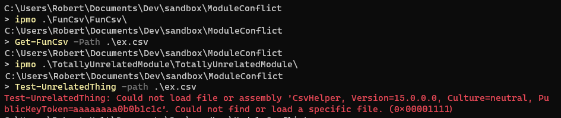
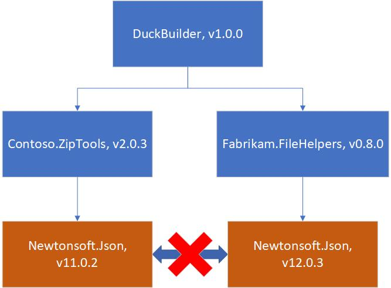
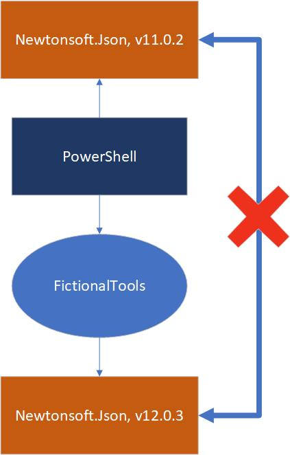
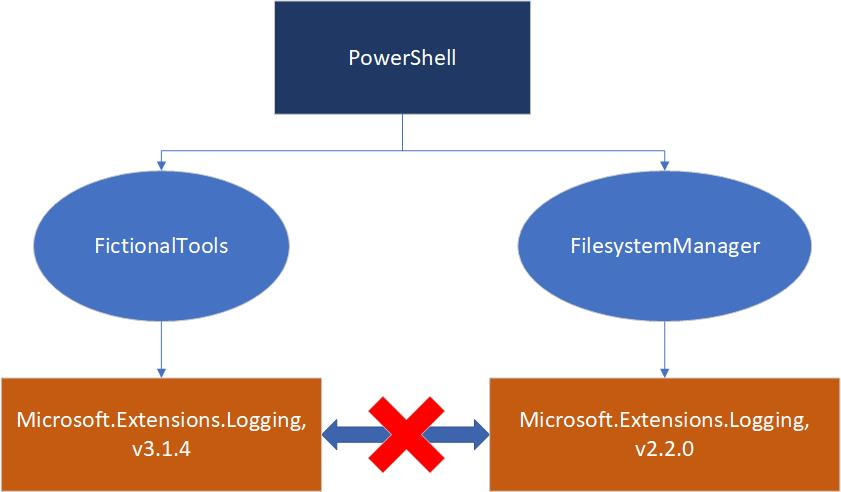
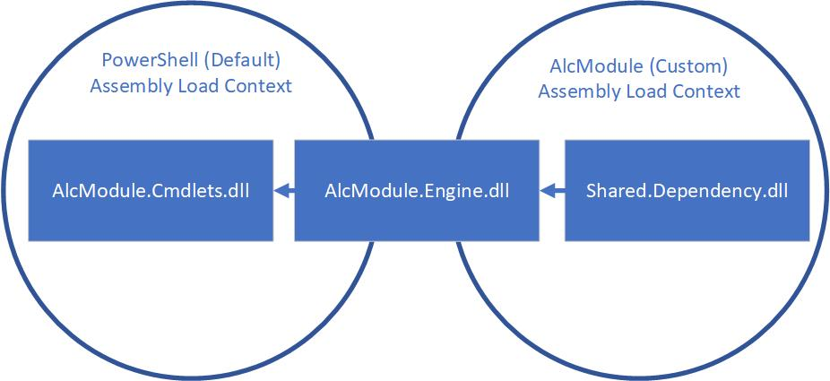
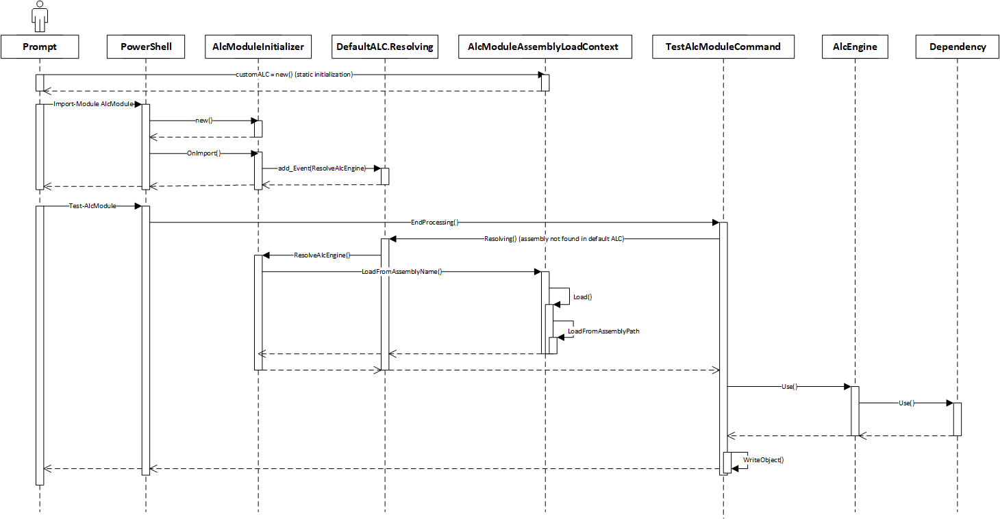

# Resolving PowerShell module assembly dependency conflicts

When writing a binary PowerShell module in C#, it's natural to take dependencies on other packages
or libraries to provide functionality. Taking dependencies on other libraries is desirable for code
reuse. PowerShell always loads assemblies into the same context. This presents issues when a
module's dependencies conflict with already-loaded DLLs and may prevent using two otherwise unrelated
modules in the same PowerShell session.

If you've had this problem, you've seen an error message like this:



This article looks at some of the ways dependency conflicts occur in PowerShell and ways to mitigate
dependency conflict issues. Even if you're not a module author, there are some tricks in here that
might help you with dependency conflicts occurring in modules that you use.

## Why do dependency conflicts occur?

In .NET, dependency conflicts occur when two versions of the same assembly are loaded into the same
_Assembly Load Context_. This term means slightly different things on different .NET platforms,
which is covered [later](#powershell-and-net). This conflict is a common problem that occurs in any
software where versioned dependencies are used. Because there are no simple solutions, and because
many dependency-resolution frameworks try to solve the problem in different ways, this situation is
often called "dependency hell".

Conflict issues are compounded by the fact that a project almost never deliberately or directly
depends on two versions of the same dependency. Instead, the project has two or more dependencies
that each require a different version of the same dependency.

For example, say your .NET application, `DuckBuilder`, brings in two dependencies, to perform parts
of its functionality and looks like this:



Because `Contoso.ZipTools` and `Fabrikam.FileHelpers` both depend on different versions of
`Newtonsoft.Json`, there may be a dependency conflict depending on how each dependency is loaded.

### Conflicting with PowerShell's dependencies

In PowerShell, the dependency conflict issue is magnified because PowerShell modules and
PowerShell's own dependencies are loaded into the same shared context. This means the PowerShell
engine and all loaded PowerShell modules must not have conflicting dependencies. A classic example
of this is `Newtonsoft.Json`:



In this example, the module `FictionalTools` depends on `Newtonsoft.Json` version `12.0.3`, which is
a newer version of `Newtonsoft.Json` than `11.0.2` that ships in the example PowerShell.

> [!NOTE]
> This is an example and PowerShell 7 currently ships with `Newtonsoft.Json 12.0.3`.

Because the module depends on a newer version of the assembly, it won't accept the version that
PowerShell already has loaded. But because PowerShell has already loaded a version of the assembly,
the module can't load its own version using the conventional load mechanism.

### Conflicting with another module's dependencies

Another common scenario in PowerShell is that a module is loaded that depends on one version of an
assembly, and then another module is loaded later that depends on a different version of that
assembly.

This often looks like the following:



In this case, the `FictionalTools` module requires a newer version of `Microsoft.Extensions.Logging`
than the `FilesystemManager` module.

Imagine these modules load their dependencies by placing the dependency assemblies in the same
directory as the root module assembly. This allows .NET to implicitly load them by name. If we're
running PowerShell 7 (on top of .NET Core 3.1), we can load and run `FictionalTools`, then load
and run `FilesystemManager` without issue. However, in a new session, if we load and run
`FilesystemManager`, then load `FictionalTools`, we get a `FileLoadException` from the `FictionalTools`
command because it requires a newer version of `Microsoft.Extensions.Logging` than the one loaded.
`FictionalTools` can't load the version needed because an assembly of the same name has already
been loaded.

## PowerShell and .NET

PowerShell runs on the .NET platform. NET is ultimately responsible for resolving and loading
assembly dependencies, so we must understand how .NET operates here to understand dependency
conflicts.

We must also confront the fact that different versions of PowerShell run on different .NET
implementations. In general, PowerShell 5.1 and below run on .NET Framework, while PowerShell 6 and
above run on .NET Core. These two implementations of .NET load and handle assemblies differently.
This means that resolving dependency conflicts can vary depending on the underlying .NET platform.

### Assembly Load Contexts

In .NET, an _Assembly Load Context_ (ALC) that is a runtime namespace into which assemblies are
loaded. The assemblies' names must be unique. This concept allows assemblies to be uniquely resolved
by name in each ALC.

### Assembly reference loading in .NET

The semantics of assembly loading depend on both the .NET implementation (.NET Core vs .NET
Framework) and the .NET API used to load a particular assembly. Rather than go into detail here,
there are links in the [Further reading](#further-reading) section that go into great detail on how
.NET assembly loading works in each .NET implementation.

In this article we'll refer to the following mechanisms:

- Implicit assembly loading (effectively `Assembly.Load(AssemblyName)`), when .NET implicitly tries
  to load an assembly by name from a static assembly reference in .NET code.
- `Assembly.LoadFrom()`, a plugin-oriented loading API that adds handlers to resolve
  dependencies of the loaded DLL. This method may not resolve dependencies the way we want.
- `Assembly.LoadFile()`, a basic loading API intended to load only the assembly asked for and does
  not handle any dependencies.

### Differences in .NET Framework vs .NET Core

The way these APIs work has changed in subtle ways between .NET Core and .NET Framework, so it's
worth reading through the included [links](#further-reading). Importantly, Assembly Load Contexts
and other assembly resolution mechanisms have changed between .NET Framework and .NET Core.

In particular, .NET Framework has the following features:

- The Global Assembly Cache, for machine-wide assembly resolution
- Application Domains, which work like in-process sandboxes for assembly isolation, but also present
  a serialization layer to contend with
- A limited assembly load context model, explained in depth
  [here](/dotnet/framework/deployment/best-practices-for-assembly-loading),
  that has a fixed set of assembly load contexts, each with their own behavior:
  - The default load context, where assemblies are loaded by default
  - The load-from context, for loading assemblies manually at runtime
  - The reflection-only context, for safely loading assemblies
    to read their metadata without running them
  - The mysterious void that assemblies loaded with `Assembly.LoadFile(string path)` and
    `Assembly.Load(byte[] asmBytes)` live in

.NET Core (and .NET 5+) has replaced this complexity with a simpler model:

- No Global Assembly Cache. Applications bring all their own dependencies. This removes an external
  factor for dependency resolution in applications, making dependency resolution more reproducible.
  PowerShell, as the plugin host, complicates this slightly for modules. Its dependencies in
  `$PSHOME` are shared with all modules.
- Only one Application Domain, and no ability to create new ones. The Application Domain concept
  is maintained in .NET Core purely to be the global state of the .NET process.
- A new, extensible Assembly Load Context model. Assembly resolution can be namespaced by putting it
  in a new ALC. .NET Core processes begin with a single default ALC into which all assemblies are
  loaded. (except for those loaded with `Assembly.LoadFile(string)` and `Assembly.Load(byte[])`) But
  the process can create and define its own custom ALCs with its own loading logic. When an assembly
  is loaded, the first ALC it is loaded into is responsible for resolving its dependencies. This
  creates opportunities to implement powerful .NET plugin loading mechanisms.

In both implementations, assemblies are loaded lazily. This means that they are loaded when a method
requiring their type is run for the first time.

For example, here are two versions of the same code that load a dependency at different times.

The first always loads its dependency when `Program.GetRange()` is called, because the dependency
reference is lexically present within the method:

```csharp
using Dependency.Library;

public static class Program
{
    public static List<int> GetRange(int limit)
    {
        var list = new List<int>();
        for (int i = 0; i < limit; i++)
        {
            if (i >= 20)
            {
                // Dependency.Library will be loaded when GetRange is run
                // because the dependency call occurs directly within the method
                DependencyApi.Use();
            }

            list.Add(i);
        }
        return list;
    }
}
```

The second will load its dependency only if the `limit` parameter is 20 or more, because of the
internal indirection through a method:

```csharp
using Dependency.Library;

public static class Program
{
    public static List<int> GetNumbers(int limit)
    {
        var list = new List<int>();
        for (int i = 0; i < limit; i++)
        {
            if (i >= 20)
            {
                // Dependency.Library is only referenced within
                // the UseDependencyApi() method,
                // so will only be loaded when limit >= 20
                UseDependencyApi();
            }

            list.Add(i);
        }
        return list;
    }

    private static void UseDependencyApi()
    {
        // Once UseDependencyApi() is called, Dependency.Library is loaded
        DependencyApi.Use();
    }
}
```

This is a good practice since it minimizes the memory and filesystem I/O and uses the resources
more efficiently. The unfortunate a side effect of this is that we won't know that the assembly fails
to load until we reach the code path that tries to load the assembly.

It can also create a timing condition for assembly load conflicts. If two parts of the same program
try to load different versions of the same assembly, the version loaded depends on which code path
is run first.

For PowerShell, this means that the following factors can affect an assembly load conflict:

- Which module was loaded first?
- Was the code path that uses the dependency library run?
- Does PowerShell load a conflicting dependency at startup or only under certain code paths?

## Quick fixes and their limitations

In some cases, it's possible to make small adjustments to your module and fix things with minimal
effort. But these solutions tend to come with caveats. While they may apply to your module, they
won't work for every module.

### Change your dependency version

The simplest way to avoid dependency conflicts is to agree on a dependency. This may be possible
when:

- Your conflict is with a direct dependency of your module and you control the version.
- Your conflict is with an indirect dependency, but you can configure your direct dependencies to
  use a workable indirect dependency version.
- You know the conflicting version and can rely on it not changing.

The `Newtonsoft.Json` package is a good example of this last scenario. This is a dependency of
PowerShell 6 and above, and isn't used in Windows PowerShell. Meaning a simple way to resolve
versioning conflicts is to target the lowest version of `Newtonsoft.Json` across the PowerShell
versions you wish to target.

For example, PowerShell 6.2.6 and PowerShell 7.0.2 both currently use `Newtonsoft.Json` version
12.0.3. So, to create a module targeting Windows PowerShell, PowerShell 6, and PowerShell 7, you
would target `Newtonsoft.Json 12.0.3` as a dependency and include it in your built module. When the
module is loaded in PowerShell 6 or 7, PowerShell's own `Newtonsoft.Json` assembly is already
loaded. Also, it is at least the version required for your module, so resolution succeeds. In
Windows PowerShell, the assembly isn't already present in PowerShell. So, it's loaded from your
module folder instead.

Generally, when targeting a concrete PowerShell package, like `Microsoft.PowerShell.Sdk` or
`System.Management.Automation`, NuGet should be able to resolve the right dependency versions
required. Targeting both Windows PowerShell and PowerShell 6+ becomes more difficult because you
must choose between targeting multiple frameworks or `PowerShellStandard.Library`.

Circumstances where pinning to a common dependency version won't work include:

- The conflict is with an indirect dependency, and none of your dependencies can be configured to
  use a common version.
- The other dependency version is likely to change often, so settling on a common version is only a
  short-term fix.

### Add an AssemblyResolve event handler to create a dynamic binding redirect

Sometimes changing your own dependency version isn't possible or is too difficult. Another option is
to set up a dynamic binding redirect by registering an event handler for the `AssemblyResolve`
event.

As with a static binding redirect, the point is to force all consumers of a dependency to use the
same actual assembly. You intercept calls to load the dependency and always redirect them to the
version you want.

This looks something like this:

```csharp
// Register the event handler as early as you can in your code.
// A good option is to use the IModuleAssemblyInitializer interface
// that PowerShell provides to run code early on when your module is loaded.

// This class will be instantiated on module import and the OnImport() method run.
// Make sure that:
//  - the class is public
//  - the class has a public, parameterless constructor
//  - the class implements IModuleAssemblyInitializer
public class MyModuleInitializer : IModuleAssemblyInitializer
{
    public void OnImport()
    {
        AppDomain.CurrentDomain.AssemblyResolve += DependencyResolution.ResolveNewtonsoftJson;
    }
}

// Clean up the event handler when the the module is removed
// to prevent memory leaks.
//
// Like IModuleAssemblyInitializer, IModuleAssemblyCleanup allows
// you to register code to run when a module is removed (with Remove-Module).
// Make sure it is also public with a public parameterless contructor
// and implements IModuleAssemblyCleanup.
public class MyModuleCleanup : IModuleAssemblyCleanup
{
    public void OnRemove()
    {
        AppDomain.CurrentDomain.AssemblyResolve -= DependencyResolution.ResolveNewtonsoftJson;
    }
}

internal static class DependencyResolution
{
    private static readonly string s_modulePath = Path.GetDirectoryName(
        Assembly.GetExecutingAssembly().Location);

    public static Assembly ResolveNewtonsoftJson(object sender, ResolveEventArgs args)
    {
        // Parse the assembly name
        var assemblyName = new AssemblyName(args.Name);

        // We only want to handle the dependency we care about.
        // In this example it's Newtonsoft.Json.
        if (!assemblyName.Name.Equals("Newtonsoft.Json"))
        {
            return null;
        }

        // Generally the version of the dependency you want to load is the higher one,
        // since it's the most likely to be compatible with all dependent assemblies.
        // The logic here assumes our module always has the version we want to load.
        // Also note the use of Assembly.LoadFrom() here rather than Assembly.LoadFile().
        return Assembly.LoadFrom(Path.Combine(s_modulePath, "Newtonsoft.Json.dll"));
    }
}
```

You can technically register a scriptblock within PowerShell to handle an `AssemblyResolve` event,
but:

- An `AssemblyResolve` event may be triggered on any thread, something that PowerShell will be
  unable to handle.
- Even when events are handled on the right thread, PowerShell's scoping concepts mean that the
  event handler scriptblock must be written carefully to not depend on variables defined outside it.

There are situations where redirecting to a common version won't work:

- When the dependency has made breaking changes between versions, or when dependent code relies on a
  functionality otherwise not available in the version you redirect to.
- When your module isn't loaded before the conflicting dependency. If you register an
  `AssemblyResolve` event handler after the dependency has been loaded, it will never be fired. If
  you're trying to prevent dependency conflicts with another module, this may be an issue, since the
  other module may be loaded first.

### Use the dependency out of process

This solution is more for module users than module authors. This is a solution to use when
confronted with a module that won't work due to an existing dependency conflict.

Dependency conflicts occur because two versions of the same assembly are loaded into the same .NET
process. A simple solution is to load them into different processes, as long as you can still
use the functionality from both together.

In PowerShell, there are several ways to achieve this:

- Invoke PowerShell as a subprocess

  A simple way to run a PowerShell command out of the current process is to just start a new
  PowerShell process directly with the command call:

  ```powershell
  pwsh -c 'Invoke-ConflictingCommand'
  ```

  The main limitation here is that restructuring the result can be trickier or more error prone than
  other options.

- The PowerShell job system

  The PowerShell job system also runs commands out of process, by sending commands to a new
  PowerShell process and returning the results:

  ```powershell
  $result = Start-Job { Invoke-ConflictingCommand } | Receive-Job -Wait
  ```

  In this case, you just need to be sure that any variables and state are passed in correctly.

  The job system can also be slightly cumbersome when running small commands.

- PowerShell remoting

  When it's available, PowerShell remoting can be a useful way to run commands out of process. With
  remoting, you can create a fresh **PSSession** in a new process, call its commands over PowerShell
  remoting, then use the results locally with the other modules containing the conflicting
  dependencies.

  An example might look like this:

  ```powershell
  # Create a local PowerShell session
  # where the module with conflicting assemblies will be loaded
  $s = New-PSSession

  # Import the module with the conflicting dependency via remoting,
  # exposing the commands locally
  Import-Module -PSSession $s -Name ConflictingModule

  # Run a command from the module with the conflicting dependencies
  Invoke-ConflictingCommand
  ```

- Implicit remoting to Windows PowerShell

  Another option in PowerShell 7 is to use the `-UseWindowsPowerShell` flag on `Import-Module`. This
  will import the module through a local remoting session into Windows PowerShell:

  ```powershell
  Import-Module -Name ConflictingModule -UseWindowsPowerShell
  ```

  Be aware that modules may not work with, or work differently with Windows PowerShell.

#### When out-of-process invocation should not be used

As a module author, out-of-process command invocation is difficult to bake into a module and may
have edge cases that cause issues. In particular, remoting and jobs may not be available in all
environments where your module needs to work. However, the general principle of moving the
implementation out of process and allowing the PowerShell module to be a thinner client, may still
be applicable.

As a module user, there are cases where out-of-process invocation won't work:

- When PowerShell remoting is unavailable because you don't have privileges to use it or it
  is not enabled.
- When a particular .NET type is needed from output as input to a method or another command.
  Commands running over PowerShell remoting emit deserialized objects rather than strongly-typed .NET
  objects. This means that method calls and strongly typed APIs do not work with the output of
  commands imported over remoting.

## More robust solutions

The previous solutions all had scenarios and modules that don't work. However, they also have the
virtue of being relatively simple to implement correctly. The following solutions are more robust,
but require more effort to implement correctly and can introduce subtle bugs if not written
carefully.

### Loading through .NET Core Assembly Load Contexts

[Assembly Load Contexts](/dotnet/api/system.runtime.loader.assemblyloadcontext)
(ALCs) as an implementable API were introduced in .NET Core 1.0 to specifically address the need to
load multiple versions of the same assembly into the same runtime.

Within .NET Core and .NET 5, they offer the most robust solution to the problem of loading
conflicting versions of an assembly. However, custom ALCs are not available in .NET Framework. This
means that this solution only works in PowerShell 6 and above.

Currently, the best example of using an ALC for dependency isolation in PowerShell is in PowerShell
Editor Services, the language server for the PowerShell extension for Visual Studio Code. An [ALC is used](https://github.com/PowerShell/PowerShellEditorServices/blob/master/src/PowerShellEditorServices.Hosting/Internal/PsesLoadContext.cs)
to prevent PowerShell Editor Services' own dependencies from clashing with those in PowerShell
modules.

Implementing module dependency isolation with an ALC is conceptually difficult, but we will work
through a minimal example. Imagine we have a simple module that is only intended to work in PowerShell 7.
The source code is organized as follows:

```
+ AlcModule.psd1
+ src/
    + TestAlcModuleCommand.cs
    + AlcModule.csproj
```

The cmdlet implementation looks like this:

```csharp
using Shared.Dependency;

namespace AlcModule
{
    [Cmdlet(VerbsDiagnostic.Test, "AlcModule")]
    public class TestAlcModuleCommand : Cmdlet
    {
        protected override void EndProcessing()
        {
            // Here's where our dependency gets used
            Dependency.Use();
            // Something trivial to make our cmdlet do *something*
            WriteObject("done!");
        }
    }
}
```

The (heavily simplified) manifest, looks like this:

```powershell
@{
    Author = 'Me'
    ModuleVersion = '0.0.1'
    RootModule = 'AlcModule.dll'
    CmdletsToExport = @('Test-AlcModule')
    PowerShellVersion = '7.0'
}
```

And the `csproj` looks like this:

```xml
<Project Sdk="Microsoft.NET.Sdk">
  <PropertyGroup>
    <TargetFramework>netcoreapp3.1</TargetFramework>
  </PropertyGroup>
  <ItemGroup>
    <PackageReference Include="Shared.Dependency" Version="1.0.0" />
    <PackageReference Include="Microsoft.PowerShell.Sdk" Version="7.0.1" PrivateAssets="all" />
  </ItemGroup>
</Project>
```

When we build this module, the generated output has the following layout:

```
AlcModule/
  + AlcModule.psd1
  + AlcModule.dll
  + Shared.Dependency.dll
```

In this example, our problem is in the `Shared.Dependency.dll` assembly, which is our imaginary
conflicting dependency. This is the dependency that we need to put behind an ALC so that we can use
the module-specific version.

We need to re-engineer the module so that:

- Module dependencies are only loaded into our custom ALC, and not into PowerShell's ALC, so
  there can be no conflict. Moreover, as we add more dependencies to our project, we don't want to
  continuously add more code to keep loading working. Instead, we want reusable, generic dependency
  resolution logic.
- Loading the module still works as normal in PowerShell. Cmdlets and other types that the
  PowerShell module system needs are defined within PowerShell's own ALC.

To mediate these two requirements, we must break up our module into two assemblies:

- A cmdlets assembly, `AlcModule.Cmdlets.dll`, that contains definitions of all the types that
  PowerShell's module system needs to load our module correctly. Namely, any implementations of the
  `Cmdlet` base class and the class that implements `IModuleAssemblyInitializer`, which sets up the
  event handler for `AssemblyLoadContext.Default.Resolving` to properly load `AlcModule.Engine.dll`
  through our custom ALC. Since PowerShell 7 deliberately hides types defined in assemblies loaded
  in other ALCs, any types that are meant to be publicly exposed to PowerShell must also be defined
  here. Finally, our custom ALC definition needs to be defined in this assembly. Beyond that, as
  little code as possible should live in this assembly.
- An engine assembly, `AlcModule.Engine.dll`, that handles the actual implementation of the module.
  Types from this are available in the PowerShell ALC, but it will initially be loaded through our
  custom ALC. Its dependencies are only loaded into the custom ALC. Effectively, this becomes a
  _bridge_ between the two ALCs.

Using this bridge concept, our new assembly situation looks like this:



To make sure the default ALC's dependency probing logic does not resolve the dependencies to be
loaded into the custom ALC, we need to separate these two parts of the module in different
directories. The new module layout has the following structure:

```
AlcModule/
  AlcModule.Cmdlets.dll
  AlcModule.psd1
  Dependencies/
  | + AlcModule.Engine.dll
  | + Shared.Dependency.dll
```

To see how the implementation changes, we'll start with the implementation of `AlcModule.Engine.dll`:

```csharp
using Shared.Dependency;

namespace AlcModule.Engine
{
    public class AlcEngine
    {
        public static void Use()
        {
            Dependency.Use();
        }
    }
}
```

This is a simple container for the dependency, `Shared.Dependency.dll`, but you should think of it
as the .NET API for your functionality that the cmdlets in the other assembly wrap for PowerShell.

The cmdlet in `AlcModule.Cmdlets.dll` looks like this:

```csharp
// Reference our module's Engine implementation here
using AlcModule.Engine;

namespace AlcModule.Cmdlets
{
    [Cmdlet(VerbsDiagnostic.Test, "AlcModule")]
    public class TestAlcModuleCommand : Cmdlet
    {
        protected override void EndProcessing()
        {
            AlcEngine.Use();
            WriteObject("done!");
        }
    }
}
```

At this point, if we were to load **AlcModule** and run `Test-AlcModule`, we get a
`FileNotFoundException` when the default ALC tries to load `Alc.Engine.dll` to run
`EndProcessing()`. This is good, since it means the default ALC can't find the dependencies we want
to hide.

Now we need to add code to `AlcModule.Cmdlets.dll` so that it knows how to resolve
`AlcModule.Engine.dll`. First we must define our custom ALC that will resolve assemblies from our
module's `Dependencies` directory:

```csharp
namespace AlcModule.Cmdlets
{
    internal class AlcModuleAssemblyLoadContext : AssemblyLoadContext
    {
        private readonly string _dependencyDirPath;

        public AlcModuleAssemblyLoadContext(string dependencyDirPath)
        {
            _dependencyDirPath = dependencyDirPath;
        }

        protected override Assembly Load(AssemblyName assemblyName)
        {
            // We do the simple logic here of
            // looking for an assembly of the given name
            // in the configured dependency directory
            string assemblyPath = Path.Combine(
                _dependencyDirPath,
                $"{assemblyName.Name}.dll");

            // The ALC must use inherited methods to load assemblies
            // Assembly.Load*() won't work here
            return LoadFromAssemblyPath(assemblyPath);
        }
    }
}
```

Then we need to hook up our custom ALC to the default ALC's `Resolving` event, which is the ALC
version of the `AssemblyResolve` event on Application Domains. This event is fired to find
`AlcModule.Engine.dll` when `EndProcessing()` is called.

```csharp
namespace AlcModule.Cmdlets
{
    public class AlcModuleResolveEventHandler : IModuleAssemblyInitializer, IModuleAssemblyCleanup
    {
        // Get the path of the dependency directory.
        // In this case we find it relative to the AlcModule.Cmdlets.dll location
        private static readonly string s_dependencyDirPath = Path.GetFullPath(
            Path.Combine(
                Path.GetDirectoryName(Assembly.GetExecutingAssembly().Location),
                "Dependencies"));

        private static readonly AlcModuleAssemblyLoadContext s_dependencyAlc = new AlcModuleAssemblyLoadContext(s_dependencyDirPath);

        public void OnImport()
        {
            // Add the Resolving event handler here
            AssemblyLoadContext.Default.Resolving += ResolveAlcEngine;
        }

        public void OnRemove()
        {
          // Remove the Resolving event handler here
          AssemblyLoadContext.Default.Resolving -= ResolveAlcEngine;
        }

        private static Assembly ResolveAlcEngine(
            AssemblyLoadContext defaultAlc,
            AssemblyName assemblyToResolve)
        {
            // We only want to resolve the Alc.Engine.dll assembly here.
            // Because this will be loaded into the custom ALC,
            // all of *its* dependencies will be resolved
            // by the logic we defined for that ALC's implementation.
            //
            // Note that we are safe in our assumption that the name is enough
            // to distinguish our assembly here,
            // since it's unique to our module.
            // There should be no other AlcModule.Engine.dll on the system.
            if (!assemblyToResolve.Name.Equals("AlcModule.Engine"))
            {
                return null;
            }

            // Allow our ALC to handle the directory discovery concept
            //
            // This is where Alc.Engine.dll is loaded into our custom ALC
            // and then passed through into PowerShell's ALC,
            // becoming the bridge between both
            return s_dependencyAlc.LoadFromAssemblyName(assemblyToResolve);
        }
    }
}
```

With the new implementation, take a look at the sequence of calls that occurs when the
module is loaded and `Test-AlcModule` is run:



Some points of interest are:

- The `IModuleAssemblyInitializer` is run first when the module loads and sets the `Resolving`
  event.
- We don't load the dependencies until `Test-AlcModule` is run and its `EndProcessing()` method
  is called.
- When `EndProcessing()` is called, the default ALC fails to find `AlcModule.Engine.dll` and fires
  the `Resolving` event.
- Our event handler hooks up the custom ALC to the default ALC and loads `AlcModule.Engine.dll`
  only.
- When `AlcEngine.Use()` is called within `AlcModule.Engine.dll`, the custom ALC again kicks
  in to resolve `Shared.Dependency.dll`. Specifically, it always loads _our_ `Shared.Dependency.dll`
  since it never conflicts with anything in the default ALC and only looks in our `Dependencies`
  directory.

Assembling the implementation, our new source code layout looks like this:

```
+ AlcModule.psd1
+ src/
  + AlcModule.Cmdlets/
  | + AlcModule.Cmdlets.csproj
  | + TestAlcModuleCommand.cs
  | + AlcModuleAssemblyLoadContext.cs
  | + AlcModuleInitializer.cs
  |
  + AlcModule.Engine/
  | + AlcModule.Engine.csproj
  | + AlcEngine.cs
```

AlcModule.Cmdlets.csproj looks like:

```xml
<Project Sdk="Microsoft.NET.Sdk">
  <PropertyGroup>
    <TargetFramework>netcoreapp3.1</TargetFramework>
  </PropertyGroup>
  <ItemGroup>
    <ProjectReference Include="..\AlcModule.Engine\AlcModule.Engine.csproj" />
    <PackageReference Include="Microsoft.PowerShell.Sdk" Version="7.0.1" PrivateAssets="all" />
  </ItemGroup>
</Project>
```

AlcModule.Engine.csproj looks like this:

```xml
<Project Sdk="Microsoft.NET.Sdk">
  <PropertyGroup>
    <TargetFramework>netcoreapp3.1</TargetFramework>
  </PropertyGroup>
  <ItemGroup>
    <PackageReference Include="Shared.Dependency" Version="1.0.0" />
  </ItemGroup>
</Project>
```

So, when we build the module, our strategy is:

- Build `AlcModule.Engine`
- Build `AlcModule.Cmdlets`
- Copy everything from `AlcModule.Engine` into the `Dependencies` directory, and remember what we
  copied
- Copy everything from `AlcModule.Cmdlets` that wasn't in `AlcModule.Engine` into the base module
  directory

Since the module layout here is so crucial to dependency separation, here's a build script to use
from the source root:

```powershell
param(
    # The .NET build configuration
    [ValidateSet('Debug', 'Release')]
    [string]
    $Configuration = 'Debug'
)

# Convenient reusable constants
$mod = "AlcModule"
$netcore = "netcoreapp3.1"
$copyExtensions = @('.dll', '.pdb')

# Source code locations
$src = "$PSScriptRoot/src"
$engineSrc = "$src/$mod.Engine"
$cmdletsSrc = "$src/$mod.Cmdlets"

# Generated output locations
$outDir = "$PSScriptRoot/out/$mod"
$outDeps = "$outDir/Dependencies"

# Build AlcModule.Engine
Push-Location $engineSrc
dotnet publish -c $Configuration
Pop-Location

# Build AlcModule.Cmdlets
Push-Location $cmdletsSrc
dotnet publish -c $Configuration
Pop-Location

# Ensure out directory exists and is clean
Remove-Item -Path $outDir -Recurse -ErrorAction Ignore
New-Item -Path $outDir -ItemType Directory
New-Item -Path $outDeps -ItemType Directory

# Copy manifest
Copy-Item -Path "$PSScriptRoot/$mod.psd1"

# Copy each Engine asset and remember it
$deps = [System.Collections.Generic.Hashtable[string]]::new()
Get-ChildItem -Path "$engineSrc/bin/$Configuration/$netcore/publish/" |
    Where-Object { $_.Extension -in $copyExtensions } |
    ForEach-Object { [void]$deps.Add($_.Name); Copy-Item -Path $_.FullName -Destination $outDeps }

# Now copy each Cmdlets asset, not taking any found in Engine
Get-ChildItem -Path "$cmdletsSrc/bin/$Configuration/$netcore/publish/" |
    Where-Object { -not $deps.Contains($_.Name) -and $_.Extension -in $copyExtensions } |
    ForEach-Object { Copy-Item -Path $_.FullName -Destination $outDir }
```

Finally, we have a general way to use an Assembly Load Context to isolate our module's
dependencies that remains robust over time as more dependencies are added.

For a more detailed example, go to this
[GitHub repository](https://github.com/rjmholt/ModuleDependencyIsolationExample). This example
demonstrates how to migrate a module to use an ALC, while keeping that module working in .NET
Framework. It also show how to use .NET Standard and PowerShell Standard to simplify the core
implementation.

### Assembly resolve handler for side-by-side loading with `Assembly.LoadFile()`

Another, possibly simpler, way to achieve side-by-side assembly loading is to hook up an
`AssemblyResolve` event to `Assembly.LoadFile()`. Using `Assembly.LoadFile()` has the advantage of
being the simplest solution to implement and works with both .NET Core and .NET Framework.

To show this, let's take a look at a quick example of an implementation that combines ideas from our
dynamic binding redirect example, and the Assembly Load Context example above.

We'll call this module **LoadFileModule**, which has a trivial command
`Test-LoadFile [-Path] <path>`. This module takes a dependency on the `CsvHelper` assembly (version
15.0.5).

As with the ALC module, we must first split up the module into two pieces.

The first part does the actual implementation, `LoadFileModule.Engine`:

```csharp
using CsvHelper;

namespace LoadFileModule.Engine
{
    public class Runner
    {
        public void Use(string path)
        {
            // Here's where we use the CsvHelper dependency
            using (var reader = new StreamReader(path))
            using (var csvReader = new CsvReader(reader, CultureInfo.InvariantCulture))
            {
                // Imagine we do something useful here...
            }
        }
    }
}
```

The second part is what PowerShell loads directly, `LoadFileModule.Cmdlets`. We use a strategy
similar to the ALC module, where we isolate dependencies in a separate directory. But this time, we
load all assemblies in with a resolve event rather than just `LoadFileModule.Engine.dll`.

```csharp
using LoadFileModule.Engine;

namespace LoadFileModule.Cmdlets
{
    // Actual cmdlet definition
    [Cmdlet(VerbsDiagnostic.Test, "LoadFile")]
    public class TestLoadFileCommand : Cmdlet
    {
        [Parameter(Mandatory = true)]
        public string Path { get; set; }

        protected override void EndProcessing()
        {
            // Here's where we use LoadFileModule.Engine
            new Runner().Use(Path);
        }
    }

    // This class controls our dependency resolution
    public class ModuleContextHandler : IModuleAssemblyInitializer, IModuleAssemblyCleanup
    {
        // We catalog our dependencies here to ensure we don't load anything else
        private static IReadOnlyDictionary<string, int> s_dependencies = new Dictionary<string, int>
        {
            { "CsvHelper", 15 },
        };

        // Set up the path to our dependency directory within the module
        private static string s_dependenciesDirPath = Path.GetFullPath(
            Path.Combine(
                Path.GetDirectoryName(Assembly.GetExecutingAssembly().Location),
                "Dependencies"));

        // This makes sure we only try to resolve dependencies when the module is loaded
        private static bool s_engineLoaded = false;

        public void OnImport()
          {
            // Set up our event when the module is loaded
            AppDomain.CurrentDomain.AssemblyResolve += HandleResolveEvent;
        }

        public void OnRemove(PSModuleInfo psModuleInfo)
        {
            // Unset the event when the module is unloaded
            AppDomain.CurrentDomain.AssemblyResolve -= HandleResolveEvent;
        }

        private static Assembly HandleResolveEvent(object sender, ResolveEventArgs args)
        {
            var asmName = new AssemblyName(args.Name);

            // First we want to know if this is the top-level assembly
            if (asmName.Name.Equals("LoadFileModule.Engine"))
            {
                s_engineLoaded = true;
                return Assembly.LoadFile(Path.Combine(s_dependenciesDirPath, "Unrelated.Engine.dll"));
            }

            // Otherwise, if that assembly has been loaded, we must try to resolve its dependencies too
            if (s_engineLoaded
                && s_dependencies.TryGetValue(asmName.Name, out int requiredMajorVersion)
                && asmName.Version.Major == requiredMajorVersion)
            {
                string asmPath = Path.Combine(s_dependenciesDirPath, $"{asmName.Name}.dll");
                return Assembly.LoadFile(asmPath);
            }

            return null;
        }
    }
}
```

Finally, the layout of the module is also similar to the ALC module:

```
LoadFileModule/
  + LoadFileModule.Cmdlets.dll
  + LoadFileModule.psd1
  + Dependencies/
  |  + LoadFileModule.Engine.dll
  |  + CsvHelper.dll
```

With this structure in place, **LoadFileModule** now supports being loaded alongside other modules
with a dependency on **CsvHelper**.

Because our handler applies to **all** `AssemblyResolve` events across the Application Domain,
we need to make some specific design choices here:

- To narrow the window in which our event may interfere with other loading, we only start handling
  general dependency loading after `LoadFileModule.Engine.dll` has been loaded.
- We push `LoadFileModule.Engine.dll` out into the Dependencies directory, so that it's loaded by a
  `LoadFile()` call rather than by PowerShell. This means its own dependency loads always raise an
  `AssemblyResolve` event, even if another `CsvHelper.dll` (for example) is loaded in PowerShell.
  This gives us the opportunity to find the correct dependency.
- Since we must only resolve the specific dependencies for our module, we're forced to code a
  dictionary of dependency names and versions into our handler. In our particular case, it would be
  possible to use the `ResolveEventArgs.RequestingAssembly` property to work out whether `CsvHelper`
  is being requested by our module. But this doesn't work for dependencies of dependencies; for example, if `CsvHelper` itself raised an `AssemblyResolve` event. There are other, harder ways to
  do this, such as comparing requested assemblies to the metadata of assemblies in the
  `Dependencies` directory. But, in this example, we've made this checking more explicit to both
  highlight the issue and simplify the example.

This is the key difference between the `LoadFile()` strategy and the ALC strategy: the
`AssemblyResolve` event must service all loads in the Application Domain, making it much harder to
keep our dependency resolution from being tangled with other modules. However, the lack of ALCs in
.NET Framework makes this option worth understanding.

### Custom Application Domains

The final and most extreme option for assembly isolation is to use custom Application Domains.
Application Domains (used in the plural) are only available in .NET Framework. They are used to
provide in-process isolation between parts of a .NET application. One of the uses is to isolate
assembly loads from each other within the same process.

However, Application Domains are serialization boundaries. Objects in one Application Domain can't
be referenced and used directly by objects in another Application Domain. You can work around this
by implementing `MarshalByRefObject`. But when you don't control the types, as is often the case
with dependencies, it's not possible to force an implementation here. The only solution is to make
large architectural changes. The serialization boundary also has serious performance implications.

Because Application Domains have this serious limitation, are complicated to implement, and only
work in .NET Framework, we won't give an example of how you might use them here. While they're worth
mentioning as a possibility, they're not recommended.

If you're interested in trying to use a custom Application Domain, the following links might help:

- [Conceptual documentation on Application Domains](/dotnet/framework/app-domains/application-domains)
- [Examples for using Application Domains](/dotnet/framework/app-domains/use)

## Solutions for dependency conflicts that don't work for PowerShell

Finally, we'll address some possibilities that come up when researching .NET dependency conflicts in
.NET that can look promising, but generally won't work for PowerShell.

These solutions have the common theme that they are changes to deployment configurations for an
environment where you control the application and possibly the entire machine. These solutions are
oriented toward scenarios like web servers and other applications deployed to server environments,
where the environment is intended to host the application and is free to be configured by the
deploying user. They also tend to be very much .NET Framework oriented, meaning they do not work
with PowerShell 6 or above.

If you know that your module is only used in Windows PowerShell 5.1 environments that you have total
control over, some of these may be options. In general however, **modules should not modify global
machine state like this**. It can break configurations that cause problems in `powershell.exe`,
other modules, or other dependent applications that cause your module to fail in unexpected ways.

### Static binding redirect with app.config to force using the same dependency version

.NET Framework applications can take advantage of an `app.config` file to configure some of the
application's behaviors declaratively. It's possible to write an `app.config` entry that configures
assembly binding to redirect assembly loading to a particular version.

Two issues with this for PowerShell are:

- .NET Core does not support `app.config`, so this solution only applies to `powershell.exe`.
- `powershell.exe` is a shared application that lives in the `System32` directory. It's likely that
  your module won't be able to modify its contents on many systems. Even if it can, modifying
  the `app.config` could break an existing configuration or affect the loading of other modules.

### Setting `codebase` with app.config

For the same reasons, trying to configure the `codebase` setting in `app.config` is not going to
work in PowerShell modules.

### Installing dependencies to the Global Assembly Cache (GAC)

Another way to resolve dependency version conflicts in .NET Framework is to install dependencies to
the GAC, so that different versions can be loaded side-by-side from the GAC.

Again, for PowerShell modules, the chief issues here are:

- The GAC only applies to .NET Framework, so this does not help in PowerShell 6 and above.
- Installing assemblies to the GAC is a modification of global machine state and may cause
  side-effects in other applications or to other modules. It may also be difficult to do correctly,
  even when your module has the required access privileges. Getting it wrong could cause serious,
  machine-wide issues in other .NET applications.

## Further reading

There's plenty more to read on .NET assembly version dependency conflicts. Here are some nice
jumping off points:

- [.NET: Assemblies in .NET](/dotnet/standard/assembly/)
- [.NET Core: The managed assembly loading algorithm](/dotnet/core/dependency-loading/loading-managed)
- [.NET Core: Understanding System.Runtime.Loader.AssemblyLoadContext](/dotnet/core/dependency-loading/understanding-assemblyloadcontext)
- [.NET Core: Discussion about side-by-side assembly loading solutions](https://github.com/dotnet/runtime/issues/13471)
- [.NET Framework: Redirecting assembly versions](/dotnet/framework/configure-apps/redirect-assembly-versions)
- [.NET Framework: Best practices for assembly loading](/dotnet/framework/deployment/best-practices-for-assembly-loading)
- [.NET Framework: How the runtime locates assemblies](/dotnet/framework/deployment/how-the-runtime-locates-assemblies)
- [.NET Framework: Resolve assembly loads](/dotnet/standard/assembly/resolve-loads)
- [StackOverflow: Assembly binding redirect, how and why?](https://stackoverflow.com/questions/43365736/assembly-binding-redirect-how-and-why)
- [PowerShell: Discussion about implementing AssemblyLoadContexts](https://github.com/PowerShell/PowerShell/issues/11571)
- [PowerShell: `Assembly.LoadFile()` doesn't load into default AssemblyLoadContext](https://github.com/PowerShell/PowerShell/issues/12052)
- [Rick Strahl: When does a .NET assembly dependency get loaded?](https://weblog.west-wind.com/posts/2012/Nov/03/Back-to-Basics-When-does-a-NET-Assembly-Dependency-get-loaded)
- [Jon Skeet: Summary of versioning in .NET](https://codeblog.jonskeet.uk/2019/06/30/versioning-limitations-in-net/)
- [Nate McMaster: Deep dive into .NET Core primitives](https://natemcmaster.com/blog/2017/12/21/netcore-primitives/)
