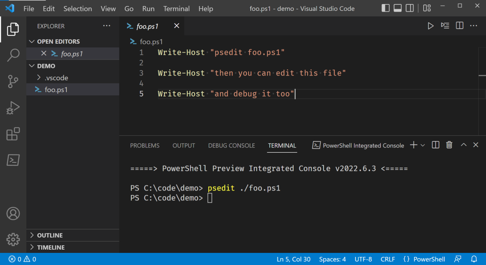
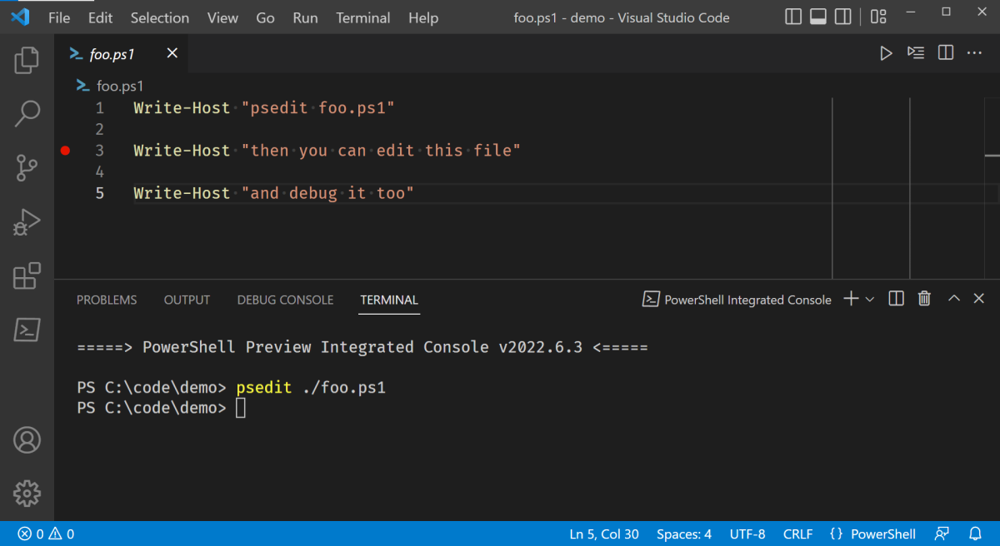
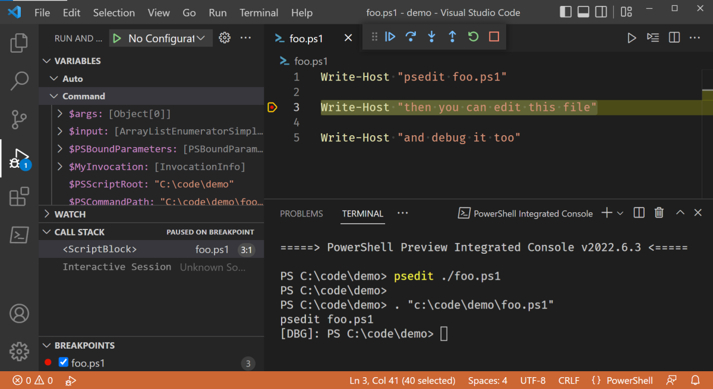
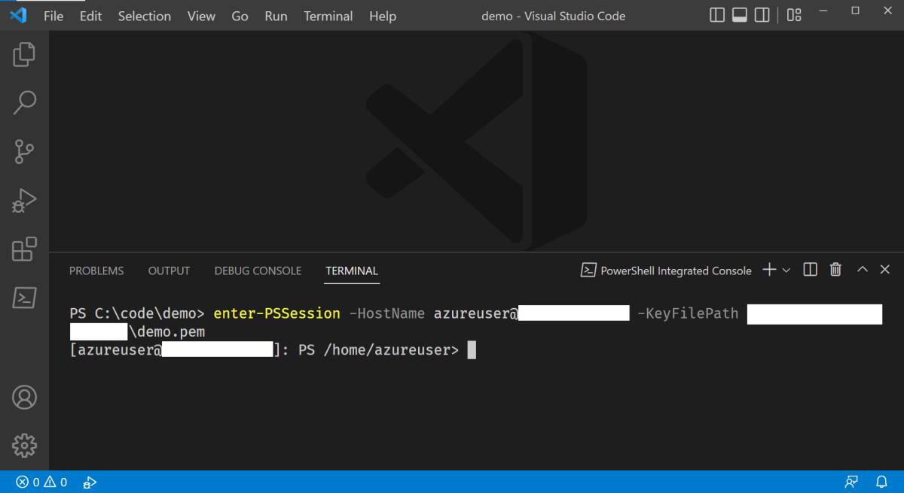
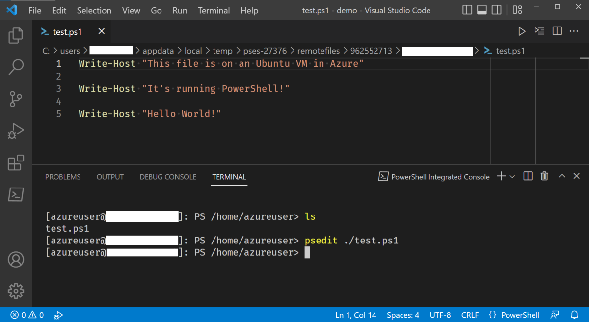
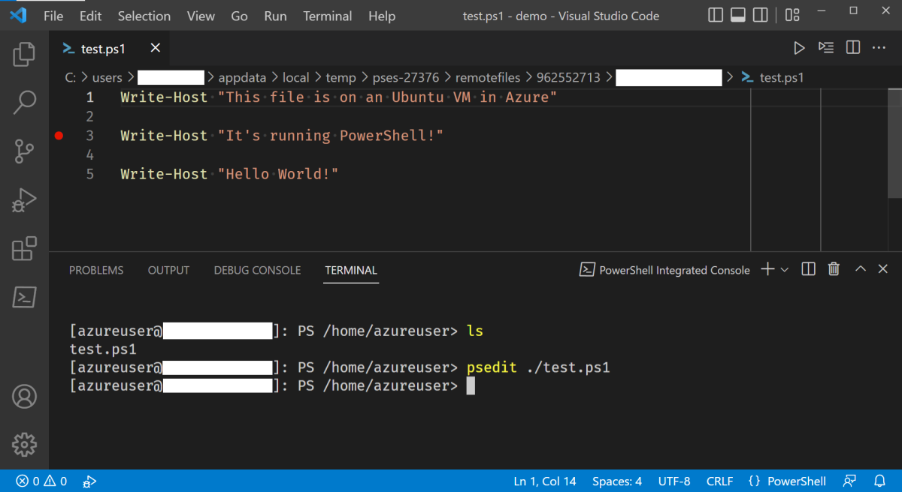
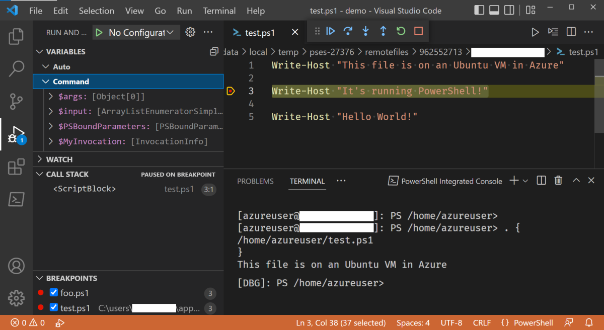

# Using Visual Studio Code for remote editing and debugging

For those of you that are familiar with the ISE, you may recall that you could run
`psedit file.ps1` from the integrated console to open files - local or remote - right in the ISE.

This feature is also available in the PowerShell extension for VSCode. This guide shows you how to
do it.

## Prerequisites

This guide assumes that you have:

- A remote resource (ex: a VM, a container) that you have access to
- PowerShell running on it and the host machine
- VSCode and the PowerShell extension for VSCode

This feature works on Windows PowerShell and PowerShell Core.

This feature also works when connecting to a remote machine via WinRM, PowerShell Direct, or SSH. If
you want to use SSH, but are using Windows, check out the [Win32 version of SSH](https://github.com/PowerShell/Win32-OpenSSH)!

> [!IMPORTANT]
> The `Open-EditorFile` and `psedit` commands only work in the **PowerShell Integrated Console**
> created by the PowerShell extension for VSCode.

## Usage examples

These examples show remote editing and debugging from a MacBook Pro to an Ubuntu VM
running in Azure. The process is identical on Windows.

### Local file editing with Open-EditorFile

With the PowerShell extension for VSCode started and the PowerShell Integrated Console opened, we
can type `Open-EditorFile foo.ps1` or `psedit foo.ps1` to open the local foo.ps1 file right in the
editor.

>[!NOTE]
> The file `foo.ps1` must already exist.

From there, we can:

- Add breakpoints to the gutter

  

- Hit F5 to debug the PowerShell script.

  

While debugging, you can interact with the debug console, check out the variables in the scope on
the left, and all the other standard debugging tools.

### Remote file editing with Open-EditorFile

Now let's get into remote file editing and debugging. The steps are nearly the same, there's just
one thing we need to do first - enter our PowerShell session to the remote server.

There's a cmdlet for to do so. It's called `Enter-PSSession`.

The watered down explanation of the cmdlet is:

- `Enter-PSSession -ComputerName foo` starts a session via WinRM
- `Enter-PSSession -ContainerId foo` and `Enter-PSSession -VmId foo` start a session via PowerShell Direct
- `Enter-PSSession -HostName foo` starts a session via SSH

For more information, see the documentation for [Enter-PSSession](/powershell/module/microsoft.powershell.core/enter-pssession).

Since we are going from macOS to an Ubuntu VM in Azure, we are using SSH for remoting.

First, in the Integrated Console, run `Enter-PSSession`. You're connected to the remote session
when `[<hostname>]` shows up to the left of your prompt.

Now, we can do the same steps as if we are editing a local script.

1. Run `Open-EditorFile test.ps1` or `psedit test.ps1` to open the remote `test.ps1` file

  

1. Edit the file/set breakpoints

   

1. Start debugging (F5) the remote file

   

If you have any problems, you can open issues in the [GitHub repo](https://github.com/powershell/vscode-powershell).
