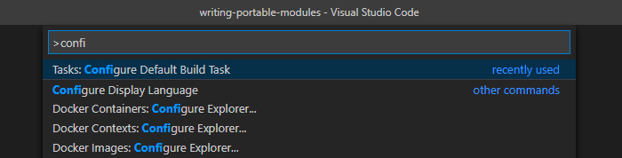
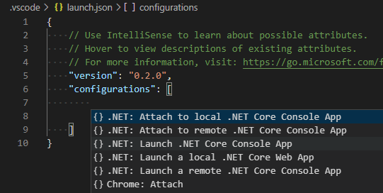
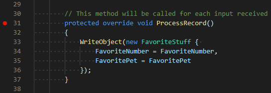
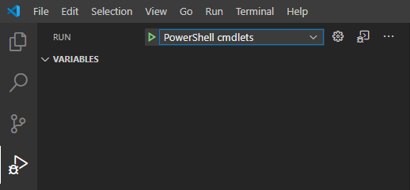
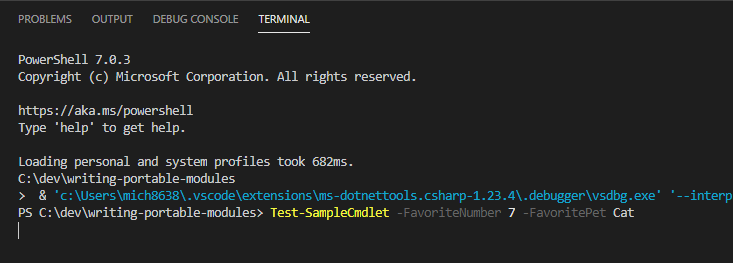
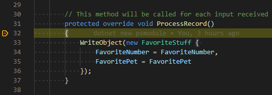

# Using Visual Studio Code to debug compiled cmdlets

This guide shows you how to interactively debug C# source code for a compiled PowerShell module
using Visual Studio Code (VS Code) and the C# extension.

Some familiarity with the Visual Studio Code debugger is assumed.

- For a general introduction to the VS Code debugger, see
  [Debugging in Visual Studio Code][].

- For examples of debugging PowerShell script files and modules, see
  [Using Visual Studio Code for remote editing and debugging][].

This guide assumes you have read and followed the instructions in the [Writing Portable Modules][]
guide.

## Creating a build task

Build your project automatically before launching a debugging session. Rebuilding ensures that you
debug the latest version of your code.

Configure a build task:

1. In the **Command Palette**, run the **Configure Default Build Task** command.

   

1. In the **Select a task to configure** dialog, choose **Create tasks.json file from template**.

1. In the **Select a Task Template** dialog, choose **.NET Core**.

A new `tasks.json` file is created if one doesn't exist yet.

To test your build task:

1. In the **Command Palette**, run the **Run Build Task** command.

1. In the **Select the build task to run** dialog, choose **build**.

### Information about DLL files being locked

By default, a successful build doesn't show output in the terminal pane. If you see output that
contains the text **Project file doesn't exist**, you should edit the `tasks.json` file. Include the
explicit path to the C# project expressed as `"${workspaceFolder}/myModule"`. In this example,
`myModule` is the name of the project folder. This entry must go after the `build` entry in the
`args` list as follows:

```json
    {
        "label": "build",
        "command": "dotnet",
        "type": "shell",
        "args": [
            "build",
            "${workspaceFolder}/myModule",
            // Ask dotnet build to generate full paths for file names.
            "/property:GenerateFullPaths=true",
            // Do not generate summary otherwise it leads to duplicate errors in Problems panel
            "/consoleloggerparameters:NoSummary",
        ],
        "group": "build",
        "presentation": {
            "reveal": "silent"
        },
        "problemMatcher": "$msCompile"
    }
```

When debugging, your module DLL is imported into the PowerShell session in the VS Code terminal. The
DLL becomes locked. The following message is displayed when you run the build task without closing
the terminal session:

```Output
Could not copy "obj\Debug\netstandard2.0\myModule.dll" to "bin\Debug\netstandard2.0\myModule.dll"`.
```

Terminal sessions must be closed before you rebuild.

## Setting up the debugger

To debug the PowerShell cmdlet, you need to set up a custom launch configuration. This
configuration is used to:

- Build your source code
- Start PowerShell with your module loaded
- Leave PowerShell open in the terminal pane

When you invoke your cmdlet in the terminal session, the debugger stops at any breakpoints set in
your source code.

### Configuring launch.json for PowerShell Core

1. Install the [C# for Visual Studio Code][] extension

1. In the Debug pane, add a debug configuration

1. In the `Select environment` dialog, choose `.NET Core`

1. The `launch.json` file is opened in the editor. With your cursor inside the `configurations`
   array, you see the `configuration` picker. If you don't see this list, select
   **Add Configuration**.

1. To create a default debug configuration, select **Launch .NET Core Console App**:

   

1. Edit the `name`, `program`, `args`, and `console` fields as follows:

   ```json
    {
        "name": "PowerShell cmdlets: pwsh",
        "type": "coreclr",
        "request": "launch",
        "preLaunchTask": "build",
        "program": "pwsh",
        "args": [
            "-NoExit",
            "-NoProfile",
            "-Command",
            "Import-Module ${workspaceFolder}/myModule/bin/Debug/netstandard2.0/myModule.dll",
        ],
        "cwd": "${workspaceFolder}",
        "stopAtEntry": false,
        "console": "integratedTerminal"
    }
   ```

The `program` field is used to launch `pwsh` so that the cmdlet being debugged can be run. The
`-NoExit` argument prevents the PowerShell session from exiting as soon as the module is imported.
The path in the `Import-Module` argument is the default build output path when you've followed the
[Writing Portable Modules][] guide. If you've created a module manifest (`.psd1` file), you should
use the path to that instead. The `/` path separator works on Windows, Linux, and macOS. You must
use the integrated terminal to run the PowerShell commands you want to debug.

> [!NOTE]
> If the debugger doesn't stop at any breakpoints, look in the Visual Studio Code Debug Console for a line that says:
>
> ```
> Loaded '/path/to/myModule.dll'. Skipped loading symbols. Module is optimized and the debugger option 'Just My Code' is enabled.
> ```
>
> If you see this, add `"justMyCode": false` to your launch config (at the same level as `"console": "integratedTerminal"`.

### Configuring launch.json for Windows PowerShell

This launch configuration works for testing your cmdlets in Windows PowerShell (`powershell.exe`).
Create a second launch configuration with the following changes:

1. `name` should be `PowerShell cmdlets: powershell`

1. `type` should be `clr`

1. `program` should be `powershell`

   It should look like this:

   ```json
    {
        "name": "PowerShell cmdlets: powershell",
        "type": "clr",
        "request": "launch",
        "preLaunchTask": "build",
        "program": "powershell",
        "args": [
            "-NoExit",
            "-NoProfile",
            "-Command",
            "Import-Module ${workspaceFolder}/myModule/bin/Debug/netstandard2.0/myModule.dll",
        ],
        "cwd": "${workspaceFolder}",
        "stopAtEntry": false,
        "console": "integratedTerminal"
    }
   ```

## Launching a debugging session

Now everything is ready to begin debugging.

- Place a breakpoint in the source code for the cmdlet you want to debug:

  

- Ensure that the relevant **PowerShell cmdlets** configuration is selected in the configuration
  drop-down menu in the **Debug** view:

  

- Press <kbd>F5</kbd> or click on the **Start Debugging** button

- Switch to the terminal pane and invoke your cmdlet:

  

- Execution stops at the breakpoint:

  

You can step through the source code, inspect variables, and inspect the call stack.

To end debugging, click **Stop** in the debug toolbar or press <kbd>Shift</kbd>-<kbd>F5</kbd>. The
shell used for debugging exits and releases the lock on the compiled DLL file.

<!-- reference links -->
[Debugging in Visual Studio Code]: https://code.visualstudio.com/docs/editor/debugging
[Using Visual Studio Code for remote editing and debugging]: using-vscode-for-remote-editing-and-debugging.md
[Writing Portable Modules]: ../writing-portable-modules.md
[C# for Visual Studio Code]: https://marketplace.visualstudio.com/items?itemName=ms-dotnettools.csharp
