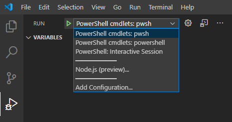

# Using Visual Studio Code for debugging compiled cmdlets

This guide will show you how to interactively debug C# source code for a compiled PowerShell module,
using Visual Studio Code and the C# extension.

Some familiarity with the Visual Studio Code debugger is assumed.

- For a general introduction to the Visual Studio Code debugger, see [Debugging in Visual Studio Code][].

- For examples of debugging PowerShell script files and modules, see [Using Visual Studio Code for remote editing and debugging][].

This guide follows on from the [Writing Portable Modules][] guide.

## Creating a build task

It is a good idea to build your project automatically before launching a debugging session. This
ensures that you are debugging the latest version of your code.

This can be achieved with a build task:

1. In the Command Palette, run the `Configure Default Build Task` command

   

2. In the `Select a task to configure` dialog, choose `Create tasks.json file from template`

3. In the `Select a Task Template` dialog, choose `.NET Core`

This will create a new `tasks.json` file, if one does not exist yet.

To test your build task:

1. In the Command Palette, run the `Run Build Task` command

2. In the `Select the build task to run` dialog, choose `build`

A successful build will not, by default, show output in the terminal pane. If you see output, review
it. If the output contains the text `Project file does not exist`, then you should edit the
`tasks.json` file to include the explicit path to the C# project, which can be expressed as
`"${workspaceFolder}/myModule"` (where `myModule` is the name of the project folder, if applicable).

This needs to go after the `build` entry in the `args` list, as follows:

```json
    {
        "label": "build",
        "command": "dotnet",
        "type": "shell",
        "args": [
            "build",
            "${workspaceFolder}/myModule",
            // Ask dotnet build to generate full paths for file names.
            "/property:GenerateFullPaths=true",
            // Do not generate summary otherwise it leads to duplicate errors in Problems panel
            "/consoleloggerparameters:NoSummary",
        ],
        "group": "build",
        "presentation": {
            "reveal": "silent"
        },
        "problemMatcher": "$msCompile"
    }
```

### Information about DLL files being locked

When you import a DLL file into a .NET application such as PowerShell, that DLL file becomes locked.

To rebuild your DLL file, you need to close the application that holds the lock. If you run the
build task without closing any locking applications, you might see a message such as
`Could not copy "obj\Debug\netstandard2.0\myModule.dll" to "bin\Debug\netstandard2.0\myModule.dll"`.

One solution is to treat terminals as disposable, and to close them before you rebuild.

## Setting up the debugger

To debug the PowerShell cmdlet, you will need to set up a custom launch configuration. This
configuration will:

- Build your source code

- Start PowerShell with your module loaded

- Leave PowerShell open in the terminal pane, so that you can invoke your cmdlet

- When you invoke your cmdlet, the debugger will stop at any breakpoints in your source code

The steps are:

1. Install the [C# for Visual Studio Code][] extension

2. In the Debug pane, add a debug configuration

3. In the `Select environment` dialog, choose `.NET Core`

4. This will open `launch.json`. With your cursor inside the `configurations` array, you will see
the `configuration` picker. If you do not see this, click on `Add Configuration`.

5. Choose `Launch .NET Core Console App`:

   

   This will create a default debug configuration.

6. Edit the `name`, `program`, `args` and `console` fields as follows:

   ```json
    {
        "name": "PowerShell cmdlets: pwsh",
        "type": "coreclr",
        "request": "launch",
        "preLaunchTask": "build",
        "program": "pwsh",
        "args": [
            "-NoExit",
            "-NoProfile",
            "-Command",
            "Import-Module ${workspaceFolder}/myModule/bin/Debug/netstandard2.0/myModule.dll",
        ],
        "cwd": "${workspaceFolder}",
        "stopAtEntry": false,
        "console": "integratedTerminal"
    }
   ```

This launch configuration will work for testing your cmdlets in PowerShell Core (`pwsh`).

### Explanation of the edits

- It is necessary to launch `pwsh` so that the cmdlet being debugged can be run

- The `-NoExit` argument prevents the PowerShell session from exiting as soon as the module is
imported

- The path in the `Import-Module` argument is the default build output path if you have followed the
[Writing Portable Modules][] guide. If you have written a module manifest (`.psd1` file), you should
use the path to that instead.

  > The `/` path separator works on Windows, Linux and macOS.

- It is necessary to use the integrated terminal because the debug terminal will not allow you to
run PowerShell commands

### Debugging in Windows PowerShell

To debug your code in Windows PowerShell (`powershell.exe`), create a second launch configuration,
with these changes from the first one:

1. `name` should be `PowerShell cmdlets: powershell`

2. `type` should be `clr`

3. `program` should be `powershell`

   It should look like this:

   ```json
    {
        "name": "PowerShell cmdlets: powershell",
        "type": "clr",
        "request": "launch",
        "preLaunchTask": "build",
        "program": "powershell",
        "args": [
            "-NoExit",
            "-NoProfile",
            "-Command",
            "Import-Module ${workspaceFolder}/myModule/bin/Debug/netstandard2.0/myModule.dll",
        ],
        "cwd": "${workspaceFolder}",
        "stopAtEntry": false,
        "console": "integratedTerminal"
    }
   ```

This launch configuration will work for testing your cmdlets in Windows PowerShell
(`powershell.exe`).

## Launching a debugging session

Now everything is ready to begin debugging.

- Place a breakpoint in the source code for the cmdlet you want to debug:

  

- Ensure that the relevant `PowerShell cmdlets` configuration is selected in the configuration
drop-down menu in the Debug view:

  

- press `F5` or click on the `Start Debugging` button

- Switch to the terminal pane and invoke your cmdlet:

  

- Execution stops at the breakpoint:

  

You can step through the source code, inspect variables and inspect the call stack.

To end debugging, click `Stop` in the debug toolbar or press `Shift-F5`. The shell used for
debugging will exit, which releases the lock on the compiled DLL file.

<!-- reference links -->
[Debugging in Visual Studio Code]: https://code.visualstudio.com/docs/editor/debugging
[Using Visual Studio Code for remote editing and debugging]: using-vscode-for-remote-editing-and-debugging
[Writing Portable Modules]: /powershell/scripting/dev-cross-plat/writing-portable-modules
[C# for Visual Studio Code]: https://marketplace.visualstudio.com/items?itemName=ms-dotnettools.csharp
