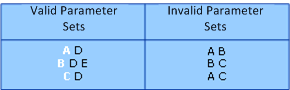

# Cmdlet parameter sets

PowerShell uses parameter sets to enable you to write a single cmdlet that can do different actions
for different scenarios. Parameter sets enable you to expose different parameters to the user. And,
to return different information based on the parameters specified by the user.

## Examples of parameter sets

For example, the PowerShell `Get-EventLog` cmdlet returns different information depending on whether
the user specifies the **List** or **LogName** parameter. If the **List** parameter is specified,
the cmdlet returns information about the log files themselves but not the event information they
contain. If the **LogName** parameter is specified, the cmdlet returns information about the events
in a specific event log. The **List** and **LogName** parameters identify two separate parameter
sets.

## Unique parameter

Each parameter set must have a unique parameter that the PowerShell runtime uses to expose the
appropriate parameter set. If possible, the unique parameter should be a mandatory parameter. When a
parameter is mandatory, the user must specify the parameter, and the PowerShell runtime uses that
parameter to identify the parameter set. The unique parameter can't be mandatory if your cmdlet is
designed to run without specifying any parameters.

## Multiple parameter sets

In the following illustration, the left column shows three valid parameter sets. **Parameter A** is
unique to the first parameter set, **parameter B** is unique to the second parameter set, and
**parameter C** is unique to the third parameter set. In the right column, the parameter sets don't
have a unique parameter.



## Parameter set requirements

The following requirements apply to all parameter sets.

- Each parameter set must have at least one unique parameter. If possible, make this parameter a
  mandatory parameter.

- A parameter set that contains multiple positional parameters must define unique positions for each
  parameter. No two positional parameters can specify the same position.

- Only one parameter in a set can declare the `ValueFromPipeline` keyword with a value of `true`.
  Multiple parameters can define the `ValueFromPipelineByPropertyName` keyword with a value of
  `true`.

- If no parameter set is specified for a parameter, the parameter belongs to all parameter sets.

> [!NOTE]
> For a cmdlet or function, there is a limit of 32 parameter sets.

## Default parameter sets

When multiple parameter sets are defined, you can use the `DefaultParameterSetName` keyword of the
**Cmdlet** attribute to specify the default parameter set. PowerShell uses the default parameter set
if it can't determine the parameter set to use based on the information provided by the command. For
more information about the **Cmdlet** attribute, see [Cmdlet Attribute Declaration](./cmdlet-attribute-declaration.md).

## Declaring parameter sets

To create a parameter set, you must specify the `ParameterSetName` keyword when you declare the
**Parameter** attribute for every parameter in the parameter set. For parameters that belong to
multiple parameter sets, add a **Parameter** attribute for each parameter set. This attribute
enables you to define the parameter differently for each parameter set. For example, you can define
a parameter as mandatory in one set and optional in another. However, each parameter set must
contain one unique parameter. For more information, see [Parameter Attribute Declaration](parameter-attribute-declaration.md).

In the following example, the **UserName** parameter is the unique parameter of the `Test01`
parameter set, and the **ComputerName** parameter is the unique parameter of the `Test02` parameter
set. The **SharedParam** parameter belongs to both sets and is mandatory for the `Test01` parameter
set but optional for the `Test02` parameter set.

```csharp
[Parameter(Position = 0, Mandatory = true, ParameterSetName = "Test01")]
public string UserName
{
  get { return userName; }
  set { userName = value; }
}
private string userName;

[Parameter(Position = 0, Mandatory = true, ParameterSetName = "Test02")]
public string ComputerName
{
  get { return computerName; }
  set { computerName = value; }
}
private string computerName;

[Parameter(Mandatory= true, ParameterSetName = "Test01")]
[Parameter(ParameterSetName = "Test02")]
public string SharedParam
{
    get { return sharedParam; }
    set { sharedParam = value; }
}
private string sharedParam;
```
