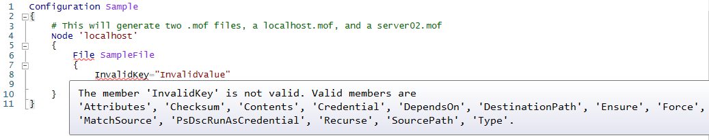
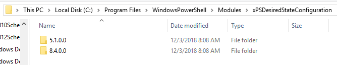
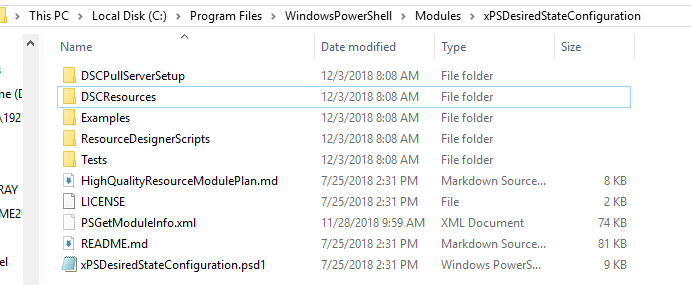

# Using Import-DSCResource

`Import-DSCResource` is a dynamic keyword, which can only be used inside a Configuration script
block to import any resources needed in your Configuration. Resources under `$PSHOME` are imported
automatically, but it is still considered best practice to explicitly import all resources used in
your [Configuration](Configurations.md).

The syntax for `Import-DSCResource` is shown below. When specifying modules by name, it is a
requirement to list each on a new line.

```syntax
Import-DscResource [-Name <ResourceName(s)>] [-ModuleName <ModuleName>] [-ModuleVersion <ModuleVersion>]
```

|    Parameter     |                                                                                                                      Description                                                                                                                      |
| ---------------- | ----------------------------------------------------------------------------------------------------------------------------------------------------------------------------------------------------------------------------------------------------- |
| `-Name`          | The DSC resource name(s) that you must import. If the module name is specified, the command searches for these DSC resources within this module; otherwise the command searches the DSC resources in all DSC resource paths. Wildcards are supported. |
| `-ModuleName`    | The module name, or module specification.  If you specify resources to import from a module, the command will try to import only those resources. If you specify the module only, the command imports all the DSC resources in the module.            |
| `-ModuleVersion` | Beginning in PowerShell 5.0, you can specify which version of a module a configuration should use. For more information, see [Import a specific version of an installed resource](sxsresource.md).                                                    |

```powershell
Import-DscResource -ModuleName xActiveDirectory
```

## Example: Use Import-DSCResource within a configuration

```powershell
Configuration MSDSCConfiguration
{
    # Search for and imports Service, File, and Registry from the module PSDesiredStateConfiguration.
    Import-DSCResource -ModuleName PSDesiredStateConfiguration -Name Service, File, Registry

    # Search for and import Resource1 from the module that defines it.
    # If only –Name parameter is used then resources can belong to different PowerShell modules as well.
    # TimeZone resource is from the ComputerManagementDSC module which is not installed by default.
    # As a best practice, list each requirement on a different line if possible.  This makes reviewing
    # multiple changes in source control a bit easier.
    Import-DSCResource -Name File
    Import-DSCResource -Name TimeZone

    # Search for and import all DSC resources inside the module PSDesiredStateConfiguration.
    # When specifying the modulename parameter, it is a requirement to list each on a new line.
    Import-DSCResource -ModuleName PSDesiredStateConfiguration
    # In PowerShell 5.0 and later, you can specify a ModuleVersion parameter
    Import-DSCResource -ModuleName ComputerManagementDsc -ModuleVersion 6.0.0.0
...
```

> [!NOTE]
> Specifying multiple values for Resource names and modules names in same command are not supported.
> It can have non-deterministic behavior about which resource to load from which module in case same
> resource exists in multiple modules. Below command will result in error during compilation.
>
> ```powershell
> Import-DscResource -Name UserConfigProvider*,TestLogger1 -ModuleName UserConfigProv,PsModuleForTestLogger
> ```

Things to consider when using only the Name parameter:

- It is a resource-intensive operation depending on the number of modules installed on machine.
- It will load the first resource found with the given name. In the case where there is more than
  one resource with same name installed, it could load the wrong resource.

The recommended usage is to specify `–ModuleName` with the `-Name` parameter, as described below.

This usage has the following benefits:

- It reduces the performance impact by limiting the search scope for the specified resource.
- It explicitly defines the module defining the resource, ensuring the correct resource is loaded.

> [!NOTE]
> In PowerShell 5.0, DSC resources can have multiple versions, and versions can be installed on a
> computer side-by-side. This is implemented by having multiple versions of a resource module that
> are contained in the same module folder. For more information, see
> [Using resources with multiple versions](sxsresource.md).

## Intellisense with Import-DSCResource

When authoring the DSC configuration in ISE, PowerShell provides IntelliSence for resources and
resource properties. Resource definitions under the `$pshome` module path are loaded automatically.
When you import resources using the `Import-DSCResource` keyword, the specified resource definitions
are added and Intellisense is expanded to include the imported resource's schema.



> [!NOTE]
> Beginning in PowerShell 5.0, tab completion was added to the ISE for DSC resources and their
> properties. For more information, see [Resources](../resources/resources.md).

When compiling the Configuration, PowerShell uses the imported resource definitions to validate all
resource blocks in the configuration. Each resource block is validated, using the resource's schema
definition, for the following rules.

- Only properties defined in schema are used.
- The data types for each property are correct.
- Keys properties are specified.
- No read-only property is used.
- Validation on value maps types.

Consider the following configuration:

```powershell
Configuration SchemaValidationInCorrectEnumValue
{
    # It is best practice to explicitly import all resources used in your Configuration.
    # This includes resources that are imported automatically, like WindowsFeature.
    Import-DSCResource -Name WindowsFeature
    Node localhost
    {
        WindowsFeature ROLE1
        {
            Name = "Telnet-Client"
            Ensure = "Invalid"
        }
    }
}
```

Compiling this Configuration results in an error.

```Output
PSDesiredStateConfiguration\WindowsFeature: At least one of the values 'Invalid' is not supported or
valid for property 'Ensure' on class 'WindowsFeature'. Please specify only supported values:
Present, Absent.
```

Intellisense and schema validation allow you to catch more errors during parse and compilation time,
avoiding complications at run time.

> [!NOTE]
> Each DSC resource can have a name, and a **FriendlyName** defined by the resource's schema. Below
> are the first two lines of "MSFT_ServiceResource.shema.mof".
>
> ```syntax
> [ClassVersion("1.0.0"),FriendlyName("Service")]
> class MSFT_ServiceResource : OMI_BaseResource
> ```
>
> When using this resource in a Configuration, you can specify **MSFT_ServiceResource** or
> **Service**.

## PowerShell v4 and v5 differences

There are multiple differences you see when authoring Configurations in PowerShell 4.0 vs.
PowerShell 5.0 and later. This section will highlight the differences that you see relevant to this
article.

### Multiple Resource Versions

Installing and using multiple versions of resources side by side was not supported in PowerShell
4.0. If you notice issues importing resources into your Configuration, ensure that you only have one
version of the resource installed.

In the image below, two versions of the **xPSDesiredStateConfiguration** module are installed.



Copy the contents of your desired module version to the top level of the module directory.



### Resource location

When authoring and compiling Configurations, your resources can be stored in any directory specified
by your
[PSModulePath](/powershell/scripting/developer/module/modifying-the-psmodulepath-installation-path).
In PowerShell 4.0, the LCM requires all DSC resource modules to be stored under "Program
Files\WindowsPowerShell\Modules" or `$pshome\Modules`. Beginning in PowerShell 5.0, this requirement
was removed, and resource modules can be stored in any directory specified by `PSModulePath`.

### ModuleVersion added

Beginning in PowerShell 5.0, the `-ModuleVersion` parameter allows you to specify which version of a
module to use within your configuration.

## See also

- [Resources](../resources/resources.md)
