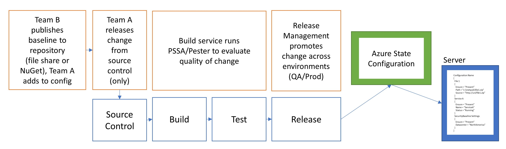
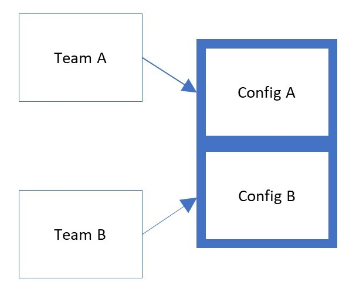
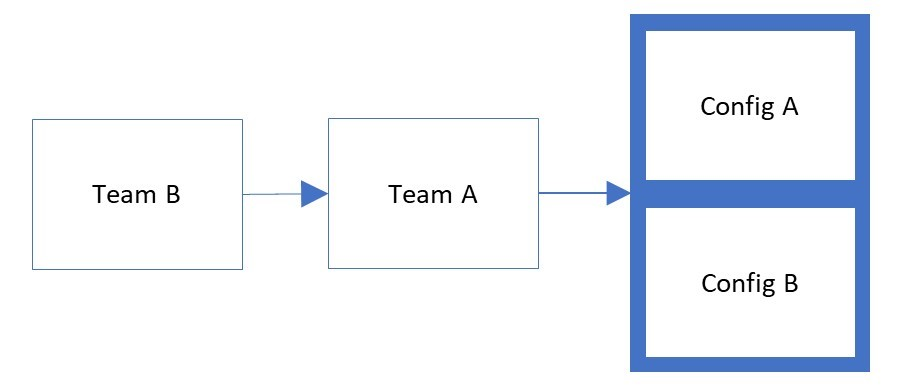
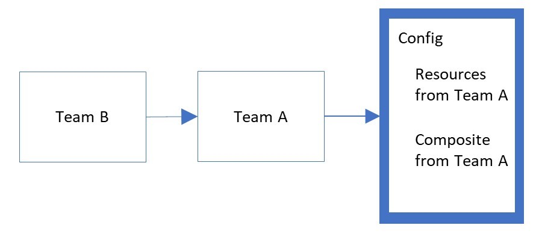

# Understanding DSC's role in a CI/CD pipeline

This article describes the types of approaches available for combining configurations and resources.
The goal for each scenario is the same, to reduce complexity when multiple configurations are
preferred to reach a server deployment end state. An example of this would be multiple teams
contributing to the outcome of a server deployment, such as an application owner maintaining the
application state and a central team releasing changes to security baselines. The nuances of each
approach including the benefits and risks are detailed here.



## Types of Collaborative Authoring Techniques

There are two solutions built in to Local Configuration Manager
to enable this concept:

|        Concept         |                    Detailed Information                     |
| ---------------------- | ----------------------------------------------------------- |
| Partial Configurations | [Documentation](../pull-server/partialConfigs.md)           |
| Composite Resources    | [Documentation](../resources/authoringResourceComposite.md) |

## Understanding The Impact of Each Approach

Either of these solutions can be used to manage the outcome of a server deployment. However, there
is significant difference in the impact of using each approach.

## Partial Configurations

When using Partial Configurations, Local Configuration Manager is configured to manage multiple
configurations independently. Configurations are compiled independently and then assigned to the
node. This requires LCM to be configured in advance with the name of each configuration.



Partial Configurations provide two, or more, teams complete control over configuration of a server,
often without the benefit of communication or collaboration.

Customers have provided feedback that this can lead to resource conflicts, unintentional overrides,
and ultimately loss of true configuration control of the asset.

Additionally, customers have provided feedback that when using this model, each controlling teams
configuration changes are unlikely to be fully tested through a release pipeline, leading to
unexpected results in production.

**It is critical that a single pipeline be used to evaluate all changes released to servers.**

In the illustration below, Team B releases their partial configuration to Team A. Team A then runs
their tests against a server with both configurations applied. In this model, only one authority has
permission to make changes in production.



When changes are required from Team B, they should submit a Pull Request against Team A's source
control environment. Team A would then review the changes using test automation and release to
production when there is confidence that the changes will not cause errors in the applications or
services hosted by the server.

## Composite Resources

A composite resource is simply a DSC Configuration packaged as a resource. There are no special
requirements for configuring LCM to accept composite resources. The resources are used within a new
configuration and a single compilation results in one MOF file.



There are two common scenarios for composite resources. The first is to reduce complexity and
abstract unique concepts. The second is to allow baselines to be packaged for an application team to
safely deploy through their release pipeline to production after all tests have passed.

```PowerShell
Configuration Name
{
  File 1
  {
    Ensure = "Present"
    Path = "c:\inetpub\file1.zip"
    Source = "http://uri/file1.zip"
  }
  Service A
  {
    Ensure = "Present"
    Name = "ServiceA"
    Status = "Running"
  }
  SecurityBaseline Settings
  {
    Ensure = "Present"
    Datacenter = "NorthAmerica"
  }
}
```

Composite resources promote both composition and collaboration using a pipeline while building
operational maturity.

You might be already using composite resources without realizing it. An example is **ServiceSet**.
This resource manages the state of multiple Windows Services without listing them individually. The
Name property accepts an array of strings to provide the name of each service. When the
configuration is compiled, the MOF will contain a unique Service section for each of the Names
passed to ServiceSet.

Organizations might have "agents" or "middleware" that should be installed on every server. A
composite resource is the best answer to managing the dependencies, setup, and configuration of any
such tools and utilities.

The person or team responsible for solutions that span multiple servers authors a configuration
containing their requirements. Next, the configuration would be packaged as a composite resource
using instructions provided in the composite resource documentation. Finally, the new composite
resource should be published to a location such as a file share or NuGet feed where application
teams can consume it in their configurations.

Each time the team releases a new version, they would increment the version number in the module
manifest for their composite resource. The application teams include the composite resource in the
configuration they author for managing application dependencies. When the Operations/Security teams
release a new version of their resource, they notify the application teams of a new change.

The application teams might trigger a release to production where the only change is to baselines.
However, this provides an opportunity to evaluate impact to applications before risk of a service
outage.

> [!NOTE]
> Feedback regarding the use of composite resources has included criticism that making changes
> requires compiling and releasing a new MOF. This is by design. Each new configuration release
> should include a static reference to a specific version of each resource, and should be validated
> by tests before reaching production server nodes. The process of testing and releasing changes
> from source control creates a safe environment for releasing change in small but frequent batches.

For more information about using release pipelines to manage core infrastructure, see the
whitepaper: [The Release Pipeline Model](../further-reading/whitepapers.md).
