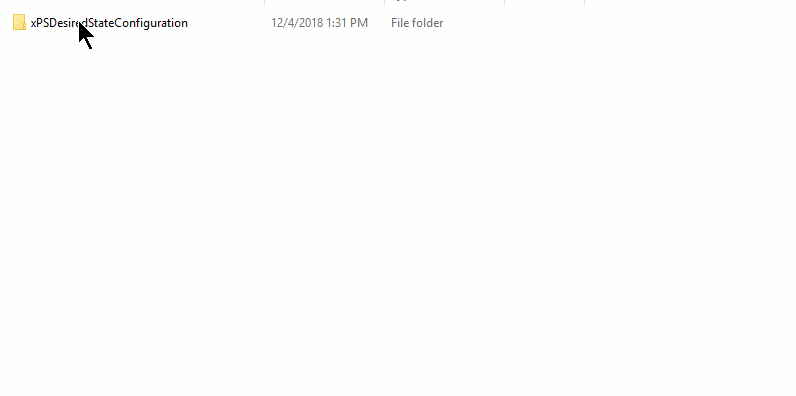

# Package and Upload Resources to a Pull Server

The sections below assume that you have already set up a Pull Server. If you have not set up your
Pull Server, you can use the following guides:

- [Set up a DSC SMB Pull Server](pullServerSmb.md)
- [Set up a DSC HTTP Pull Server](pullServer.md)

Each target node can be configured to download configurations, resources, and even report its
status. This article will show you how to upload resources so they are available to be downloaded,
and configure clients to download resources automatically. When the Node's receives an assigned
Configuration, through **Pull** or **Push** (v5), it automatically downloads any resources required
by the Configuration from the location specified in the LCM.

## Package Resource Modules

Each resource available for a client to download must be stored in a `.zip` file. The example below
will show the required steps using the
[xPSDesiredStateConfiguration](https://www.powershellgallery.com/packages/xPSDesiredStateConfiguration/8.4.0.0)
resource.

> [!NOTE]
> If you have any clients using PowerShell 4.0, you will need to flatten the resource folder
> structure and remove any version folders. For more information, see
> [Multiple Resource Versions](../configurations/import-dscresource.md#multiple-resource-versions).

You can compress the resource directory using any utility, script, or method that you prefer. In
Windows, you can _right-click_ on the `xPSDesiredStateConfiguration` directory, and select **Send
To**, then **Compressed Folder**.



### Naming the Resource Archive

The Resource archive needs to be named with the following format:

```
{ModuleName}_{Version}.zip
```

In the example above, `xPSDesiredStateConfiguration.zip` should be renamed
`xPSDesiredStateConfiguration_8.4.4.0.zip`.

### Create CheckSums

Once the Resource module has been compressed and renamed, you need to create a **CheckSum**. The
**CheckSum** is used, by the LCM on the client, to determine if the resource has been changed, and
needs to be downloaded again. You can create a **CheckSum** with the
[New-DSCCheckSum](/powershell/module/PSDesiredStateConfiguration/New-DSCCheckSum) cmdlet, as shown
in the example below.

```powershell
New-DscChecksum -Path .\xPSDesiredStateConfiguration_8.4.4.0.zip
```

No output will be shown, but you should now see a
"xPSDesiredStateConfiguration_8.4.4.0.zip.checksum". You can also run `New-DSCCheckSum` against a
directory of files using the `-Path` parameter. If a checksum already exists, you can force it to be
re-created with the `-Force` parameter.

### Where to store Resource Archives

#### On a DSC HTTP Pull Server

When you set up your HTTP Pull Server, as explained in
[Set up a DSC HTTP Pull Server](pullServer.md), you specify directories for the **ModulePath** and
**ConfigurationPath** keys. The **ConfigurationPath** key indicates where any ".mof" files should be
stored. The **ModulePath** indicates where any DSC Resource Modules should be stored.

```powershell
    xDscWebService PSDSCPullServer
    {
    ...
        ModulePath              = "$env:PROGRAMFILES\WindowsPowerShell\DscService\Modules"
        ConfigurationPath       = "$env:PROGRAMFILES\WindowsPowerShell\DscService\Configuration"
    ...
    }

```

#### On an SMB Share

If you specified a **ResourceRepositoryShare**, when setting up your Pull Client, store archives and
checksums in the **SourcePath** directory from the **ResourceRepositoryShare** block.

```powershell
ConfigurationRepositoryShare SMBPullServer
{
    SourcePath = '\\SMBPullServer\Configurations'
}

ResourceRepositoryShare SMBResourceServer
{
    SourcePath = '\\SMBPullServer\Resources'
}
```

If you specified only a **ConfigurationRepositoryShare**, when setting up your Pull Client, store
archives and checksums in the **SourcePath** directory from the **ConfigurationRepositoryShare**
block.

```powershell
ConfigurationRepositoryShare SMBPullServer
{
    SourcePath = '\\SMBPullServer\Pull'
}
```

#### Updating resources

You can force a Node to update its resources by changing the version number in the archive's name,
or by creating a new checksum. The Pull Client will check for newer versions of required resources,
as well as updated checksums, when its LCM refreshes.

## See also

- [Set up a DSC SMB Pull Server](pullServerSmb.md)
- [Set up a DSC HTTP Pull Server](pullServer.md)
