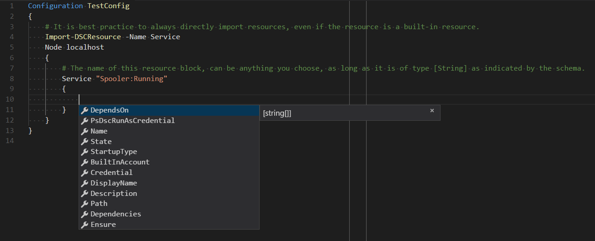

# DSC Resources

> Applies to Windows PowerShell 4.0 and up.

## Overview

Desired State Configuration (DSC) Resources provide the building blocks for a DSC configuration. A
resource exposes properties that can be configured (schema) and contains the PowerShell script
functions that the Local Configuration Manager (LCM) calls to "make it so".

A resource can model something as generic as a file or as specific as an IIS server setting. Groups
of like resources are combined in to a DSC Module, which organizes all the required files in to a
structure that is portable and includes metadata to identify how the resources are intended to be
used.

Each resource has a *schema that determines the syntax needed to use the resource in a
[Configuration](../configurations/configurations.md). A resource's schema can be defined in the
following ways:

- `Schema.Mof` file: Most resources define their _schema_ in a `schema.mof` file, using
  [Managed Object Format](/windows/desktop/wmisdk/managed-object-format--mof-).
- `<Resource Name>.schema.psm1` file: [Composite Resources](../configurations/compositeConfigs.md)
  define their _schema_ in a `<ResourceName>.schema.psm1` file using a
  [Parameter Block](/powershell/module/microsoft.powershell.core/about/about_functions#functions-with-parameters).
- `<Resource Name>.psm1` file: Class based DSC resources define their _schema_ in the class
  definition. Syntax items are denoted as Class properties. For more information, see
  [about_Classes](/powershell/module/psdesiredstateconfiguration/about/about_classes_and_dsc).

To retrieve the syntax for a DSC resource, use the
[Get-DSCResource](/powershell/module/PSDesiredStateConfiguration/Get-DscResource) cmdlet with the
**Syntax** parameter. This usage is similar to using
[Get-Command](/powershell/module/microsoft.powershell.core/get-command) with the **Syntax**
parameter to get cmdlet syntax. The output you see will show the template used for a resource block
for the resource you specify.

```powershell
Get-DscResource -Syntax Service
```

The output you see should be similar to the output below, though this resource's syntax could change
in the future. Like cmdlet syntax, the _keys_ seen in square brackets, are optional. The types
specify the type of data each key expects.

> [!NOTE]
> The **Ensure** key is optional because it defaults to "Present".

```output
Service [String] #ResourceName
{
    Name = [string]
    [BuiltInAccount = [string]{ LocalService | LocalSystem | NetworkService }]
    [Credential = [PSCredential]]
    [Dependencies = [string[]]]
    [DependsOn = [string[]]]
    [Description = [string]]
    [DisplayName = [string]]
    [Ensure = [string]{ Absent | Present }]
    [Path = [string]]
    [PsDscRunAsCredential = [PSCredential]]
    [StartupType = [string]{ Automatic | Disabled | Manual }]
    [State = [string]{ Running | Stopped }]
}
```

> [!NOTE]
> In PowerShell versions below 7.0, `Get-DscResource` does not find Class based DSC resources.

Inside a Configuration, a **Service** resource block might look like this to **Ensure** that the
Spooler service is running.

> [!NOTE]
> Before using a resource in a Configuration, you must import it using
> [Import-DSCResource](../configurations/import-dscresource.md).

```powershell
Configuration TestConfig
{
    # It is best practice to always directly import resources, even if the
    # resource is a built-in resource.
    Import-DSCResource -Name Service
    Node localhost
    {
        # The name of this resource block, can be anything you choose, as l
        # ong as it is of type [String] as indicated by the schema.
        Service "Spooler:Running"
        {
            Name = "Spooler"
            State = "Running"
        }
    }
}
```

Configurations can contain multiple instances of the same resource type. Each instance must be
uniquely named. In the following example, a second **Service** resource block is added to configure
the "DHCP" service.

```powershell
Configuration TestConfig
{
    # It is best practice to always directly import resources, even if the
    # resource is a built-in resource.
    Import-DSCResource -Name Service
    Node localhost
    {
        # The name of this resource block, can be anything you choose, as
        # long as it is of type [String] as indicated by the schema.
        Service "Spooler:Running"
        {
            Name = "Spooler"
            State = "Running"
        }

        # To configure a second service resource block, add another Service
        # resource block and use a unique name.
        Service "DHCP:Running"
        {
            Name = "DHCP"
            State = "Running"
        }
    }
}
```

> [!NOTE]
> Beginning in PowerShell 5.0, IntelliSense was added for DSC. This new feature allows you to use
> <kbd>TAB</kbd> and <kbd>Ctr</kbd>+<kbd>Space</kbd> to auto-complete key names.



## Types of resources

Windows comes with built in resources and Linux has OS specific resources. There are resources for
[cross-node dependencies](../configurations/crossNodeDependencies.md), package management resources,
as well as[community owned and maintained resources](https://github.com/dsccommunity). You can use
the above steps to determine the syntax of these resources and how to use them. The pages that serve
these resources have been archived under **Reference**.

### Windows built-in resources

- [Archive Resource](../reference/resources/windows/archiveResource.md)
- [Environment Resource](../reference/resources/windows/environmentResource.md)
- [File Resource](../reference/resources/windows/fileResource.md)
- [Group Resource](../reference/resources/windows/groupResource.md)
- [GroupSet Resource](../reference/resources/windows/groupSetResource.md)
- [Log Resource](../reference/resources/windows/logResource.md)
- [Package Resource](../reference/resources/windows/packageResource.md)
- [ProcessSet Resource](../reference/resources/windows/ProcessSetResource.md)
- [Registry Resource](../reference/resources/windows/registryResource.md)
- [Script Resource](../reference/resources/windows/scriptResource.md)
- [Service Resource](../reference/resources/windows/serviceResource.md)
- [ServiceSet Resource](../reference/resources/windows/serviceSetResource.md)
- [User Resource](../reference/resources/windows/userResource.md)
- [WindowsFeature Resource](../reference/resources/windows/windowsFeatureResource.md)
- [WindowsFeatureSet Resource](../reference/resources/windows/windowsFeatureSetResource.md)
- [WindowsOptionalFeature Resource](../reference/resources/windows/windowsOptionalFeatureResource.md)
- [WindowsOptionalFeatureSet Resource](../reference/resources/windows/windowsOptionalFeatureSetResource.md)
- [WindowsPackageCabResource Resource](../reference/resources/windows/windowsPackageCabResource.md)
- [WindowsProcess Resource](../reference/resources/windows/windowsProcessResource.md)

### Cross-Node dependency resources

- [WaitForAll Resource](../reference/resources/windows/waitForAllResource.md)
- [WaitForSome Resource](../reference/resources/windows/waitForSomeResource.md)
- [WaitForAny Resource](../reference/resources/windows/waitForAnyResource.md)

### Package Management resources

- [PackageManagement Resource](../reference/resources/packagemanagement/PackageManagementDscResource.md)
- [PackageManagementSource Resource](../reference/resources/packagemanagement/PackageManagementSourceDscResource.md)

#### Linux resources

- [Linux Archive Resource](../reference/resources/linux/lnxArchiveResource.md)
- [Linux Environment Resource](../reference/resources/linux/lnxEnvironmentResource.md)
- [Linux FileLine Resource](../reference/resources/linux/lnxFileLineResource.md)
- [Linux File Resource](../reference/resources/linux/lnxFileResource.md)
- [Linux Group Resource](../reference/resources/linux/lnxGroupResource.md)
- [Linux Package Resource](../reference/resources/linux/lnxPackageResource.md)
- [Linux Script Resource](../reference/resources/linux/lnxScriptResource.md)
- [Linux Service Resource](../reference/resources/linux/lnxServiceResource.md)
- [Linux SshAuthorizedKeys Resource](../reference/resources/linux/lnxSshAuthorizedKeysResource.md)
- [Linux User Resource](../reference/resources/linux/lnxUserResource.md)
