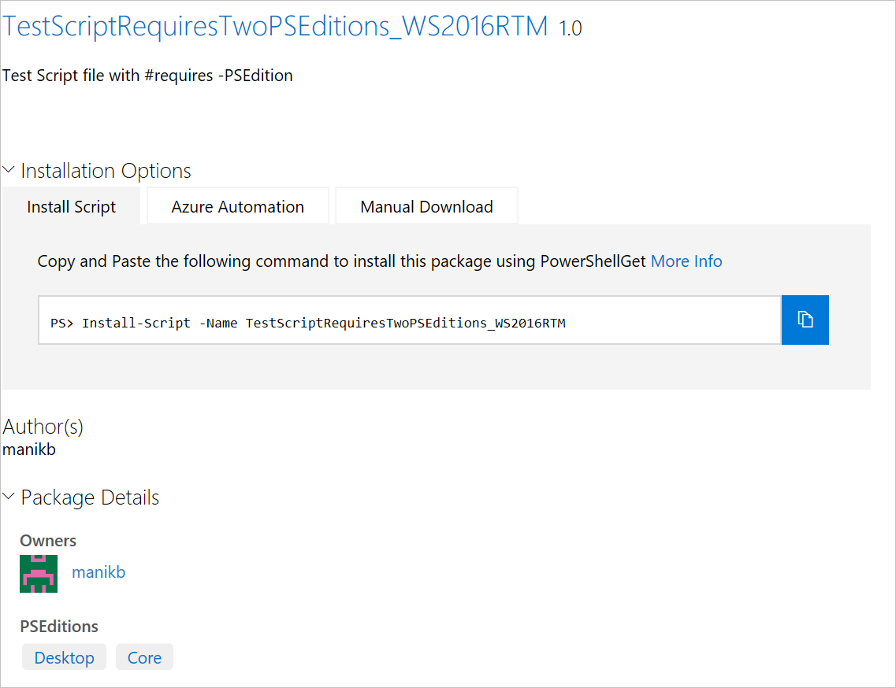
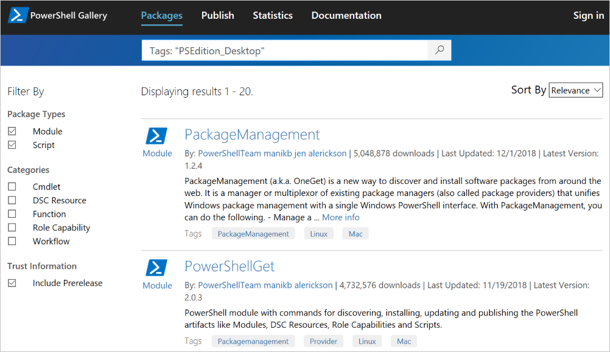

# Packages with compatible PowerShell Editions or Operating Systems

Starting with version 5.1, PowerShell is available in different editions which denote varying
feature sets and platform compatibilities.

## Searching by PowerShell Edition

The two editions of PowerShell are:

- **Desktop Edition:** Built on .NET Framework and provides compatibility with scripts and modules
  targeting versions of PowerShell running on full footprint editions of Windows such as Server Core
  and Windows Desktop.
- **Core Edition:** Built on .NET Core and provides compatibility with scripts and modules
  targeting versions of PowerShell running on reduced footprint editions of Windows such as Nano
  Server and Windows IoT.

### PowerShell Gallery allows you to filter packages compatible for specific PowerShell Editions

If a package has compatible PSEditions specified, they are listed as part of 'PowerShell
Editions' in the package display page and also in packages results.
You can also search for compatible packages using PowerShell.



### Search for packages in the gallery UI that work on PowerShell Core

Use Tags:"PSEdition_Desktop" and Tags:"PSEdition_Core" to filters the packages on PowerShell Gallery.

### Use Tags:"PSEdition_Core" to search items compatible with PowerShell Core Edition


### Use Tags:"PSEdition_Desktop" to search items compatible with PowerShell Desktop Edition



### Search for packages to find compatible editions using PowerShell

You can specify tags to filter for the PowerShell edition and OS. You use the `Find-Package` cmdlet
specifying the `-Tag` parameter to specify the edition (and OS) you are targeting. Like this:

```powershell
# Find modules compatible with PowerShell Core:
Find-Module -Tag PSEdition_Core

# Find modules compatible with PowerShell Core on Linux:
Find-Module -Tag PSEdition_Core, Linux
```

## Searching by Operating System

Since PowerShell Core is available for Windows, Linux, and MacOS, packages in the Gallery may be
designed for any combination of these operating systems. In the gallery UI use the following searchs
tags to find packages tagged by operating system:

- Tags: "Windows"
- Tags: "Linux"
- Tags: "MacOS"

You can specify these tags on `Find-Module` (and other cmdlets in the PowerShellGet module), like this:

```powershell
# Find Modules compatible with Windows
Find-Module -Tag Linux
```

## Searching for Multiple Compatibilities

You can look for a package that has multiple compatibilities by using the syntax:

Tags: "Compatibility1" "Compatibility2"

For example, if you are looking for a package with PowerShell Core Compatibility that runs on both
my Windows and Linux machines, use the search tags:

Tags: "PSEdition_Core" "Windows" "Linux"

To search using PowerShell, you can use the `Find-Module` (and the other cmdlets in the
PowerShellGet module), like this:

```powershell
# Find scripts compatible with PowerShell Core, Windows, and Linux
Find-Script -Tag PSEdition_Core,Linux,Windows

# Find modules compatible with PowerSHellCore and MacOS
Find-Module -Tag PSEdition_Core,MacOS
```

## More details on authoring and finding the packages with compatible PowerShell Editions

- [Modules with PSEditions](../../concepts/module-psedition-support.md)
- [Scripts with PSEditions](../../concepts/script-psedition-support.md)
