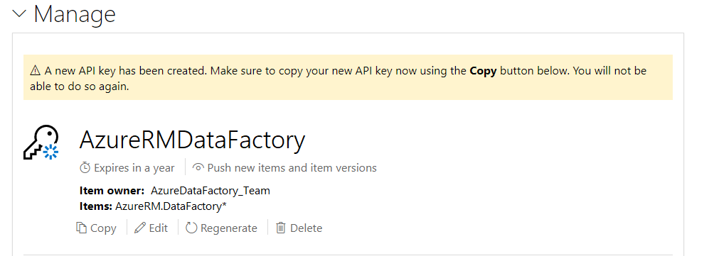
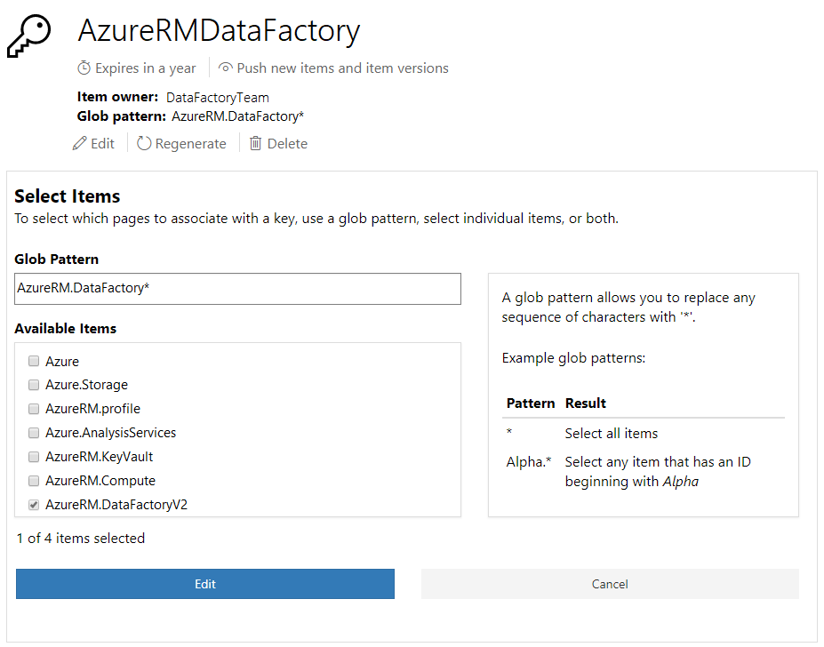

# Managing API keys

The PowerShell Gallery supports creating multiple API keys to support a range of publishing
requirements. An API key can apply to one or more packages, grants specific privileges, and has an
expiration date.

> [!IMPORTANT]
> Users who published to the PowerShell Gallery prior to the introduction of scoped API keys will
> have a "Full access API key". The full access keys do not have the security improvements built
> into scoped API keys. The full access keys never expires and apply to everything owned by the
> user. If you delete this key, it cannot be recreated.

The following image shows the options available when creating a scoped API key.

In this example, we created an API key named **AzureRMDataFactory**. This key value can be used to
push packages with names that begin with 'AzureRM.DataFactory' and is valid for 365 days. This is a
typical scenario when different teams within the same organization work on different packages. The
members of the team have a key that grants them privileges for the specific package they work on.
The expiration value prevents the use of stale or forgotten keys.

## Using glob patterns

If you work on multiple packages, you can use globbing patterns to match multiple packages as a
group. API key permissions apply to all new packages matching the glob pattern. For example, the
previous example uses a **Glob Pattern** value of 'AzureRM.DataFactory*'. You can push a package
named 'AzureRm.DataFactoryV2.Netcore' using this key since the package matches the glob pattern.

## Create API keys securely

For security, a newly created key value is never shown on the screen and is only available with the
Copy button, as shown below.

> [!IMPORTANT]
> You can only copy the API key value immediately after creating or refreshing it. It will not be
> displayed, and will not be accessible again after the page is refreshed. If you lose the key
> value, you must use Regenerate, and copy the key after it is regenerated.

## Key permissions and expiration

Scoped API keys can assign any of the following permissions:

- Push new packages
- Push new or update packages
- Unlist packages

Every new key has an expiration. The expiration value is measured in days. The possible values for expiration are:

- 1 day
- 90 days
- 180 days
- 270 days
- 365 days (default)

These settings cannot be changed once the key is created. You cannot create a new key that never
expires.

## Editing and deleting existing API keys

You can change some settings of an existing key. As previously noted, you cannot modify the
security scope for an existing API key or change the expiration. The changeable options are shown in
the following screenshot:

To change the packages controlled by a key, you can choose individual packages from the list or
change the glob pattern.

Clicking **Regenerate** creates a new key value. Just like when you initially created the key, you
must **Copy** the key value immediately after updating it. The **Copy** option is not available
once you leave this page.

Clicking **Delete** displays a confirmation message. Once a key is deleted, it will be unusable.

## Key expiration

Ten days before the expiration, the PowerShell Gallery sends a warning email the account holder of
the API key. After expiration, the key is unusable. A warning message is displayed at the top of
the API key management page showing which keys are no longer valid. You can generate a new key
value.
