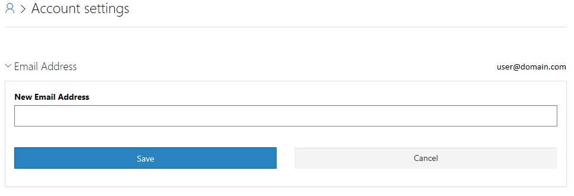
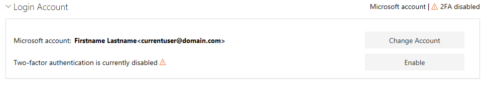
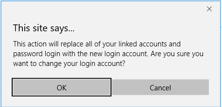
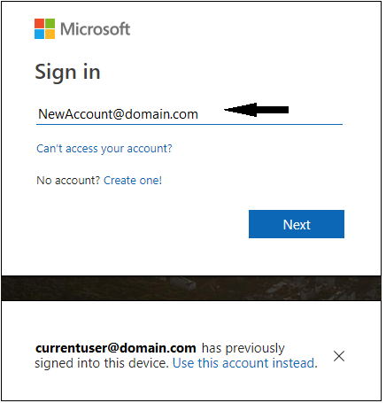
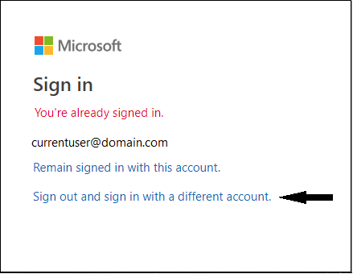

# PowerShell Gallery Account Settings

Your PowerShell Gallery account is a publicly visible name that is linked to an identity. That
identity is either a Microsoft ID, like `user@hotmail.com` or `user@outlook.com`, or an Azure
Active Directory (AAD) account.

The PowerShell Gallery provides the following account settings:

- The email account associated with your PowerShell Gallery account
- Options for email notifications sent from the PowerShell Gallery
- The user account associated with your PowerShell Gallery account
- The picture associated with your PowerShell Gallery account

## Email address

The email address is the destination for PowerShell Gallery notifications. It does not have to
match the login account. You may use any email account you have access to. Your email address is
never directly provided by the PowerShell Gallery to other users.

When you enter a new email address, the PowerShell Gallery sends a verification mail to that
address. The verification mail contains a link back to the PowerShell Gallery to complete the
change process. Until you complete the verification process, all notifications are sent to the
previous address.

## Email notifications

PowerShell Gallery provides the following notification options:

- Users can contact me through the PowerShell Gallery
- Notify me when an package is pushed to the PowerShell Gallery using my account

As noted on the page, critical notifications from the PowerShell Gallery can't be disabled.
These include:

- Security notifications
- Account management notifications from PowerShell Gallery administrators
- Notifications about the tests run by the PowerShell Gallery for submissions you have made

## Change your login account

To change the login account, you must be signed in with the current account. Use the following
steps to complete the change.

1. Click on **Change Account**. A pop-up window explains that changing the login account applies to
   all uses of that account in the PowerShell Gallery. Review the information, then click **OK** to
   continue.

   

2. You are then prompted to sign in using the _new account_.

   

3. When you click **Next**, you see a message that you are signed in using the current account.
   Click **Sign out and sign in with a different account**.

   

4. Enter the password of the new account. After entering the password, you are returned to the
   Account Settings page showing you that the login account has been updated.

## Enable Two-Factor Authentication (2FA)

Two-factor authentication is recommended for all users who publish manually to the PowerShell
Gallery. To enable two-factor authentication, the login account must have at least two forms of
authentication registered. One is a password and the other forms can be:

- A phone number that can receive text messages
- A registered authenticator application, such as Microsoft Authenticator for your mobile phone

These forms of authentication must be configured in your AAD account information or in your
Microsoft ID Account Security settings.

Once 2FA is enabled, you are required to authenticate using the configured forms of authentication
every time you sign in to the PowerShell Gallery.

> [!IMPORTANT]
> Enabling two-factor authentication for the PowerShell Gallery site does not require you to enable
> 2FA for all uses of your login account. For more information, see
> [About two-step verification](https://support.microsoft.com/help/12408/microsoft-account-about-two-step-verification).

## Change your profile picture

The PowerShell Gallery relies on Gravatar to store and display the picture associated with your
profile. To update your profile image, visit [Gravatar.com](http://www.gravatar.com/).
