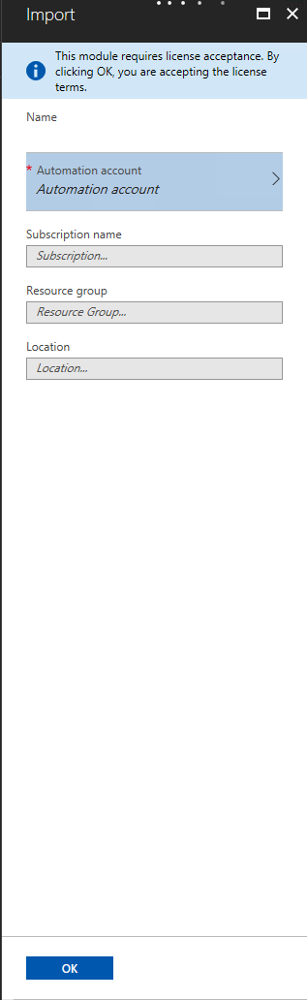

# Deploy to Azure Automation

The Deploy to Azure Automation button on the package details page will deploy the package from the
PowerShell Gallery to Azure Automation.

When clicked, it will redirect you to the Azure Management Portal, where you sign in using your
Azure account credentials. If the package includes dependencies, all the dependencies will be
deployed to Azure Automation as well.

> [!WARNING]
> If the same package and version already exist in your Automation account, deploying it again from
> the PowerShell Gallery will overwrite the package in your Automation account.

If you deploy a module, it will appear in the Modules section of Azure Automation. If you deploy a
script, it will appear in the Runbooks section of Azure Automation.

The Deploy to Azure Automation button can be disabled by adding the AzureAutomationNotSupported tag
to the package metadata.

## Require License Acceptance on Deploy to Azure Automation

If the module being deployed to Azure Automation requires license acceptance, portal UI will show a
disclaimer saying 'This module requires license acceptance. By clicking OK, you are accepting
license terms.'

## More details

- [Require License Acceptance in PowerShellGet](../../concepts/module-license-acceptance.md)
- [Require License Acceptance in PowerShell Gallery](packages-that-require-license-acceptance.md)
- [Azure Automation website](https://azure.microsoft.com/services/automation/)
