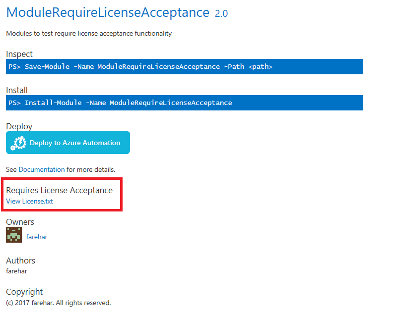
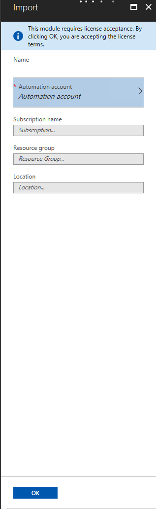

# Require license acceptance

Require License Acceptance text shows up on item details page for modules that require license
acceptance. License for module can be viewed by clicking on **View License.txt** link.

Users will be prompted to accept the license when installing, saving or updating the module through
PowerShellGet or when deploying to Azure Automation.

## Require License Acceptance on Deploy to Azure Automation

If the module being deployed to Azure Automation requires license acceptance, portal UI will show a
disclaimer saying 'This module requires license acceptance. By clicking OK, you are accepting
license terms.'

## More details

[Require License Acceptance in PowerShellGet](../../concepts/module-license-acceptance.md)
[Azure Automation website](/azure/automation)
