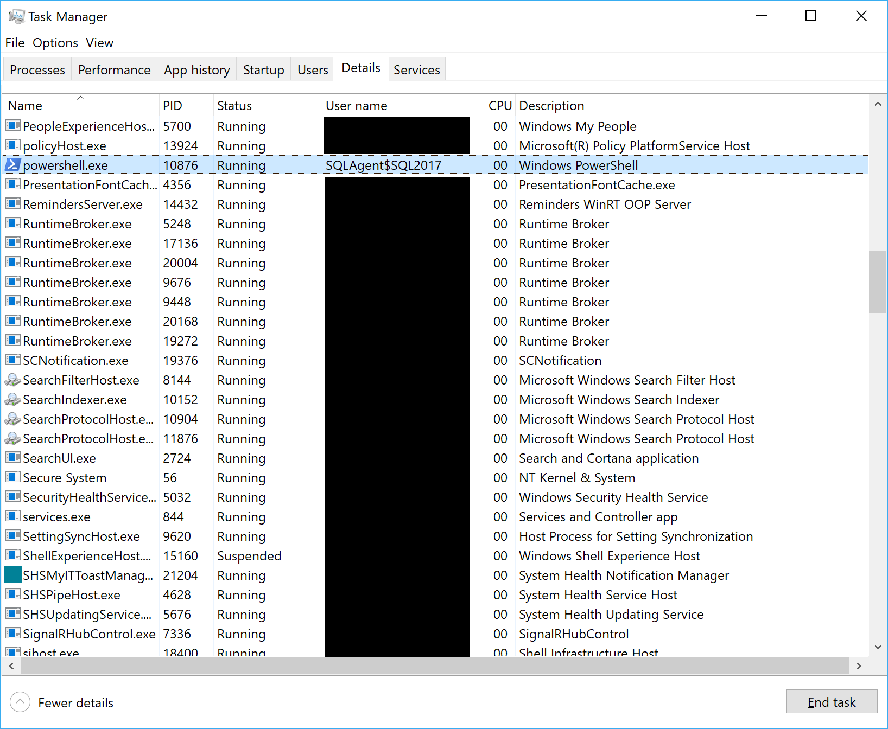
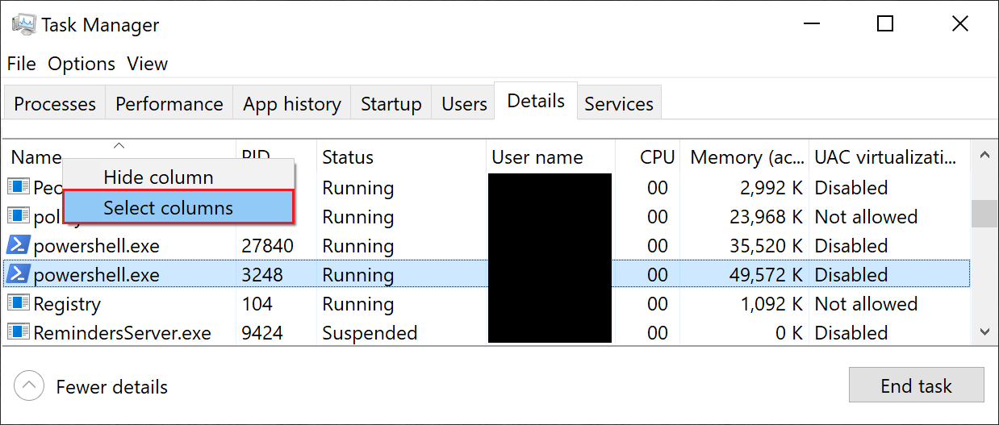
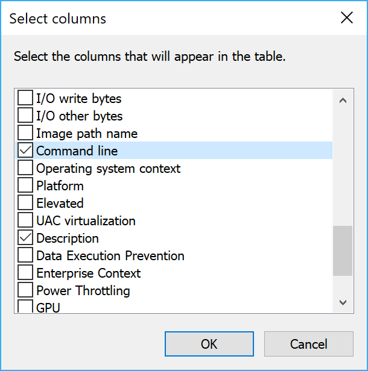
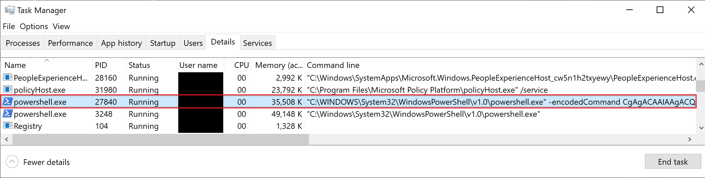

# Decode PowerShell Command from a Running Process

There are times when I've found a PowerShell process running that is taking up a bunch of resources. Sometimes they've even been my own scripts running in the context of a [Task Scheduler](https://docs.microsoft.com/windows/desktop/TaskSchd/task-scheduler-start-page
) job or a [SQL Server Agent](https://docs.microsoft.com/sql/ssms/agent/sql-server-agent
) Job with a PowerShell job step. Because multiple PowerShell processes can be running at a time, sometimes it's difficult to know what the offending process is. The following method can be used to decode a script block that a PowerShell process is currently running.

## Create a Long Running Process

To demonstrate this capability, open a new PowerShell window and run the following code. It executes a PowerShell command that outputs a number every minute for 10 minutes.

```PowerShell
powershell.exe -Command {
    $i = 1
    while ( $i -le 10 )
    {
        Write-Output -InputObject $i
        Start-Sleep -Seconds 60
        $i++
    }
}
```

## View the Process

### Using Task Manager

- Launch the Task Manager and select the **Details** tab.
- Scroll down the list to powershell.exe.

  [](./media/DecodeCommandTaskManagerDetails.png "Task Manager Details")

- Right-click the column headers in Task Manager and click **Select Columns**.

  [](./media/DecodeCommandTaskManagerRightClick.png "Right-Click the column header")

- Check **Command Line** in the Select columns dialogue and click **OK**.

  [](./media/DecodeCommandTaskManagerSelectColumns.png "Select Columns")

- Now the parameters that were passed into powershell.exe are visible. However, the command is still obfuscated as an encoded command.

  [](./media/DecodeCommandTaskManagerWithCommandLine.png "Task Manager with Command Line shown")

### Using PowerShell

- Start PowerShell as Administrator. It is vital that PowerShell is running as administrator, otherwise no results will be returned when querying the running processes.
- Execute the following command to obtain all of the PowerShell processes that have an encoded command:

```PowerShell
$powerShellProcesses = Get-CimInstance -ClassName Win32_Process -Filter 'CommandLine LIKE "%EncodedCommand%"'
```

- The following command creates a custom PowerShell object that contains the process ID and the encoded command.

```PowerShell
$commandDetails = $powerShellProcesses | Select-Object -Property ProcessId,
@{
    name       = 'EncodedCommand'
    expression = {
        if ( $_.CommandLine -match 'encodedCommand (.*) -inputFormat' )
        {
            return $matches[1]
        }
    }
}
```

- Now the encoded command can be decoded. The following snippet iterates over the command details object, decodes the encoded command, and adds the decoded command back to the object for further investigation.

```PowerShell
$commandDetails | ForEach-Object -Process {
    # Get the current process
    $currentProcess = $_

    # Convert the Base 64 string to a Byte Array
    $commandBytes = [System.Convert]::FromBase64String($currentProcess.EncodedCommand)

    # Convert the Byte Array to a string
    $decodedCommand = [System.Text.Encoding]::Unicode.GetString($commandBytes)

    # Add the decoded command back to the object
    $commandDetails |
        Where-Object -FilterScript { $_.ProcessId -eq $_.ProcessId } |
        Add-Member -MemberType NoteProperty -Name DecodedCommand -Value $decodedCommand
}
```

- The decoded command can now be reviewed by selecting the decoded command property.

```PowerShell
$commandDetails[0].DecodedCommand
```
