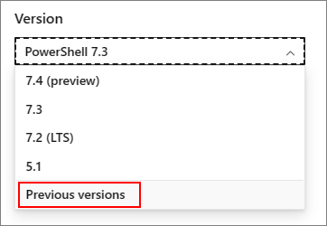

# How to use the PowerShell documentation

Welcome to the PowerShell online documentation. This site contains cmdlet reference for the
following versions of PowerShell:

- PowerShell 7.6 (preview)
- PowerShell 7.5 (RC)
- PowerShell 7.4 (LTS)
- PowerShell 5.1

## Navigating the documentation

![Screenshot showing the various elements of the web page.][02]

The web page contains multiple elements that help you navigate the documentation.

- **Site level navigation** - The site level navigation appears at the top of the page. It contains
  links to other content on the Microsoft Learn platform.
- **Related content navigation** - The related content bar is immediately below the site level
  navigation. It contains links to content related to the current documentation set, which is
  PowerShell in this case.
- **Version selector** - The version selector appears above the Table of Contents (TOC) and
  controls which version of the cmdlet reference appears in the TOC.
- **Table of Contents** - The TOC on the left side of the page is divided into two sections:
  conceptual and reference. Notice the line between the **Reference** node of the TOC. The
  conceptual documents appear above the line. Reference content is listed in **Reference** node
  below the line.
- **Action buttons** - The action buttons provide a way to add content to a collection, provide
  feedback, edit the content, or share the content with others.

## Selecting the version of PowerShell

Use the version selector located above the TOC to select the version of PowerShell you want. By
default, the page loads with the most current stable release version selected. The version selector
controls which version of the cmdlet reference appears in the TOC under the **Reference** node. Some
cmdlets work differently in different versions of PowerShell you are using. Be sure you are viewing
the documentation for the correct version of PowerShell.

The version selector doesn't affect conceptual documentation. The conceptual documents appear above
the **Reference** node in the TOC. The same conceptual articles appear for every version selected.
If there are version-specific differences, the documentation makes note of those differences.

![Animation showing how to use the version selector.][04]

You can verify the version of PowerShell you are using by inspecting the `$PSversionTable.PSVersion`
value. The following example shows the output for Windows PowerShell 5.1.

```powershell
$PSVersionTable.PSVersion
```

```Output
Major  Minor  Build  Revision
-----  -----  -----  --------
5      1      22621  963
```

## Finding articles

There are two ways to search for content in Docs.

- The search box in the site-level navigation bar searches the entire site. It returns a list of
  matching articles from all documentation sets.
- The TOC filter box under the version selector allows filtering by words that appear in the title
  of an article. The filter displays a list of matching articles as you type. You can also select
  the option to search for the words in an article. When you search from here, the search is
  limited to the PowerShell documentation.

In the following example, the search in the site-level navigation bar returns 840 results for the
word `idempotent`. Entering the word `invoke` in the TOC filter box shows a list of articles that
contain the word `invoke` in the title. Entering the word `idempotent` in the TOC filter shows no
articles. Clicking the search link searches for `idempotent` in the PowerShell documentation. This
search only returns 9 results.

![Animation showing how to use the search features.][05]

## Downloading the documentation as a PDF

To download the documentation as a PDF, click the **Download PDF** button at the bottom of the TOC.

![Screenshot of the Download PDF button.][03]

- If you are viewing a conceptual article, the Learn platform creates a PDF containing all the
  conceptual content for the selected version.
- If you are viewing a reference article, the Learn platform creates a PDF containing all the
  reference content for the selected version.

## Finding articles for previous versions

Documentation for older versions of PowerShell is archived in our [Previous Versions][01] site. You
can choose **Previous Versions** from the version selector.



The previous versions site contains documentation for the following topics:

- PowerShell 7.3
- PowerShell 7.2
- PowerShell 7.1
- PowerShell 7.0
- PowerShell 6
- PowerShell 5.0
  - PowerShell Workflows
  - PowerShell Web Access
- PowerShell 4.0
- PowerShell 3.0

<!-- link references -->
[01]: https://aka.ms/PSLegacyDocs
[02]: media/how-to-use-docs/how-to-use.gif
[03]: media/how-to-use-docs/pdf-button.gif
[04]: media/how-to-use-docs/version-search.gif
[05]: media/how-to-use-docs/search-scope.gif
