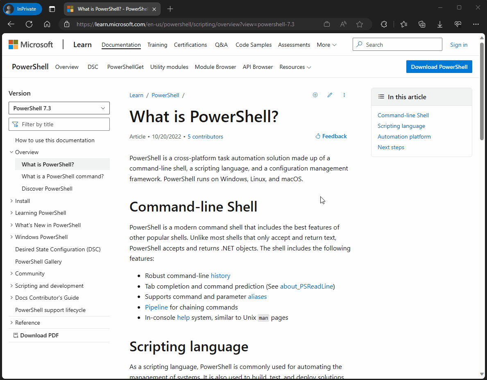

# How to use the PowerShell documentation

Welcome to the PowerShell online documentation. This site contains cmdlet reference for the
following versions of PowerShell:

- PowerShell 7.2 (prerelease)
- PowerShell 7.1 (current)
- PowerShell 7.0 (LTS)
- PowerShell 5.1

## Finding articles and selecting a version

There are two ways to search for content in Docs. The simplest way is to use the filter box under
the version selector. Just enter a word that appears in the title of an article. The page displays
a list of matching articles. You can also select the option to search the entire site from that
list.

By default, this site displays documentation for the latest released version of PowerShell. Some
cmdlets work differently in various versions of PowerShell. Be sure you are viewing the
documentation for the version of PowerShell you are using.

Use the version picker at the top of the page to select the version of PowerShell you want.



You can verify the version of PowerShell you are using by inspecting the `$PSversionTable.PSVersion`
value. The following example shows the output for Windows PowerShell 5.1.

```powershell
$PSVersionTable.PSVersion
```

```Output
Major  Minor  Build  Revision
-----  -----  -----  --------
5      1      19041  1
```

If you are new to PowerShell and need help understanding the command syntax, see
[about_Command_Syntax](/powershell/module/microsoft.powershell.core/about/about_command_syntax).

## Finding articles for previous versions

Documentation for older versions of PowerShell has been archived in our
[Previous Versions](https://aka.ms/PSLegacyDocs) site.

This site contains documentation for the following topics:

- PowerShell 3.0
- PowerShell 4.0
- PowerShell 5.0
- PowerShell 6
- PowerShell Workflows
- PowerShell Web Access
