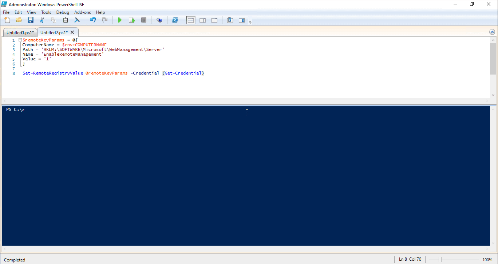
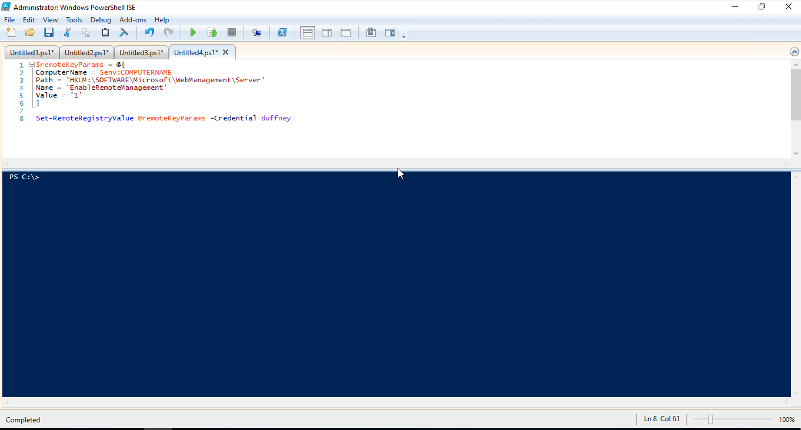

# Add Credential support to PowerShell functions

> [!NOTE]
> The [original version][] of this article appeared on the blog written by [@joshduffney][]. This
> article has been edited for inclusion on this site. The PowerShell team thanks Josh for sharing
> this content with us. Please check out his blog at [duffney.io][].

This article shows you how to add credential parameters to PowerShell functions and why you'd want
to. A credential parameter is to allow you to run the function or cmdlet as a different user. The
most common use is to run the function or cmdlet as an elevated user account.

For example, the cmdlet `New-ADUser` has a **Credential** parameter, which you could provide domain
admin credentials to create an account in a domain. Assuming your normal account running the
PowerShell session doesn't have that access already.

## Creating credential object

The [PSCredential][] object represents a set of security credentials such as a user name and
password. The object can be passed as a parameter to a function that runs as the user account in
that credential object. There are a few ways that you can create a credential object. The first way
to create a credential object is to use the PowerShell cmdlet `Get-Credential`. When you run without
parameters, it prompts you for a username and password. Or you can call the cmdlet with some
optional parameters.

To specify the domain name and username ahead of time you can use either the **Credential** or
**UserName** parameters. When you use the **UserName** parameter, you're also required to provide a
**Message** value. The code below demonstrates using the cmdlet. You can also store the credential
object in a variable so that you can use the credential multiple times. In the example below, the
credential object is stored in the variable `$Cred`.

```powershell
$Cred = Get-Credential
$Cred = Get-Credential -Credential domain\user
$Cred = Get-Credential -UserName domain\user -Message 'Enter Password'
```

Sometimes, you can't use the interactive method of creating credential objects shown in the previous
example. Most automation tools require a non-interactive method. To create a credential without user
interaction, create a secure string containing the password. Then pass the secure string and user
name to the `System.Management.Automation.PSCredential()` method.

Use the following command to create a secure string containing the password:

```powershell
ConvertTo-SecureString "MyPlainTextPassword" -AsPlainText -Force
```

Both the **AsPlainText** and **Force** parameters are required. Without those parameters, you
receive a message warning that you shouldn't pass plain text into a secure string. PowerShell
returns this warning because the plain text password gets recorded in various logs. Once you have a
secure string created, you need to pass it to the `PSCredential()` method to create the credential
object. In the following example, the variable `$password` contains the secure string `$Cred`
contains the credential object.

```powershell
$password = ConvertTo-SecureString "MyPlainTextPassword" -AsPlainText -Force
$Cred = New-Object System.Management.Automation.PSCredential ("username", $password)
```

Now that you know how to create credential objects, you can add credential parameters to your
PowerShell functions.

## Adding a Credential Parameter

Just like any other parameter, you start off by adding it in the `param` block of your function.
It's recommended that you name the parameter `$Credential` because that's what existing PowerShell
cmdlets use. The type of the parameter should be `[System.Management.Automation.PSCredential]`.

The following example shows the parameter block for a function called `Get-Something`. It has two
parameters: `$Name` and `$Credential`.

```powershell
function Get-Something {
    param(
        $Name,
        [System.Management.Automation.PSCredential]$Credential
    )
```

The code in this example is enough to have a working credential parameter, however there are a few
things you can add to make it more robust.

- Add the `[ValidateNotNull()]` validation attribute to check that the value being passed to
  **Credential**. If the parameter value is null, this attribute prevents the function from
  executing with invalid credentials.

- Add `[System.Management.Automation.Credential()]`. This allows you to pass in a username as a
  string and have an interactive prompt for the password.

- Set a default value for the `$Credential` parameter to
  `[System.Management.Automation.PSCredential]::Empty`. Your function you might be passing this
  `$Credential` object to existing PowerShell cmdlets. Providing a null value to the cmdlet called
  inside your function causes an error. Providing an empty credential object avoids this error.

> [!TIP]
> Some cmdlets that accept a credential parameter do not support
> `[System.Management.Automation.PSCredential]::Empty` as they should. See the
> [Dealing with Legacy Cmdlets](#dealing-with-legacy-cmdlets) section for a workaround.

## Using credential parameters

The following example demonstrates how to use credential parameters. This example shows a function
called `Set-RemoteRegistryValue`, which is out of [The Pester Book][]. This function defines the
credential parameter using the techniques describe in the previous section. The function calls
`Invoke-Command` using the `$Credential` variable created by the function. This allows you to change
the user who's running `Invoke-Command`. Because the default value of `$Credential` is an empty
credential, the function can run without providing credentials.

```powershell
function Set-RemoteRegistryValue {
    param(
        $ComputerName,
        $Path,
        $Name,
        $Value,
        [ValidateNotNull()]
        [System.Management.Automation.PSCredential]
        [System.Management.Automation.Credential()]
        $Credential = [System.Management.Automation.PSCredential]::Empty
    )
        $null = Invoke-Command -ComputerName $ComputerName -ScriptBlock {
            Set-ItemProperty -Path $using:Path -Name $using:Name -Value $using:Value
        } -Credential $Credential
}
```

The following sections show different methods of providing credentials to `Set-RemoteRegistryValue`.

### Prompting for credentials

Using `Get-Credential` in parentheses `()` at run time causes the `Get-credential` to run first. You
are prompted for a username and password. You could use the **Credential** or **UserName**
parameters of `Get-credential` to pre-populate the username and domain. The following example uses a
technique called splatting to pass parameters to the `Set-RemoteRegistryValue` function. For more
information about splatting, check out the [about_Splatting][] article.

```powershell
$remoteKeyParams = @{
    ComputerName = $env:COMPUTERNAME
    Path = 'HKLM:\SOFTWARE\Microsoft\WebManagement\Server'
    Name = 'EnableRemoteManagement'
    Value = '1'
}

Set-RemoteRegistryValue @remoteKeyParams -Credential (Get-Credential)
```



Using `(Get-Credential)` seems cumbersome. Normally, when you use the **Credential** parameter with
only a username, the cmdlet automatically prompts for the password. The
`[System.Management.Automation.Credential()]` attribute enables this behavior.

```powershell
$remoteKeyParams = @{
    ComputerName = $env:COMPUTERNAME
    Path = 'HKLM:\SOFTWARE\Microsoft\WebManagement\Server'
    Name = 'EnableRemoteManagement'
    Value = '1'
}

Set-RemoteRegistryValue @remoteKeyParams -Credential duffney
```



> [!NOTE]
> To set the registry value shown, these examples assume you have the **Web Server** features of
> Windows installed. Run `Install-WindowsFeature Web-Server` and
> `Install-WindowsFeature web-mgmt-tools` if required.

### Provide credentials in a variable

You can also populate a credential variable ahead of time and pass it to the **Credential**
parameter of `Set-RemoteRegistryValue` function. Use this method with Continuous Integration /
Continuous Deployment (CI/CD) tools such as Jenkins, TeamCity, and Octopus Deploy. For an example
using Jenkins, check out Hodge's blog post
[Automating with Jenkins and PowerShell on Windows - Part 2][].

This example uses the .NET method to create the credential object and a secure string to pass in the
password.

```powershell
$password = ConvertTo-SecureString "P@ssw0rd" -AsPlainText -Force
$Cred = New-Object System.Management.Automation.PSCredential ("duffney", $password)

$remoteKeyParams = @{
    ComputerName = $env:COMPUTERNAME
    Path = 'HKLM:\SOFTWARE\Microsoft\WebManagement\Server'
    Name = 'EnableRemoteManagement'
    Value = '1'
}

Set-RemoteRegistryValue @remoteKeyParams -Credential $Cred
```

For this example, the secure string is created using a clear text password. All of the
previously mentioned CI/CD have a secure method of providing that password at run time. When using
those tools, replace the plain text password with the variable defined within the CI/CD tool you
use.

### Run without credentials

Since `$Credential` defaults to an empty credential object, you can run the command without
credentials, as shown in this example:

```powershell
$remoteKeyParams = @{
    ComputerName = $env:COMPUTERNAME
    Path = 'HKLM:\SOFTWARE\Microsoft\WebManagement\Server'
    Name = 'EnableRemoteManagement'
    Value = '1'
}

Set-RemoteRegistryValue @remoteKeyParams
```

## Dealing with legacy cmdlets

Not all cmdlets support credential objects or allow empty credentials. Instead, the cmdlet wants
username and password parameters as strings. There are a few ways to work around this limitation.

### Using if-else to handle empty credentials

In this scenario, the cmdlet you want to run doesn't accept an empty credential object. This example
adds the **Credential** parameter to `Invoke-Command` only if it's not empty. Otherwise, it runs the
`Invoke-Command` without the **Credential** parameter.

```powershell
function Set-RemoteRegistryValue {
    param(
        $ComputerName,
        $Path,
        $Name,
        $Value,
        [ValidateNotNull()]
        [System.Management.Automation.PSCredential]
        [System.Management.Automation.Credential()]
        $Credential = [System.Management.Automation.PSCredential]::Empty
    )

    if($Credential -ne [System.Management.Automation.PSCredential]::Empty) {
        Invoke-Command -ComputerName:$ComputerName -Credential:$Credential  {
            Set-ItemProperty -Path $using:Path -Name $using:Name -Value $using:Value
        }
    } else {
        Invoke-Command -ComputerName:$ComputerName {
            Set-ItemProperty -Path $using:Path -Name $using:Name -Value $using:Value
        }
    }
}
```

### Using splatting to handle empty credentials

This example uses parameter splatting to call the legacy cmdlet. The `$Credential` object is
conditionally added to the hash table for splatting and avoids the need to repeat the
`Invoke-Command` script block. To learn more about splatting inside functions, see the
[Splatting Parameters Inside Advanced Functions][] blog post.

```powershell
function Set-RemoteRegistryValue {
    param(
        $ComputerName,
        $Path,
        $Name,
        $Value,
        [ValidateNotNull()]
        [System.Management.Automation.PSCredential]
        [System.Management.Automation.Credential()]
        $Credential = [System.Management.Automation.PSCredential]::Empty
    )

        $Splat = @{
            ComputerName = $ComputerName
        }

        if ($Credential -ne [System.Management.Automation.PSCredential]::Empty) {
            $Splat['Credential'] = $Credential
        }

        $null = Invoke-Command -ScriptBlock {
            Set-ItemProperty -Path $using:Path -Name $using:Name -Value $using:Value
        } @splat
}
```

### Working with string passwords

The `Invoke-Sqlcmd` cmdlet is an example of a cmdlet that accepts a string as a password.
`Invoke-Sqlcmd` allows you to run simple SQL insert, update, and delete statements. `Invoke-Sqlcmd`
requires a clear-text username and password rather than a more secure credential object. This
example shows how to extract the username and password from a credential object.

The `Get-AllSQLDatabases` function in this example calls the `Invoke-Sqlcmd` cmdlet to query a SQL
server for all its databases. The function defines a **Credential** parameter with the same
attribute used in the previous examples. Since the username and password exist within the
`$Credential` variable, you can extract those values for use with `Invoke-Sqlcmd`.

The user name is available from the **UserName** property of the `$Credential` variable. To obtain
the password, you have to use the `GetNetworkCredential()` method of the `$Credential` object. The
values are extracted into variables that are added to a hash table used for splatting parameters to
`Invoke-Sqlcmd`.

```powershell
function Get-AllSQLDatabases {
    param(
        $SQLServer,
        [ValidateNotNull()]
        [System.Management.Automation.PSCredential]
        [System.Management.Automation.Credential()]
        $Credential = [System.Management.Automation.PSCredential]::Empty
    )

        $UserName = $Credential.UserName
        $Password = $Credential.GetNetworkCredential().Password

        $splat = @{
            UserName = $UserName
            Password = $Password
            ServerInstance = 'SQLServer'
            Query = "Select * from Sys.Databases"
        }

        Invoke-Sqlcmd @splat
}

$credSplat = @{
    TypeName = 'System.Management.Automation.PSCredential'
    ArgumentList = 'duffney',('P@ssw0rd' | ConvertTo-SecureString -AsPlainText -Force)
}
$Credential= New-Object @credSplat
ConvertTo-SecureString -AsPlainText -Force)

Get-AllSQLDatabases -SQLServer SQL01 -Credential $Credential
```

## Continued learning credential management

Creating and storing credential objects securely can be difficult. The following resources can help
you maintain PowerShell credentials.

- [BetterCredentials][]
- [Azure Key Vault][]
- [Vault Project][]
- [SecretManagement module][]

<!-- link references -->
[original version]: https://duffney.io/addcredentialstopowershellfunctions/
[@joshduffney]: https://twitter.com/joshduffney
[duffney.io]: https://duffney.io/posts/
[BetterCredentials]: https://www.powershellgallery.com/packages/BetterCredentials/
[Azure Key Vault]: https://azure.microsoft.com/services/key-vault/
[Vault Project]: https://www.vaultproject.io/
[Splatting Parameters Inside Advanced Functions]: https://duffney.io/Splatting-Parameters-Within-AdvancedFunctions
[Automating with Jenkins and PowerShell on Windows - Part 2]: https://hodgkins.io/automating-with-jenkins-and-powershell-on-windows-part-2
[PSCredential]: /dotnet/api/system.management.automation.pscredential
[The Pester Book]: https://leanpub.com/the-pester-book
[about_Splatting]: /powershell/module/microsoft.powershell.core/about/about_splatting
[SecretManagement module]: https://devblogs.microsoft.com/powershell/secretmanagement-and-secretstore-updates/
