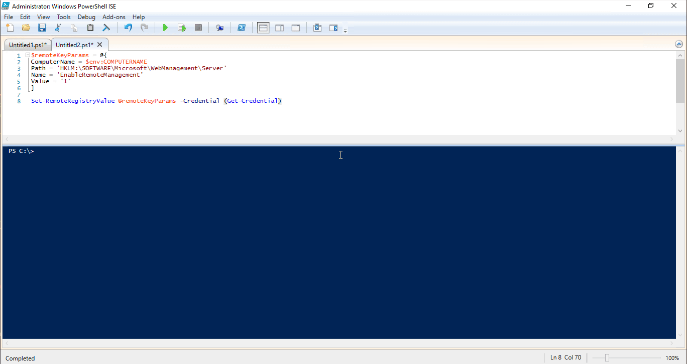
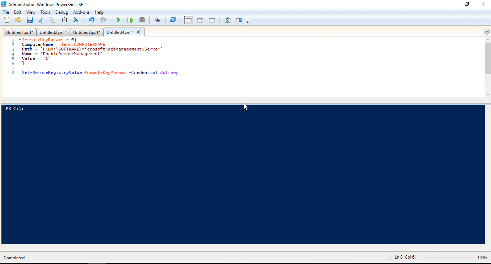

In this blog post, I'll show you how to add credential parameters to PowerShell functions. But before I do that let's first talk about why you'd want to add a credential parameter to your functions. The purpose of the credential parameter is to allow you to run the function and/or cmdlet as a different user, some account other than the one currently running the PowerShell session. The most common use is to run the function or cmdlet as an elevated user account. 

For example, the cmdlet `New-ADUser` has a `-Credential` parameter, which you could provide domain admin credentials in order to create an account in a domain. Assuming your normal account running the PowerShell session doesn't have that access already.

This blog post walks you through the process of adding such functionality to your PowerShell functions. I also discuss how to get around common issues when working with _legacy_ cmdlets that don't support a credential object, but before we get started let's first talk about PSCredential objects and how to generate them.

## Creating Credential Object

_PSCredential objects represent a set of security credentials, such as a user name and password._ [MSDN](https://msdn.microsoft.com/en-us/library/system.management.automation.pscredential(v=vs.85).aspx) The objects are then passed to the parameter of a function and used to execute the function as that user account in the credential object. There are a few ways that you can generate a credential object. The first and easiest method is by using the PowerShell cmdlet `Get-Credential`. You can simply execute `Get-Credential`, which will result in a username and password prompt. From there you could enter the _domainName\userName_ or you can call the cmdlet with some optional parameters.

To specify the domain name and username ahead of time you can use either the `-Credential` or `-UserName` parameters. The only difference I've noticed is when you use `-UserName` you'll also be required to input a message value. The code below demonstrates using the cmdlet. You can also store the credential object in a variable, which allows you to use the credential several times. In the example below, I'm storing each credential object to a variable called $Cred.

```powershell

$Cred = Get-Credential

$Cred = Get-Credential -Credential domain\user

$Cred = Get-Credential -UserName domain\user -Message 'Enter Password'

```

Sometimes, you won't want an interactive method of creating credential objects as I just demonstrated. Most automation tools such as Jenkins, TeamCity, and Octopus Deploy require a non-interactive method. To do this you'll have to create a secure string, which contains the password. You then have to pass the secure string and user name to the `System.Management.Automation`'s PSCredential method. Sounds a lot more complicated than it is, I assure you.


The syntax for creating a secure string looks like this `ConvertTo-SecureString “PlainTextPassword” -AsPlainText -Force`. Both the `-AsPlainText` and `-Force` parameters are required or you'll receive error messages saying you shouldn't pass plain text into a secure string. 

The reason being, if your PowerShell session is logged, that password would exist in the log. With the secure string created you'll need to pass it to the PSCredential method to create the credential object. That syntax looks like this `New-Object System.Management.Automation.PSCredential (“username”, $secpasswd)`. In the example below, I'm storing the secure string into a variable called $password and the credential object into a variable $Cred.

```powershell
$password = ConvertTo-SecureString “PlainTextPassword” -AsPlainText -Force

$Cred = New-Object System.Management.Automation.PSCredential (“username”, $password)
```

Now that you know how to create credential objects, it's now time to talk about how we add credential parameters to our PowerShell functions.

## Adding a Credential Parameter

Just like any other parameter, you start off by adding it in the param block of your function. I typically use the parameter name of $Credential because that's what existing PowerShell cmdlets use. 

With the parameter added, you then have to define its type, which you just learned is `[System.Management.Automation.PSCredential]`. Before we move on, take a moment to look at the code snippet below. It is for a function called Get-Something. It has two parameters, $Name and $Credential, which has the `[System.Management.Automation.PSCredential]` type.

```powershell
function Get-Something {
    param(
        $Name,
        [System.Management.Automation.PSCredential]$Credential      
    )
```

The code above would be enough to have a working credential parameter, however there are a few things you can add to make it more robust. 

The first thing you can add is `[ValidateNotNull()]`, which checks to see if the value being passed to `-Credential` is null. If it is, it will stop the function from executing. If you don't have proper credential input specified, why execute? 

The next thing you can add is `[System.Management.Automation.Credential()]`. This allows you to pass in a username as a string and have an interactive prompt for the password, which I'll demonstrate later in the post.

Lastly, you can do is set a default value for the $Credential parameter. Adding `[System.Management.Automation.PSCredential]::Empty` as a default value will populate an empty credential object. Why do this? Well, in your code you might be passing this $Credential object to existing PowerShell cmdlets that use the `-Credential` parameter. If you do not provide a credential object to your function, the code will error out when it hits the cmdlet inside your code that requires a credential. By providing a default empty credential object, you can resolve that error.

There are a few other methods for handling this problem. One is a simple if statement and another option are to use splatting. I'll walk through this later in the post. The snippet of code below shows what the function would now look like with all these changes.

> **TIP:** - Some cmdlets that accept a credential parameter do not support `[System.Management.Automation.PSCredential]::Empty` as they should. _See the [Dealing with Legacy Cmdlets](##Dealing-with-Legacy-Cmdlets) section for a workaround._

## Using Credential Parameters

In this next section of the post, I'm going to demonstrate how to use credential parameters. I'll be using a function called `Set-RemoteRegistryValue`, which is out of [The Pester Book](https://leanpub.com/the-pester-book). I've added the credential parameter by using the techniques you just learned above. Inside the `Set-RemoteRegistryValue` function, it uses Invoke-Command. I've updated it to use the `-Credential` parameter and then added the $Credential variable created by the function. This allows me to change the user who's running Invoke-Command.

Because I've included `[System.Management.Automation.PSCredential]::Empty` as the default value, it should work with no credentials being passed and with credentials being passed. So, let's test it out and see if it works as we expect. The `Set-RemoteRegistryValue` code is below if you'd like to follow along.

```powershell
function Set-RemoteRegistryValue {
    param(
        $ComputerName,
        $Path,
        $Name,
        $Value,
        [ValidateNotNull()]
        [System.Management.Automation.PSCredential]
        [System.Management.Automation.Credential()]
        $Credential = [System.Management.Automation.PSCredential]::Empty        
    )
        $null = Invoke-Command -ComputerName $ComputerName -ScriptBlock {
            Set-ItemProperty -Path $using:Path -Name $using:Name -Value $using:Value
        } -Credential $Credential
}
```

## With Credentials


The first way I can use the -Credential parameter of `Set-RemoteRegistryValue` is by using `Get-Credential` in `()` at run time. This will cause the `Get-credential` to run first just like a math problem. You'll then be prompted for a username and password. You could use the `-Credential` or `-Username` parameters of `Get-credential` to pre-populate the username and domain. If you're not familiar with a technique called splatting, that's how I'm passing the rest of the parameters to the `Set-RemoteRegistryValue` function. For more information about splatting, check out this [MSDN article](https://msdn.microsoft.com/en-us/powershell/reference/5.0/microsoft.powershell.core/about/about_splatting)

```powershell
$remoteKeyParams = @{
ComputerName = $env:COMPUTERNAME
Path = 'HKLM:\SOFTWARE\Microsoft\WebManagement\Server'
Name = 'EnableRemoteManagement'
Value = '1' 
}

Set-RemoteRegistryValue @remoteKeyParams -Credential (Get-Credential)
```



Having to use `(Get-Credential)` seems a little weird, doesn't it? 

Normally, when you run cmdlets that support the `-Credential` parameter you can just put in your username and it will automatically prompted for the password. 

Well, because we used `[System.Management.Automation.Credential()]` in the function, we can do that! Just remember to put the username as a string right after the `-Credential` parameter and you'll get prompted for your password.

```powershell
$remoteKeyParams = @{
ComputerName = $env:COMPUTERNAME
Path = 'HKLM:\SOFTWARE\Microsoft\WebManagement\Server'
Name = 'EnableRemoteManagement'
Value = '1' 
}

Set-RemoteRegistryValue @remoteKeyParams -Credential duffney
```




> **TIP:** - _If you're following allong you'll need to install a few windows features to create this registry value._ Run `Install-WindowsFeature Web-Server` and `Install-WindowsFeature web-mgmt-tools` if required.

## With Credentials in a variable

You can also populate a credential variable ahead of time and pass it to the `-Credential` parameter of `Set-RemoteRegistryValue` function. I use the following method a lot when working with continuous integration and continuous deployment tools such as Jenkins, TeamCity, and Octopus Deploy. 

I use the .Net method to create the credential object as well as use a secure string to pass in the password. You'll notice the password is in clear text when I create the secure string. All of the CI and CD tools I just mentioned have a secure method of populating that at run time so when using those tools, I replace the plain text password with a variable defined within the tool I'm using. 

For an example of that, check out Hodge's blog post [Automating with Jenkins and PowerShell on Windows - Part 2](https://hodgkins.io/automating-with-jenkins-and-powershell-on-windows-part-2).

```powershell
$password = ConvertTo-SecureString “P@ssw0rd” -AsPlainText -Force
$Cred = New-Object System.Management.Automation.PSCredential (“duffney”, $password)

$remoteKeyParams = @{
ComputerName = $env:COMPUTERNAME
Path = 'HKLM:\SOFTWARE\Microsoft\WebManagement\Server'
Name = 'EnableRemoteManagement'
Value = '1' 
}


Set-RemoteRegistryValue @remoteKeyParams -Credential $Cred
```

## Without Credentials


Since I added `[System.Management.Automation.PSCredential]::Empty` as the default value of the `-Credential` parameter, I can run the command without credentials as well. Remember, that not all cmdlets that have the `-Credential` parameter allow for this. Not to worry though, we can get around this limitation and I'll discuss how in the next section of the post.

```powershell
$remoteKeyParams = @{
ComputerName = $env:COMPUTERNAME
Path = 'HKLM:\SOFTWARE\Microsoft\WebManagement\Server'
Name = 'EnableRemoteManagement'
Value = '1' 
}

Set-RemoteRegistryValue @remoteKeyParams
```

## Dealing with Legacy Cmdlets {##Dealing-with-Legacy-Cmdlets}

Being in the tech industry, you'll never escape the need to support and/or deal with legacy applications. Working in PowerShell is no different and in this case, you'll eventually run into one or both of the following problems. 

A cmdlet doesn't support `[System.Management.Automation.PSCredential]::Empty`, which I've mentioned a few times. Or, the cmdlet you want to use doesn't even support the `-Credential` parameter at all and instead accepts a string username and string password! This section of the blog post is dedicated to helping you solve this problem. First, up is, what to do when a cmdlet doesn't support `[System.Management.Automation.PSCredential]::Empty`.

## Using If Else to Handle Empty Credentials

Before I dive into solving this problem, let me first expand on what the problem is. So, what does it mean when I say the cmdlet doesn't support `[System.Management.Automation.PSCredential]::Empty`? 

It means that when you do not provide a credential object, the function you wrote will fail because the cmdlet inside your function will fail as it's unable to accept the empty credential object. The function you wrote will work wonderfully as long as you supply a credential object, but as soon as you don't, no dice. So, how do we fix it? 

There are a few ways, the first is to check the `-Credential` parameter for a value with an if-else statement. The if statement checks the value of the $credential and adds the `-Credential` parameter to `Invoke-Command` only if it's not empty, otherwise it issues the `Invoke-Command` without the `-Credential` parameter.

```powershell
function Set-RemoteRegistryValue {
    param(
        $ComputerName,
        $Path,
        $Name,
        $Value,
        [ValidateNotNull()]
        [System.Management.Automation.PSCredential]
        [System.Management.Automation.Credential()]
        $Credential = [System.Management.Automation.PSCredential]::Empty        
    )

    if($Credential -ne [System.Management.Automation.PSCredential]::Empty) {
        Invoke-Command -ComputerName:$ComputerName -Credential:$Credential  {
            Set-ItemProperty -Path $using:Path -Name $using:Name -Value $using:Value
        }
    } else {
        Invoke-Command -ComputerName:$ComputerName {
            Set-ItemProperty -Path $using:Path -Name $using:Name -Value $using:Value
        }
    }
}
```

## Using Splatting to Handle Empty Credentials


Another way to address this problem is to use splatting. I still use an if statement to determine if $credential is empty or not, but the difference is I'm just adding a $credential object to a hash table, instead of repeating the entire block of code that uses `Invoke-Command`. 

To learn more about splatting inside functions, check out a previous blog post of mine [Splatting Parameters Inside Advanced Functions](http://duffney.io/Splatting-Parameters-Within-AdvancedFunctions). That wraps up dealing with cmdlets that don't support `[System.Management.Automation.PSCredential]::Empty`, so let’s move on to dealing with cmdlets that don't even have a `-Credential` parameter.

```powershell
function Set-RemoteRegistryValue {
    param(
        $ComputerName,
        $Path,
        $Name,
        $Value,
        [ValidateNotNull()]
        [System.Management.Automation.PSCredential]
        [System.Management.Automation.Credential()]
        $Credential = [System.Management.Automation.PSCredential]::Empty        
    )
        
        $Splat = @{
            ComputerName = $ComputerName
        }

        if ($Credential -ne [System.Management.Automation.PSCredential]::Empty) {
            $Splat['Credential'] = $Credential
        }
        
        $null = Invoke-Command -ScriptBlock {
            Set-ItemProperty -Path $using:Path -Name $using:Name -Value $using:Value
        } @splat
}
```

## Working with [string] Passwords


A good example of a cmdlet that accepts a string as a password is the `Invoke-Sqlcmd` cmdlet. Invoke-Sqlcmd is an extremely useful cmdlet that allows you to interact with SQL via PowerShell. I use it all the time within my code to perform simple SQL insert, update, and delete statements. The problem is, I don't want to pass a clear text password to my function in order to use Invoke-Sqlcmd. I want to pass a credential object like I would when using a modern and well-designed PowerShell cmdlet. 

To accomplish this I have to hydrate and dehydrate a credential object. Which is fancy talk for create a credential object and extract out the username and password from it. You've already learned how to create credential objects in this blog post so I won't cover that in much detail. However, I will step the process of extracting or _dehydrating_ the username and password from a credential object.

To demonstrate how to dehydrate a credential object, I've written a PowerShell function called `Get-AllSQLDatabases`. This function wraps around the `Invoke-Sqlcmd` cmdlet and queries a SQL server for all its databases. Notice that I have all the settings used before to add a credential parameter to my function. This allows me to pass in a credential object like I've been teaching you throughout this post. But, how is that going to work if `Invoke-Sqlcmd` doesn't support the `-Credential` object? 

Well, the username and password exist within the `$Credential` variable. So, all we have to do is extract it. The user name is easy to obtain, we can get that by calling out the UserName property of the $Credential variable. In the example below, I'm storing that into a variable called $UserName. To obtain the password you have to use the `GetNetworkCredential` method of the $Credential object. The syntax for that is `$Credential.GetNetworkCredential().Password`. I'm taking the output of that, which is the password as a string and storing it to a variable called $Password. Keep in mind these variables are only accessible inside the function.

Now, that I have a username and password variable stored as a string I can pass those to the `Invoke-Sqlcmd`. Instead of passing all the `Invoke-Sqlcmd` parameters and values on a single line, I chose to create a hash table and splat them to the cmdlet. I didn't need to create an extra $UserName and $Password variable in this example. I could of just put the code inside the hash table or directly to the `Invoke-Sqlcmd` parameters, but this makes it a little easier to see what's going on.

```powershell
function Get-AllSQLDatabases {
    param(
        $SQLServer,
        [ValidateNotNull()]
        [System.Management.Automation.PSCredential]
        [System.Management.Automation.Credential()]
        $Credential = [System.Management.Automation.PSCredential]::Empty          
    )
        
        $UserName = $Credential.UserName
        $Password = $Credential.GetNetworkCredential().Password   
        
        $splat = @{
            UserName = $UserName
            Password = $Password
            ServerInstance = 'SQLServer'
            Query = "Select * from Sys.Databases"
        }
        
        Invoke-Sqlcmd @splat
}

$Credential= New-Object -TypeName System.Management.Automation.PSCredential `
-ArgumentList 'duffney',('P@ssw0rd' | ConvertTo-SecureString -AsPlainText -Force)

Get-AllSQLDatabases -SQLServer SQL01 -Credential $Credential
```

## Continued Learning Credential Management

Creating and storing credential objects can be a pain. To help maintain your PowerShell credentials I recommend checking out the following PowerShell module and blog post.

[BetterCredentials](https://www.powershellgallery.com/packages/BetterCredentials/)


[Using Credentials in your Profile](https://beaudry.io/articles/2016-08/azure-profile)


_Other solutions_


[Azure Key Vault](https://azure.microsoft.com/en-us/services/key-vault/)


[Vault Project](https://www.vaultproject.io/)

## Sources

PowerShell.Org: [using-credential-param-as-optional](https://powershell.org/forums/topic/using-credential-param-as-optional/)

[powershell-how-to-create-a-pscredential-object](https://blogs.msdn.microsoft.com/koteshb/2010/02/12/powershell-how-to-create-a-pscredential-object/)


## Shout Out

I want to give a shout out to [Joel Bennett](https://twitter.com/Jaykul). He was kind enough to review this blog post and provide some really great technical insights. With his help,
I learned as much as you did, if not more. Teaching is the best way to learn after all. Thanks, Joel! 
