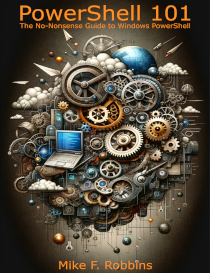

# Introduction

<table>
  <tr><td>
  
  </td>
  <td colspan=2>
  This content originally appeared in the book <em>PowerShell 101</em> by Mike F. Robbins. We thank
  Mike for granting us permission to reuse the content here. We edited the content for publication
  on this platform. You can still get the original book from Leanpub at
  <a href="https://leanpub.com/powershell101">PowerShell 101</a>.
  </td></tr>
</table>

## About this book

Before PowerShell, I began my career as an IT Pro, pointing and clicking in the GUI. I wrote this
book to save IT Pros from themselves by reducing the learning curve and helping them avoid being
reluctant to learn PowerShell.

Instead of a book that covers topics with fictitious scenarios, this book is a condensed version
targeting the specific topics that an IT Pro needs to know to succeed with PowerShell in a
real-world production environment. It's a collection of what I wish someone had told me when I
started learning PowerShell. I include tips, tricks, and best practices that I learned while using
PowerShell since 2007.

Each chapter includes a curated collection of links to specific help articles that expand on the
information covered. These resources expand on the concepts discussed and broaden your understanding
of PowerShell.

## Who is this book for?

This book is for anyone wanting to learn PowerShell. Whether you're a beginner or an experienced
user, this book helps you improve your PowerShell skills.

This book focuses on Windows PowerShell version 5.1 running on Windows 11 and Windows Server 2022 in
a Microsoft Active Directory domain environment. However, the basic concepts apply to all versions
of PowerShell running on any supported platform.

## Lab environment

The examples in this book were created and tested on Windows 11 and Windows Server 2022 operating
systems, using Windows PowerShell version 5.1. If you're running a different operating system or
version of PowerShell, your results might vary from the ones presented in this book.

## About the author

Mike F. Robbins, a former Microsoft MVP, is the lead technical writer for
[Azure PowerShell][azps-docs] at Microsoft. With extensive experience in PowerShell, he is a
scripting, automation, and efficiency expert. As a lifelong learner, Mike continuously strives to
improve his skills and empower others by sharing his knowledge and experience. He is also a
published author of several books, including:

- Author of [PowerShell 101: The No-Nonsense Guide to Windows PowerShell][powershell-101]
- Creator of [The PowerShell Conference Book][psconf-book]
- Coauthor of [Windows PowerShell TFM 4th Edition][tfm4]
- Contributing author in the [PowerShell Deep Dives][ps-deep-dives] book

When Mike's not writing documentation for Microsoft, he shares his thoughts and insights on his blog
at [mikefrobbins.com][mikefrobbins-com] and interacts with his followers on Twitter
[@mikefrobbins][mikefrobbins-x].

<!-- link references -->

[azps-docs]: /powershell/azure
[powershell-101]: https://leanpub.com/powershell101
[psconf-book]: https://leanpub.com/powershell-conference-book
[tfm4]: https://www.sapien.com/books_training/Windows-PowerShell-4
[ps-deep-dives]: https://www.manning.com/books/powershell-deep-dives
[mikefrobbins-com]: https://mikefrobbins.com/
[mikefrobbins-x]: https://twitter.com/mikefrobbins
