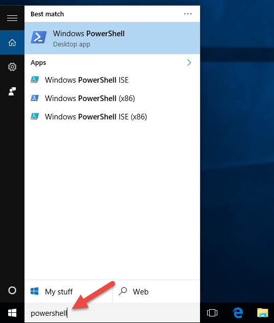
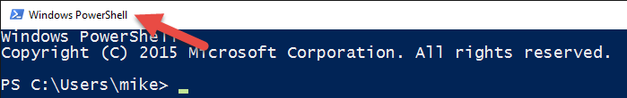
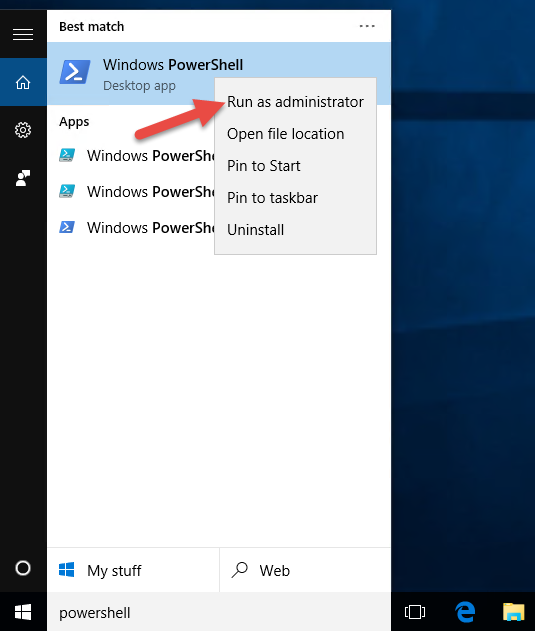
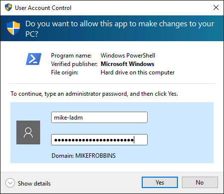
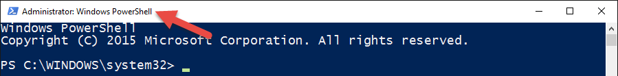
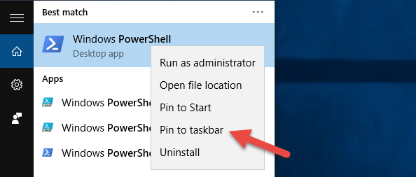
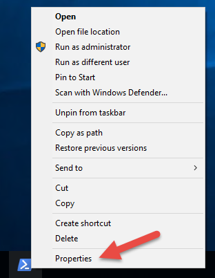
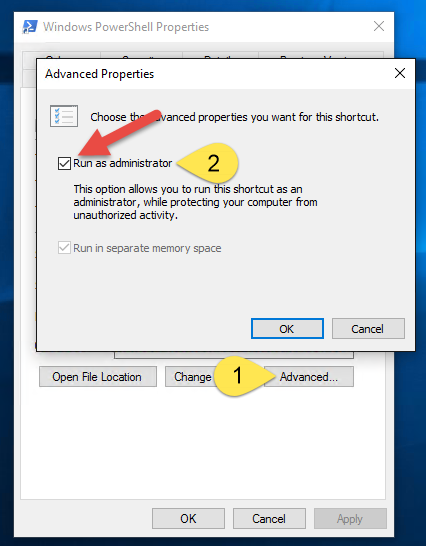

# Chapter 1 - Getting Started with PowerShell

I often find that presenters at conferences and user group meetings already have PowerShell running
when they start entry-level presentations. This book begins by answering the questions I've heard
attendees who haven't previously used PowerShell ask in those sessions.

Specifically, this chapter focuses on finding and launching PowerShell, and solving some of the
initial pain points that new users experience with PowerShell. Be sure to follow along and
walk through the examples shown in this chapter on your Windows 10 lab environment computer.

## What do I need to get started with PowerShell?

All modern versions of Windows operating systems ship with PowerShell installed. If you're running a version older than 5.1, you should install the latest version.

- To upgrade to Windows PowerShell 5.1, see [Upgrading existing Windows PowerShell][]
- To install the latest version of PowerShell, see [Installing PowerShell][]

## Where do I find PowerShell?

The easiest way to find PowerShell on Windows 10 is to type **PowerShell** into the search bar as
shown in Figure 1-1.



Notice that four different shortcuts for PowerShell are shown in Figure 1-1. The computer used for
demonstration purposes in this book is running the 64-bit version of Windows 10 so there's a 64-bit
version of the PowerShell console and the PowerShell ISE (Integrated Scripting Environment), and a
32-bit version of each one as denoted by the (x86) suffix on the shortcuts. If you happen to be
running a 32-bit version of Windows 10, you'll only have two shortcuts. Those items don't have the
(x86) suffix, but are 32-bit versions. If you have a 64-bit operating system, my recommendation is
to run the 64-bit version of PowerShell unless you have a specific reason for running the 32-bit
version.

For information about starting PowerShell on other versions of Windows, see
[Starting Windows PowerShell][].

## How do I launch PowerShell?

In the production enterprise environments that I support, I use three different Active Directory
user accounts. I've mirrored those accounts in the lab environment used in this book. I log into the
Windows 10 computer as a domain user who is not a domain or local administrator.

I've launched the PowerShell console by clicking on the "Windows PowerShell" shortcut as shown in
Figure 1-1.



Notice that the title bar of the PowerShell console says "Windows PowerShell" as shown in Figure
1-4. Some commands run fine, but PowerShell can't participate in User Access Control (UAC). That
means it's unable to prompt for elevation for tasks that require the approval of an administrator.
The following error message is generated:

```powershell
Get-Service -Name W32Time | Stop-Service
```

```Output
Stop-Service : Service 'Windows Time (W32Time)' cannot be stopped due to the following
error: Cannot open W32Time service on computer '.'.
At line:1 char:29
+ Get-Service -Name W32Time | Stop-Service
+
    + CategoryInfo          : CloseError: (System.ServiceProcess.ServiceController:ServiceController)
     [Stop-Service], ServiceCommandException
    + FullyQualifiedErrorId : CouldNotStopService,Microsoft.PowerShell.Commands.StopServiceCommand
```

The solution to this problem is to run PowerShell as a domain user who is a local administrator.
This is how my second domain user account is configured. Using the principal of least privilege,
this account should NOT be a domain administrator, or have any elevated privileges in the domain.

Close PowerShell. Relaunch the PowerShell console, except this time right-click on the **Windows
PowerShell** shortcut and select **Run as administrator** as shown in Figure 1-5.



If you're logged into Windows as a normal user, you'll be prompted for credentials. I'll enter the
credentials for my user account who is a domain user and local admin as shown in Figure 1-6.



Once PowerShell is relaunched as an administrator, the title bar should say "Administrator: Windows
PowerShell" as shown in Figure 1-7.



Now that PowerShell is being run elevated as a local administrator, UAC will no longer be a problem
when a command is run on the local computer that would normally require a prompt for elevation. Keep
in mind though that any command run from this elevated instance of the PowerShell console, also runs
elevated.

To simplify finding PowerShell and launching it as an administrator, I recommend pinning it to the
taskbar and setting it to automatically launch as an admin each time it's run.

Search for PowerShell again, except this time right-click on it and select "Pin to taskbar" as shown
in Figure 1-8.



Right-click on the PowerShell shortcut that's now pinned to the taskbar and select properties as
shown in Figure 1-9.



Click on "Advanced" as denoted by #1 in Figure 1-10, then check the "Run as administrator" checkbox
as denoted by #2 in Figure 1-10, and then click OK twice to accept the changes and exit out of both
dialog boxes.



You'll never have to worry about finding PowerShell or whether or not it's running as an
administrator again.

Running PowerShell elevated as an administrator to prevent having problems with UAC only impacts
commands that are run against the local computer. It has no effect on commands that target remote
computers.

## What version of PowerShell am I running?

There are a number of automatic variables in PowerShell that store state information. One of these
variables is `$PSVersionTable`, which contains a hashtable that can be used to display the relevant
PowerShell version information:

```powershell
$PSVersionTable
```

```Output
Name                           Value
----                           -----
PSVersion                      5.1.19041.1
PSEdition                      Desktop
PSCompatibleVersions           {1.0, 2.0, 3.0, 4.0...}
BuildVersion                   10.0.19041.1
CLRVersion                     4.0.30319.42000
WSManStackVersion              3.0
PSRemotingProtocolVersion      2.3
SerializationVersion           1.1.0.1
```

Newer versions of Windows PowerShell are distributed as part of the Windows Management Framework
(WMF). A specific version of the .NET Framework is required depending on the WMF version. To upgrade
to Windows PowerShell 5.1, see [Upgrading existing Windows PowerShell][].

## Execution Policy

Contrary to popular belief, the execution policy in PowerShell is not a security boundary. It's
designed to prevent a user from unknowingly running a script. A determined user can easily bypass
the execution policy in PowerShell. Table 1-2 shows the default execution policy for current
Windows operating systems.

| Windows Operating System Version | Default Execution Policy |
| -------------------------------- | ------------------------ |
| Server 2019                      | Remote Signed            |
| Server 2016                      | Remote Signed            |
| Windows 10                       | Restricted               |

Regardless of the execution policy setting, any PowerShell command can be run interactively. The
execution policy only affects commands running in a script. The `Get-ExecutionPolicy` cmdlet is used
to determine what the current execution policy setting is and the `Set-ExecutionPolicy` cmdlet is
used to change the execution policy. My recommendation is to use the **RemoteSigned** policy, which
requires downloaded scripts to be signed by a trusted publisher in order to be run.

Check the current execution policy:

```powershell
Get-ExecutionPolicy
```

```Output
Restricted
```

PowerShell scripts can't be run at all when the execution policy is set to **Restricted**. This is
the default setting on all Windows client operating systems. To demonstrate the problem, save the
following code as a `.ps1` file named `Stop-TimeService.ps1`.

```powershell
Get-Service -Name W32Time | Stop-Service -PassThru
```

That command runs interactively without error as long as PowerShell is run elevated as an
administrator. But as soon as it's saved as a script file and you try to execute the script, it
generates an error:

```powershell
.\Stop-TimeService.ps1
```

```Output
.\Stop-TimeService.ps1 : File C:\demo\Stop-TimeService.ps1 cannot be loaded because
running scripts is disabled on this system. For more information, see
about_Execution_Policies at http://go.microsoft.com/fwlink/?LinkID=135170.
At line:1 char:1
+ .\Stop-TimeService.ps1
+
    + CategoryInfo          : SecurityError: (:) [], PSSecurityException
    + FullyQualifiedErrorId : UnauthorizedAccess
```

Notice that the error shown in the previous set of results tells you exactly what the problem is
(running scripts is disabled on this system). When you run a command in PowerShell that generates an
error message, be sure to read the error message instead of just rerunning the command and hoping
that it runs successfully.

Change the PowerShell execution policy to remote signed.

```powershell
Set-ExecutionPolicy -ExecutionPolicy RemoteSigned
```

```Output
Execution Policy Change
The execution policy helps protect you from scripts that you do not trust. Changing the execution
policy might expose you to the security risks described in the about_Execution_Policies help topic
at http://go.microsoft.com/fwlink/?LinkID=135170. Do you want to change the execution policy?
[Y] Yes [A] Yes to All [N] No [L] No to All [S] Suspend [?] Help (default is "N"):y
```

Be sure to read the warning that's displayed when changing the execution policy. I also recommend
taking a look at the [about_Execution_Policies][] help topic to make sure you understand the
security implications of changing the execution policy.

Now that the execution policy has been set to **RemoteSigned**, the `Stop-TimeService.ps1` script
runs error free.

```powershell
.\Stop-TimeService.ps1
```

```Output
Status   Name               DisplayName
------   ----               -----------
Stopped  W32Time            Windows Time
```

Be sure to start your Windows Time service before continuing otherwise you may run into unforeseen
problems.

```powershell
Start-Service -Name w32time
```

## Summary

In this chapter, you've learned how to find and launch PowerShell, and how to create a shortcut that
launches PowerShell as an administrator. You've also learned about the default execution policy and
how to change it.

## Review

1. How do you determine what PowerShell version a computer is running?
1. Why is it important to launch PowerShell elevated as an administrator?
1. How do you determine the current PowerShell execution policy?
1. What does the default PowerShell execution policy on Windows client computers prevent from
   occurring?
1. How do you change the PowerShell execution policy?

## Recommended Reading

For those who want to know more information about the topics covered in this chapter, I recommend
reading the following PowerShell help topics.

- [about_Automatic_Variables][]
- [about_Hash_Tables][]
- [about_Execution_Policies][]

In the next chapter, you'll learn about the discoverability of commands in PowerShell. One of the
things that will be covered is how to update PowerShell so those help topics can be viewed right
from within PowerShell instead of having to view them on the internet.

<!-- link references -->
[about_Automatic_Variables]: /powershell/module/microsoft.powershell.core/about/about_automatic_variables
[about_Hash_Tables]: /powershell/module/microsoft.powershell.core/about/about_hash_tables
[about_Execution_Policies]: /powershell/module/microsoft.powershell.core/about/about_execution_policies
[Upgrading existing Windows PowerShell]: /powershell/scripting/windows-powershell/install/installing-windows-powershell#upgrading-existing-windows-powershell
[Installing PowerShell]: /powershell/scripting/install/installing-powershell
[Starting Windows PowerShell]: /powershell/scripting/windows-powershell/starting-windows-powershell
