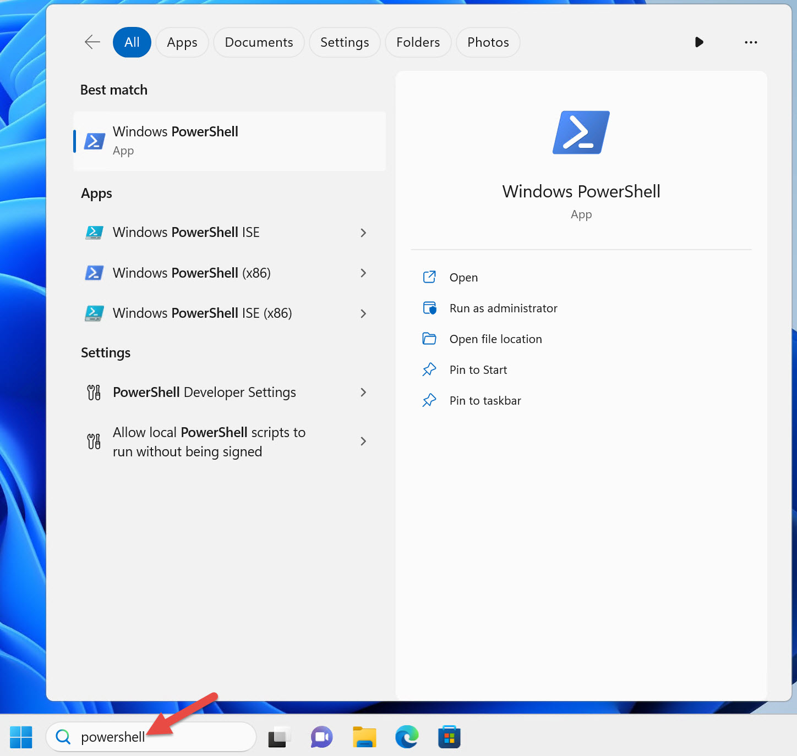
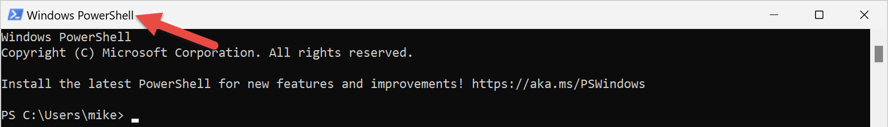
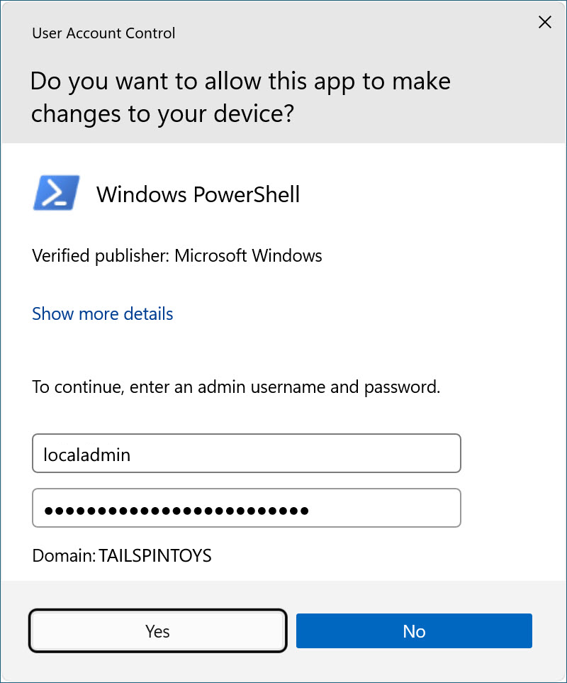

# Chapter 1 - Getting started with PowerShell

This chapter focuses on finding and launching PowerShell and solving the initial pain points that
new users experience with PowerShell. Follow along and walk through the examples in this chapter on
your lab environment computer.

## What is PowerShell?

Windows PowerShell is an easy-to-use command-line shell and scripting environment for automating
administrative tasks of Windows-based systems. Windows PowerShell is preinstalled on all modern
versions of the Windows operating system.

## Where to find PowerShell

The easiest way to find PowerShell on Windows 11 is to type `PowerShell` into the search bar, as
shown in Figure 1-1. Notice that there are four different shortcuts for Windows PowerShell.



Windows PowerShell shortcuts on a 64-bit version of Windows:

- Windows PowerShell
- Windows PowerShell ISE
- Windows PowerShell (x86)
- Windows PowerShell ISE (x86)

On a 64-bit version of Windows, you have a 64-bit version of the Windows PowerShell console and the
Windows PowerShell Integrated Scripting Environment (ISE) and a 32-bit version of each one, as
indicated by the (x86) suffix on the shortcuts.

> [!NOTE]
> Windows 11 only ships as a 64-bit operating system. There is no 32-bit version of Windows 11.
> However, Windows 11 includes 32-bit versions of Windows PowerShell and the Windows PowerShell ISE.

You only have two shortcuts if you're running an older 32-bit version of Windows. Those shortcuts
don't have the (x86) suffix but are 32-bit versions.

I recommend using the 64-bit version of Windows PowerShell if you're running a 64-bit operating
system unless you have a specific reason for using the 32-bit version.

Depending on what version of Windows 11 you're running, Windows PowerShell might open in
[Windows Terminal][windows-terminal].

Microsoft no longer updates the PowerShell ISE. The ISE only works with Windows PowerShell 5.1.
[Visual Studio Code][vs-code] (VS Code) with the [PowerShell extension][ps-ext] works with both
versions of PowerShell. VS Code and the PowerShell extension don't ship in Windows. Install VS Code
and the extension on the computer where you create PowerShell scripts. You don't need to install
them on all the computers where you run PowerShell.

## How to launch PowerShell

I use three different Active Directory user accounts in the production environments I support. I
mirrored those accounts in the lab environment used in this book. I sign into my Windows 11 computer
as a domain user without domain or local administrator rights.

Launch the PowerShell console by clicking the **Windows PowerShell** shortcut, as shown in Figure
1-1. Notice that the title bar of the console says **Windows PowerShell**, as shown in Figure 1-2.



Some commands run fine when you run PowerShell as an ordinary user. However, PowerShell doesn't
participate in [User Access Control (UAC)][uac]. That means it's unable to prompt for elevation for
tasks that require the approval of an administrator.

> [!NOTE]
> UAC is a Windows security feature that helps prevent malicious code from running with elevated
> privileges.

When signed on as an ordinary user, PowerShell returns an error when you run a command that requires
elevation. For example, stopping a Windows service:

```powershell
Stop-Service -Name W32Time
```

```Output
Stop-Service : Service 'Windows Time (W32Time)' cannot be stopped due to
the following error: Cannot open W32Time service on computer '.'.
At line:1 char:1
+ Stop-Service -Name W32Time
+ ~~~~~~~~~~~~~~~~~~~~~~~~~~
    + CategoryInfo          : CloseError: (System.ServiceProcess.ServiceCon
   troller:ServiceController) [Stop-Service], ServiceCommandException
    + FullyQualifiedErrorId : CouldNotStopService,Microsoft.PowerShell.Comm
   ands.StopServiceCommand
```

The solution is to run PowerShell elevated as a user who is a local administrator. That's how I
configured my second domain user account. Following the principle of least privilege, this account
shouldn't be a domain administrator or have any elevated privileges in the domain.

To start PowerShell with elevated rights, right-click the **Windows PowerShell** shortcut and select
**Run as administrator**, as shown in Figure 1-3.


Windows prompts you for credentials because you logged into Windows as an ordinary user. Enter the
credentials of your domain user who is a local administrator, as shown in Figure 1-4.



Notice that the title bar of the elevated console windows says **Administrator: Windows
PowerShell**, as shown in Figure 1-5.


Now that you're running PowerShell elevated as an administrator, UAC is no longer a problem when you
run a command that requires elevation.

> [!IMPORTANT]
> You should only run PowerShell elevated as an administrator when absolutely necessary.

When you target remote computers, there's no need to run PowerShell elevated. Running PowerShell
elevated only affects commands that run against your local computer.

You can simplify finding and launching PowerShell. Pin the PowerShell or Windows Terminal shortcut
to your taskbar. Search for PowerShell again, except this time right-click on it and select **Pin to
taskbar** as shown in Figure 1-6.


> [!IMPORTANT]
> The original version of this book, published in 2017, recommended pinning a shortcut to the
> taskbar to launch an elevated instance automatically every time you start PowerShell. However, due
> to potential security concerns, I no longer recommend it. Any applications you launch from an
> elevated instance of PowerShell also bypass UAC and run elevated. For example, if you launch a web
> browser from an elevated instance of PowerShell, any website you visit containing malicious code
> also runs elevated.

When you need to run PowerShell with elevated permissions, right-click the PowerShell shortcut
pinned to your taskbar while pressing <kbd>Shift</kbd>. Select **Run as administrator**, as shown in
Figure 1-7.


## Determine your version of PowerShell

There are automatic variables in PowerShell that store state information. One of these variables is
`$PSVersionTable`, which contains version information about your PowerShell session.

```powershell
$PSVersionTable
```

```Output
Name                           Value
----                           -----
PSVersion                      5.1.22621.2428
PSEdition                      Desktop
PSCompatibleVersions           {1.0, 2.0, 3.0, 4.0...}
BuildVersion                   10.0.22621.2428
CLRVersion                     4.0.30319.42000
WSManStackVersion              3.0
PSRemotingProtocolVersion      2.3
SerializationVersion           1.1.0.1
```

If you're running a version of Windows PowerShell older than 5.1, you should update your version of
Windows. Windows PowerShell 5.1 is preinstalled on the currently supported versions of Windows.

PowerShell version 7 isn't a replacement for Windows PowerShell 5.1; it installs side-by-side with
Windows PowerShell. Windows PowerShell version 5.1 and PowerShell version 7 are two different
products. For more information about the differences between Windows PowerShell version 5.1 and
PowerShell version 7, see [Migrating from Windows PowerShell 5.1 to PowerShell 7][migrate-ps].

> [!TIP]
> PowerShell version 6, formerly known as PowerShell Core, is no longer supported.

## Execution policy

PowerShell execution policy controls the conditions under which you can run PowerShell scripts. The
execution policy in PowerShell is a safety feature designed to help prevent the unintentional
execution of malicious scripts. However, it's not a security boundary because it can't stop
determined users from deliberately running scripts. A determined user can bypass the execution
policy in PowerShell.

You can set an execution policy for the local computer, current user, or a PowerShell session. You
can also set execution policies for users and computers with Group Policy.

The following table shows the default execution policy for current Windows operating systems.

| Windows Operating System Version | Default Execution Policy |
| -------------------------------- | ------------------------ |
| Windows Server 2022              | Remote Signed            |
| Windows Server 2019              | Remote Signed            |
| Windows Server 2016              | Remote Signed            |
| Windows 11                       | Restricted               |
| Windows 10                       | Restricted               |

Regardless of the execution policy setting, you can run any PowerShell command interactively. The
execution policy only affects commands running in a script. Use the `Get-ExecutionPolicy` cmdlet to
determine the current execution policy setting.

Check the execution policy setting on your computer.

```powershell
Get-ExecutionPolicy
```

```Output
Restricted
```

List the execution policy settings for all scopes.

```powershell
Get-ExecutionPolicy -List
```

```Output
        Scope ExecutionPolicy
        ----- ---------------
MachinePolicy       Undefined
   UserPolicy       Undefined
      Process       Undefined
  CurrentUser       Undefined
 LocalMachine       Undefined
```

All Windows client operating systems have the default execution policy setting of `Restricted`. You
can't run PowerShell scripts using the `Restricted` execution policy setting. To test the execution
policy, save the following code as a `.ps1` file named `Get-TimeService.ps1`.

> [!TIP]
> A PowerShell script is a plaintext file that contains the commands you want to run. PowerShell
> script files use the `.ps1` file extension. To create a PowerShell script, use a code editor like
> Visual Studio Code (VS Code) or any text editor such as Notepad.

When you run the following command interactively, it completes without error.

```powershell
Get-Service -Name W32Time
```

However, PowerShell returns an error when you run the same command from a script.

```powershell
.\Get-TimeService.ps1
```

```Output
.\Get-TimeService.ps1 : File C:\tmp\Get-TimeService.ps1 cannot be loaded
because running scripts is disabled on this system. For more information,
see about_Execution_Policies at
https:/go.microsoft.com/fwlink/?LinkID=135170.
At line:1 char:1
+ .\Get-TimeService.ps1
+ ~~~~~~~~~~~~~~~~~~~~~
    + CategoryInfo          : SecurityError: (:) [], PSSecurityException
    + FullyQualifiedErrorId : UnauthorizedAccess
```

When you run a command in PowerShell that generates an error, read the error message before retrying
the command. Notice the error message tells you why the command failed:

> _... running scripts is disabled on this system._

To enable the execution of scripts, change the execution policy with the `Set-ExecutionPolicy`
cmdlet. `LocalMachine` is the default scope when you don't specify the **Scope** parameter. You must
run PowerShell elevated as an administrator to change the execution policy for the local machine.
Unless you're signing your scripts, I recommend using the `RemoteSigned` execution policy.
`RemoteSigned` prevents you from running downloaded scripts that aren't signed by a trusted
publisher.

Before you change the execution policy, read the [about_Execution_Policies][execution-policies] help
article to understand the security implications.

Change the execution policy setting on your computer to `RemoteSigned`.

```powershell
Set-ExecutionPolicy -ExecutionPolicy RemoteSigned
```

If you have successfully changed the execution policy, PowerShell displays the following warning:

```Output
Execution Policy Change
The execution policy helps protect you from scripts that you do not trust.
Changing the execution policy might expose you to the security risks
described in the about_Execution_Policies help topic at
https:/go.microsoft.com/fwlink/?LinkID=135170. Do you want to change the
execution policy?
[Y] Yes  [A] Yes to All  [N] No  [L] No to All  [S] Suspend  [?] Help
(default is "N"):y
```

If you're not running PowerShell elevated as an administrator, PowerShell returns the following
error message:

```Output
Set-ExecutionPolicy : Access to the registry key 'HKEY_LOCAL_MACHINE\SOFTWAR
E\Microsoft\PowerShell\1\ShellIds\Microsoft.PowerShell' is denied. To
change the execution policy for the default (LocalMachine) scope, start
Windows PowerShell with the "Run as administrator" option. To change the
execution policy for the current user, run "Set-ExecutionPolicy -Scope
CurrentUser".
At line:1 char:1
+ Set-ExecutionPolicy -ExecutionPolicy RemoteSigned
+ ~~~~~~~~~~~~~~~~~~~~~~~~~~~~~~~~~~~~~~~~~~~~~~~~~
    + CategoryInfo          : PermissionDenied: (:) [Set-ExecutionPolicy],
   UnauthorizedAccessException
    + FullyQualifiedErrorId : System.UnauthorizedAccessException,Microsoft.
   PowerShell.Commands.SetExecutionPolicyCommand
```

It's also possible to change the execution policy for the current user without requiring you to run
PowerShell elevated as an administrator. This step is unnecessary if you successfully set the
execution policy for the local machine to `RemoteSigned`.

```powershell
Set-ExecutionPolicy -ExecutionPolicy RemoteSigned -Scope CurrentUser
```

With the execution policy set to `RemoteSigned`, the `Get-TimeService.ps1` script runs successfully.

```powershell
.\Get-TimeService.ps1
```

```Output
Status   Name               DisplayName
------   ----               -----------
Running  W32Time            Windows Time
```

## Summary

In this chapter, you learned where to find and how to launch PowerShell. You also learned how to
determine the version of PowerShell and the purpose of execution policies.

## Review

1. How do you determine what PowerShell version a computer is running?
1. When should you launch PowerShell elevated as an administrator?
1. What's the default execution policy on Windows client computers, and what does it prevent you
   from doing?
1. How do you determine the current PowerShell execution policy setting?
1. How do you change the PowerShell execution policy?

## References

To learn more about the concepts covered in this chapter, read the following PowerShell help
articles.

- [about_Automatic_Variables][auto-variables]
- [about_Execution_Policies][execution-policies]

## Next steps

In the next chapter, you'll learn about the discoverability of commands in PowerShell. You'll also
learn how to download PowerShell's help files so you can view the help in your PowerShell session.

<!-- link references -->

[windows-terminal]: /windows/terminal/
[vs-code]: https://code.visualstudio.com/
[ps-ext]: https://code.visualstudio.com/docs/languages/powershell
[uac]: /windows/security/application-security/application-control/user-account-control/
[migrate-ps]: /powershell/scripting/whats-new/migrating-from-windows-powershell-51-to-powershell-7
[execution-policies]: /powershell/module/microsoft.powershell.core/about/about_execution_policies
[auto-variables]: /powershell/module/microsoft.powershell.core/about/about_automatic_variables
