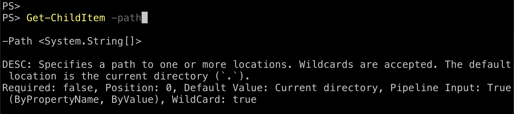
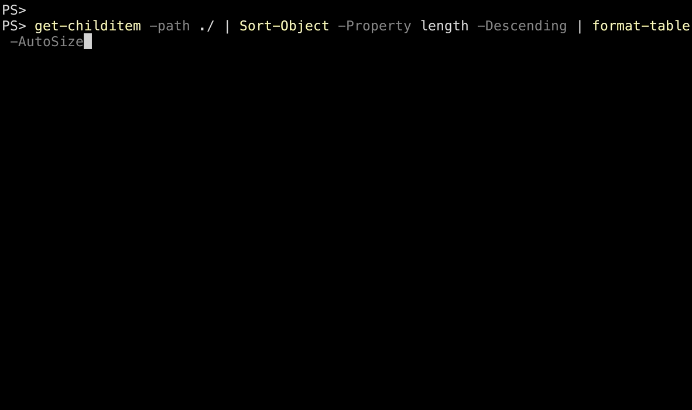

# Using dynamic help

Dynamic Help provides just-in-time help that allows you to stay focused on your work losing your
place typing on the command line.

## Getting cmdlet help

Dynamic Help provides a view of full cmdlet help shown in an alternative screen buffer.
**PSReadLine** maps the function `ShowCommandHelp` to the <kbd>F1</kbd>key.

- When the cursor is at the end of a fully expanded cmdlet name, pressing <kbd>F1</kbd>displays the
  help for that cmdlet.
- When the cursor is at the end of a fully expanded parameter name, pressing <kbd>F1</kbd>displays
  the help for the cmdlet beginning at the parameter.


The pager in **PSReadLine** allows you to scroll the displayed help using the up and down arrow
keys. Pressing <kbd>Q</kbd> exits the alternative screen buffer and returns to the current cursor
position on the command line on the primary screen.

## Focused parameter help

Pressing <kbd>Alt</kbd>-<kbd>h</kbd> provides dynamic help for parameters. The help is shown below
the current command line similar to `MenuComplete`. The cursor must be at the end of the fully
expanded parameter name when you press the <kbd>Alt</kbd>-<kbd>h</kbd> key.



## Selection of arguments

To quickly select and edit the arguments of a cmdlet without disturbing your syntax using
<kbd>Alt</kbd>-<kbd>a</kbd>. Based on the cursor position, it searches from the current cursor
position and stops when it finds any arguments on the command line.



## Keybindings for macOS

Not all keybindings work for all operating systems. The <kbd>Alt</kbd> key bindings don't work on
macOS. Mac users can map help functions to an available key combination. For example:

```powershell
Set-PSReadLineKeyHandler -chord "Ctrl+l" -Function ShowParameterHelp
Set-PSReadLineKeyHandler -Chord "Ctrl+k" -Function SelectCommandArgument
```
