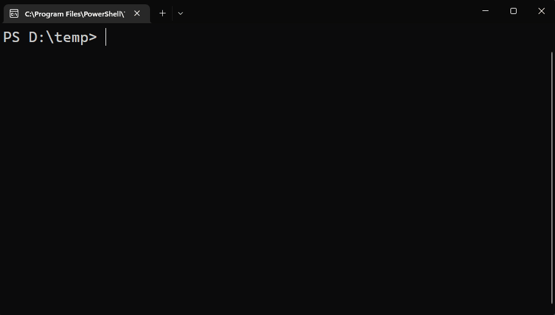

# Using tab-completion in the shell

PowerShell provides completions on input to provide hints, enable discovery, and speed up input
entry. Command names, parameter names, argument values and file paths can all be completed by
pressing the <kbd>Tab</kbd> key.

The <kbd>Tab</kbd> key is the default key binding on Windows. **PSReadLine** also provides a
`MenuComplete` function that's bound to <kbd>Ctrl</kbd>+<kbd>Space</kbd>. The `MenuComplete`
function displays a list of matching completions below the command line.

These keybindings can be changed using **PSReadLine** cmdlets or the application that's hosting
PowerShell. Keybindings can be different on non-Windows platforms. For more information, see
[about_PSReadLine_Functions][PSRFunctions].

## Built-in tab completion features

PowerShell has enabled tab completion for many aspects of the command line experience.

### Filename completion

To fill in a filename or path from the available choices automatically, type part of the name and
press the <kbd>Tab</kbd> key. PowerShell automatically expands the name to the first match that it
finds. Pressing the <kbd>Tab</kbd> key again cycles through all the available choices with each key
press.

### Command and parameter name completion

The tab expansion of cmdlet names is slightly different. To use tab expansion on a cmdlet name, type
the entire first part of the name (the verb) and the hyphen that follows it. You can fill in more of
the name for a partial match. For example, if you type `get-co` and then press the <kbd>Tab</kbd>
key, PowerShell automatically expands this to the `Get-Command` cmdlet (notice that it also changes
the case of letters to their standard form). If you press <kbd>Tab</kbd> key again, PowerShell
replaces this with the only other matching cmdlet name, `Get-Content`. Tab completion also works to
resolve PowerShell aliases and native executables.

The following graphic shows examples of tab and menu completion.

### Other tab completion enhancements

Each new version of PowerShell includes improvements to tab completion that fix bugs and improve
usability.

PowerShell 7.0

- Tab completion resolves variable assignments that are enums or are type constrained
- Tab completion expands abbreviated cmdlets and functions. For example, `i-psdf<tab>` returns
  `Import-PowerShellDataFile`

PowerShell 7.2

- Fix tab completion for unlocalized `about*` topics
- Fix splatting being treated as positional parameter in completions
- Add completions for Comment-based Help keywords
- Add completion for `#requires` statements
- Add tab completion for **View** parameter of `Format-*` cmdlets
- Add support for class-based argument completers

PowerShell 7.3

- Fix tab completion within the script block specified for the `ValidateScriptAttribute`
- Added tab completion for loop labels after `break` and `continue`
- Improve Hashtable completion in multiple scenarios
  - Parameter splatting
  - **Arguments** parameter for `Invoke-CimMethod`
  - **FilterHashtable** parameter for `Get-WinEvent`
  - **Property** parameter for the CIM cmdlets
  - Removes duplicates from member completion scenarios
- Support forward slashes in network share (UNC path) completion
- Improve member auto completion
- Prioritize `ValidateSet` completions over enums for parameters
- Add type inference support for generic methods with type parameters
- Improve type inference and completions
  - Allows methods to be shown in completion results for `ForEach-Object -MemberName`
  - Prevents completion on expressions that return **void** like (`[void]("")`)
  - Allows non-default Class constructors to show up when class completion is based on the AST

## Other ways to enhance tab completion of command parameters

Built-in tab expansion is controlled by the internal function **TabExpansion** or **TabExpansion2**.
It's possible to create functions or modules that replace the default behavior of these functions.
You can find examples in the PowerShell Gallery by searching for the [TabExpansion][TabExpansion]
keyword.

### Using the `ValidateSet` or `ArgumentCompletions` attributes with parameters

The `ArgumentCompletions` attribute allows you to add tab completion values to a specific parameter.
The `ArgumentCompletions` attribute is similar to `ValidateSet`. Both attributes takes a list of
values to be presented when the user presses <kbd>Tab</kbd> after the parameter name. However,
unlike `ValidateSet`, the values aren't validated.

For more information, see:

- [ArgumentCompletions][ArgumentCompletions]
- [ValidateSet][ValidateSet]

### Using the `ArgumentCompleter` attribute or `Register-ArgumentCompleter` with parameters

An argument completer is a script block or function that provides dynamic tab completion for
parameter values.

The `ArgumentCompleter` attribute allows you to register a function that provides tab completion
values to for the parameter. The argument completer function must be available to the function
containing the parameter with the `ArgumentCompleter` attribute. Usually, the function is defined in
the same script or module.

For more information, see [ArgumentCompleter][ArgumentCompleter].

The `Register-ArgumentCompleter` cmdlet registers a script block as an argument completer function
at run time for any command you specify. This allows you to define argument completers outside of
the script or module or for native commands. For more information, see
[Register-ArgumentCompleter][Register-ArgumentCompleter].

## Predictive IntelliSense in PSReadLine

PSReadLine 2.1.0 introduced the **Predictive IntelliSense** feature. Predictive IntelliSense
provides suggestions for full commands based on items from your **PSReadLine** history.

PSReadLine 2.2.2 extends the power of Predictive IntelliSense by adding support for plug-in modules
that use advanced logic to provide suggestions for full commands. The **Az.Tools.Predictor** module
was the first plug-in for Predictive IntelliSense. It uses Machine Learning to predict what Azure
PowerShell command you want to run and the parameters you want to use.

For more information, see [Using predictors](using-predictors.md).

<!-- link references -->
[ArgumentCompleter]: /powershell/module/microsoft.powershell.core/about/about_functions_argument_completion#argumentcompleter-attribute
[ArgumentCompletions]: /powershell/module/microsoft.powershell.core/about/about_functions_advanced_parameters#argumentcompletions-attribute
[PSRFunctions]: /powershell/module/psreadline/about/about_psreadline_functions#completion-functions
[Register-ArgumentCompleter]: xref:Microsoft.PowerShell.Core.Register-ArgumentCompleter
[TabExpansion]: https://www.powershellgallery.com/packages?q=tabexpansion
[ValidateSet]: /powershell/module/microsoft.powershell.core/about/about_functions_advanced_parameters#validateset-attribute
