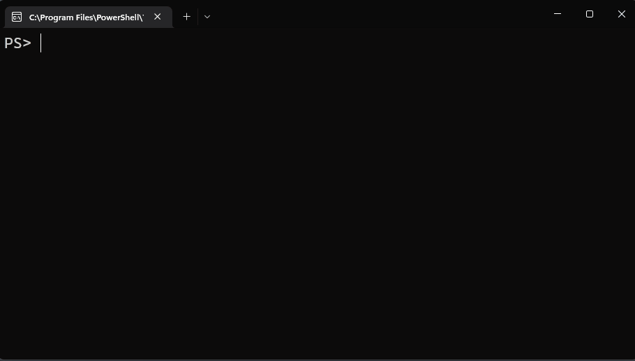

# Using predictors in PSReadLine

**PSReadLine** 2.1.0 introduced the **Predictive IntelliSense** feature. Predictive IntelliSense
provides suggestions for full commands based on items from your **PSReadLine** history.
**PSReadLine** 2.2.2 extends the power of Predictive IntelliSense by adding support for plug-in
modules that use advanced logic to provide suggestions for full commands. The latest version,
**PSReadLine** 2.2.6, enables predictions by default.

## Using Predictive IntelliSense

When Predictive IntelliSense is enabled, the prediction suggestion appears as colored text following
the user's cursor. The suggestions from Predictive IntelliSense help new and experienced users of
PowerShell discover, edit, and execute full commands based on matching predictions. Suggestions can
come from the user's history and additional domain specific plugins.


The previous images shows the default `InlineView` of the suggestion. Pressing <kbd>RightArrow</kbd>
key accepts an inline suggestion. After accepting the suggestion, you can edit the command line
before hitting <kbd>Enter</kbd> to run the command.

**PSReadLine** also offers a `ListView` presentation of the suggestions.


When in the list view, you can use the arrow keys to scroll through the available suggestions. List
view also shows the source of the prediction.

**PSReadLine** defaults to `InlineView`. You can switch between `InlineView` and `ListView` by
pressing the <kbd>F2</kbd> key. You can also use the **PredictionViewStyle** parameter of
`Set-PSReadLineOption` to change the view.

## Managing Predictive IntelliSense

To use Predictive IntelliSense you must have a newer version of **PSReadLine** installed. For best
results, install the latest version of the module.

To install **PSReadLine** using **PowerShellGet**:

```powershell
Install-Module -Name PSReadLine
```

Or install using the new [PowerShellGet v3][PSGetv3] module:

```powershell
Install-PSResource -Name PSReadLine
```

**PSReadLine** can be installed in Windows PowerShell 5.1 or in PowerShell 7 or higher. To use
predictor plug-ins you must be running in PowerShell 7.2 or higher. Windows PowerShell 5.1 can use
the history-based predictor.

In **PSReadLine** 2.2.6, Predictive IntelliSense is enabled by default depending on the following
conditions:

- If Virtual Terminal (VT) is supported and **PSReadLine** running in PowerShell 7.2 or higher,
  **PredictionSource** is set to `HistoryAndPlugin`
- If VT is supported and **PSReadLine** running in PowerShell older than 7.2, **PredictionSource**
  is set to `History`
- If VT isn't supported, **PredictionSource** is set to `None`.

Use the following command to see the current setting:

```powershell
Get-PSReadLineOption | Select-Object -Property PredictionSource
```

You can change the prediction source using the `Set-PSReadLineOption` cmdlet with the
**PredictionSource** parameter. The **PredictionSource** can be set to:

- `None`
- `History`
- `Plugin`
- `HistoryAndPlugin`

> [!NOTE]
> History-based predictions come from the history maintained by **PSReadLine**. That history is more
> comprehensive than the session-based history you can see using `Get-History`. For more
> information, see **Command history** section of [about_PSReadLine][psr-history].

### Setting the prediction color

By default, predictions appear in light grey text on the same line the user is typing. To support
accessibility needs, you can customize the prediction color. Colors are defined using ANSI escape
sequences. You can use `$PSStyle` to compose ANSI escape sequences.

```powershell
Set-PSReadLineOption -Colors @{ InlinePrediction = $PSStyle.Background.Blue }
```

Or you can create your own. The default light-grey prediction text color can be restored using the
following ANSI escape sequence.

```powershell
Set-PSReadLineOption -Colors @{ InlinePrediction = "`e[38;5;238m" }
```

For more information about setting prediction color and other PSReadLine settings, see
[Set-PSReadLineOption][Set-PSReadLineOption].

### Changing keybindings

PSReadLine contains functions to navigate and accept predictions. For example:

- `AcceptSuggestion` - Accept the current inline suggestion
- `AcceptNextSuggestionWord` - Accept the next word of the inline suggestion
- `AcceptSuggestion` is built within `ForwardChar`, which is bound to
  <kbd>RightArrow</kbd> by default
- `AcceptNextSuggestionWord` is built within the function `ForwardWord`, which can be bound to
  <kbd>Ctrl</kbd>+<kbd>f</kbd>

You can use the `Set-PSReadLineKeyHandler` cmdlet to change key bindings.

```powershell
Set-PSReadLineKeyHandler -Chord "Ctrl+f" -Function ForwardWord
```

With this binding, pressing <kbd>Ctrl</kbd>+<kbd>f</kbd> accepts the next word of an inline
suggestion when the cursor is at the end of current editing line. You can bind other keys to
`AcceptSuggestion` and `AcceptNextSuggestionWord` for similar functionalities. For example, you may
want to make <kbd>RightArrow</kbd> accept the next word of the inline suggestion, instead of the
whole suggestion line.

```powershell
Set-PSReadLineKeyHandler -Chord "RightArrow" -Function ForwardWord
```

## Using other predictor plug-ins

The **Az.Tools.Predictor** module was the first plug-in for Predictive IntelliSense. It uses Machine
Learning to predict what Azure PowerShell command you want to run and the parameters you want to
use. For more information and installation instructions, see
[Announcing General Availability of Az.Tools.Predictor][azpredictor].

The **CompletionPredictor** module adds an IntelliSense experience for anything that can be
tab-completed in PowerShell. With **PSReadLine** set to `InlineView`, you get the normal tab
completion experience. When you switch to `ListView`, you get the IntelliSense experience. You can
install the [CompletionPredictor][CompletionPredictor] module from the PowerShell Gallery.



As previously noted, `ListView` shows you the source of the prediction. If you have multiple
plug-ins installed the predictions are grouped by source with **History** listed first followed by
each plug-in in the order that they were loaded.

## Creating your own predictor module

You can write your own predictor using C# to create a compiled PowerShell module. The module must
implement the **System.Management.Automation.Subsystem.Prediction.ICommandPredictor** interface.
This interface declares the methods used to query for prediction results and provide feedback.

For more information, see [How to create a command-line predictor][custom-predictor].

<!-- link references -->
[azpredictor]: https://techcommunity.microsoft.com/t5/azure-tools-blog/announcing-general-availability-of-az-tools-predictor/ba-p/3297956
[Set-PSReadLineOption]: xref:PSReadLine.Set-PSReadLineOption
[PSGetv3]: https://www.powershellgallery.com/packages/PowerShellGet/3.0.14-beta14
[CompletionPredictor]: https://www.powershellgallery.com/packages/CompletionPredictor
[psr-history]: /powershell/module/psreadline/about/about_psreadline#command-history
[custom-predictor]: /powershell/scripting/dev-cross-plat/create-cmdline-predictor
