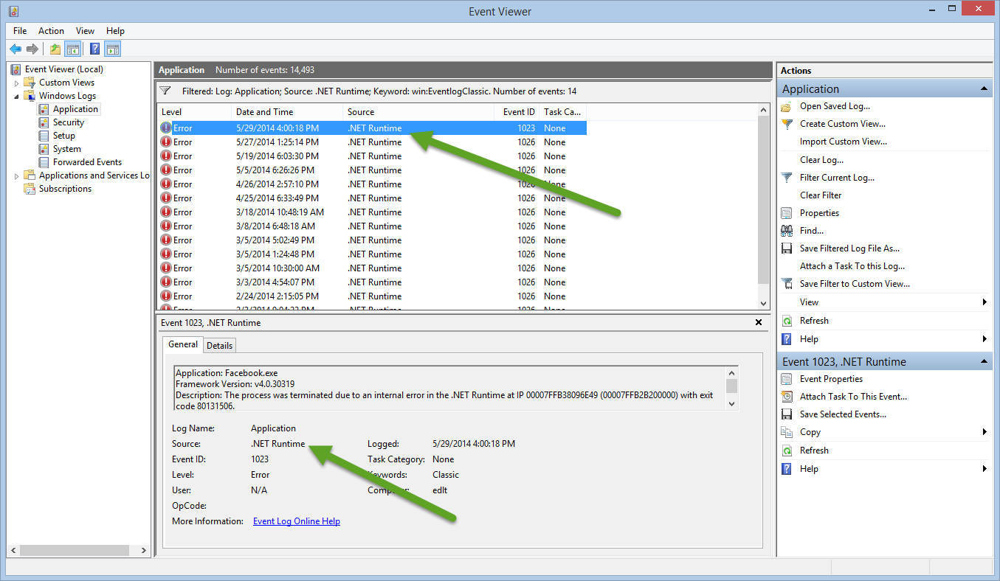
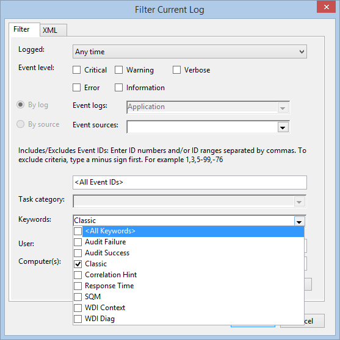

# Creating Get-WinEvent queries with FilterHashtable

To read the original June 3, 2014 **Scripting Guy** blog post, see
[Use FilterHashTable to Filter Event Log with PowerShell](https://devblogs.microsoft.com/scripting/use-filterhashtable-to-filter-event-log-with-powershell/).

This article is an excerpt of the original blog post and explains how to use the `Get-WinEvent`
cmdlet's **FilterHashtable** parameter to filter event logs. PowerShell's `Get-WinEvent` cmdlet is a
powerful method to filter Windows event and diagnostic logs. Performance improves when a
`Get-WinEvent` query uses the **FilterHashtable** parameter.

When you work with large event logs, it's not efficient to send objects down the pipeline to a
`Where-Object` command. Prior to PowerShell 6, the `Get-EventLog` cmdlet was another option to get
log data. For example, the following commands are inefficient to filter the
**Microsoft-Windows-Defrag** logs:

```powershell
Get-EventLog -LogName Application | Where-Object Source -Match defrag

Get-WinEvent -LogName Application | Where-Object { $_.ProviderName -Match 'defrag' }
```

The following command uses a hash table that improves the performance:

```powershell
Get-WinEvent -FilterHashtable @{
   LogName='Application'
   ProviderName='*defrag'
}
```

## Blog posts about enumeration

This article presents information about how to use enumerated values in a hash table. For more
information about enumeration, read these **Scripting Guy** blog posts. To create a function that
returns the enumerated values, see
[Enumerations and Values](https://devblogs.microsoft.com/scripting/hey-scripting-guy-weekend-scripter-enumerations-and-values).
For more information, see the
[Scripting Guy series of blog posts about enumeration](https://devblogs.microsoft.com/scripting/?s=about+enumeration).

## Hash table key-value pairs

To build efficient queries, use the `Get-WinEvent` cmdlet with the **FilterHashtable** parameter.
**FilterHashtable** accepts a hash table as a filter to get specific information from Windows event
logs. A hash table uses **key-value** pairs. For more information about hash tables, see
[about_Hash_Tables](/powershell/module/microsoft.powershell.core/about/about_hash_tables).

If the **key-value** pairs are on the same line, they must be separated by a semicolon. If each
**key-value** pair is on a separate line, the semicolon isn't needed. For example, this article
places **key-value** pairs on separate lines and doesn't use semicolons.

This sample uses several of the **FilterHashtable** parameter's **key-value** pairs. The completed
query includes **LogName**, **ProviderName**, **Keywords**, **ID**, and **Level**.

The accepted **key-value** pairs are shown in the following table and are included in the
documentation for the [Get-WinEvent](/powershell/module/microsoft.powershell.diagnostics/Get-WinEvent)
**FilterHashtable** parameter.

The following table displays the key names, data types, and whether wildcard characters are accepted
for a data value.

|    Key name    | Value data type | Accepts wildcard characters? |
| -------------- | --------------- | ---------------------------- |
| LogName        | `<String[]>`    | Yes                          |
| ProviderName   | `<String[]>`    | Yes                          |
| Path           | `<String[]>`    | No                           |
| Keywords       | `<Long[]>`      | No                           |
| ID             | `<Int32[]>`     | No                           |
| Level          | `<Int32[]>`     | No                           |
| StartTime      | `<DateTime>`    | No                           |
| EndTime        | `<DateTime>`    | No                           |
| UserID         | `<SID>`         | No                           |
| Data           | `<String[]>`    | No                           |
| `<named-data>` | `<String[]>`    | No                           |

The `<named-data>` key represents a named event data field. For example, the Perflib event 1008
can contain the following event data:

```xml
<EventData>
  <Data Name="Service">BITS</Data>
  <Data Name="Library">C:\Windows\System32\bitsperf.dll</Data>
  <Data Name="Win32Error">2</Data>
</EventData>
```

You can query for these events using the following command:

```powershell
Get-WinEvent -FilterHashtable @{LogName='Application'; 'Service'='Bits'}
```

> [!NOTE]
> The ability to query for `<named-data>` was added in PowerShell 6.

## Building a query with a hash table

To verify results and troubleshoot problems, it helps to build the hash table one **key-value** pair
at a time. The query gets data from the **Application** log. The hash table is equivalent to
`Get-WinEvent –LogName Application`.

To begin, create the `Get-WinEvent` query. Use the **FilterHashtable** parameter's **key-value**
pair with the key, **LogName**, and the value, **Application**.

```powershell
Get-WinEvent -FilterHashtable @{
   LogName='Application'
}
```

Continue to build the hash table with the **ProviderName** key. The **ProviderName** is the name
that appears in the **Source** field in the **Windows Event Viewer**. For example, **.NET Runtime**
in the following screenshot:



Update the hash table and include the **key-value** pair with the key, **ProviderName**, and the
value, **.NET Runtime**.

```powershell
Get-WinEvent -FilterHashtable @{
   LogName='Application'
   ProviderName='.NET Runtime'
}
```

If your query needs to get data from archived event logs, use the **Path** key. The **Path** value
specifies the full path to the log file. For more information, see the **Scripting Guy** blog post,
[Use PowerShell to Parse Saved Event Logs for Errors](https://devblogs.microsoft.com/scripting/use-powershell-to-parse-saved-event-logs-for-errors).

## Using enumerated values in a hash table

**Keywords** is the next key in the hash table. The **Keywords** data type is an array of the `[long]`
value type that holds a large number. Use the following command to find the maximum value of `[long]`:

```powershell
[long]::MaxValue
```

```Output
9223372036854775807
```

For the **Keywords** key, PowerShell uses a number, not a string such as **Security**. **Windows
Event Viewer** displays the **Keywords** as strings, but they are enumerated values. In the hash
table, if you use the **Keywords** key with a string value, an error message is displayed.

Open the **Windows Event Viewer** and from the **Actions** pane, click on **Filter current log**.
The **Keywords** drop-down menu displays the available keywords, as shown in the following
screenshot:



Use the following command to display the `StandardEventKeywords` property names.

```powershell
[System.Diagnostics.Eventing.Reader.StandardEventKeywords] | Get-Member -Static -MemberType Property
```

```Output
   TypeName: System.Diagnostics.Eventing.Reader.StandardEventKeywords
Name             MemberType Definition
—-             ———- ———-
AuditFailure     Property   static System.Diagnostics.Eventing.Reader.StandardEventKey…
AuditSuccess     Property   static System.Diagnostics.Eventing.Reader.StandardEventKey…
CorrelationHint  Property   static System.Diagnostics.Eventing.Reader.StandardEventKey…
CorrelationHint2 Property   static System.Diagnostics.Eventing.Reader.StandardEventKey…
EventLogClassic  Property   static System.Diagnostics.Eventing.Reader.StandardEventKey…
None             Property   static System.Diagnostics.Eventing.Reader.StandardEventKey…
ResponseTime     Property   static System.Diagnostics.Eventing.Reader.StandardEventKey…
Sqm              Property   static System.Diagnostics.Eventing.Reader.StandardEventKey…
WdiContext       Property   static System.Diagnostics.Eventing.Reader.StandardEventKey…
WdiDiagnostic    Property   static System.Diagnostics.Eventing.Reader.StandardEventKey…
```

The enumerated values are documented in the **.NET Framework**. For more information, see
[StandardEventKeywords Enumeration](/dotnet/api/system.diagnostics.eventing.reader.standardeventkeywords).

The **Keywords** names and enumerated values are as follows:

| Name             |  Value            |
| ---------------- | ------------------|
| AuditFailure     | 4503599627370496  |
| AuditSuccess     | 9007199254740992  |
| CorrelationHint2 | 18014398509481984 |
| EventLogClassic  | 36028797018963968 |
| Sqm              | 2251799813685248  |
| WdiDiagnostic    | 1125899906842624  |
| WdiContext       | 562949953421312   |
| ResponseTime     | 281474976710656   |
| None             | 0                 |

Update the hash table and include the **key-value** pair with the key, **Keywords**, and the
**EventLogClassic** enumeration value, **36028797018963968**.

```powershell
Get-WinEvent -FilterHashtable @{
   LogName='Application'
   ProviderName='.NET Runtime'
   Keywords=36028797018963968
}
```

### Keywords static property value (optional)

The **Keywords** key is enumerated, but you can use a static property name in the hash table query.
Rather than using the returned string, the property name must be converted to a value with the
**Value__** property.

For example, the following script uses the **Value__** property.

```powershell
$C = [System.Diagnostics.Eventing.Reader.StandardEventKeywords]::EventLogClassic
Get-WinEvent -FilterHashtable @{
   LogName='Application'
   ProviderName='.NET Runtime'
   Keywords=$C.Value__
}
```

## Filtering by Event Id

To get more specific data, the query's results are filtered by **Event Id**. The **Event Id** is
referenced in the hash table as the key **ID** and the value is a specific **Event Id**. The
**Windows Event Viewer** displays the **Event Id**. This example uses **Event Id 1023**.

Update the hash table and include the **key-value** pair with the key, **ID** and the value,
**1023**.

```powershell
Get-WinEvent -FilterHashtable @{
   LogName='Application'
   ProviderName='.NET Runtime'
   Keywords=36028797018963968
   ID=1023
}
```

## Filtering by Level

To further refine the results and include only events that are errors, use the **Level** key.
**Windows Event Viewer** displays the **Level** as string values, but they are enumerated values. In
the hash table, if you use the **Level** key with a string value, an error message is displayed.

**Level** has values such as **Error**, **Warning**, or **Informational**. Use the following command
to display the `StandardEventLevel` property names.

```powershell
[System.Diagnostics.Eventing.Reader.StandardEventLevel] | Get-Member -Static -MemberType Property
```

```Output
   TypeName: System.Diagnostics.Eventing.Reader.StandardEventLevel

Name          MemberType Definition
----          ---------- ----------
Critical      Property   static System.Diagnostics.Eventing.Reader.StandardEventLevel Critical {get;}
Error         Property   static System.Diagnostics.Eventing.Reader.StandardEventLevel Error {get;}
Informational Property   static System.Diagnostics.Eventing.Reader.StandardEventLevel Informational {get;}
LogAlways     Property   static System.Diagnostics.Eventing.Reader.StandardEventLevel LogAlways {get;}
Verbose       Property   static System.Diagnostics.Eventing.Reader.StandardEventLevel Verbose {get;}
Warning       Property   static System.Diagnostics.Eventing.Reader.StandardEventLevel Warning {get;}
```

The enumerated values are documented in the **.NET Framework**. For more information, see
[StandardEventLevel Enumeration](/dotnet/api/system.diagnostics.eventing.reader.standardeventlevel).

The **Level** key's names and enumerated values are as follows:

| Name           | Value |
| -------------- | ----- |
| Verbose        |   5   |
| Informational  |   4   |
| Warning        |   3   |
| Error          |   2   |
| Critical       |   1   |
| LogAlways      |   0   |

The hash table for the completed query includes the key, **Level**, and the value, **2**.

```powershell
Get-WinEvent -FilterHashtable @{
   LogName='Application'
   ProviderName='.NET Runtime'
   Keywords=36028797018963968
   ID=1023
   Level=2
}
```

### Level static property in enumeration (optional)

The **Level** key is enumerated, but you can use a static property name in the hash table query.
Rather than using the returned string, the property name must be converted to a value with the
**Value__** property.

For example, the following script uses the **Value__** property.

```powershell
$C = [System.Diagnostics.Eventing.Reader.StandardEventLevel]::Informational
Get-WinEvent -FilterHashtable @{
   LogName='Application'
   ProviderName='.NET Runtime'
   Keywords=36028797018963968
   ID=1023
   Level=$C.Value__
}
```
