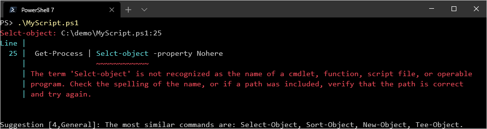
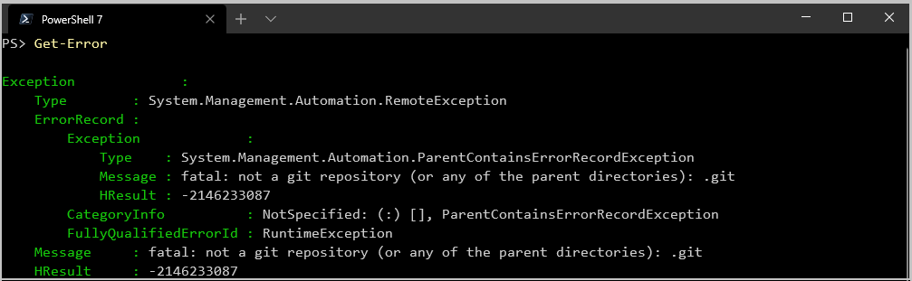

# What's New in PowerShell 7.0

PowerShell 7.0 is an open-source, cross-platform (Windows, macOS, and Linux) edition of PowerShell,
built to manage heterogeneous environments and hybrid cloud.

In this release, we're introducing a number of new features, including:

- Pipeline parallelization with `ForEach-Object -Parallel`
- New operators:
  - Ternary operator: `a ? b : c`
  - Pipeline chain operators: `||` and `&&`
  - Null conditional operators: `??` and `??=`
- A simplified and dynamic error view and `Get-Error` cmdlet for easier investigation of errors
- A compatibility layer that enables users to import modules in an implicit Windows PowerShell session
- Automatic new version notifications
- The ability to invoke DSC resources directly from PowerShell 7 (experimental)

To see a full list of features and fixes, see the [changelogs](https://github.com/PowerShell/PowerShell/blob/master/CHANGELOG/7.0.md).

## Where can I install PowerShell?

PowerShell 7 currently supports the following operating systems on x64, including:

- Windows 8.1, and 10
- Windows Server 2012, 2012 R2, 2016, and 2019
- macOS 10.13+
- Red Hat Enterprise Linux (RHEL) / CentOS 7
- Fedora 30+
- Debian 9
- Ubuntu LTS 16.04+
- Alpine Linux 3.8+

Additionally, PowerShell 7.0 supports ARM32 and ARM64 flavors of Debian, Ubuntu, and ARM64 Alpine
Linux.

Check the installation instructions for your preferred operating system
[Windows](/powershell/scripting/install/installing-powershell-core-on-windows),
[macOS](/powershell/scripting/install/installing-powershell-core-on-macos),
or
[Linux](/powershell/scripting/install/installing-powershell-core-on-linux).

While not officially supported, the community has also provided packages for
[Arch](https://aur.archlinux.org/packages/powershell/) and Kali Linux.

> [!NOTE]
> Debian 10 and CentOS 8 currently do not support WinRM remoting. For details on setting up
> SSH-based remoting, see
> [PowerShell Remoting over SSH](/powershell/scripting/learn/remoting/ssh-remoting-in-powershell-core).

For more up-to-date information about supported operating systems and support lifecycle, see the
[PowerShell Support Lifecycle](/powershell/scripting/powershell-support-lifecycle).

## Running PowerShell 7

PowerShell 7 installs to a directory seperately from Windows PowerShell.
This enables you to run PowerShell 7 side-by-side with Windows PowerShell 5.1. For
PowerShell Core 6.x, PowerShell 7 is an in-place upgrade that removes PowerShell Core 6.x.

- PowerShell 7 is installed to `%programfiles%\PowerShell\7`
- The `%programfiles%\PowerShell\7` folder is added to `$env:PATH`

The PowerShell 7 installer package upgrades previous versions of PowerShell Core 6.x:

- PowerShell Core 6.x on Windows: `%programfiles%\PowerShell\6` is replaced by
  `%programfiles%\PowerShell\7`
- Linux: `/opt/microsoft/powershell/6` is replaced by `/opt/microsoft/powershell/7`
- macOS: `/usr/local/microsoft/powershell/6` is replaced by `/usr/local/microsoft/powershell/7`

> [!NOTE]
> In Windows PowerShell, the executable to launch PowerShell is named `powershell.exe`. In version 6
> and above, the executable name is changed to support side-by-side execution. The new executable name to
> launch PowerShell 7 is `pwsh.exe`. Preview builds remain in-place as `pwsh-preview` instead
> of `pwsh` under the 7-preview directory.

## Improved backwards compatibility with Windows PowerShell

PowerShell 7.0 marks a move a to .NET Core 3.1, enabling significantly more backwards compatibility
with existing Windows PowerShell modules. This includes many modules on Windows that require GUI
functionality like `Out-GridView` and `Show-Command`, as well as many role management modules that
ship as part of Windows.

For Windows, a new switch parameter **UseWindowsPowerShell** is added to `Import-Module`. This
switch creates a proxy module in PowerShell 7 that uses a local Windows PowerShell process to
implicitly run any cmdlets contained in that module. For more information on
[Import-Module](/powershell/module/microsoft.powershell.core/import-module?view=powershell-7&preserve-view=true).

For more information on which Microsoft modules work with PowerShell 7.0, see the
[Module Compatibility Table](https://aka.ms/PSModuleCompat).

## Parallel execution added to ForEach-Object

The `ForEach-Object` cmdlet, which iterates items in a collection, now has built-in parallelism with
the new **Parallel** parameter.

By default, parallel script blocks use the current working directory of the caller that started the
parallel tasks.

This example retrieves 50,000 log entries from 5 system logs on a local Windows machine:

```powershell
$logNames = 'Security','Application','System','Windows PowerShell','Microsoft-Windows-Store/Operational'

$logEntries = $logNames | ForEach-Object -Parallel {
    Get-WinEvent -LogName $_ -MaxEvents 10000
} -ThrottleLimit 5

$logEntries.Count

50000
```

The **Parallel** parameter specifies the script block that is run in parallel for each input log name.

The new **ThrottleLimit** parameter limits the number of script blocks running in parallel at a
given time. The default is 5.

Use the `$_` variable to represent the current input object in the script block. Use the
`$using:` scope to pass variable references to the running script block.

For more information about
[ForEach-Object](/powershell/module/microsoft.powershell.core/foreach-object?view=powershell-7&preserve-view=true).

## Ternary operator

PowerShell 7.0 introduces a ternary operator which behaves like a simplified `if-else` statement.
PowerShell's ternary operator is closely modeled from the C# ternary operator syntax:

```
<condition> ? <if-true> : <if-false>
```

The condition-expression is always evaluated and its result converted to a **Boolean** to
determine which branch is evaluated next:

- The `<if-true>` expression is executed if the `<condition>` expression is true
- The `<if-false>` expression is executed if the `<condition>` expression is false

For example:

```powershell
$message = (Test-Path $path) ? "Path exists" : "Path not found"
```

In this example, if the path exists, then **Path exists** is displayed. If the path does not exist,
then **Path not found** is displayed.

For more information
[About If](/powershell/module/microsoft.powershell.core/about/about_if).

## Pipeline chain operators

PowerShell 7 implements the `&&` and `||` operators to conditionally chain pipelines. These
operators are known in PowerShell as "pipeline chain operators", and are similar to AND and OR lists
in shells like **Bash** and **Zsh**, as well as conditional processing symbols in the
Windows Command Shell (**cmd.exe**).

The `&&` operator executes the right-hand pipeline, if the left-hand pipeline succeeded. Conversely,
the `||` operator executes the right-hand pipeline if the left-hand pipeline failed.

> [!NOTE]
> These operators use the `$?` and `$LASTEXITCODE` variables to determine if a pipeline
> failed. This allows you to use them with native commands and not just with cmdlets or functions.

Here, the first command succeeds and the second command is executed:

```powershell
Write-Output 'First' && Write-Output 'Second'
```

```Output
First
Second
```

Here, the first command fails, the second is not executed:

```powershell
Write-Error 'Bad' && Write-Output 'Second'
```

```Output
Write-Error: Bad
```

Here, the first command succeeds, the second command is not executed:

```powershell
Write-Output 'First' || Write-Output 'Second'
```

```Output
First
```

Here, the first command fails, so the second command is executed:

```powershell
Write-Error 'Bad' || Write-Output 'Second'
```

```Output
Write-Error 'Bad'
Second
```

For more information
[About Pipeline Chain Operators](/powershell/module/microsoft.powershell.core/about/about_pipeline_chain_operators?view=powershell-7&preserve-view=true).

## Null-coalescing, assignment, and conditional operators

PowerShell 7 includes Null coalescing operator `??`, Null conditional assignment `??=`, and Null
conditional member access operators `?.` and `?[]`.

### Null-coalescing Operator ??

The null-coalescing operator `??` returns the value of its left-hand operand if it isn't null.
Otherwise, it evaluates the right-hand operand and returns its result. The `??` operator doesn't
evaluate its right-hand operand if the left-hand operand evaluates to non-null.

```powershell
$x = $null
$x ?? 100
100
```

In the following example, the right-hand operand won't be evaluated:

```powershell
[string] $todaysDate = '1/10/2020'
$todaysDate ?? (Get-Date).ToShortDateString()
1/10/2020
```

### Null conditional assignment operator ??=

The null conditional assignment operator `??=` assigns the value of its right-hand operand to its
left-hand operand only if the left-hand operand evaluates to null. The `??=` operator doesn't
evaluate its right-hand operand if the left-hand operand evaluates to non-null.

```powershell
$x = $null
$x ??= 100
$x
100
```

In the following example, the right-hand operand is not evaluated:

```powershell
[string] $todaysDate = '1/10/2020'
$todaysDate ??= (Get-Date).ToShortDateString()
1/10/2020
```

### Null conditional member access operators ?. and ?[] (Experimental)

> [!NOTE]
> This is an experimental feature named **PSNullConditionalOperators**. For more information, see
> [Using Experimental Features](/powershell/scripting/learn/experimental-features).

A null conditional operator permits member access, `?.`, or element access, `?[]`, to its operand
only if that operand evaluates to non-null; otherwise, it returns null.

> [!NOTE]
> Since PowerShell allows `?` to be part of the variable name, formal specification of the
> variable name is required for using these operators. So it is required to use `{}` around the
> variable names like `${a}` or when `?` is part of the variable name `${a?}`.

In the following example, the value of the member property **Status** is returned:

```powershell
$Service = Get-Service -Name 'bits'
${Service}?.status
Stopped
```

The following example returns null, without trying to access the member name **Status**:

```powershell
$service = $Null
${Service}?.status
```

Similarly, using `?[]`, the value of the element is returned:

```powershell
$a = 1..10
${a}?[0]
1
```

And when the operand is null, the element isn't accessed and null is returned:

```powershell
$a = $null
${a}?[0]
```

For more information
[About_Operators](/powershell/module/microsoft.powershell.core/about/about_operators?view=powershell-7&preserve-view=true).

## New view ConciseView and cmdlet Get-Error

PowerShell 7.0 enhances the display of error messages to improve the readability of interactive and script
errors with a new default view **ConciseView**. The views are user-selectable through the preference
variable `$ErrorView`.

With **ConciseView**, if an error is not from a script or parser error, then
it's a single line error message:

```powershell
Get-Childitem -Path c:\NotReal
```

```Output
Get-ChildItem: Cannot find path 'C:\NotReal' because it does not exist
```

If the error occurs during script execution or is a parsing error, PowerShell returns a multiline
error message that contains the error, a pointer and error message showing where the error is in
that line. If the terminal doesn't support ANSI color escape sequences (VT100), then colors are not displayed.



The default view in PowerShell 7 is **ConciseView**. The previous default view was **NormalView** and you can select thisby setting the preference variable `$ErrorView`.

```powershell
$ErrorView = 'NormalView' # Sets the error view to NormalView
$ErrorView = 'ConciseView' # Sets the error view to ConciseView
```

> [!NOTE]
> A new property **ErrorAccentColor** is added to `$Host.PrivateData` to support changing
> the accent color of the error message.

A new cmdlet `Get-Error` provides a complete detailed view of the fully qualified error when desired.
By default the cmdlet displays the full details, including inner exceptions, of the last error that
occurred.



The `Get-Error` cmdlet supports input from the pipeline using the built-in variable `$Error`.
`Get-Error` displays all piped errors.

```powershell
$Error | Get-Error
```

The `Get-Error` cmdlet supports the **Newest** parameter, allowing you to specify how many errors
from the current session you wish displayed.

```powershell
Get-Error -Newest 3 # Displays the lst three errors that occurred in the session
```

For more information about [Get-Error](/powershell/module/microsoft.powershell.utility/get-error?view=powershell-7&preserve-view=true).

## New version notification

PowerShell 7 uses update notifications to alert users to the existence of updates to PowerShell.
Once per day, PowerShell queries an online service to determine if a newer version is available.

> [!NOTE]
> The update check happens during the first session in a given 24-hour period. For performance
> reasons, the update check starts 3 seconds after the session begins. The notification is shown
> only on the start of subsequent sessions.

By default, PowerShell subscribes to one of two different notification channels depending on its
version/branch. Supported, Generally Available (GA) versions of PowerShell only return notifications
for updated GA releases. Preview and Release Candidate (RC) releases notify of updates to preview,
RC, and GA releases.

The update notification behavior can be changed using the `$Env:POWERSHELL_UPDATECHECK` environment
variable. The following values are supported:

- **Default** is the same as not defining `$Env:POWERSHELL_UPDATECHECK`
  - GA releases notify of updates to GA releases
  - Preview/RC releases notify of updates to GA and preview releases
- **Off** turns off the update notification feature
- **LTS** only notifies of updates to long-term-servicing (LTS) GA releases

> [!NOTE]
> The environment variable `$Env:POWERSHELL_UPDATECHECK` does not exist until it is set for
> the first time.

To set the version notification for `LTS` releases only:

```powershell
$Env:POWERSHELL_UPDATECHECK = 'LTS'
```

To set the version notification to the `Default` behavior:

```powershell
$Env:POWERSHELL_UPDATECHECK = 'Default'
```

For more information
[About Update Notifications](/powershell/module/microsoft.powershell.core/about/about_update_notifications).

## New DSC Resource support with Invoke-DSCResource (Experimental)

> [!NOTE]
> This is an experimental feature named **PSDesiredStateConfiguration.InvokeDscResource**. For more
> information, see
> [Using Experimental Features](/powershell/scripting/learn/experimental-features).

The `Invoke-DscResource` cmdlet runs a method of a specified PowerShell Desired State Configuration
(DSC) resource.

This cmdlet invokes a DSC resource directly, without creating a configuration document. Using this
cmdlet, configuration management products can manage Windows or Linux by using DSC resources. This
cmdlet also enables debugging of resources when the DSC engine is running with debugging enabled.

This command invokes the **Set** method of a resource named **WindowsProcess** and provides the
mandatory **Path** and **Arguments** properties to start the specified Windows process.

```powershell
Invoke-DscResource -Name WindowsProcess -Method Set -ModuleName PSDesiredStateConfiguration -Property @{
  Path = 'C:\Windows\System32\WindowsPowerShell\v1.0\powershell.exe'
  Arguments = ''
}
```

For more information about
[Invoke-DSCResource](/powershell/module/psdesiredstateconfiguration/invoke-dscresource?view=powershell-7&preserve-view=true).

## Breaking Changes and Improvements

### Breaking Changes

- Make update notification support LTS and default channels (#11132)
- Update Test-Connection to work more like the one in Windows PowerShell (#10697) (Thanks @vexx32!)
- Preserve $? for ParenExpression, SubExpression and ArrayExpression (#11040)
- Set working directory to current directory in Start-Job (#10920) (Thanks @iSazonov!)
- Make $PSCulture consistently reflect in-session culture changes (#10138) (Thanks @iSazonov!)

### Engine Updates and Fixes

- Improvements in breakpoint APIs for remote scenarios (#11312)
- Fix PowerShell class definition leaking into another Runspace (#11273)
- Fix a regression in formatting caused by the FirstOrDefault primitive added in 7.0.0-Preview1 (#11258)
- Additional Microsoft Modules to track in PS7 Telemetry (#10751)
- Make approved features non-experimental (#11303)
- Update ConciseView to use TargetObject if applicable (#11075)
- Fix NullReferenceException in CompletionCompleters public methods (#11274)
- Fix apartment thread state check on non-Windows platforms (#11301)
- Update setting PSModulePath to concatenate the process and machine environment variables (#11276)
- Bump .NET Core to 3.1.0 (#11260)
- Fix detection of $PSHOME in front of $env:PATH (#11141)
- Allow pwsh to inherit $env:PSModulePath and enable powershell.exe to start correctly (#11057)
- Move to .NET Core 3.1 preview 1 (#10798)
- Refactor reparse tag checks in file system provider (#10431) (Thanks @iSazonov!)
- Replace CR and new line with a 0x23CE character in script logging (#10616)
- Fix a resource leak by unregistering the event handler from AppDomain.CurrentDomain.ProcessExit (#10626)
- Add support to ActionPreference.Break to break into debugger when Debug, Error, Information, Progress, Verbose or Warning messages are generated (#8205) (Thanks @KirkMunro!)
- Enable starting control panel add-ins within PowerShell Core without specifying .CPL extension. (#9828)
- Support negative numbers in -split operator (#8960) (Thanks @ece-jacob-scott!)

### General Cmdlet Updates and Fixes

- Fix for issue on Raspbian for setting date of file changes in UnixStat Experimental Feature (#11313)
- Add -AsPlainText to ConvertFrom-SecureString (#11142)
- Added WindowsPS version check for WinCompat (#11148)
- Fix error-reporting in some WinCompat scenarios (#11259)
- Add native binary resolver (#11032) (Thanks @iSazonov!)
- Update calculation of char width to respect CJK chars correctly (#11262)
- Add Unblock-File for macOS (#11137)
- Fix regression in Get-PSCallStack (#11210) (Thanks @iSazonov!)
- Remove autoloading of the ScheduledJob module when using Job cmdlets (#11194)
- Add OutputType to Get-Error cmdlet and preserve original typenames (#10856)
- Fix null reference in SupportsVirtualTerminal property (#11105)
- Add limit check in Get-WinEvent (#10648) (Thanks @iSazonov!)
- Fix command runtime so StopUpstreamCommandsException doesn't get populated in -ErrorVariable (#10840)
- Set the output encoding to [Console]::OutputEncoding for native commands (#10824)
- Support multi-line code blocks in examples (#10776) (Thanks @Greg-Smulko!)
- Add Culture parameter to Select-String cmdlet (#10943) (Thanks @iSazonov!)
- Fix Start-Job working directory path with trailing backslash (#11041)
- ConvertFrom-Json: Unwrap collections by default (#10861) (Thanks @danstur!)
- Use case-sensitive Hashtable for Group-Object cmdlet with -CaseSensitive and -AsHashtable switches (#11030) (Thanks @vexx32!)
- Handle exception if enumerating files fails when rebuilding path to have correct casing (#11014)
- Fix ConciseView to show Activity instead of myCommand (#11007)
- Allow web cmdlets to ignore HTTP error statuses (#10466) (Thanks @vdamewood!)
- Fix piping of more than one CommandInfo to Get-Command (#10929)
- Add back Get-Counter cmdlet for Windows (#10933)
- Make ConvertTo-Json treat [AutomationNull]::Value and [NullString]::Value as $null (#10957)
- Remove brackets from ipv6 address for SSH remoting (#10968)
- Fix crash if command sent to pwsh is just whitespace (#10977)
- Added cross-platform Get-Clipboard and Set-Clipboard (#10340)
- Fix setting original path of filesystem object to not have extra trailing slash (#10959)
- Support $null for ConvertTo-Json (#10947)
- Add back Out-Printer command on Windows (#10906)
- Fix Start-Job -WorkingDirectory with whitespace (#10951)
- Return default value when getting null for a setting in PSConfiguration.cs (#10963) (Thanks @iSazonov!)
- Handle IO exception as non-terminating (#10950)
- Add GraphicalHost assembly to enable Out-GridView, Show-Command, and Get-Help -ShowWindow (#10899)
- Take ComputerName via pipeline in Get-HotFix (#10852) (Thanks @kvprasoon!)
- Fix tab completion for parameters so that it shows common parameters as available (#10850)
- Fix GetCorrectCasedPath() to first check if any system file entries is returned before calling First() (#10930)
- Set working directory to current directory in Start-Job (#10920) (Thanks @iSazonov!)
- Change TabExpansion2 to not require -CursorColumn and treat as $InputScript.Length (#10849)
- Handle case where Host may not return Rows or Columns of screen (#10938)
- Fix use of accent colors for hosts that don't support them (#10937)
- Add back Update-List command (#10922)
- Update FWLink Id for Clear-RecycleBin (#10925)
- During tab completion, skip file if can't read file attributes (#10910)
- Add back Clear-RecycleBin for Windows (#10909)
- Add `$env:__SuppressAnsiEscapeSequences` to control whether to have VT escape sequence in output (#10814)
- Add -NoEmphasize parameter to colorize Select-String output (#8963) (Thanks @derek-xia!)
- Add back Get-HotFix cmdlet (#10740)
- Make Add-Type usable in applications that host PowerShell (#10587)
- Use more effective evaluation order in LanguagePrimitives.IsNullLike() (#10781) (Thanks @vexx32!)
- Improve handling of mixed-collection piped input and piped streams of input in Format-Hex (#8674) (Thanks @vexx32!)
- Use type conversion in SSHConnection hashtables when value doesn't match expected type (#10720) (Thanks @SeeminglyScience!)
- Fix Get-Content -ReadCount 0 behavior when -TotalCount is set (#10749) (Thanks @eugenesmlv!)
- Reword access denied error message in Get-WinEvent (#10639) (Thanks @iSazonov!)
- Enable tab completion for variable assignment that is enum or type constrained (#10646)
- Remove unused SourceLength remoting property causing formatting issues (#10765)
- Add -Delimiter parameter to ConvertFrom-StringData (#10665) (Thanks @steviecoaster!)
- Add positional parameter for ScriptBlock when using Invoke-Command with SSH (#10721) (Thanks @machgo!)
- Show line context information if multiple lines but no script name for ConciseView (#10746)
- Add support for \\wsl$\ paths to file system provider (#10674)
- Add the missing token text for TokenKind.QuestionMark in parser (#10706)
- Set current working directory of each ForEach-Object -Parallel running script to the same location as the calling script. (#10672)
- Replace api-ms-win-core-file-l1-2-2.dll with Kernell32.dll for FindFirstStreamW and FindNextStreamW APIs (#10680) (Thanks @iSazonov!)
- Tweak help formatting script to be more StrictMode tolerant (#10563)
- Add -SecurityDescriptorSDDL parameter to New-Service (#10483) (Thanks @kvprasoon!)
- Remove informational output, consolidate ping usage in Test-Connection (#10478) (Thanks @vexx32!)
- Read special reparse points without accessing them (#10662) (Thanks @iSazonov!)
- Direct Clear-Host output to terminal (#10681) (Thanks @iSazonov!)
- Add back newline for grouping with Format-Table and -Property (#10653)
- Remove [ValidateNotNullOrEmpty] from -InputObject on Get-Random to allow empty string (#10644)
- Make suggestion system string distance algorithm case-insensitive (#10549) (Thanks @iSazonov!)
- Fix null reference exception in ForEach-Object -Parallel input processing (#10577)
- Add PowerShell Core group policy definitions (#10468)
- Update console host to support XTPUSHSGR/XTPOPSGR VT control sequences that are used in composability scenarios. (#10208)
- Add WorkingDirectory parameter to Start-Job (#10324) (Thanks @davinci26!)
- Remove the event handler that was causing breakpoint changes to be erroneously replicated to the host runspace debugger (#10503) (Thanks @KirkMunro!)
- Replace api-ms-win-core-job-12-1-0.dll with Kernell32.dll in Microsoft.PowerShell.Commands.NativeMethods P/Invoke API(#10417) (Thanks @iSazonov!)
- Fix wrong output for New-Service in variable assignment and -OutVariable (#10444) (Thanks @kvprasoon!)
- Fix global tool issues around exit code, command line parameters and path with spaces (#10461)
- Fix recursion into OneDrive - change FindFirstFileEx() to use SafeFindHandle type (#10405)
- Skip auto-loading PSReadLine on Windows if the NVDA screen reader is active (#10385)
- Increase built-with-PowerShell module versions to 7.0.0.0 (#10356)
- Add throwing an error in Add-Type if a type with the same name already exists (#9609) (Thanks @iSazonov!)

### Performance

- Avoid using closure in Parser.SaveError (#11006)
- Improve the caching when creating new Regex instances (#10657) (Thanks @iSazonov!)
- Improve processing of the PowerShell built-in type data from types.ps1xml, typesV3.ps1xml and GetEvent.types.ps1xml (#10898)
- Update PSConfiguration.ReadValueFromFile to make it faster and more memory efficient (#10839)
- Add minor performance improvements for runspace initialization (#10569) (Thanks @iSazonov!)
- Make ForEach-Object faster for its commonly used scenarios (#10454) and fix ForEach-Object -Parallel performance problem with many runspaces (#10455)

### Code Cleanup

- Change comment and element text to meet Microsoft standards (#11304)
- Cleanup style issues in Compiler.cs (#10368) (Thanks @iSazonov!)
- Remove the unused type converter for CommaDelimitedStringCollection (#11000) (Thanks @iSazonov!)
- Cleanup style in InitialSessionState.cs (#10865) (Thanks @iSazonov!)
- Code clean up for PSSession class (#11001)
- Remove the not-working 'run Update-Help from Get-Help when Get-Help runs for the first time' feature (#10974)
- Fix style issues (#10998) (Thanks @iSazonov!)
- Cleanup: use the built-in type alias (#10882) (Thanks @iSazonov!)
- Remove the unused setting key ConsolePrompting and avoid unnecessary string creation when querying ExecutionPolicy setting (#10985)
- Disable update notification check for daily builds (#10903) (Thanks @bergmeister!)
- Reinstate debugging API lost in #10338 (#10808)
- Remove WorkflowJobSourceAdapter reference that is no longer used (#10326) (Thanks @KirkMunro!)
- Cleanup COM interfaces in jump list code by fixing PreserveSig attributes (#9899) (Thanks @weltkante!)
- Add a comment describing why -ia is not the alias for -InformationAction common parameter (#10703) (Thanks @KirkMunro!)
- Rename InvokeCommandCmdlet.cs to InvokeExpressionCommand.cs (#10659) (Thanks @kilasuit!)
- Add minor code cleanups related to update notifications (#10698)
- Remove deprecated workflow logic from the remoting setup scripts (#10320) (Thanks @KirkMunro!)
- Update help format to use proper case (#10678) (Thanks @tnieto88!)
- Clean up CodeFactor style issues coming in commits for the last month (#10591) (Thanks @iSazonov!)
- Fix typo in description of PSTernaryOperator experimental feature (#10586) (Thanks @bergmeister!)
- Convert ActionPreference.Suspend enumeration value into a non-supported, reserved state, and remove restriction on using ActionPreference.Ignore in preference variables (#10317) (Thanks @KirkMunro!)
- Replace ArrayList with List\<T> to get more readable and reliable code without changing functionality (#10333) (Thanks @iSazonov!)
- Make code style fixes to TestConnectionCommand (#10439) (Thanks @vexx32!)
- Cleanup AutomationEngine and remove extra SetSessionStateDrive method call (#10416) (Thanks @iSazonov!)
- Rename default ParameterSetName back to Delimiter for ConvertTo-Csv and ConvertFrom-Csv (#10425)

### Tools

- Add default setting for the SDKToUse property so that it builds in VS (#11085)
- Install-Powershell.ps1: Add parameter to use MSI installation (#10921) (Thanks @MJECloud!)
- Add basic examples for install-powershell.ps1 (#10914) (Thanks @kilasuit!)
- Make Install-PowerShellRemoting.ps1 handle empty string in PowerShellHome parameter (#10526) (Thanks @Orca88!)
- Switch from /etc/lsb-release to /etc/os-release in install-powershell.sh (#10773) (Thanks @Himura2la!)
- Check pwsh.exe and pwsh in daily version on Windows (#10738) (Thanks @centreboard!)
- Remove unneeded tap in installpsh-osx.sh (#10752)
- Update install-powershell.ps1 to check for already installed daily build (#10489)

### Tests

- Make unreliable DSC test pending (#11131)
- Fix stringdata test to correctly validate keys of hashtables (#10810)
- Unload test modules (#11061) (Thanks @iSazonov!)
- Increase time between retries of testing URL (#11015)
- Update tests to accurately describe test actions. (#10928) (Thanks @romero126!)
- Temporary skip the flaky test TestAppDomainProcessExitEvenHandlerNotLeaking (#10827)
- Make the event handler leaking test stable (#10790)
- Sync capitalization in CI YAML (#10767) (Thanks @RDIL!)
- Add test for the event handler leaking fix (#10768)
- Add Get-ChildItem test (#10507) (Thanks @iSazonov!)
- Replace ambiguous language for tests from switch to parameter for accuracy (#10666) (Thanks @romero126!)
- Add experimental check to ForEach-Object -Parallel tests (#10354) (Thanks @KirkMunro!)
- Update tests for Alpine validation (#10428)

### Build and Package Improvements

- Fix Nuget package signing for Coordinated Package build (#11316)
- Update dependencies from PowerShell Gallery and NuGet (#11323)
- Bump Microsoft.ApplicationInsights from 2.11.0 to 2.12.0 (#11305)
- Bump Microsoft.CodeAnalysis.CSharp from 3.3.1 to 3.4.0 (#11265)
- Updates packages for Debian 10 and 11 (#11236)
- Only enable experimental features prior to RC (#11162)
- Update macOS minimum version (#11163)
- Bump NJsonSchema from 10.0.27 to 10.0.28 (#11170)
- Updating links in README.md and metadata.json for Preview.5 (#10854)
- Select the files for compliance tests which are owned by PowerShell (#10837)
- Allow win7x86 msix package to build. (Internal 10515)
- Allow semantic versions to be passed to NormalizeVersion function (#11087)
- Bump .NET core framework to 3.1-preview.3 (#11079)
- Bump PSReadLine from 2.0.0-beta5 to 2.0.0-beta6 in /src/Modules (#11078)
- Bump Newtonsoft.Json from 12.0.2 to 12.0.3 (#11037) (#11038)
- Add Debian 10, 11 and CentOS 8 packages (#11028)
- Upload Build-Info Json file with the ReleaseDate field (#10986)
- Bump .NET core framework to 3.1-preview.2 (#10993)
- Enable build of x86 MSIX package (#10934)
- Update the dotnet SDK install script URL in build.psm1 (#10927)
- Bump Markdig.Signed from 0.17.1 to 0.18.0 (#10887)
- Bump ThreadJob from 2.0.1 to 2.0.2 (#10886)
- Update AppX Manifest and Packaging module to conform to MS Store requirements (#10878)
- Update package reference for PowerShell SDK to preview.5 (Internal 10295)
- Update ThirdPartyNotices.txt (#10834)
- Bump Microsoft.PowerShell.Native to 7.0.0-preview.3 (#10826)
- Bump Microsoft.ApplicationInsights from 2.10.0 to 2.11.0 (#10608)
- Bump NJsonSchema from 10.0.24 to 10.0.27 (#10756)
- Add MacPorts support to the build system (#10736) (Thanks @Lucius-Q-User!)
- Bump PackageManagement from 1.4.4 to 1.4.5 (#10728)
- Bump NJsonSchema from 10.0.23 to 10.0.24 (#10635)
- Add environment variable to differentiate client/server telemetry in MSI (#10612)
- Bump PSDesiredStateConfiguration from 2.0.3 to 2.0.4 (#10603)
- Bump Microsoft.CodeAnalysis.CSharp from 3.2.1 to 3.3.1 (#10607)
- Update to .Net Core 3.0 RTM (#10604) (Thanks @bergmeister!)
- Update MSIX packaging so the version to Windows Store requirements (#10588)
- Bump PowerShellGet version from 2.2 to 2.2.1 (#10382)
- Bump PackageManagement version from 1.4.3 to 1.4.4 (#10383)
- Update README.md and metadata.json for 7.0.0-preview.4 (Internal 10011)
- Upgrade .Net Core 3.0 version from Preview 9 to RC1 (#10552) (Thanks @bergmeister!)
- Fix ExperimentalFeature list generation (Internal 9996)
- Bump PSReadLine version from 2.0.0-beta4 to 2.0.0-beta5 (#10536)
- Fix release build script to set release tag
- Update version of Microsoft.PowerShell.Native to 7.0.0-preview.2 (#10519)
- Upgrade to Netcoreapp3.0 preview9 (#10484) (Thanks @bergmeister!)
- Make sure the daily coordinated build, knows it is a daily build (#10464)
- Update the combined package build to release the daily builds (#10449)
- Remove appveyor reference (#10445) (Thanks @RDIL!)
- Bump NJsonSchema version from 10.0.22 to 10.0.23 (#10421)
- Remove the deletion of linux-x64 build folder because some dependencies for Alpine need it (#10407)

### Documentation and Help Content

- Refactor change logs into one log per release (#11165)
- Fix FWLinks for PowerShell 7 online help documents (#11071)
- Update CONTRIBUTING.md (#11096) (Thanks @mklement0!)
- Fix installation doc links in README.md (#11083)
- Adds examples to install-powershell.ps1 script (#11024) (Thanks @kilasuit!)
- Fix to Select-String emphasis and Import-DscResource in CHANGELOG.md (#10890)
- Remove the stale link from powershell-beginners-guide.md (#10926)
- Merge stable and servicing change logs (#10527)
- Update used .NET version in build docs (#10775) (Thanks @Greg-Smulko!)
- Replace links from MSDN to docs.microsoft.com in powershell-beginners-guide.md (#10778) (Thanks @iSazonov!)
- Fix broken DSC overview link (#10702)
- Update Support_Question.md to link to Stack Overflow as another community resource (#10638) (Thanks @mklement0!)
- Add processor architecture to distribution request template (#10661)
- Add new PowerShell MoL book to learning PowerShell docs (#10602)
- Update README.md and metadata for v6.1.6 and v6.2.3 releases (#10523)
- Fix a typo in README.md (#10465) (Thanks @vedhasp!)
- Add a reference to PSKoans module to Learning Resources documentation (#10369) (Thanks @vexx32!)
- Update README.md and metadata.json for 7.0.0-preview.3 (#10393)
