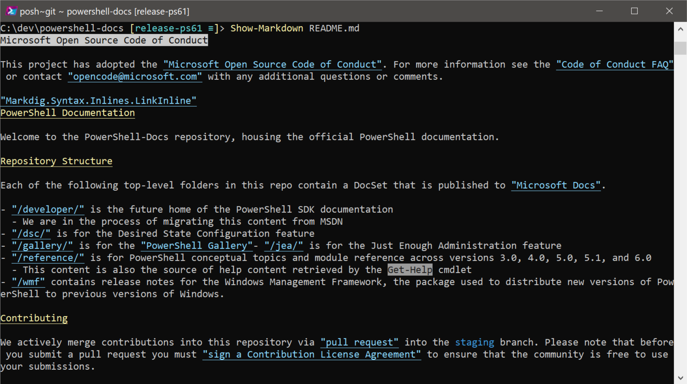
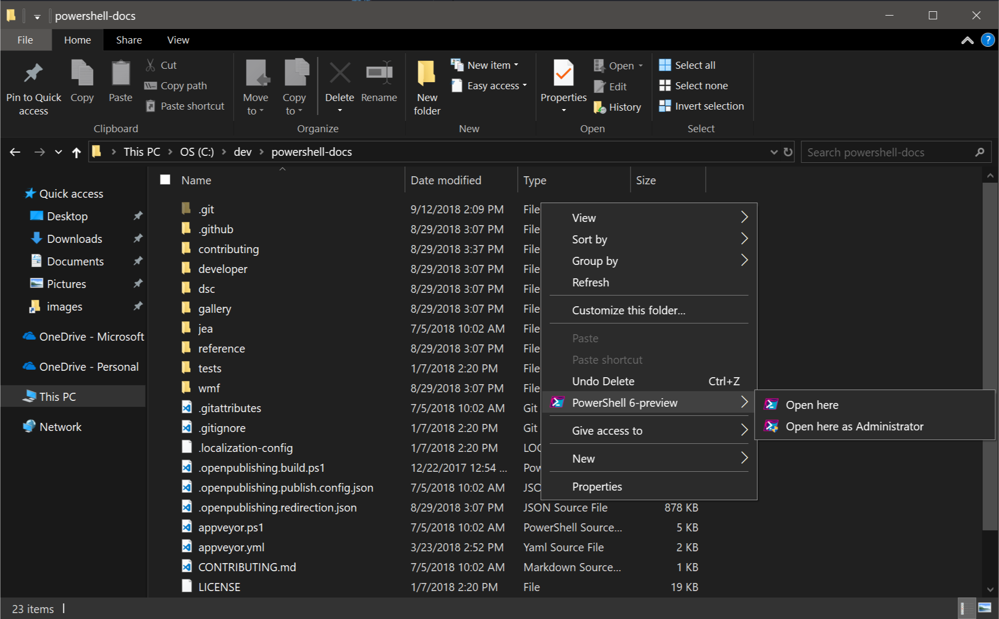
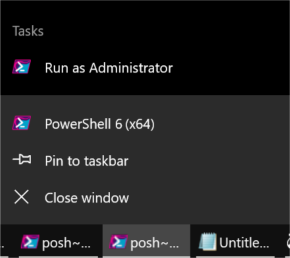

# What's New in PowerShell Core 6.1

Below is a selection of some of the major new features and changes that have been introduced
in PowerShell Core 6.1.

There's also **tons** of "boring stuff" that make PowerShell faster and more stable (plus lots and lots of bug fixes)!
For a full list of changes, check out our [changelog on GitHub](https://github.com/PowerShell/PowerShell/blob/master/CHANGELOG.md).

And while we call out some names below, thank you to
[all of the community contributors](https://github.com/PowerShell/PowerShell/graphs/contributors)
that made this release possible.

## .NET Core 2.1

PowerShell Core 6.1 moved to .NET Core 2.1 after it was
[released in May](https://blogs.msdn.microsoft.com/dotnet/2018/05/30/announcing-net-core-2-1/),
resulting in a number of improvements to PowerShell, including:

* performance improvements (see [below](#performance-improvements))
* Alpine Linux support (preview)
* [.NET global tool support](https://docs.microsoft.com/en-us/dotnet/core/tools/global-tools)
  (coming soon to PowerShell)
* [`Span<T>`](https://docs.microsoft.com/en-us/dotnet/api/system.span-1?view=netcore-2.1)

## Windows Compatibility Pack for .NET Core

On Windows, the .NET team [shipped the Windows Compatibility Pack for .NET Core](https://blogs.msdn.microsoft.com/dotnet/2017/11/16/announcing-the-windows-compatibility-pack-for-net-core/),
a set of assemblies that add a number of removed APIs back to .NET Core on Windows.

With the release of PowerShell Core 6.1,
we've added the Windows Compatibility Pack to PowerShell so that any modules or scripts
that leverage these APIs can depend on them being available.

This includes first-party Microsoft modules,
including **more than 1900+ cmdlets that ship as part of Windows 10 October 2018 Update and Windows Server 2019**.

## Performance improvements

On the heels of some significant performance improvements in PowerShell Core 6.0,
we've made some changes in PowerShell Core 6.1 that continue to speed up certain operations.

For example, `Group-Object` has been sped up by 66%:

```powershell
Measure-Command { 1..100000 | % {Get-Random -Minimum 1 -Maximum 10000} | Group-Object }
```

|              | Windows PowerShell 5.1 | PowerShell Core 6.0 | PowerShell Core 6.1 |
|--------------|------------------------|---------------------|---------------------|
| Time (sec)   | 25.178                 | 19.653              | 6.641               |
| Speed-up (%) | N/A                    | 21.9%               | 66.2%               |

Similarly, sorting scenarios like this one have improved by more than 15%:

```powershell
Measure-Command { 1..100000 | % {Get-Random -Minimum 1 -Maximum 10000} | Sort-Object }
```

|              | Windows PowerShell 5.1 | PowerShell Core 6.0 | PowerShell Core 6.1 |
|--------------|------------------------|---------------------|---------------------|
| Time (sec)   | 12.170                 | 8.493               | 7.08                |
| Speed-up (%) | N/A                    | 30.2%               | 16.6%               |

`Import-Csv` has also been sped up significantly after a regression from Windows PowerShell.
Using a test CSV with 26616 rows and 6 columns:

```powershell
Measure-Command {$a = Import-Csv foo.csv}
```

|              | Windows PowerShell 5.1 | PowerShell Core 6.0 | PowerShell Core 6.1    |
|--------------|------------------------|---------------------|------------------------|
| Time (sec)   | 0.441                  | 1.069               | 0.268                  |
| Speed-up (%) | N/A                    | -142.4%             | 74.9% (39.2% from WPS) |

Lastly, conversion from JSON into `PSObject` has been sped up by more than 50%
since Windows PowerShell.
Using a ~2MB test JSON file:

```powershell
Measure-Command {Get-Content .\foo.json | ConvertFrom-Json}
```

|              | Windows PowerShell 5.1 | PowerShell Core 6.0 | PowerShell Core 6.1    |
|--------------|------------------------|---------------------|------------------------|
| Time (sec)   | 0.259                  | 0.577               | 0.125                  |
| Speed-up (%) | N/A                    | -122.8%             | 78.3% (51.7% from WPS) |

### Check `system32` for compatible inbox modules on Windows

In the Windows 10 1809 update and Windows Server 2019,
we updated a number of inbox PowerShell modules to mark them as compatible with PowerShell Core.

When PowerShell Core 6.1 starts up, it will automatically include `system32`
as part of the `PSModulePath` environment variable.
However, it will only expose modules to `Get-Module` and `Import-Module`
if its `CompatiblePSEdition` has been marked compatible `Core`.

(Note: you may see different available modules depending on what roles and features are installed.)

```powershell
Get-Module -ListAvailable
```

```text
...
    Directory: C:\WINDOWS\system32\WindowsPowerShell\v1.0\Modules

ModuleType Version    Name                                PSEdition ExportedCommands
---------- -------    ----                                --------- ----------------
Manifest   2.0.1.0    Appx                                Core,Desk {Add-AppxPackage, Get-AppxPackage, Get-AppxPacka...
Manifest   1.0.0.0    BitLocker                           Core,Desk {Unlock-BitLocker, Suspend-BitLocker, Resume-Bit...
Manifest   1.0.0.0    DnsClient                           Core,Desk {Resolve-DnsName, Clear-DnsClientCache, Get-DnsC...
Manifest   1.0.0.0    HgsDiagnostics                      Core,Desk {New-HgsTraceTarget, Get-HgsTrace, Get-HgsTraceF...
Binary     2.0.0.0    Hyper-V                             Core,Desk {Add-VMAssignableDevice, Add-VMDvdDrive, Add-VMF...
Binary     1.1        Hyper-V                             Core,Desk {Add-VMDvdDrive, Add-VMFibreChannelHba, Add-VMHa...
Manifest   2.0.0.0    NetAdapter                          Core,Desk {Disable-NetAdapter, Disable-NetAdapterBinding, ...
Manifest   1.0.0.0    NetEventPacketCapture               Core,Desk {New-NetEventSession, Remove-NetEventSession, Ge...
Manifest   2.0.0.0    NetLbfo                             Core,Desk {Add-NetLbfoTeamMember, Add-NetLbfoTeamNic, Get-...
Manifest   1.0.0.0    NetNat                              Core,Desk {Get-NetNat, Get-NetNatExternalAddress, Get-NetN...
Manifest   2.0.0.0    NetQos                              Core,Desk {Get-NetQosPolicy, Set-NetQosPolicy, Remove-NetQ...
Manifest   2.0.0.0    NetSecurity                         Core,Desk {Get-DAPolicyChange, New-NetIPsecAuthProposal, N...
Manifest   1.0.0.0    NetSwitchTeam                       Core,Desk {New-NetSwitchTeam, Remove-NetSwitchTeam, Get-Ne...
Manifest   1.0.0.0    NetWNV                              Core,Desk {Get-NetVirtualizationProviderAddress, Get-NetVi...
Manifest   2.0.0.0    TrustedPlatformModule               Core,Desk {Get-Tpm, Initialize-Tpm, Clear-Tpm, Unblock-Tpm...
...
```

You can override this behavior and show all modules with the `-SkipEditionCheck` switch parameter.
We've also added a `PSEdition` property to the table output
so that you can see which modules are compatible at a glance.

```powershell
Get-Module Net* -ListAvailable -SkipEditionCheck
```

```text
    Directory: C:\WINDOWS\system32\WindowsPowerShell\v1.0\Modules

ModuleType Version    Name                                PSEdition ExportedCommands
---------- -------    ----                                --------- ----------------
Manifest   2.0.0.0    NetAdapter                          Core,Desk {Disable-NetAdapter, Disable-NetAdapterBinding, ...
Manifest   1.0.0.0    NetConnection                       Desk      {Get-NetConnectionProfile, Set-NetConnectionProf...
Manifest   1.0.0.0    NetDiagnostics                      Desk      Get-NetView
Manifest   1.0.0.0    NetEventPacketCapture               Core,Desk {New-NetEventSession, Remove-NetEventSession, Ge...
Manifest   2.0.0.0    NetLbfo                             Core,Desk {Add-NetLbfoTeamMember, Add-NetLbfoTeamNic, Get-...
Manifest   1.0.0.0    NetNat                              Core,Desk {Get-NetNat, Get-NetNatExternalAddress, Get-NetN...
Manifest   2.0.0.0    NetQos                              Core,Desk {Get-NetQosPolicy, Set-NetQosPolicy, Remove-NetQ...
Manifest   2.0.0.0    NetSecurity                         Core,Desk {Get-DAPolicyChange, New-NetIPsecAuthProposal, N...
Manifest   1.0.0.0    NetSwitchTeam                       Core,Desk {New-NetSwitchTeam, Remove-NetSwitchTeam, Get-Ne...
Manifest   1.0.0.0    NetTCPIP                            Desk      {Get-NetIPAddress, Get-NetIPInterface, Get-NetIP...
Manifest   1.0.0.0    NetWNV                              Core,Desk {Get-NetVirtualizationProviderAddress, Get-NetVi...
Manifest   1.0.0.0    NetworkConnectivityStatus           Desk      {Get-DAConnectionStatus, Get-NCSIPolicyConfigura...
Manifest   1.0.0.0    NetworkSwitchManager                Desk      {Disable-NetworkSwitchEthernetPort, Enable-Netwo...
Manifest   1.0.0.0    NetworkTransition                   Desk      {Add-NetIPHttpsCertBinding, Disable-NetDnsTransi...
```

For more information about this behavior, check out [this RFC](https://github.com/PowerShell/PowerShell-RFC/blob/master/2-Draft-Accepted/RFC0025-PSCore6-and-Windows-Modules.md).

### Markdown cmdlets and rendering

Markdown is a standard for creating readable plaintext documents with
basic formatting that can be rendered into HTML.

We've added some cmdlets in 6.1 that allow you to convert and render
Markdown documents in the console, including:

* `ConvertFrom-Markdown`
* `Get-MarkdownOption`
* `Set-MarkdownOption`
* `Show-Markdown`

For example, `Show-Markdown` renders a Markdown file in the console:



For more information on how these cmdlets work, check out
[this RFC](https://github.com/PowerShell/PowerShell-RFC/blob/master/5-Final/RFC0025-Native-Markdown-Rendering.md).

### Experimental feature flags

Experimental feature flags enable users to turn on experimental features that
are have not been finalized, are not supported, and may have bugs.

You can learn more about this feature as part of [this RFC](https://github.com/PowerShell/PowerShell-RFC/blob/master/5-Final/RFC0029-Support-Experimental-Features.md).

### Web cmdlets

Thanks to @markekraus, a whole slew of improvements have been made to our web cmdlets,
`Invoke-WebRequest` and `Invoke-RestMethod`:

* [default encoding set to UTF-8 for `application-json` responses](https://github.com/PowerShell/PowerShell/pull/6109)
* [`-SkipHeaderValidation` parameter to allow `Content-Type` headers that are not standards compliant](https://github.com/PowerShell/PowerShell/pull/6018)
* [`Form` parameter to support simplified `multipart/form-data` support](https://github.com/PowerShell/PowerShell/pull/5972)
* [Compliant, case-insensitive handling of relation keys](https://github.com/PowerShell/PowerShell/pull/6338)

### Remoting improvements

#### PowerShell Direct tries to use PowerShell Core first

[PowerShell Direct](https://docs.microsoft.com/en-us/virtualization/hyper-v-on-windows/user-guide/powershell-direct)
is a feature of PowerShell and Hyper-V that allows you to connect to a Hyper-V VM without network connectivity or
other remote management services.

In the past, PowerShell Direct would connect via the inbox Windows PowerShell instance on the VM.
Now, PowerShell Direct first attempts to connect via any available `pwsh.exe`
on the `PATH` environment variable.
If none is available, PowerShell Direct falls back to using `powershell.exe`.

#### New endpoints created by `Enable-PSRemoting` creates a separate remoting endpoint for preview versions

`Enable-PSRemoting` now creates two remoting session configurations:

* `PowerShell.6`: an endpoint that can be relied upon across minor version updates as the "system-wide" PowerShell 6 session configuration
    * A version-specific session configuration, e.g. `PowerShell.6.1.0`

This behavior is useful if you want to have multiple PowerShell 6 versions/instances
installed and accessible on the same machine.

Additionally, preview versions of PowerShell now get their own
remoting session configurations after running the `Enable-PSRemoting` cmdlet:

```powershell
C:\WINDOWS\system32> Enable-PSRemoting
# These lines may show something different if you haven't set up WinRM before
```

```text
WinRM is already set up to receive requests on this computer.
WinRM is already set up for remote management on this computer.
```

Then you can see separate PowerShell session configurations for
both the preview and stable builds of PowerShell 6,
as well as for each specific version.

```powershell
Get-PSSessionConfiguration
```

```text
Name          : PowerShell.6.2-preview.1
PSVersion     : 6.2
StartupScript :
RunAsUser     :
Permission    : NT AUTHORITY\INTERACTIVE AccessAllowed, BUILTIN\Administrators AccessAllowed, BUILTIN\Remote Management Users AccessAllowed

Name          : PowerShell.6-preview
PSVersion     : 6.2
StartupScript :
RunAsUser     :
Permission    : NT AUTHORITY\INTERACTIVE AccessAllowed, BUILTIN\Administrators AccessAllowed, BUILTIN\Remote Management Users AccessAllowed

Name          : powershell.6
PSVersion     : 6.1
StartupScript :
RunAsUser     :
Permission    : NT AUTHORITY\INTERACTIVE AccessAllowed, BUILTIN\Administrators AccessAllowed, BUILTIN\Remote Management Users AccessAllowed

Name          : powershell.6.1.0
PSVersion     : 6.1
StartupScript :
RunAsUser     :
Permission    : NT AUTHORITY\INTERACTIVE AccessAllowed, BUILTIN\Administrators AccessAllowed, BUILTIN\Remote Management Users AccessAllowed
```

#### `user@host:port` syntax supported for SSH

SSH clients typically support a connection string in the format `user@host:port`.
With the addition of SSH as a protocol for PowerShell Remoting,
we've added support for this format of connection string:

`Enter-PSSession -HostName fooUser@ssh.contoso.com:2222`

### Goodies

#### `cd -` returns to previous directory

```powershell
C:\Windows\System32> cd C:\
C:\> cd -
C:\Windows\System32>
```

Or on Linux:

```ShellSession
PS /etc> cd /usr/bin
PS /usr/bin> cd -
PS /etc>
```

#### `-Resume` parameter for web cmdlets

Thanks to @markekraus, [`Invoke-WebRequest`](https://docs.microsoft.com/en-us/powershell/module/microsoft.powershell.utility/invoke-webrequest)
and [`Invoke-RestMethod`](https://docs.microsoft.com/en-us/powershell/module/microsoft.powershell.utility/invoke-restmethod)
now support a `-Resume` parameter that works in conjunction with `OutFile` to resume
the download of a file.

#### `Test-Connection`

Thanks to @iSazonov, the [`Test-Connection`](https://docs.microsoft.com/en-us/powershell/module/microsoft.powershell.management/test-connection)
cmdlet has been ported to PowerShell Core.

#### `Update-Help` as non-admin

By popular demand, `Update-Help` now defaults to saving help to a user-scoped folder.
This means that `Update-Help` now longer needs to be run as an administrator.

#### New methods/properties on `PSCustomObject`

Thanks to @iSazonov, we've added some new methods and properties to `PSCustomObject`.
This includes a `Count`/`Length` property that gives the number of items
in the `PSCustomObject`.
Both of these examples return `2` as the number of `PSCustomObjects` in the collection.

```powershell
@(
[pscustomobject]@{foo = '1'},
[pscustomobject]@{bar = '2' }).Length
```

```powershell
@(
[pscustomobject]@{foo = '1'},
[pscustomobject]@{bar = '2' }).Count
```

This work also includes `ForEach` and `Where` methods that allow you
to operate and filter on `PSCustomObject` items:

```powershell
@(
>> [pscustomobject]@{foo = 1},
>> [pscustomobject]@{foo = 2 }).ForEach({$_.foo+1})
```

```text
2
3
```

```powershell
@(
>> [pscustomobject]@{foo = 1},
>> [pscustomobject]@{foo = 2 }).Where({$_.foo -gt 1})
```

```text
foo
---
  2
```

#### `Where-Object -Not`

Thanks to @SimonWahlin, we've added the `-Not` parameter to `Where-Object,
so that you can filter an object at the pipeline for the non-existence of a property,
or a null/empty property value.
For example, this will return all services which do not have any dependent services defined:

```powershell
Get-Service | Where-Object -Not DependentServices
```

#### `New-ModuleManifest` creates a BOM-less UTF-8 document

Given our move to BOM-less UTF-8 in PowerShell 6.0,
we've updated the `New-ModuleManifest` cmdlet to create a BOM-less UTF-8 document
instead of a UTF-16 one.

#### Conversions from PSMethod to Delegate

Thanks to @powercode, we now support the conversion of a `PSMethod` into a delegate.
This allows you to things like this, where the `PSMethod` `[M]::DoubleStrLen`
is passed as a delegate value into `[M]::AggregateString`:

```powershell
class M {
    static [int] DoubleStrLen([string] $value) { return 2 * $value.Length }

    static [long] AggregateString([string[]] $values, [func[string, int]] $selector) {
        [long] $res = 0
        foreach($s in $values){
            $res += $selector.Invoke($s)
        }
        return $res
    }
}

[M]::AggregateString((gci).Name, [M]::DoubleStrLen)
```

For more info on this, check out [#5287](https://github.com/PowerShell/PowerShell/pull/5287).

#### Standard deviation in `Measure-Object`

Thanks to @CloudyDino, we've added a `StandardDeviation` property to `Measure-Object`:

```powershell
Get-Process | Measure-Object -Property CPU -AllStats
```

```text
Count             : 308
Average           : 31.3720576298701
Sum               : 9662.59375
Maximum           : 4416.046875
Minimum           :
StandardDeviation : 264.389544720926
Property          : CPU
```

#### `GetPfxCertificate -Password`

Thanks to @maybe-hello-world, we've added a `Password` parameter to `Get-PfxCertificate`
which takes a `SecureString` so that you can use it non-interactively:

```powershell
$certFile = '\\server\share\pwd-protected.pfx'
$certPass = Read-Host -AsSecureString -Prompt 'Enter the password for certificate: '

$certThumbPrint = (Get-PfxCertificate -FilePath $certFile -Password $certPass ).ThumbPrint
```

#### Removal of the `more` function

In the past, PowerShell shipped a function on Windows called `more` that wrapped `more.com`.

That function has now been removed, and the `help` function has been updated to use `more.com` on Windows,
or the system's default pager as specified by `$env:PAGER` on non-Windows platforms.

#### `cd DriveName:` now returns users to the current working directory in that drive

In the past, using `Set-Location` or `cd` to return to a PSDrive sent users
to the default location for that drive.

Thanks to @mcbobke, users are now sent back to the last known current working directory for that session.

#### Windows PowerShell type accelerators

In Windows PowerShell, we included the following type accelerators to make it easier to work with their respective types:

* `[adsi]`: `System.DirectoryServices.DirectoryEntry`
* `[adsisearcher]`: `System.DirectoryServices.DirectorySearcher`
* `[wmi]`: `System.Management.ManagementObject`
* `[wmiclass]`: `System.Management.ManagementClass`
* `[wmisearcher]`: `System.Management.ManagementObjectSearcher`

These types are useful in easily constructing AD and WMI objects.

For example, you can query using LDAP:

```powershell
[adsi]'LDAP://CN=FooUse,OU=People,DC=contoso,DC=com'
```

Both of these create a Win32_OperatingSystem CIM object:

```powershell
[wmi]"win32_operatingsystem=@"
[wmiclass]"win32_operatingsystem"
```

```text
SystemDirectory : C:\WINDOWS\system32
Organization    : Contoso IT
BuildNumber     : 18234
RegisteredUser  : Contoso Corp.
SerialNumber    : 12345-67890-ABCDE-F0123
Version         : 10.0.18234
```

#### MSI option to add explorer shell context menu on Windows

Thanks to @bergmeister, we have an option to enable a context menu on Windows,
enabling you to open your system-wide installation of PowerShell 6.1 from any
folder in the Windows Explorer:



#### "Run as Administrator" in the Windows shortcut jump list

Thanks to @bergmeister, the PowerShell Core shortcut's jump list now includes "Run as Administrator":



#### `-lp` alias for all `-LiteralPath` parameters

Thanks to @kvprasoon, there is now a parameter alias `-lp` for all the
built-in PowerShell cmdlets that have a `-LiteralPath`.

### Breaking Changes

#### MSI-based installation paths on Windows

On Windows, the MSI installation path has been updated to the following:

* `$env:ProgramFiles\PowerShell\6\` for the stable installation of 6.x
* `$env:ProgramFiles\PowerShell\6-preview\` for the preview installation of 6.x

This change ensures that PowerShell Core can be updated/serviced by Microsoft Update.

For more information, check out [this RFC on MSI installation paths](https://github.com/PowerShell/PowerShell-RFC/blob/master/5-Final/RFC0026-MSI-Installation-Path.md).

#### Telemetry can only be disabled with an environment variable

PowerShell Core sends some basic telemetry to Microsoft when it's launched
to report on the OS, OS version, and PowerShell version.
This data enables us to better understand the types of environments in which PowerShell is used,
so that we can prioritize new features and fixes appropriately.

To opt-out of this telemetry, simply set an environment variable,
`POWERSHELL_TELEMETRY_OPTOUT`, to `true`, `yes`, or `1`.
We no longer support deletion of the file `DELETE_ME_TO_DISABLE_CONSOLEHOST_TELEMETRY` to disable telemetry.

#### Disallowed Basic Auth over HTTP in PowerShell Remoting on Unix platforms

Due to security concerns around unencrypted traffic,
PowerShell Remoting on Unix platforms now require usage of either NTLM/Negotiate or HTTPS.

For more information on these changes, check out [#6799](https://github.com/PowerShell/PowerShell/pull/6799).

#### Removed `VisualBasic` as a supported language in Add-Type

In the past, you could compile Visual Basic code using the `Add-Type` cmdlet.
Due to low known usage, we removed this feature to reduce the size of PowerShell.

#### Cleaned up uses of `CommandTypes.Workflow` and `WorkflowInfoCleaned`

For more information on these changes, check out [#6708](https://github.com/PowerShell/PowerShell/pull/6708).