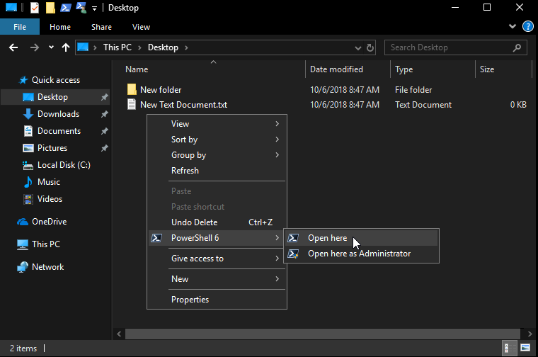
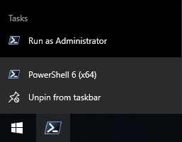

# What's New in PowerShell Core 6.1

Below is a selection of some of the major new features and changes that have been introduced in
PowerShell Core 6.1.

There's also **tons** of "boring stuff" that make PowerShell faster and more stable (plus lots and
lots of bug fixes)! For a full list of changes, check out our
[changelog on GitHub](https://github.com/PowerShell/PowerShell/blob/master/CHANGELOG.md).

And while we call out some names below, thank you to
[all of the community contributors](https://github.com/PowerShell/PowerShell/graphs/contributors)
that made this release possible.

## .NET Core 2.1

PowerShell Core 6.1 moved to .NET Core 2.1 after it was
[released in May](https://devblogs.microsoft.com/dotnet/announcing-net-core-2-1/), resulting in a
number of improvements to PowerShell, including:

- performance improvements (see [below](#performance-improvements))
- Alpine Linux support (preview)
- [.NET global tool support](/dotnet/core/tools/global-tools) - coming soon to PowerShell
- [`Span<T>`](/dotnet/api/system.span-1)

## Windows Compatibility Pack for .NET Core

On Windows, the .NET team shipped the
[Windows Compatibility Pack for .NET Core](https://devblogs.microsoft.com/dotnet/announcing-the-windows-compatibility-pack-for-net-core/),
a set of assemblies that add a number of removed APIs back to .NET Core on Windows.

We've added the Windows Compatibility Pack to PowerShell Core 6.1 release so that any modules or
scripts that use these APIs can rely on them being available.

The Windows Compatibility Pack enables PowerShell Core to use **more than 1900 cmdlets that ship
with Windows 10 October 2018 Update and Windows Server 2019**.

## Support for Application allow lists

PowerShell Core 6.1 has parity with Windows PowerShell 5.1 supporting
[AppLocker](/windows/security/threat-protection/windows-defender-application-control/applocker/applocker-overview)
and
[Device Guard](/windows/security/threat-protection/device-guard/introduction-to-device-guard-virtualization-based-security-and-windows-defender-application-control)
application allow lists. Application allow lists allow granular control of what binaries are
allowed to be executed used with PowerShell
[Constrained Language mode](https://devblogs.microsoft.com/powershell/powershell-constrained-language-mode/).

## Performance improvements

PowerShell Core 6.0 made some significant performance improvements. PowerShell Core 6.1 continues to
improve the speed of certain operations.

For example, `Group-Object` has been sped up by 66%:

```powershell
Measure-Command { 1..100000 | % {Get-Random -Minimum 1 -Maximum 10000} | Group-Object }
```

|    Metric    | Windows PowerShell 5.1 | PowerShell Core 6.0 | PowerShell Core 6.1 |
| ------------ | ---------------------- | ------------------- | ------------------- |
| Time (sec)   | 25.178                 | 19.653              | 6.641               |
| Speed-up (%) | N/A                    | 21.9%               | 66.2%               |

Similarly, sorting scenarios like this one have improved by more than 15%:

```powershell
Measure-Command { 1..100000 | % {Get-Random -Minimum 1 -Maximum 10000} | Sort-Object }
```

|    Metric    | Windows PowerShell 5.1 | PowerShell Core 6.0 | PowerShell Core 6.1 |
| ------------ | ---------------------- | ------------------- | ------------------- |
| Time (sec)   | 12.170                 | 8.493               | 7.08                |
| Speed-up (%) | N/A                    | 30.2%               | 16.6%               |

`Import-Csv` has also been sped up significantly after a regression from Windows PowerShell.
The following example uses a test CSV with 26,616 rows and six columns:

```powershell
Measure-Command {$a = Import-Csv foo.csv}
```

|    Metric    | Windows PowerShell 5.1 | PowerShell Core 6.0 |  PowerShell Core 6.1   |
| ------------ | ---------------------- | ------------------- | ---------------------- |
| Time (sec)   | 0.441                  | 1.069               | 0.268                  |
| Speed-up (%) | N/A                    | -142.4%             | 74.9% (39.2% from WPS) |

Lastly, conversion from JSON into `PSObject` has been sped up by more than 50%
since Windows PowerShell.
The following example uses a ~2MB test JSON file:

```powershell
Measure-Command {Get-Content .\foo.json | ConvertFrom-Json}
```

|    Metric    | Windows PowerShell 5.1 | PowerShell Core 6.0 |  PowerShell Core 6.1   |
| ------------ | ---------------------- | ------------------- | ---------------------- |
| Time (sec)   | 0.259                  | 0.577               | 0.125                  |
| Speed-up (%) | N/A                    | -122.8%             | 78.3% (51.7% from WPS) |

## Check `system32` for compatible built-in modules on Windows

In the Windows 10 1809 update and Windows Server 2019, we updated a number of built-in PowerShell
modules to mark them as compatible with PowerShell Core.

When PowerShell Core 6.1 starts up, it will automatically include `$windir\System32` as part of the
`PSModulePath` environment variable. However, it only exposes modules to `Get-Module` and
`Import-Module` if its `CompatiblePSEdition` is marked as compatible with `Core`.

```powershell
Get-Module -ListAvailable
```

> [!NOTE]
> You may see different available modules depending on what roles and features are installed.

```Output
...
    Directory: C:\WINDOWS\system32\WindowsPowerShell\v1.0\Modules

ModuleType Version    Name                                PSEdition ExportedCommands
---------- -------    ----                                --------- ----------------
Manifest   2.0.1.0    Appx                                Core,Desk {Add-AppxPackage, Get-AppxPackage, Get-AppxPacka...
Manifest   1.0.0.0    BitLocker                           Core,Desk {Unlock-BitLocker, Suspend-BitLocker, Resume-Bit...
Manifest   1.0.0.0    DnsClient                           Core,Desk {Resolve-DnsName, Clear-DnsClientCache, Get-DnsC...
Manifest   1.0.0.0    HgsDiagnostics                      Core,Desk {New-HgsTraceTarget, Get-HgsTrace, Get-HgsTraceF...
Binary     2.0.0.0    Hyper-V                             Core,Desk {Add-VMAssignableDevice, Add-VMDvdDrive, Add-VMF...
Binary     1.1        Hyper-V                             Core,Desk {Add-VMDvdDrive, Add-VMFibreChannelHba, Add-VMHa...
Manifest   2.0.0.0    NetAdapter                          Core,Desk {Disable-NetAdapter, Disable-NetAdapterBinding, ...
Manifest   1.0.0.0    NetEventPacketCapture               Core,Desk {New-NetEventSession, Remove-NetEventSession, Ge...
Manifest   2.0.0.0    NetLbfo                             Core,Desk {Add-NetLbfoTeamMember, Add-NetLbfoTeamNic, Get-...
Manifest   1.0.0.0    NetNat                              Core,Desk {Get-NetNat, Get-NetNatExternalAddress, Get-NetN...
Manifest   2.0.0.0    NetQos                              Core,Desk {Get-NetQosPolicy, Set-NetQosPolicy, Remove-NetQ...
Manifest   2.0.0.0    NetSecurity                         Core,Desk {Get-DAPolicyChange, New-NetIPsecAuthProposal, N...
Manifest   1.0.0.0    NetSwitchTeam                       Core,Desk {New-NetSwitchTeam, Remove-NetSwitchTeam, Get-Ne...
Manifest   1.0.0.0    NetWNV                              Core,Desk {Get-NetVirtualizationProviderAddress, Get-NetVi...
Manifest   2.0.0.0    TrustedPlatformModule               Core,Desk {Get-Tpm, Initialize-Tpm, Clear-Tpm, Unblock-Tpm...
...
```

You can override this behavior to show all modules using the `-SkipEditionCheck` switch parameter.
We've also added a `PSEdition` property to the table output.

```powershell
Get-Module Net* -ListAvailable -SkipEditionCheck
```

```Output
    Directory: C:\WINDOWS\system32\WindowsPowerShell\v1.0\Modules

ModuleType Version    Name                        PSEdition ExportedCommands
---------- -------    ----                        --------- ----------------
Manifest   2.0.0.0    NetAdapter                  Core,Desk {Disable-NetAdapter, Disable-NetAdapterBinding, ...
Manifest   1.0.0.0    NetConnection               Core,Desk {Get-NetConnectionProfile, Set-NetConnectionProf...
Manifest   1.0.0.0    NetDiagnostics              Desk      Get-NetView
Manifest   1.0.0.0    NetEventPacketCapture       Core,Desk {New-NetEventSession, Remove-NetEventSession, Ge...
Manifest   2.0.0.0    NetLbfo                     Core,Desk {Add-NetLbfoTeamMember, Add-NetLbfoTeamNic, Get-...
Manifest   1.0.0.0    NetNat                      Core,Desk {Get-NetNat, Get-NetNatExternalAddress, Get-NetN...
Manifest   2.0.0.0    NetQos                      Core,Desk {Get-NetQosPolicy, Set-NetQosPolicy, Remove-NetQ...
Manifest   2.0.0.0    NetSecurity                 Core,Desk {Get-DAPolicyChange, New-NetIPsecAuthProposal, N...
Manifest   1.0.0.0    NetSwitchTeam               Core,Desk {New-NetSwitchTeam, Remove-NetSwitchTeam, Get-Ne...
Manifest   1.0.0.0    NetTCPIP                    Core,Desk {Get-NetIPAddress, Get-NetIPInterface, Get-NetIP...
Manifest   1.0.0.0    NetWNV                      Core,Desk {Get-NetVirtualizationProviderAddress, Get-NetVi...
Manifest   1.0.0.0    NetworkConnectivityStatus   Core,Desk {Get-DAConnectionStatus, Get-NCSIPolicyConfigura...
Manifest   1.0.0.0    NetworkSwitchManager        Core,Desk {Disable-NetworkSwitchEthernetPort, Enable-Netwo...
Manifest   1.0.0.0    NetworkTransition           Core,Desk {Add-NetIPHttpsCertBinding, Disable-NetDnsTransi...
```

For more information about this behavior, check out
[PowerShell RFC0025](https://github.com/PowerShell/PowerShell-RFC/blob/master/5-Final/RFC0025-PSCore6-and-Windows-Modules.md).

## Markdown cmdlets and rendering

Markdown is a standard for creating readable plaintext documents with basic formatting that can be
rendered into HTML.

We've added some cmdlets in 6.1 that allow you to convert and render Markdown documents in the
console, including:

- `ConvertFrom-Markdown`
- `Get-MarkdownOption`
- `Set-MarkdownOption`
- `Show-Markdown`

For example, `Show-Markdown` renders a Markdown file in the console:


For more information about how these cmdlets work, check out
[this RFC](https://github.com/PowerShell/PowerShell-RFC/blob/master/5-Final/RFC0025-Native-Markdown-Rendering.md).

## Experimental feature flags

We enabled support for [Experimental Features][]. This allows PowerShell developers to deliver new
features and get feedback before the design is complete. This way we avoid making breaking changes
as the design evolves.

Use `Get-ExperimentalFeature` to get a list of available experimental features. You can enable or
disable these features with `Enable-ExperimentalFeature` and `Disable-ExperimentalFeature`.

You can learn more about this feature in
[PowerShell RFC0029](https://github.com/PowerShell/PowerShell-RFC/blob/master/5-Final/RFC0029-Support-Experimental-Features.md).

## Web cmdlet improvements

Thanks to [@markekraus](https://github.com/markekraus), a whole slew of improvements have been made to our web cmdlets:
[`Invoke-WebRequest`](/powershell/module/microsoft.powershell.utility/invoke-webrequest)
and [`Invoke-RestMethod`](/powershell/module/microsoft.powershell.utility/invoke-restmethod).

- [PR #6109](https://github.com/PowerShell/PowerShell/pull/6109) - default encoding set to UTF-8 for
  `application-json` responses
- [PR #6018](https://github.com/PowerShell/PowerShell/pull/6018) - `-SkipHeaderValidation` parameter
  to allow `Content-Type` headers that aren't standards-compliant
- [PR #5972](https://github.com/PowerShell/PowerShell/pull/5972) - `Form` parameter to support
  simplified `multipart/form-data` support
- [PR #6338](https://github.com/PowerShell/PowerShell/pull/6338) - Compliant, case-insensitive
  handling of relation keys
- [PR #6447](https://github.com/PowerShell/PowerShell/pull/6447) - Add `-Resume` parameter for web
  cmdlets

## Remoting improvements

### PowerShell Direct for Containers tries to use PowerShell Core first

[PowerShell Direct](/virtualization/hyper-v-on-windows/user-guide/powershell-direct) is a feature of
PowerShell and Hyper-V that allows you to connect to a Hyper-V VM or Container without network
connectivity or other remote management services.

In the past, PowerShell Direct connected using the built-in Windows PowerShell instance on the
Container. Now, PowerShell Direct first attempts to connect using any available `pwsh.exe` on the
`PATH` environment variable. If `pwsh.exe` isn't available, PowerShell Direct falls back to use
`powershell.exe`.

### `Enable-PSRemoting` now creates separate remoting endpoints for preview versions

`Enable-PSRemoting` now creates two remoting session configurations:

- One for the major version of PowerShell. For example, `PowerShell.6`. This endpoint that can be
  relied upon across minor version updates as the "system-wide" PowerShell 6 session configuration
- One version-specific session configuration, for example: `PowerShell.6.1.0`

This behavior is useful if you want to have multiple PowerShell 6 versions installed and accessible
on the same machine.

Additionally, preview versions of PowerShell now get their own
remoting session configurations after running the `Enable-PSRemoting` cmdlet:

```powershell
C:\WINDOWS\system32> Enable-PSRemoting
```

Your output may be different if you haven't set up WinRM before.

```Output
WinRM is already set up to receive requests on this computer.
WinRM is already set up for remote management on this computer.
```

Then you can see separate PowerShell session configurations for the preview and stable builds of
PowerShell 6, and for each specific version.

```powershell
Get-PSSessionConfiguration
```

```Output
Name          : PowerShell.6.2-preview.1
PSVersion     : 6.2
StartupScript :
RunAsUser     :
Permission    : NT AUTHORITY\INTERACTIVE AccessAllowed, BUILTIN\Administrators AccessAllowed, BUILTIN\Remote Management Users AccessAllowed

Name          : PowerShell.6-preview
PSVersion     : 6.2
StartupScript :
RunAsUser     :
Permission    : NT AUTHORITY\INTERACTIVE AccessAllowed, BUILTIN\Administrators AccessAllowed, BUILTIN\Remote Management Users AccessAllowed

Name          : powershell.6
PSVersion     : 6.1
StartupScript :
RunAsUser     :
Permission    : NT AUTHORITY\INTERACTIVE AccessAllowed, BUILTIN\Administrators AccessAllowed, BUILTIN\Remote Management Users AccessAllowed

Name          : powershell.6.1.0
PSVersion     : 6.1
StartupScript :
RunAsUser     :
Permission    : NT AUTHORITY\INTERACTIVE AccessAllowed, BUILTIN\Administrators AccessAllowed, BUILTIN\Remote Management Users AccessAllowed
```

### `user@host:port` syntax supported for SSH

SSH clients typically support a connection string in the format `user@host:port`. With the addition
of SSH as a protocol for PowerShell Remoting, we've added support for this format of connection
string:

`Enter-PSSession -HostName fooUser@ssh.contoso.com:2222`

## MSI option to add explorer shell context menu on Windows

Thanks to [@bergmeister](https://github.com/bergmeister), now you can enable a context menu on
Windows. Now you can open your system-wide installation of PowerShell 6.1 from any folder in the
Windows Explorer:



## Goodies

### "Run as Administrator" in the Windows shortcut jump list

Thanks to [@bergmeister](https://github.com/bergmeister), the PowerShell Core shortcut's jump list
now includes "Run as Administrator":



### `cd -` returns to previous directory

```powershell
C:\Windows\System32> cd C:\
C:\> cd -
C:\Windows\System32>
```

Or on Linux:

```ShellSession
PS /etc> cd /usr/bin
PS /usr/bin> cd -
PS /etc>
```

Also, `cd` and `cd --` change to `$HOME`.

### `Test-Connection`

Thanks to [@iSazonov](https://github.com/iSazonov), the
[`Test-Connection`](/powershell/module/microsoft.powershell.management/test-connection) cmdlet has
been ported to PowerShell Core.

### `Update-Help` as non-admin

By popular demand, `Update-Help` no longer needs to be run as an administrator. `Update-Help` now
defaults to saving help to a user-scoped folder.

### New methods/properties on `PSCustomObject`

Thanks to [@iSazonov](https://github.com/iSazonov), we've added new methods and properties to
`PSCustomObject`. `PSCustomObject` now includes a `Count`/`Length` property like other objects.

```powershell
$PSCustomObject = [pscustomobject]@{foo = 1}

$PSCustomObject.Length
```

```Output
1
```

```powershell
$PSCustomObject.Count
```

```Output
1
```

This work also includes `ForEach` and `Where` methods that allow you to operate and filter on
`PSCustomObject` items:

```powershell
$PSCustomObject.ForEach({$_.foo + 1})
```

```Output
2
```

```powershell
$PSCustomObject.Where({$_.foo -gt 0})
```

```Output
foo
---
  1
```

### `Where-Object -Not`

Thanks to @SimonWahlin, we've added the `-Not` parameter to `Where-Object`. Now you can filter an
object at the pipeline for the non-existence of a property, or a null/empty property value.

For example, this command returns all services that don't have any dependent services defined:

```powershell
Get-Service | Where-Object -Not DependentServices
```

### `New-ModuleManifest` creates a BOM-less UTF-8 document

Given our move to BOM-less UTF-8 in PowerShell 6.0, we've updated the `New-ModuleManifest` cmdlet to
create a BOM-less UTF-8 document instead of a UTF-16 one.

### Conversions from PSMethod to Delegate

Thanks to [@powercode](https://github.com/powercode), we now support the conversion of a `PSMethod`
into a delegate. This allows you to do things like passing `PSMethod` `[M]::DoubleStrLen` as a
delegate value into `[M]::AggregateString`:

```powershell
class M {
    static [int] DoubleStrLen([string] $value) { return 2 * $value.Length }

    static [long] AggregateString([string[]] $values, [func[string, int]] $selector) {
        [long] $res = 0
        foreach($s in $values){
            $res += $selector.Invoke($s)
        }
        return $res
    }
}

[M]::AggregateString((gci).Name, [M]::DoubleStrLen)
```

For more info on this change, check out [PR #5287](https://github.com/PowerShell/PowerShell/pull/5287).

### Standard deviation in `Measure-Object`

Thanks to [@CloudyDino](https://github.com/CloudyDino), we've added a `StandardDeviation` property
to `Measure-Object`:

```powershell
Get-Process | Measure-Object -Property CPU -AllStats
```

```Output
Count             : 308
Average           : 31.3720576298701
Sum               : 9662.59375
Maximum           : 4416.046875
Minimum           :
StandardDeviation : 264.389544720926
Property          : CPU
```

### `GetPfxCertificate -Password`

Thanks to [@maybe-hello-world](https://github.com/maybe-hello-world), `Get-PfxCertificate` now has
the `Password` parameter, which takes a `SecureString`. This allows you to use it non-interactively:

```powershell
$certFile = '\\server\share\pwd-protected.pfx'
$certPass = Read-Host -AsSecureString -Prompt 'Enter the password for certificate: '

$certThumbPrint = (Get-PfxCertificate -FilePath $certFile -Password $certPass ).ThumbPrint
```

### Removal of the `more` function

In the past, PowerShell shipped a function on Windows called `more` that wrapped `more.com`. That
function has now been removed.

Also, the `help` function changed to use `more.com` on Windows, or the system's default pager
specified by `$env:PAGER` on non-Windows platforms.

### `cd DriveName:` now returns users to the current working directory in that drive

Previously, using `Set-Location` or `cd` to return to a PSDrive sent users
to the default location for that drive.

Thanks to [@mcbobke](https://github.com/mcbobke), users are now sent to the last known current
working directory for that session.

### Windows PowerShell type accelerators

In Windows PowerShell, we included the following type accelerators to make it easier to work with
their respective types:

- `[adsi]`: `System.DirectoryServices.DirectoryEntry`
- `[adsisearcher]`: `System.DirectoryServices.DirectorySearcher`
- `[wmi]`: `System.Management.ManagementObject`
- `[wmiclass]`: `System.Management.ManagementClass`
- `[wmisearcher]`: `System.Management.ManagementObjectSearcher`

These type accelerators were not included in PowerShell 6, but have been added to PowerShell 6.1
running on Windows.

These types are useful in easily constructing AD and WMI objects.

For example, you can query using LDAP:

```powershell
[adsi]'LDAP://CN=FooUse,OU=People,DC=contoso,DC=com'
```

Following example creates a Win32_OperatingSystem CIM object:

```powershell
[wmi]"Win32_OperatingSystem=@"
```

```Output
SystemDirectory : C:\WINDOWS\system32
Organization    : Contoso IT
BuildNumber     : 18234
RegisteredUser  : Contoso Corp.
SerialNumber    : 12345-67890-ABCDE-F0123
Version         : 10.0.18234
```

This example returns a ManagementClass object for Win32_OperatingSystem class.

```powershell
[wmiclass]"Win32_OperatingSystem"
```

```Output
   NameSpace: ROOT\cimv2

Name                                Methods              Properties
----                                -------              ----------
Win32_OperatingSystem               {Reboot, Shutdown... {BootDevice, BuildNumber, BuildType, Caption...}
```

### `-lp` alias for all `-LiteralPath` parameters

Thanks to [@kvprasoon](https://github.com/kvprasoon), we now have a parameter alias `-lp` for all
the built-in PowerShell cmdlets that have a `-LiteralPath` parameter.

## Breaking Changes

### MSI-based installation paths on Windows

On Windows, the MSI package now installs to the following path:

- `$env:ProgramFiles\PowerShell\6\` for the stable installation of 6.x
- `$env:ProgramFiles\PowerShell\6-preview\` for the preview installation of 6.x

This change ensures that PowerShell Core can be updated/serviced by Microsoft Update.

For more information, check out
[PowerShell RFC0026](https://github.com/PowerShell/PowerShell-RFC/blob/master/5-Final/RFC0026-MSI-Installation-Path.md).

### Telemetry can only be disabled with an environment variable

PowerShell Core sends basic telemetry data to Microsoft when it is launched. The data includes the
OS name, OS version, and PowerShell version. This data allows us to better understand the
environments where PowerShell is used and enables us to prioritize new features and fixes.

To opt-out of this telemetry, set the environment variable `POWERSHELL_TELEMETRY_OPTOUT` to `true`,
`yes`, or `1`. We no longer support deletion of the file
`DELETE_ME_TO_DISABLE_CONSOLEHOST_TELEMETRY` to disable telemetry.

### Disallowed Basic Auth over HTTP in PowerShell Remoting on Unix platforms

To prevent the use of unencrypted traffic, PowerShell Remoting on Unix platforms now requires usage
of NTLM/Negotiate or HTTPS.

For more information on these changes, check out [Issue #6779](https://github.com/PowerShell/PowerShell/issues/6779).

### Removed `VisualBasic` as a supported language in Add-Type

In the past, you could compile Visual Basic code using the `Add-Type` cmdlet. Visual Basic was
rarely used with `Add-Type`. We removed this feature to reduce the size of PowerShell.

### Cleaned up uses of `CommandTypes.Workflow` and `WorkflowInfoCleaned`

For more information on these changes, check out
[PR #6708](https://github.com/PowerShell/PowerShell/pull/6708).

### Group-Object now sorts the groups

As part of the performance improvement, `Group-Object` now returns a sorted listing of the groups.
Although you should not rely on the order, you could be broken by this change if you wanted the
first group. We decided that this performance improvement was worth the change since the impact of
being dependent on previous behavior is low.

For more information on this change, see [Issue #7409](https://github.com/PowerShell/PowerShell/issues/7409).

<!-- URL references -->
[Experimental Features]: /powershell/module/Microsoft.PowerShell.Core/About/about_Experimental_Features
